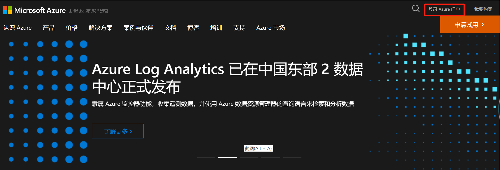
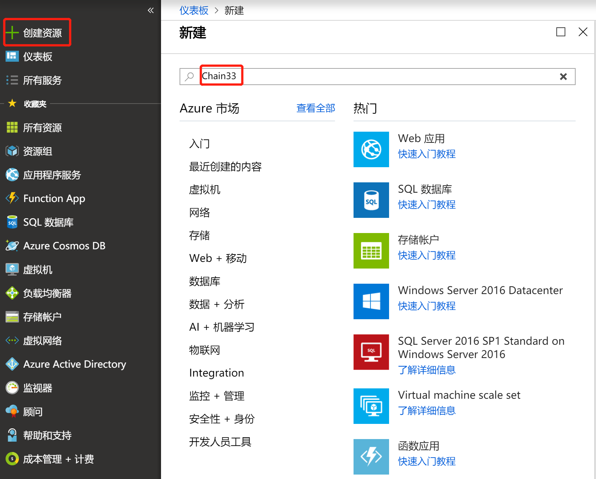
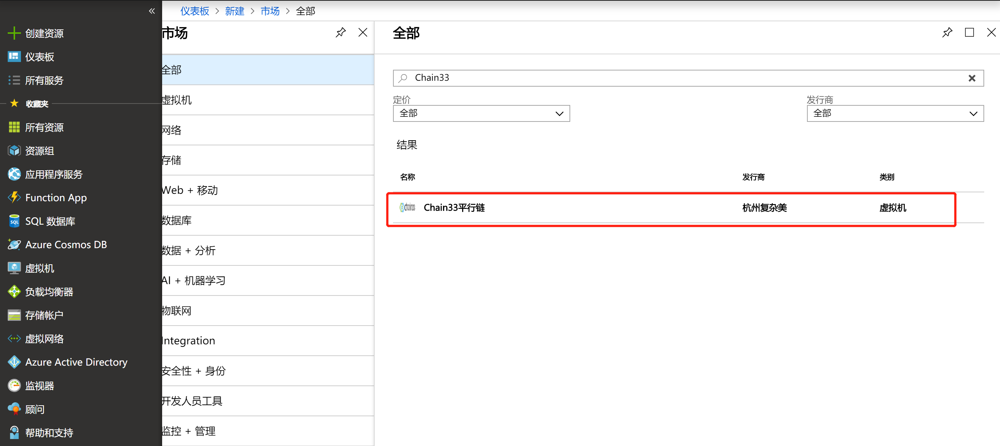
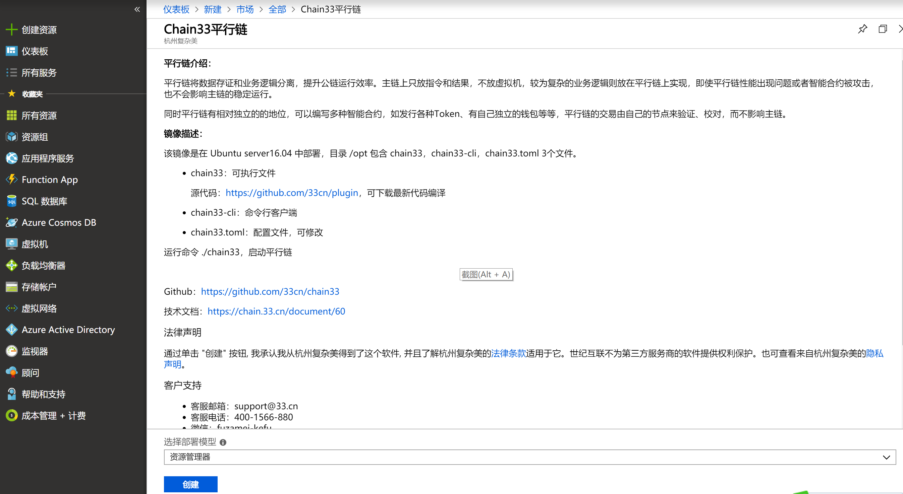
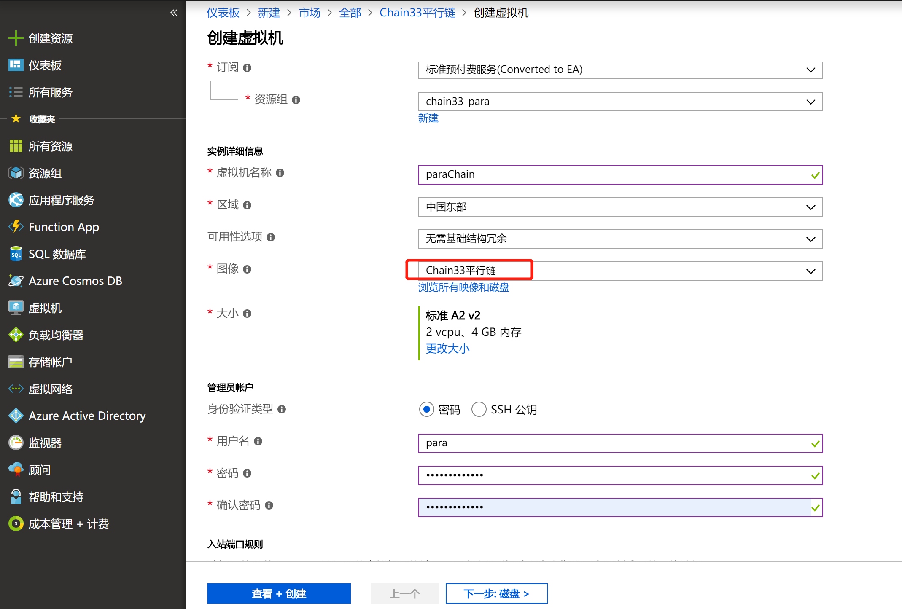
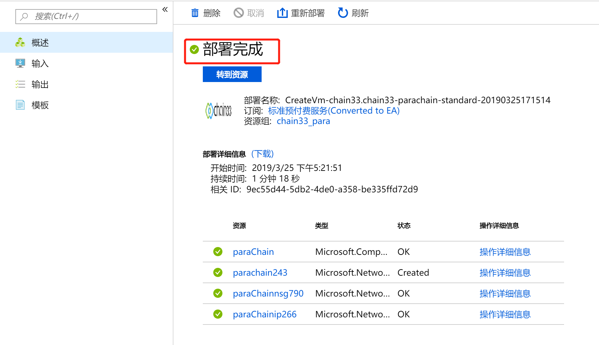
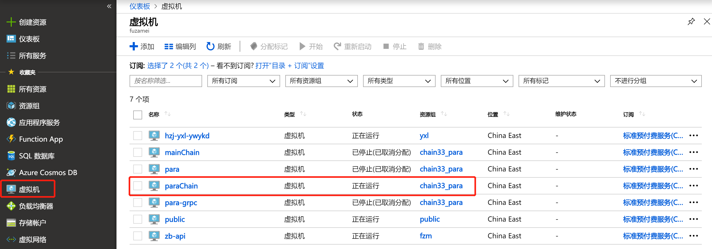

# 基于Azure的Chain33平行链

**致谢**：本动手实验由微软合作伙伴（杭州复杂美）提供并授权使用

越来越多的应用希望整合区块链技术。本实验会介绍如何搭建并启动一个区块链，如何生成本地钱包，如何配置，审核并发行Token等的完整过程。

### 演示一：在Azure中创建Chain33平行链
 1.	登陆Azure管理门户
 2.	创建Chain33平行链镜像
 3.	配置文件设置
 4. 启动Chain33平行链

### 演示二：通过命令行的方式生成本地钱包
 1.	生成钱包，创建账户

### 演示三：通过json/rpc接口的方式发行token
 1.	配置token发行的审核者
 2.	配置token名称的黑名单
 3.	token预发行
 4.	token审核并实际发行


## 演示一：在Azure中创建Chain33平行链
### 1.登陆Azure管理门户

在浏览器中输入 (https://www.azure.cn/) 打开Azure中国区官方网站，然后点击页面右上角的“登录Azure门户”：



### 2.创建Chain33平行链镜像

输入账户和密码，登陆到管理门户。点击左上角“+创建资源”按钮，然后搜索市场栏中输入“Chain33”，如下图所示：



回车后，搜索出Chain33平行链对应的镜像名称，如下图所示：



选择这条搜索出来的结果，进入到介绍页面，如下图所示：



点击创建按钮，进入到创建虚拟机页面,选择“资源组”, 输入“虚拟机名称”，选择“图像”（必须选Chain33平行链），选择合适的“大小”（普通用途2核4G就够用），设定“用户名”和“密码”，如下图所示：



点击“查看加创建”，确认信息无误后，再点击“创建”，等待部署完成(一般只要1分多钟就可以)，如下图所示：



### 3.配置文件设置
进入到“虚拟机”页面，选择刚刚创建的虚拟机，如下图所示：



获取到公网IP地址后通过SSH登录，设置root密码，执行以下命令，输入自己设定的密码，然后切换至root用户

```bash
sudo passwd
```

Chain33平行链可执行文件，命令行工具及配置文件在/opt目录下， chain33是平行链的执行文件，chain33-cli是命令行工具，chain33.toml是配置文件
```bash
cd /opt

ls
chain33  chain33-cli  chain33.toml
```

修改配置文件chain33.toml, 主要关注以下几项：

```bash
# Title是平行链的名称，user.p.是固定前缀不可以修改，后面的可以自定义，这边命名microsoft.（最后一个点不能省掉）
Title="user.p.microsoft."

# 和主链的连接，主链可以自己部署，也可以用官方提供的连接，如下：
ParaRemoteGrpcClient="101.37.227.226:8802,39.97.20.242:8802,47.107.15.126:8802,jiedian2.bityuan.com,cloud.bityuan.com"

# 指示从主链哪一个高度开始同步区块，可以通过查看主链浏览器看目前主链高度：https://mainnet.bityuan.com/block
# 一般初次部署的话，选一个略低于主链的（主链高度-100就行）
startHeight=1700000

# 平行链超级管理员，填入自己掌握私钥的地址
superManager=[
    "1CbEVT9RnM5oZhWMj4fxUrJX94VtRotzvs",
]
```

### 4.启动Chain33平行链
```bash
nohup ./chain33 -f chain33.toml >> para.out&

# 执行完以上命令，会在当前目录下生成paradatadir:区块数据文件，parawallet:钱包文件
ls
chain33  chain33-cli  chain33.toml  grpc33.log  logs  paradatadir  para.out  parawallet
```

## 演示二：通过命令行的方式生成本地钱包
### 1.生成钱包，创建账户
```bash
cd /opt

# 生成seed
./chain33-cli seed generate --lang=0
allow theory account song radar mask clump announce room travel vivid bacon reflect grunt year

# 将上述seed保存到本地节点， -p: 带的是钱包密码，可以自定义，-s：带的是上一步生成的seed
./chain33-cli seed save -p test123 -s "allow theory account song radar mask clump announce room travel vivid bacon reflect grunt year"

# 解锁钱包
./chain33-cli wallet unlock -p test123 -t 0

# 创建一个名为microsoft的账户
./chain33-cli account create -l microsoft

# 也可以通过导入私钥的方法创建账户
./chain33-cli account import_key -k "3990969DF92A5914F7B71EEB9A4E58D6E255F32BF042FEA5318FC8B3D50EE6E8" -l test

# 查询账户列表
./chain33-cli account list
```

## 演示三：通过json/rpc接口的方式发行token
### 1.	配置token发行的审核者

```bash
# 调用json/rpc接口，传入相应的参数，配置token发行的审核者
curl --data-binary '{"jsonrpc":"2.0","id":2,"method":"Chain33.CreateTransaction","params":[{"execer":"user.p.microsoft.manage","actionName":"Modify","payload": {"key": "token-finisher","value": "1CbEVT9RnM5oZhWMj4fxUrJX94VtRotzvs","op":"add"}}]}' \
        -H 'content-type:text/plain;' \
        http://localhost:8801

# 调用json/rpc接口，签名上一步生成的交易体
curl --data-binary '{"jsonrpc":"2.0", "id": 1, "method":"Chain33.SignRawTx","params":[{"addr":"1CbEVT9RnM5oZhWMj4fxUrJX94VtRotzvs", "expire":"2h", "txHex":"上一步生成的交易体"}] }' \
        -H 'content-type:text/plain;' \
        http://localhost:8801

# 调用json/rpc接口，将签名后的交易发送至区块链
curl --data-binary '{"jsonrpc":"2.0", "id": 1, "method":"Chain33.SendTransaction","params":[{"data":"上一步签名过后的值"}] }' \
        -H 'content-type:text/plain;' \
        http://localhost:8801

# 配置完后，可以调用json/rpc接口进行查询
curl --data-binary '{"jsonrpc":"2.0","id":2,"method":"Chain33.Query","params":[{"execer":"user.p.microsoft.manage","funcName":"GetConfigItem", "payload":{"data": "token-finisher"}}]}' \
        -H 'content-type:text/plain;' \
        http://localhost:8801
```

### 2.	配置token名的黑名单
```bash
# 调用json/rpc接口，传入相应的参数，配置token名称的黑名单
curl --data-binary '{"jsonrpc":"2.0","id":2,"method":"Chain33.CreateTransaction","params":[{"execer":"user.p.microsoft.manage","actionName":"Modify","payload": {"key": "token-blacklist","value": "BTY","op":"add"}}]}' \
        -H 'content-type:text/plain;' \
        http://localhost:8801

# 调用json/rpc接口，签名上一步生成的交易体
curl --data-binary '{"jsonrpc":"2.0", "id": 1, "method":"Chain33.SignRawTx","params":[{"addr":"1CbEVT9RnM5oZhWMj4fxUrJX94VtRotzvs", "expire":"2h", "txHex":"上一步生成的交易体"}] }' \
        -H 'content-type:text/plain;' \
        http://localhost:8801

# 调用json/rpc接口，将签名后的交易发送至区块链
curl --data-binary '{"jsonrpc":"2.0", "id": 1, "method":"Chain33.SendTransaction","params":[{"data":"上一步签名过后的值"}]}' \
        -H 'content-type:text/plain;' \
        http://localhost:8801

# 配置完后，可以调用json/rpc接口进行查询
curl --data-binary '{"jsonrpc":"2.0","id":2,"method":"Chain33.Query","params":[{"execer":"user.p.microsoft.manage","funcName":"GetConfigItem", "payload":{"data": "token-blacklist"}}]}' \
        -H 'content-type:text/plain;' \
        http://localhost:8801
```

### 3.	token预发行
```bash
# 调用json/rpc接口，传入相应的参数预发行token，这一步完成token只是预发行， symbol:token的名称，只支持大写字母+数字， owner: 指示哪个地址拥有初始发行的token, total:token的总量（精度是1e8）
curl --data-binary '{"jsonrpc":"2.0","id":2,"method":"token.CreateRawTokenPreCreateTx","params":[{"name":"MIC COIN","symbol":"MICCOINX","total":150000000000,"owner":"1B37gMWCo1EVQxroWKkhgkyyKYZbgZEUs7"}]}' \
        -H 'content-type:text/plain;' \
        http://localhost:8801

# 调用json/rpc接口，签名上一步生成的交易体
curl --data-binary '{"jsonrpc":"2.0", "id": 1, "method":"Chain33.SignRawTx","params":[{"addr":"1CbEVT9RnM5oZhWMj4fxUrJX94VtRotzvs", "expire":"2h", "txHex":"上一步生成的交易体"}] }' \
        -H 'content-type:text/plain;' \
        http://localhost:8801

# 调用json/rpc接口，将签名后的交易发送至区块链
curl --data-binary '{"jsonrpc":"2.0", "id": 1, "method":"Chain33.SendTransaction","params":[{"data":"上一步签名过后的值"}]}' \
        -H 'content-type:text/plain;' \
        http://localhost:8801

# 配置完后，可以调用json/rpc接口进行查询
curl --data-binary '{"jsonrpc":"2.0","id":2,"method":"Chain33.Query","params":[{"execer":"user.p.microsoft.token","funcName":"GetTokens", "payload":{"status": 0,"queryAll":true,"symbolOnly":true}}]}' \
        -H 'content-type:text/plain;' \
        http://localhost:8801
```

### 4.	token审核并实际发行
```bash
# 调用json/rpc接口，传入相应的参数审核发行token，这一步完成后，token的状态才是已发行
curl --data-binary '{"jsonrpc":"2.0","id":2,"method":"token.CreateRawTokenFinishTx","params":[{"symbol":"MICCOINX", "owner":"1B37gMWCo1EVQxroWKkhgkyyKYZbgZEUs7"}]}' \
        -H 'content-type:text/plain;' \
        http://localhost:8801

# 调用json/rpc接口，签名上一步生成的交易体
curl --data-binary '{"jsonrpc":"2.0", "id": 1, "method":"Chain33.SignRawTx","params":[{"addr":"1CbEVT9RnM5oZhWMj4fxUrJX94VtRotzvs", "expire":"2h", "txHex":"上一步生成的交易体"}] }' \
        -H 'content-type:text/plain;' \
        http://localhost:8801

# 调用json/rpc接口，将签名后的交易发送至区块链
curl --data-binary '{"jsonrpc":"2.0", "id": 1, "method":"Chain33.SendTransaction","params":[{"data":"上一步签名过后的值"}]}' \
        -H 'content-type:text/plain;' \
        http://localhost:8801
```