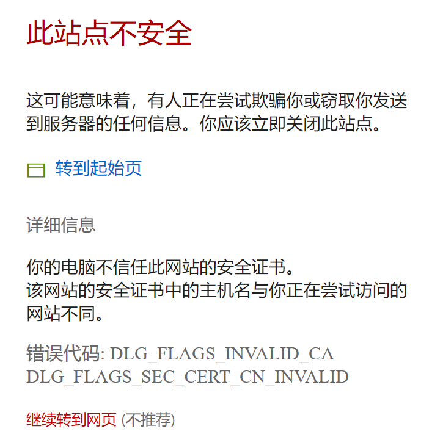

# 任务一：搭建营地

## 背景

在正式着手开发一个计算机视觉解决方案之前，Adventure Works 公司的数据科学团队需要先建立一个标准化的数据科学开发环境。

搭建开发环境之后，您可以在其中探索 Adventure Works 所采集的图像数据，并对其进行预处理以便训练一个机器学习的模型。

## 任务

任务一由三个子任务组成：

1. 在 Azure上部署一台数据科学虚拟机（Data Science Virtual Machine，DSVM）实例
2. 探索 JupyterHub 开发环境
3. 预处理图像数据

每个子任务都在下面列出了详细的需求，以及一些提示信息。另外，页面下方的**参考**部分包含了有用的资源链接。

### 1. 在 Azure 上部署一台数据科学虚拟机实例

本任务以及后续的各个任务，需要您用一台在 Azure 上的数据科学虚拟机（DSVM）实例作为机器学习的开发环境。这个虚拟机镜像中自带了包括 Jupyterhub notebook 在内的很多基本的数据科学工具。您可以在 Jupyterhub notebook 中编写和运行 Python 代码。

如果要搭建开发环境，请先在 <a href="https://portal.azure.com" target="_blank">Azure 门户</a> 登录您的 Azure 订阅，然后新建一台 DSVM 。推荐使用如下带 GPU 加速的 DSVM ，就可满足本实验所需：

- DSVM Image: *Data Science Virtual Machine for Linux (Ubuntu)*
- Region: 任何可用的区域
- Size:  _NC6_ (在 **Family** 中列选支持 **GPU** 的规格)
- Authentication type:  _Password_
- Username: _(全部由小写字母构成的自定义用户名)_
- Password: _(足够复杂的密码串)_

DSVM 部署完成之后，使用您创建 DSVM 时指定的用户名和密码来连接 Jupyterhub 。

#### 提示

- Azure 订阅的类型有时会限制您创建 GPU 虚拟机时可选的区域。如果您在创建时发现没有带 GPU 的规格可选，返回到区域重新选择即可。
- 部署 DSVM 实例时，确保身份验证类型为 **Password** ，而且用户名为全小写字母。
- Jupyterhub 的访问地址是 **https://<dsvm公网IP地址>:8000**。关于如何使用 Jupyterhub，请参考 <a href="https://www.youtube.com/watch?v=4b1G9pQC3KM" target="_blank"> 这里的视频</a> 或者 <a href="https://docs.microsoft.com/azure/machine-learning/data-science-virtual-machine/linux-dsvm-walkthrough/?wt.mc_id=OH-ML-ComputerVision#jupyterhub" target="_blank">这篇文档</a>。
- 为了要能访问到 Jupyterhub ，您必须点击浏览器的“此站点不安全”警告页面中的“详细信息”->“继续转到网页（不推荐）” 以继续。不用担心，这是预料中的行为。



- 如果 Jupyterhub 载入时间过长，点击左上角 **jupyter** 的图标来打开文件夹目录树的页面。

从页面底端的 **参考** 部分可获得更多帮助信息。

### 2. 探索 JupyterHub 开发环境

在 Jupyterhub 的文件夹目录树页面，您可以看到已经有一些文件夹和 notebooks 文件，您可以利用这些资源来学习多种不同的数据科学框架和技术。

在右上角的 **New** 下拉菜单，点击最下方的 **Terminal** 以创建一个新的终端会话页面，这个会话将会把您的 home 文件夹 (*username*@*dsvm*:/data/home/*username*) 设为工作目录并打开。在这个终端会话页面中可以输入操作系统命令。

输入以下命令，把当前目录设为 JupyterHub 目录树的根目录：

```shell
cd notebooks
```

然后输入以下命令，把本实验所在的 GitHub 代码库复制到当前目录：

```shell
git clone https://github.com/Azure/OCPOpenHack/
```

代码库下载完成后，在浏览器中切换回目录树所在的页面。确保 **OCPOpenHack** 文件夹已经出现在根目录下，而且其下包含 **Azure_Deep_Learning** 子文件夹。如果没有出现，请刷新一下页面。

### 3. 预处理图像数据

在 **OCPOpenHack/Azure_Deep_Learning/notebooks** 文件夹内点击打开 **01-DataPrep.ipynb** notebook 文件，并仔细阅读说明和代码。逐一运行每个代码单元，并仔细观察代码单元的输出结果。这些代码的主要功能是：

1. 从网上下载并解压出一个以层次化文件夹结构组织好的图像文件集合，用于后续任务。
2. 显示每个文件夹中的第一张图像。每一个文件夹代表了产品图片中的一个品类，也称为 **类（ Class ）**。
3. 把这些图像都标准化，使他们的宽、高和文件格式都相同。

> **说明**： 当前子任务中所提供的代码，无需修改直接运行，即可帮助您完成图像数据预处理的工作。但还是强烈建议您熟悉 Jupyter notebook 的环境，并仔细阅读代码直至完全理解它。在后续的任务中，您需要自己编写代码来完成类似的要求。

#### 提示

- 在 Jupyterhub 中使用 **Python 3.5** 内核。
- Python 的<a href="https://docs.python.org/3.6/tutorial/stdlib.html#operating-system-interface" target="_blank"> **os** </a> 库包含了与文件系统交互的函数和功能。
- Python 的<a href="https://matplotlib.org/2.0.2/index.html" target="_blank"> **matplotlib** </a> 库提供了绘制图表和呈现图像相关的函数。
- 为了让图表和图像能显示在 notebook 文件中，必须在创建第一个图表之前，先运行如下的命令：

    `%matplotlib inline`

- 图像数据本质上是数值型的数组。对于彩色图像，它们是以三维数组表示的，其中每一维的数组又是代表一个颜色通道的二维像素数组。例如，一个 128x128 的 Jpeg 类型的图像，被表示成三个 128x128 的像素数组，这三个数组依次代表红、绿、蓝三个颜色通道。Python 的 <a href="https://docs.scipy.org/doc/numpy/reference/arrays.html" target="_blank"> **NumPy** </a>库让您可以非常便利地处理多维数组。譬如，您可以用：
  - `numpy.array(my_img)` 把一个图像对象显性地转换为一个 numpy 数组。
  - `my_array.shape` 可以返回一个数组的大小和维度，譬如图像是三维的 (高度，宽度，通道数)
- 在 **参考** 部分还罗列了其它一些可用于处理和操作图像的 Python 库。您可以按照自己的喜好，任意组合这些库的功能来处理您的图像。图像被转换成 **Numpy** 数组的数据类型可以获得最大的兼容性。
- <a href="https://pillow.readthedocs.io" target="_blank"> **PIL** </a> 库会使用一种原生的格式来表示图像。但您可以用 `numpy.array()` 函数很方便地把 PIL 图像转换为 numpy 数组，也可以反过来用 `Image.fromarray()` 函数把 numpy 数组转换为 PIL 图像。您还可以用 `my_img.convert()` 函数把 PIL 图像在不同的图像格式之间互相转换，例如从一个 4 通道的 PNG 格式转换为一个 3 通道的 JPG 格式。
- 用 `Image.open()` 函数可以把一个文件打开成为一个 PIL 图像对象。如果要把一个 PIL 图像保存成文件，可以用 `my_img.save()` 函数。
- 要在保持一个图像的高宽比的同时改变其尺寸，通常的做法是：
  1. 缩放图像，使其最大的那维（高度或宽度）与目标的同维度一致。使用 PIL中的 `my_image.thumbnail()` 函数可以实现。
  2. 用合适的背景色，新建一个目标尺寸和形状的图像。可以使用 PIL 中的`Image.new()` 函数实现。
  3. 把缩放过的图像粘贴到新建背景图片的中心。使用 PIL 中的 `my_bg_img.paste()` 函数可以做到。
- 如果用 <a href="https://matplotlib.org/2.0.2/users/image_tutorial.html" target="_blank"> **matplotlib** </a> 以网格的格式绘制多个图表和图像，需要新建一个 figure 并且用 `my_figure.add_subplot()` 函数为每个图像增加一个子图。函数的参数如下：
  - *rows*，网格的行数。
  - *columns*，网格的列数。
  - *ordinal position*，子图在网格中的顺序位置 (网格最左上单元为 1 )。

## 成功条件

要成功完成本任务，您只需在您的 DSVM 实例的 Jupyterhub 环境中运行完 **01-DataPrep.ipynb** notebook 文件中的所有代码。最后一个代码单元会显示每个图像文件夹中的第一个图像的原图和经过缩放以后的图像，与下图类似：


如果您和您的团队确认已经全部达成上述成功条件，可以继续进入 [下一任务](Challenge02.md) 接受挑战。

## 参考

### 数据科学虚拟机（DSVM）

- <a href="https://docs.microsoft.com/en-us/azure/machine-learning/data-science-virtual-machine/dsvm-ubuntu-intro" target="_blank">Provisioning a Ubuntu DSVM</a>

### Jupyterhub 和 Notebooks

- <a href="https://docs.microsoft.com/en-us/azure/machine-learning/data-science-virtual-machine/linux-dsvm-walkthrough#jupyterhub" target="_blank">Jupyterhub in the DSVM</a>
- <a href="https://jupyterhub.readthedocs.io/en/stable/" target="_blank">Jupyterhub documentation</a>
- <a href="https://jupyter-notebook.readthedocs.io/en/latest/" target="_blank">Jupyter Notebooks documentation</a>

### Python 基础

- <a href="https://docs.python.org/3.6/" target="_blank">Python 3.6 documentation</a>
- <a href="https://docs.scipy.org/doc/numpy/user/index.html" target="_blank">NumPy User Guide</a>
- <a href="https://docs.python.org/3.6/library/pdb.html" target="_blank">The Python Debugger</a>

### 图像处理

- <a href="https://matplotlib.org/2.0.2/users/image_tutorial.html" target="_blank">Using *matplotlib* for image I/O and plotting</a>
- <a href="https://pillow.readthedocs.io/en/5.3.x/reference/Image.html" target="_blank">Using the *PIL Image* module for I/O and more </a>
- <a href="http://pillow.readthedocs.io/en/5.3.x/reference/ImageOps.html" target="_blank">Using the *PIL ImageOps* module for image manipulation</a>
- <a href="https://docs.scipy.org/doc/numpy-1.13.0/reference/routines.io.html" target="_blank">Using *NumPy* for image I/O</a>
- <a href="http://www.scipy-lectures.org/advanced/image_processing/" target="_blank">Using *NumPy* for image manipulation/processing/visualization</a>