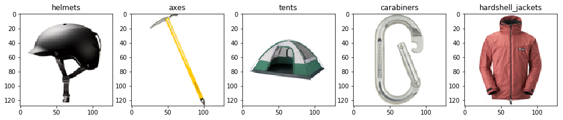

# 任务二：深入丛林

## 背景

Adventure Works 公司的数据科学团队决定采用深度学习技术来创建一个图像分类模型，这个模型将要能识别公司目前在售的每一个产品品类。具体来说，这个团队需要开发一个卷积神经网络（ **Convolutional Neural Network，CNN** ）模型。您可以选择使用 *PyTorch* 或者 *Keras* 深度学习框架。

## 先决条件

* 一台数据科学虚拟机 (DSVM)
* 上一个任务中处理完成的经过缩放的  ***gear*** 图像数据集。

## 任务

本任务包含三个子任务：

1. 探索一个卷积神经网络（CNN）例子。
2. 新建并训练一个 CNN 模型。
3. 将模型用于新数据的预测。

> 作为一个团队，您和您的团队需要讨论确定选择哪一个深度学习框架来探索。并不是说您的团队成员就不能分工同时探索 PyTorch 和 Keras ，但团队的首要目标是交出一个能满足成功条件的解决方案。因此您和您的团队需要分工，并且协同工作在一个**共享的**解决方案上。

### 1. 探索一个 CNN 例子

在 **OCPOpenHack/Azure_Deep_Learning/notebooks** 文件夹中，仔细阅读 **02-Image Classification (*framework*).ipynb** notebook 文件中的代码和说明，了解例子中的 CNN 模型是如何创建和使用的。

### 2. 新建并训练一个 CNN 模型

新建一个 notebook 文件，使用您在上一个任务中处理得到的经过缩放的 *gear* 图像数据集来创建一个可以预测图像分类的 CNN 模型：

* 您的模型的结构应当由一系列您所定义的*卷积（convolutional）*、*池化（pooling）*、*失活（dropout）* 和 *全连接（fully-connected）* 层所组成。
* 模型的输入层必须与训练图像数组的大小和形状相匹配。
* 模型的输出层的输出必须包含要预测的每一个类。
* 把图像数据集随机划分成 *训练* 和 *验证* 两个子集，分别用于模型的训练和验证。
* 对于训练过程中的每一个 *世代（Epoch）*，您应当同时记录下在训练集上和在验证集上的平均 *损失（Loss）*。训练过程结束后，您可以把训练的损失值的变化绘出类似下图的图表：

    

#### 提示

* 在 Jupyterhub 环境中使用 **Python 3.5** 内核。
* 根据示例代码来创建您第一个版本的解决方案。
* 可以采用增加卷积层和池化层，或者增加训练世代的方法，改进模型的性能。
* 您的模型应当尽量避免对于训练数据集的 *过拟合（overfitting）*。过拟合的一个表现就是，当训练和验证的损失值收敛后，训练损失持续下降但验证损失持平甚至开始上升，如上图所示。带来的最终结果是模型对于训练集之中的数据预测得很好，然而对于没有见过的新图像则表现平平。也就是模型的概化能力不足。
* 避免过拟合的技巧有：
  * 在模型中包含 *失活层* 来随机去除一些特征。
  * 使用图像旋转、增加偏度等手段来增强训练数据集。

### 3. 将模型用于新数据的预测

使用您训练的模型预测不少于 5 张的相关图片的分类，这些图片应当 **不包含** 在 ***gear*** 数据集中。您可以使用 Bing 搜索引擎加上合适的关键词来获得新的测试图像文件，例如：

* <a href="https://www.bing.com/images/search?q=ski+helmet" target="_blank">https://www.bing.com/images/search?q=ski+helmet</a>
* <a href="https://www.bing.com/images/search?q=climbing+axe" target="_blank">https://www.bing.com/images/search?q=climbing+axe</a>
* <a href="https://www.bing.com/images/search?q=tent" target="_blank">https://www.bing.com/images/search?q=tent</a>
* <a href="https://www.bing.com/images/search?q=carabiner" target="_blank">https://www.bing.com/images/search?q=carabiner</a>
* <a href="https://www.bing.com/images/search?q=insulated+jacket" target="_blank">https://www.bing.com/images/search?q=insulated+jacket</a>

#### 提示

* 在您的 DSVM 上您可以使用 `curl` 命令把新的图像文件下载到机器上。
* 新的测试图像也需要经过缩放和预处理，正如您对训练数据集所做的那样。

## 成功条件

* 成功训练出一个 CNN 模型。
* 把模型训练过程中的平均训练损失和验证损失绘制成图表。
* 在您的验证数据集上，模型的正确率达到 **0.90** (90%) 以上。
* 对您新搜索、下载的 5 张测试图像展示预测结果，如下图：

  

  *(备注：模型不要求100%预测正确，但如果达到100%预测正确，团队值得庆贺一下。)*

如果您和您的团队确认已经全部达成上述成功条件，可以继续进入 [下一任务](Challenge03.md) 接受挑战。

## 参考

### CNN 基础

* <a href="https://ujjwalkarn.me/2016/08/11/intuitive-explanation-convnets/" target="_blank">An Intuitive Explanation of Convolutional Neural Networks</a>
* <a href="https://www.youtube.com/watch?v=FmpDIaiMIeA" target="_blank">How Convolutional Neural Networks work</a> （视频）
* <a href="https://youtu.be/k-K3g4FKS_c" target="_blank">Demystifying AI</a> （视频）

### 深度学习框架

* **<a href="https://pytorch.org/" target="_blank">PyTorch</a>**
  * <a href="https://pytorch.org/docs/stable/index.html" target="_blank">Documentation</a>
  * <a href="https://pytorch.org/tutorials/" target="_blank">Tutorials</a>
* **<a href="https://keras.io/" target="_blank">Keras</a>** （使用 TensorFlow 或者 CNTK 作为抽象层的后端）
  * <a href="https://keras.io/" target="_blank">Documentation</a>
  * <a href="https://github.com/fchollet/keras-resources" target="_blank">Tutorials</a>
