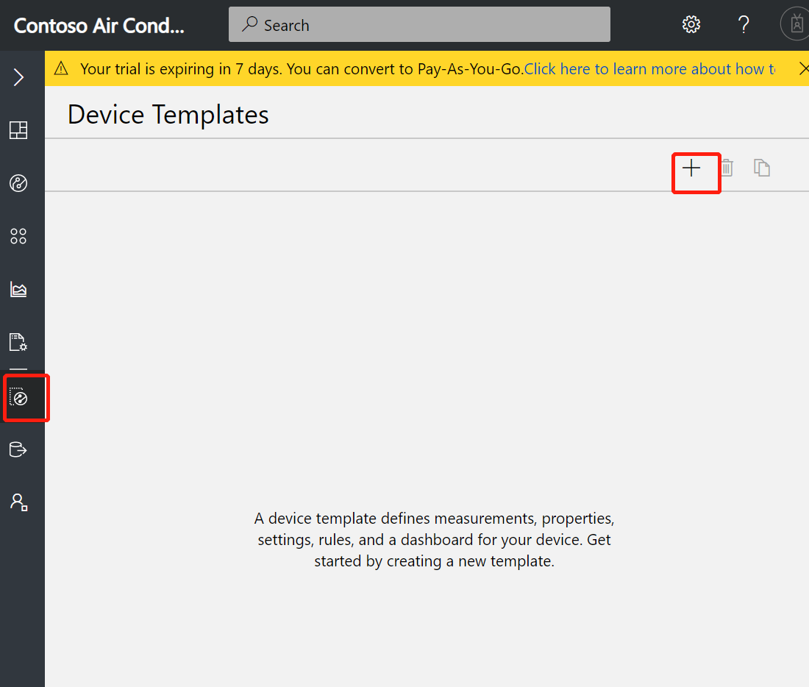
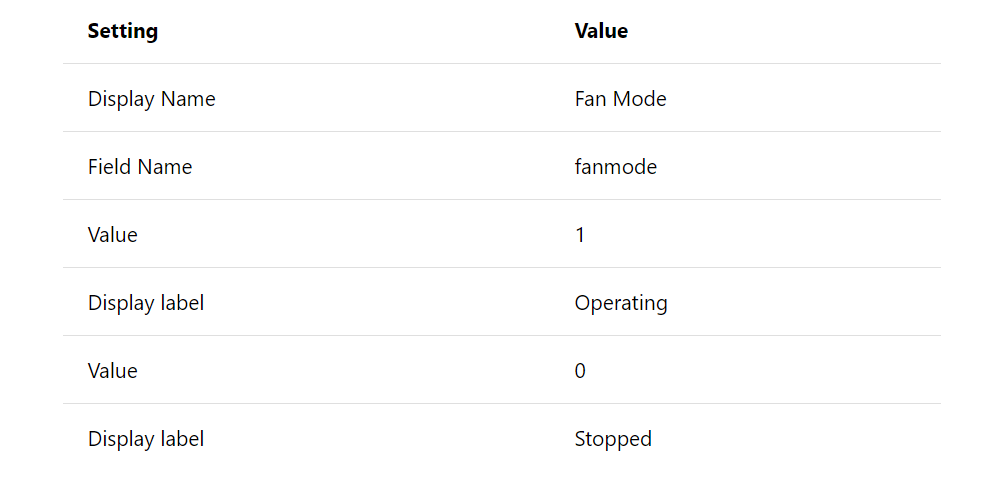

# 利用Azure IoT Central快速搭建远程监控平台

本教程介绍了如何利用模板在 Microsoft Azure IoT Central 应用程序中定义一个远程监控系统。设备模板定义设备类型的遥测、状态、属性和设置。

为了在连接实际设备之前，提前测试应用程序，IoT Central 会在创建设备模板时基于该模板生成一个模拟设备。

本教程将创建“Connected Air Conditioner”设备模板。他将连接模拟的空调设备：

- 发送温度和湿度等遥测数据。
- 报告状态，例如，该设备是已打开还是已关闭。
- 具有设备属性，例如固件版本和序列号。
- 具有设置，例如目标温度。
  
本教程介绍如何执行下列操作：

- 创建新设备模板
- 将遥测功能添加到设备
- 查看模拟遥测数据
- 定义事件度量
- 查看模拟事件
- 定义状态度量
- 查看模拟状态
- 使用设置和属性
- 使用命令
- 在仪表板中查看模拟设备
 

### 1. 创建一个空的 Azure IoT Central 应用程序：
- 导航到 Azure IoT Central 的[应用程序管理器](https://apps.azureiotcentral.com/) 页。
输入用于访问 Azure 订阅的电子邮件地址和密码：

- 若要开始创建新的 Azure IoT Central 应用程序，请选择“新建应用程序”：

- 若要创建新的 Azure IoT Central 应用程序：
  - 选择“试用版”。 无需 Azure 订阅即可创建试用版应用程序。
  - 选择“自定义应用程序”。
  - 可以选择一个友好的应用程序名称，例如 Contoso Air Conditioners。 Azure IoT Central 将会生成唯一的 URL 前缀。 可将此 URL 前缀更改为更容易记住的内容。
  - 选择“创建”。

### 2. 创建设备模板
开发人员可在应用程序中创建和编辑设备模板。 创建设备模板时，Azure IoT Central 将会基于该模板生成模拟设备。 模拟设备生成遥测数据，使你能够在连接实际设备之前测试应用程序的行为。

若要将新设备模板添加到应用程序，需要转到“设备模板”页。 为此，请在左侧导航菜单中选择“设备模板”。

1. 在“设备模板”页上，选择“+新建” ：

2. 该页面显示了你可以选择的模板。
3. 选择“自定义”，输入“Connected Air Conditioner”作为设备模板的名称，然后选择“创建” 。 还可以上传设备的图像，使操作员能够在 Device Explorer 中看到它：

4. 在“Connected Air Conditioner”设备模板中，确保在定义遥测的“度量”选项卡中操作。 定义的每个设备模板包含单独的选项卡用于执行以下操作：
- 指定度量，例如设备发送的遥测数据、事件和状态。
- 定义用于控制设备的设置。
- 定义属于设备元数据的属性。
- 定义要在设备上直接运行的命令。
- 定义与设备关联的规则。
- 为操作员自定义设备仪表板。
  

若要添加温度遥测度量，请选择“New Measurement”。 然后选择“Telementry”作为度量类型：

若要配置“温度”遥测，请使用下表中的信息：

还可以选择遥测数据的显示颜色。 若要保存遥测定义，请选择“保存”：

之后，“Measurement”页会显示模拟的连接空调设备发来的温度遥测数据图表。 使用控件可以管理可见性、聚合，或编辑：

还可以使用“折线图”、“编辑时间范围”等控件来自定义图表。

### 4. 定义事件度量

可以使用“Event”来定义设备发送的时间点数据，以指明某个重要的事件，例如，发生错误或组件故障。 与处理遥测度量一样，Azure IoT Central 可以模拟设备事件，使你能够在连接实际设备之前测试应用程序的行为。 在“Measurement”视图中为设备类型定义事件度量。
若要添加“风扇电机错误”事件度量，请选择“New Measurement”。 然后选择“Event”作为度量类型：

若要配置“风扇电机错误”事件，请使用如下图的信息，并保存。

之后，“Measurement”页会显示模拟的连接空调设备随机生成的事件图表。使用控件可以管理可见性，或编辑事件定义：

### 5. 定义状态度量

可以使用“State”来定义和可视化设备或其组件在一段时间内的状态。 与处理遥测度量一样，Azure IoT Central 可以模拟设备状态，使你能够在连接实际设备之前测试应用程序的行为。 在“Measurement”视图中为设备类型定义状态度量。

若要添加“风扇模式”度量，请选择“New Measurement”。 然后选择“State”作为度量类型：
连接的空调状态度量

为设备模板定义的每种状态都包括一些配置选项。若要配置“风扇模式”状态，请使用下表中的信息：

若要保存状态度量定义，请选择“保存”：

之后，“Measurement”页会显示模拟的连接空调设备随机生成的状态图表。使用控件可以管理可见性，或编辑状态定义。

### 6. 设置、属性和命令

设置、属性以及命令是设备模板中定义的、与每个设备关联的不同值：

- 使用“设置”可从应用程序向设备发送配置数据。 例如，操作员可以使用某项设置将设备的遥测间隔从 2 秒更改为 5 秒。 当操作员更改某项设置时，该设置将在 UI 中标记为挂起，直到设备确认已处理设置更改为止。
- 请使用“属性”来定义与设备相关联的元数据。 有两种类别的属性：
  - 使用“应用程序属性”可以记录有关应用程序中设备的信息。 例如，可以使用应用程序属性来记录设备的位置以及上一次进行维修的日期。 这些属性存储在应用程序中，不会与设备保持同步。 操作员可以向属性赋值。
  - 使用“设备属性”可让设备向应用程序发送属性值。 这些属性只能由设备更改。 对于操作员而言，设备属性是只读的。 在这个有关连接的空调的方案中，固件版本和设备序列号是由设备报告的设备属性。

- 请使用命令通过应用程序远程管理设备。 可以通过云直接在设备上运行命令，以便控制设备。 例如，操作员可以运行重启之类的命令来即时重启设备。

### 7. 使用设置

操作员可以使用“设置”向设备发送配置数据。 在本部分，我们要将一项设置添加到“连接的空调”设备模板，使操作员能够设置连接的空调的目标温度。
- 导航到“Connected Air Conditioner”设备模板的“Settings”页,并选择“Edit Template”：

可以创建不同类型（例如数字或文本）的设置。

- 选择“数字”可将数字设置添加到设备。
- 若要配置“设置温度”设置，请使用下表中的信息，并保存。

### 8. 使用属性
使用“应用程序属性”可以存储有关应用程序中设备的信息。 在本部分中，向“连接的空调”设备模板中添加应用程序属性，以便存储设备的位置和最后维修日期。 请注意，这两者都是设备的可编辑属性。 还有由设备报告的无法更改的只读设备属性，例如设备序列号和固件版本。
导航到“连接的空调”设备模板的“属性”页：

可以创建不同类型（例如数字或文本）的设备属性。 若要向设备模板添加位置属性，请选择“位置”。

选择“保存”。

若要向设备模板添加最后维修日期属性，请选择“日期”。
若要配置最后维修日期属性，请使用下表中的信息：

选择“保存”。

若要向设备模板添加设备属性（例如固件版本），请选择“设备属性”。
若要配置固件版本，请使用下图中的信息：

选择“保存”。
若要向设备模板添加设备属性（例如序列号），请选择“设备属性”。
若要配置序列号，请使用下图中的信息：

选择“保存”。

### 8. 使用命令
若要允许操作员直接在设备上运行命令，请使用“命令”功能。 在本部分，请将一项命令添加到“连接的空调”设备模板，使操作员能够回显已连接空调上的特定消息。
1. 导航到“连接的空调”设备模板的“命令”选项卡，以便编辑模板。
2. 选择“+新建命令”，向设备添加命令，然后开始配置新命令 。
3. 若要配置新命令，请使用以下信息

选择“保存”。
4. 可以通过移动命令磁贴或调整其大小，来自定义“命令”选项卡的布局。

### 9. 查看模拟设备

定义“Connected Air Conditioner”设备模板后，可以自定义其“仪表板”，以包含定义的度量、设置和属性。 然后，可用操作员的身份预览仪表板：
1. 选择“连接的空调”设备模板的“仪表板”选项卡。
2. 选择“折线图”，将组件添加到“仪表板”上 。
3. 使用下图中的信息配置“折线图”组成部分：

再选择“保存” 。
4. 使用下图中的信息配置“事件历史记录”组件：

再选择“保存” 。
5. 使用下图中的信息配置“状态历史记录”组成部分：

再选择“保存” 。
6. 若要将设备设置和属性添加到仪表板，请选择“设置和属性”。 选择“添加/删除”，添加希望在仪表板中看到的设置或属性。
7. 使用下图中的信息配置“设置和属性”组成部分：

再选择“保存” 。
8. 现在，可以在仪表板上查看连接的空调的模拟数据。 可以编辑仪表板的磁贴和布局：

本教程介绍了如何：
- 创建新设备模板
- 将遥测功能添加到设备
- 查看模拟遥测数据
- 定义设备事件
- 查看模拟事件
- 定义状态
- 查看模拟状态
- 使用设置和属性
- 使用命令
- 在仪表板中查看模拟设备

在 Azure IoT Central 应用程序内定义设备模板后，接下来您还可以选择继续执行以下步骤：

[为设备配置规则和操作](https://docs.microsoft.com/zh-cn/azure/iot-central/tutorial-configure-rules)

[自定义操作员的视图](https://docs.microsoft.com/zh-cn/azure/iot-central/tutorial-customize-operator)
