# 基于LUIS的Voice Command创建
Language Understanding Intelligent Services（简称LUIS），是Azure中用于会话AI的意图管理的服务。通过LUIS用户可以创建任务对话服务中的意图，意图中的参数，部署和管理意图信息，发布意图服务给对话机器人或者其他需要意图识别的应用。

本实验通过一个零售商品查询的场景，演示和介绍如何使用[luis.ai](https://www.luis.ai)生成语义App，创建意图，训练意图并发布语义App REST API给其他应用服务调用。该实验将包括以下内容：
- 创建语义应用
- 创建意图/语料
- 创建实例
- 训练与测试意图
- 发布和调用语义应用


该样例需要使用[微软认知服务](https://azure.microsoft.com/zh-cn/services/cognitive-services/)中语义服务，需要申请免费使用账号或者购买Azure.com的订阅，Azure.com的试用账号可以参考[链接](http://www.cnblogs.com/meowmeow/p/7773226.html?from=groupmessage&isappinstalled=0)

## 创建语义应用 ##
1 . LUIS为开发者提供了定制化训练业务场景语义的工具，开发者可以自己独立完成语义应用的搭建和训练。访问[luis.ai](https://www.luis.ai)，使用已有的Azure订阅账号登陆。
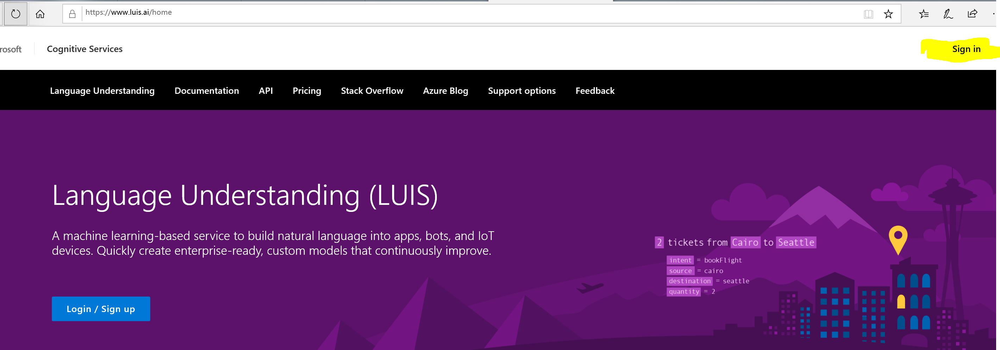

2 . 登陆LUIS门户后，进入MyApp页面，点击New App，创建你的LUIS应用，输入应用名称，语种（目前支持13种语言），应用的描述等信息。输入完成后点击创建。
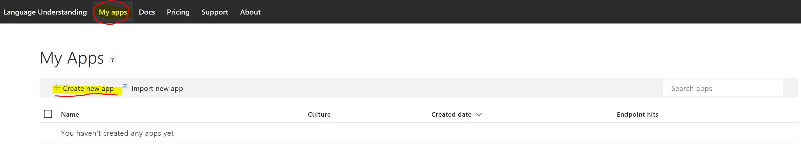

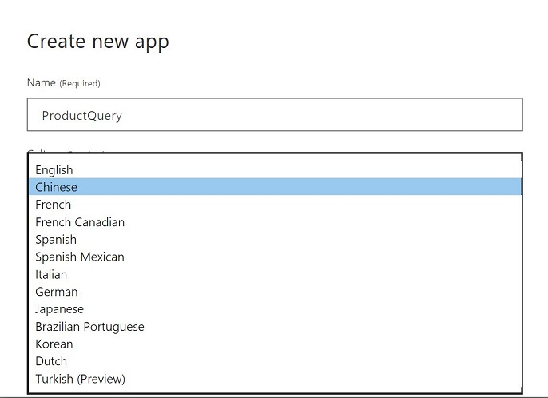

3 . 应用创建成功后，进入意图应用开发界面，界面功能介绍如下：
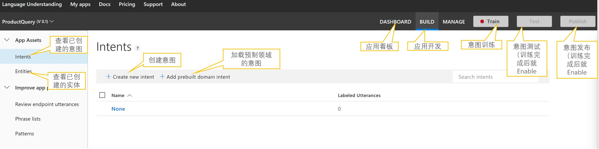


## 创建意图/语料 ##
4 . 应用创建完成后，就可以开始为系统创建意图，点击"Create new intent"，输入意图名称比如“查询商品价格”，点击确认。
5 . 意图创建后，需要输入意图相关的语料，可以输入多个语料，每个语料输入后回车即可，确认的语料会出现在Utterance列表中。 
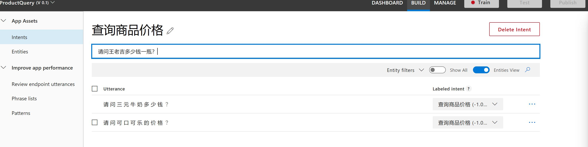

这里创建的语料中的“可口可乐”， “三元牛奶”，“王老吉”这些商品名称会有很多，不需要为每个商品名称都创建语料，只需要创建“商品名称”的实体（entity），需要的该实体的语料只需要在语料中加入该实体即可。

接下来， 我们看看实体的创建

## 创建实例 ##
6 . 点击左侧功能栏中的Entities，进入实体管理界面， 选择Create new entity， 输入实体名称，例如“商品名称”，点击“Done”
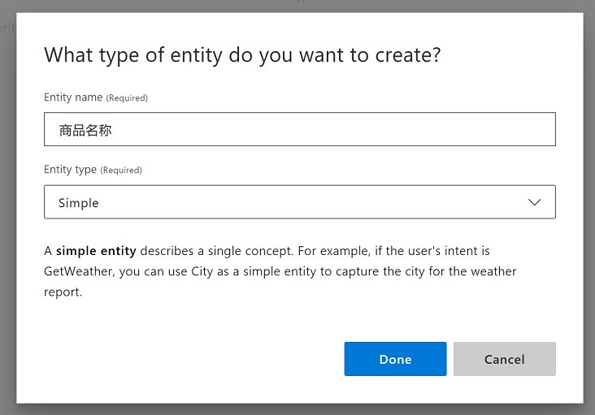
7 . 如果我们的实体是从一组数据中选择，比如商品名称的实际参数有：可口可乐，王老吉，三元牛奶，娃哈哈， 德芙巧克力等等。这时候我们需要创建Phrase List导入商品名称列表。点击左侧功能栏中的Phrase Lists， 进入Phrase List的管理界面，点击Create new phrase list，输入Phrase List名称，**必须与之前的实体名称一致**，这里是“商品名称”， 在Value栏中输入商品列表的参数，**注意参数之间用英文逗号分隔**，输入完成回车。
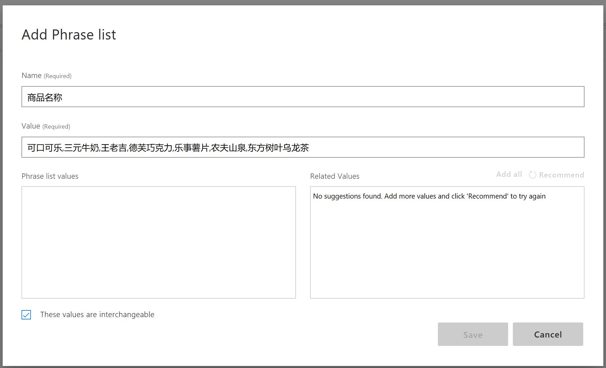
8 . 回车后，参数列表信息就会进入左下方的Phrase list values框中， 同时右下方的Related Values里面会有其他相关的推荐，可以根据需要添加对应的value进入你的Phrase List Values中，完成后，点击Save。
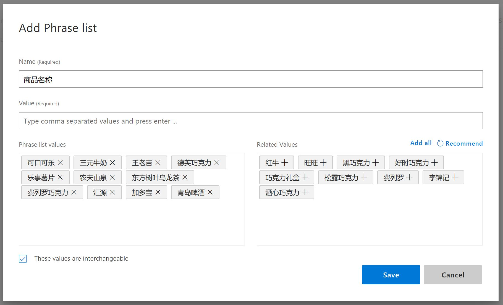

9 . 实体和对应的Phrase List创建完成后， 可以为需要该实体的语料做实体关联，点击左侧功能栏的Intents，进入意图管理界面， 选择之前我们创建的“查询商品名称”的意图，可以调出之前的Utterance列表， 用鼠标在Utterance中连续点击需要作为实体的字符，比如这里“王老吉”，就会自动出现实体列表， 其中会显示我们之前创建的实体“商品名称”，选择“商品名称”。以此类推， 为下面的三元牛奶，和可口可乐都做商品名称的关联。
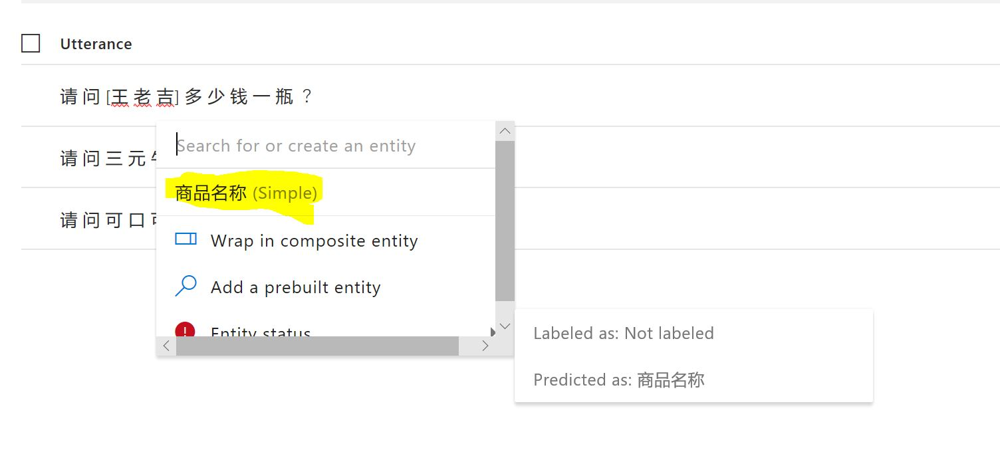

此外，LUIS模型中提供预定义的实体，如时间，数字，百分比，年龄等，当你需要的语料实体是预定义实体时，就不用创建这些实体类型，可以直接选择语料中的参数，关联预定义的实体就可以。

## 训练与测试意图 ##
10 . 意图和实体管理完成后，就可对意图做训练了， 点击右上方的“Train”，进行训练，训练完成后，就可以进行测试， 点击右上方的“Test”，进入测试界面，输入你需要测试的语料，比如“请问德芙巧克力多少钱？”，然后回车。测试页面会出现测试语料对应的意图以及意图的置信度的打分，这里是0.955（满分是1）。

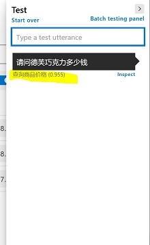

11 . 测试结果中如果需要查看详细的信息，可以点击测试结果中的Inspect，进入Inspect界面，可以看到最高分的意图，该测试语料中是否有实体参数，具体参数信息都可以从这里看到，方便确认测试结果是否正确。

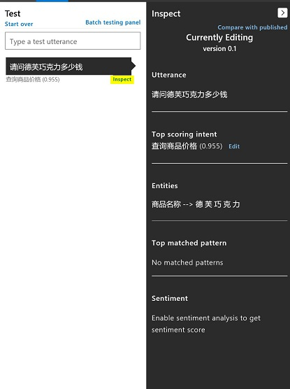

到这里，我们查询商品价格的意图就创建并测试完成，可以通过以上方法持续添加该应用需要的其他意图，比如“查询商品余量”。所有意图和实体创建测试完成后，就可以进入发布阶段。

## 发布语义应用 ##

12 . 发布语义应用需要使用LUIS的访问密钥。接下来，我们来看如何在您的[Azure Portal](http://portal.azure.com)中创建LUIS服务，发布语义应用时需要使用该LUIS服务的密钥。
13 . 登陆[Azure Portal](http://portal.azure.com)后， 点击创建，输入LUIS查询，结果中出现与LUIS相关的Azure服务，点击Language Understanding，然后点击Create。
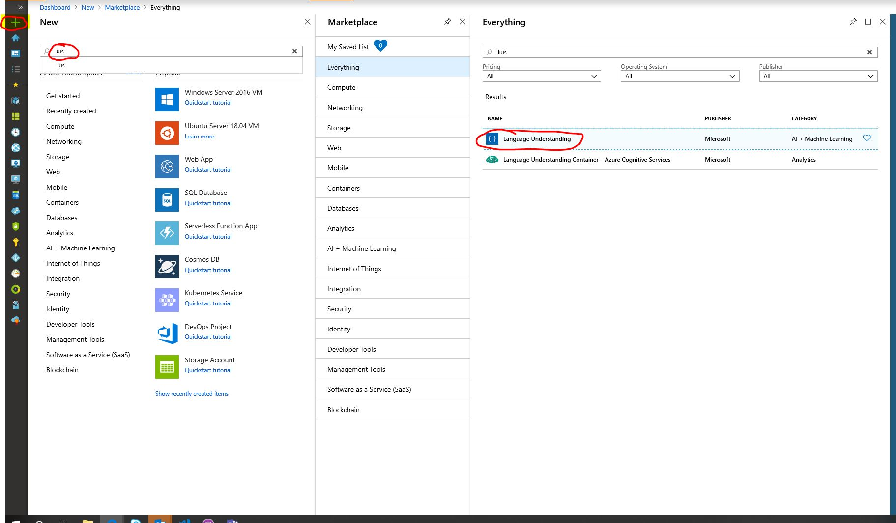
14 . 在服务创建页面输入名称，选择服务的Location，选择价格，测试使用可以选择F0，免费服务， 选择资源组或者创建一个新的资源组，完成后点击下方的Create。

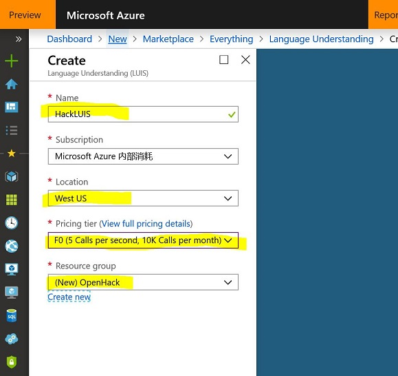
15 . 创建完成后，回到[Luis.ai](http://luis.ai)，点击右上方的MANAGE菜单，进入应用设置管理界面，在左侧功能栏中，选择Keys and Endpoints， 进入密钥和Endpoint管理界面，缺省这里会提供一个Starter-Key，本教程为了给大家一个完整的正式发布流程，在这里增加我们刚刚创建的LUIS服务的密钥，选择Assign resource

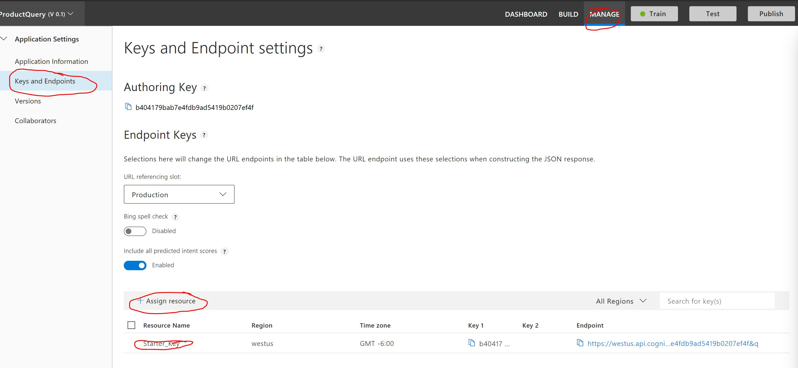
16 . 选择你的账户的租户名称，选择刚刚创建服务所在的订阅， 选择该订阅下面的需要增加的LUIS服务，点击Assign resource，系统会自动将LUIS的Key导入，并生成Endpoint。后面我们就可以发布应用了。**如果你刚刚创建的服务没有出现在下拉列表中，可以尝试重新登陆即可**

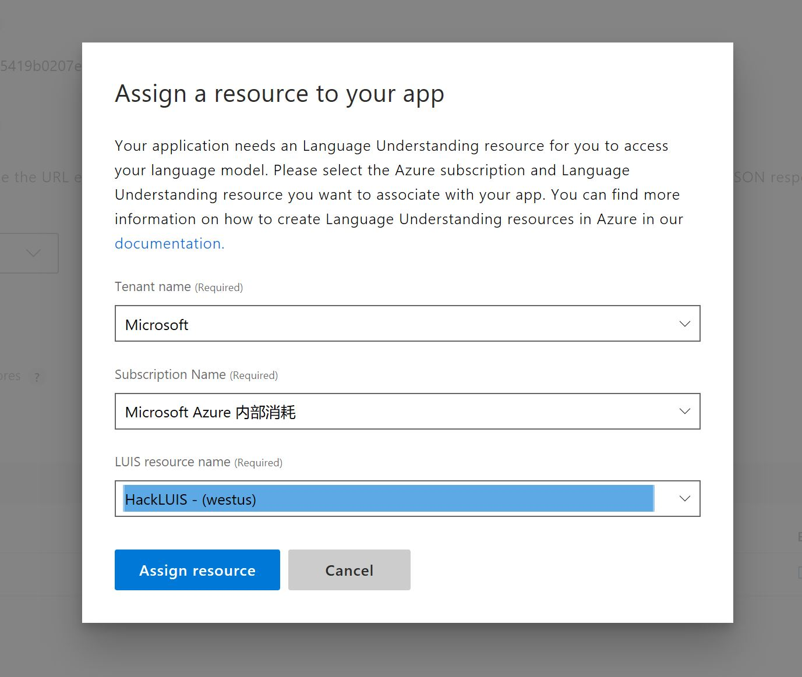

17 . 点击右上方的“Publish”， 系统会发布刚刚的应用， 完成会会提示进入endpoint列表，也就是就进入16步中的列表，点击你的luis resource后面Endpoint链接。

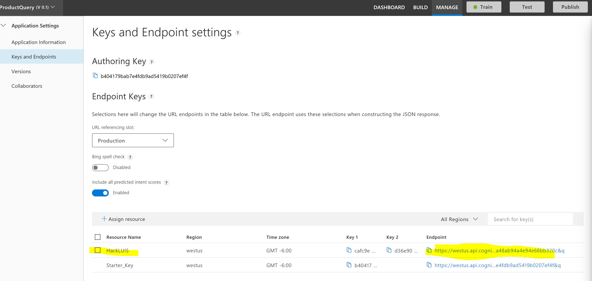

18 . 点击Endpoint链接后，进入浏览器，可以直接在URL链接后面输入测试语料， 回车，就可以看到语义应用返回的Json结果

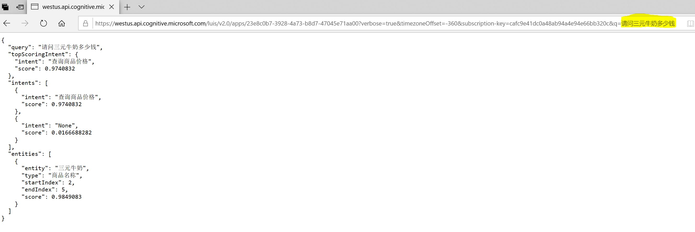
```json
{
  "query": "请问三元牛奶多少钱",
  "topScoringIntent": {
    "intent": "查询商品价格",
    "score": 0.9740832
  },
  "intents": [
    {
      "intent": "查询商品价格",
      "score": 0.9740832
    },
    {
      "intent": "None",
      "score": 0.0166688282
    }
  ],
  "entities": [
    {
      "entity": "三元牛奶",
      "type": "商品名称",
      "startIndex": 2,
      "endIndex": 5,
      "score": 0.9849083
    }
  ]
}
```
接下来，就可以将这个URL提供给需要调用语义应用的用户使用了。

## 总结 ##
LUIS提供给开发者独立完成语义训练环境和服务，利用它可以作为Voice Command或者BOT的意图处理中心，实现自己的人工智能服务。 