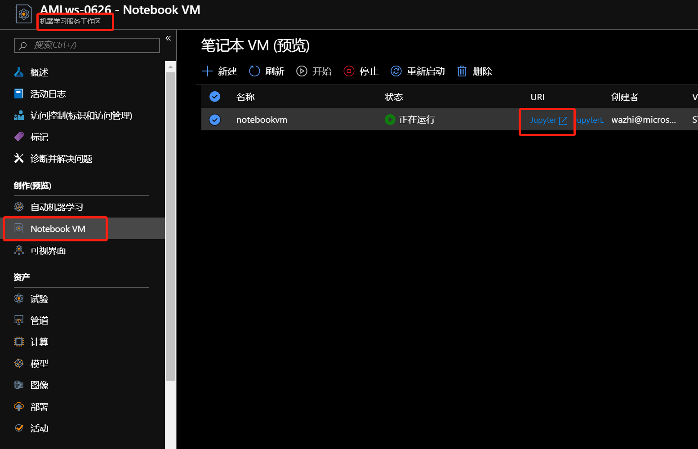
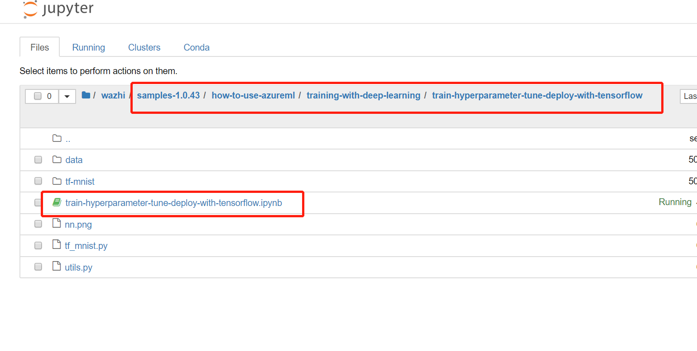

# 超参数优化

## 先决条件
对AML Service的有基本的认识，并完成[Lab0：创建机器学习服务](https://docs.microsoft.com/zh-cn/azure/machine-learning/service/quickstart-run-cloud-notebook)的服务创建。  

## 动手实践
1. 找到创建的Notebook VM，打开Jupyter，如下图所示:

   
2. 找到train-hyperparameter-tune-deploy-with-tensorflow，并执行：
   
   
