# Azure Machine Learning Studio 动手实验
Azure Machine Learning Studio是微软Azure上一个开箱即用的机器学习SaaS服务。您无需安装任何客户端软件和配置环境，也无需准备任何硬件的算力资源，即可以可视化的方式，开发和部署端到端的机器学习任务。

本实验将会让您使用Azure Machine Learning Studio来分别训练、评价和部署三种经典机器学习模型：分类、回归和聚类。会涵盖基本的环节，但不会对特征工程、模型的选择和优化深入涉及。

## 实验条件 ##
要完成本实验，您需要准备好：

1 . 一个Azure Machine Learning Studio账号。如果您还没有，可以访问[https://studio.azureml.net/](https://studio.azureml.net/)来免费注册一个。

2 . 一个浏览器和互联网连接。

3 . 实验中会用到的数据和代码文件，您可以在当前目录下找到。

## 实验一：实现一个分类模型 ##
本实验中，您将会基于一个给定的人口普查数据集，创建一个二元分类模型，这个模型可以根据一些人口统计特征来预测一个人的年收入是否超过$50,000。

使用公开的人口统计数据，根据人口的收入状况、受教育程度和所在地域等信息来对用户分群和画像，是数字营销领域的典型应用场景。

### 数据准备 ###
本实验中用到的人口普查数据集，是Azure Machine Learning Studio中提供的样例数据集之一。但要将其训练出一个分类模型，还需要采取一些数据预处理的技巧：

1. 打开浏览器访问[https://studio.azureml.net/](https://studio.azureml.net/)，用您之前注册好的账号来登录Azure Machine Learning Studio。
2. 新建一个空白实验，并将其命名为 **Adult Income Classification**。
3. 在这个 **Adult Income Classification** 实验中, 把 **Adult Census Income Binary Classification** 样例数据集拖拽到画布区域。
4. 在数据集的Output中右键点击Visualize以浏览这个数据集。这个数据集包含如下特征：
    - **age**: 表明普查对象年龄的数值特征。 
    - **workclass**: 表明普查对象受雇类型的字符串特征。 
    - **fnlwgt**: 表明当前普查对象相对于总人口的记录权重的数值特征。 
    - **education**: 表明普查对象最高教育程度的字符串特征。 
    - **education-num**: 表明普查对象最高教育程度的数值特征。 
    - **marital-status**: 表明普查对象婚姻状况的字符串特征。 
    - **occupation**: 表明普查对象职业的字符串特征。 
    - **relationship**: 表明普查对象在家庭关系中角色的分类特征。 
    - **race**: 表明普查对象种族的字符串特征。 
    - **sex**: 表明普查对象性别的分类特征。 
    - **capital-gain**: 表明普查对象资本利得的数值特征。 
    - **capital-loss**: 表明普查对象资本损失的数值特征。 
    - **hours-per-week**: 表明普查对象每周工作小时数的数值特征。 
    - **native-country**: 表明普查对象国籍的字符串特征。 
    - **income**: 表明普查对象年收入小于等于$50,000或大于$50,000的标签。

**说明**：在真实的机器学习建模任务之前，一般需要您探索数据集，并进行一些数据清洗和转换的工作。但在本实验中，我们已经替您做了数据探索的工作，假设其中某些特征是冗余的，它们对分类标签的预测没有多大帮助。数据转换的策略，在本实验中确定为，将所有的字符串特征转换为分类特征，以及将所有的数值特征都归一化。之所以需要归一化的原因，在于我们将采用逻辑回归来训练分类模型以预测标签。逻辑回归算法要求所有的数值特征的值域在同一尺度下，否则更大值域的特征将会具有更高的权重，从而使模型偏差。

5. 在实验中拖入一个 **Select Columns in Dataset** 模块，并将数据集的输出端连接到这个模块的输入端。
6. 选中 **Select Columns in Dataset** 模块，在 **Properties** 面板中点击 **Launch column selector** ，并在 **With Rules** 页面 **排除** (Exclude)如下这些特征：
    - workclass 
    - education 
    - occupation 
    - capital-gain 
    - capital-loss 
    - native-country 
  
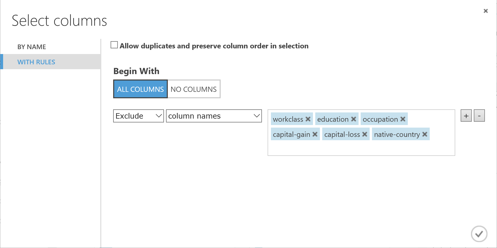

7. 在实验中拖入一个 **Normalize Data** 模块，并将 **Select Columns in Dataset** 模块的输出端连到这个模块的输入端。
8. 把 **Normalize Data** 模块的属性按如下设置：

    - **Transformation method**: MinMax 
    - **Use 0 for constant columns**: 不选 
    - **Columns to transform**: All numeric columns
     
9. 在实验中拖入一个 **Edit Metadata** 模块，并把 **Normalize Data** 模块的左边输出端 **Transformed dataset** 连到这个模块的输入端。 
10. 把 **Edit Metadata** 模块的属性按如下设置：

    - **Column**: All string columns 
    - **Data type**: Unchanged 
    - **Categorical**: Make categorical 
    - **Fields**: Unchanged 
    - **New column names**: 留空白 

11. 确保您的实验跟下图一致，然后保存并运行实验:

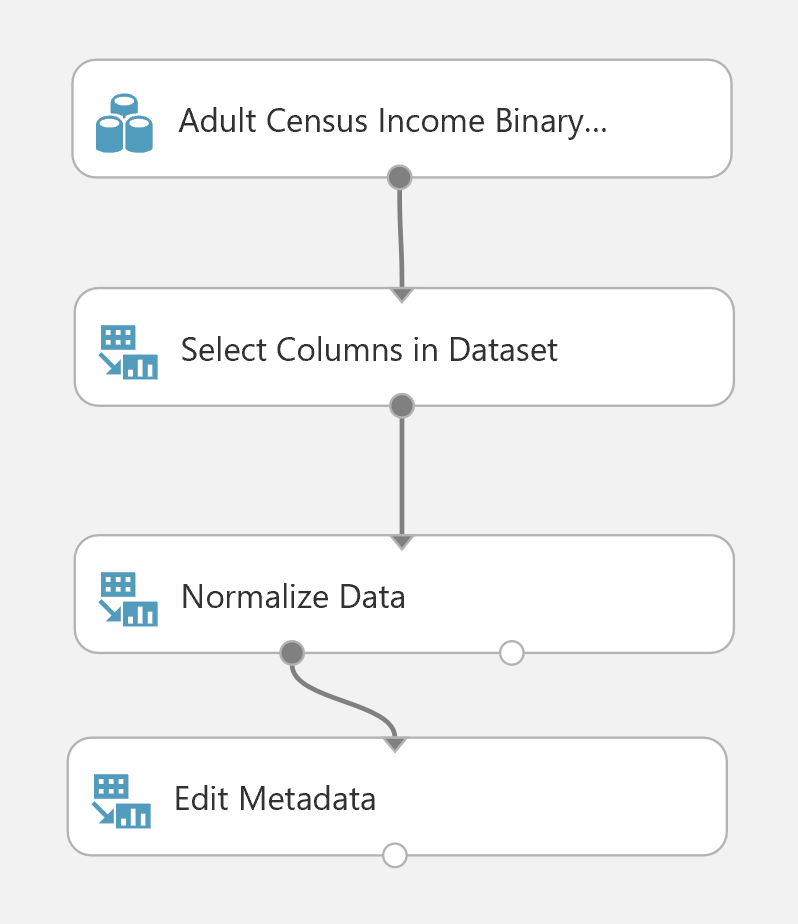

12. 实验运行结束后，在 **Edit Metadata** 模块的输出端右键选择 Results Dataset-> Visualize ，验证如下结果：
     
- 前述指定的那些特征已经被去掉了。 
- 所有的数值类型的特征取值都在0和1之间。 
- 所有字符串类型的特征，其特征类型都为 **Categorical Feature** 。

### 创建和评估分类模型 ###

完成数据准备之后，现在您可以创建和评估一个分类模型了。这个模型的目的，是需要把人根据收入情况分成两类：low (<=50K) 或者 high (>50K)。

1.	在Adult Income Classification实验中，拖入一个 **Split Data** 模块，并且把 **Edit Metadata** 模块的输出端连到这个 **Split Data** 模块的输入端。您将利用这个模块将数据集划分成用于训练和测试的两个子集。
2.	把 **Split Data** 模块的属性按如下设置： 

    - **Splitting mode**: Split Rows 
    - **Fraction of rows in the first output dataset**: 0.6 
    - **Randomized split**: 勾选 
    - **Random seed**: 123 
    - **Stratified split**: False 

3.	在实验中拖入一个 **Train Model** 模块，并把 **Split Data** 模块的左边输出端 **Results dataset1** 连到 **Train Model** 模块的右边输入端 **Dataset** 。 
4.	在 **Train Model** 模块的 **Properties** 面板中，点击 **Launch column selector** 并选中 **income** 列。这是设置待训练的分类模型所要去预测的标签列（标签特征）。 
5.	在实验中拖入一个 **Two Class Logistic Regression** 模块，并把这个 **Two Class Logistic Regression** 模块连到 **Train Model** 模块的左边输入端 **Untrained model** 。这是设置分类模型将使用二元逻辑回归算法来训练。 
6.	把 **Two Class Logistic Regression** 模块的属性按如下设置：
    - **Create trainer mode**: Single Parameter 
    - **Optimization tolerance**: 1E-07 
    - **L1 regularization weight**: 0.001 
    - **L2 regularization weight**: 0.001 
    - **Memory size for L-BFGS**: 20 
    - **Random number seed**: 123 
    - **Allow unknown categorical levels**: 勾选 

7.	在实验中拖入一个 **Score Model** 模块，并把 **Train Model** 模块的输出端连到 **Score Model** 模块的左边输入端 **Trained model** ，再把 **Split Data** 模块的右边输出端 **Results dataset2** 连到 **Score Model** 模块的右边输入端 **Dataset** 。 
8.	在 **Score Model** 模块的 **Properties** 面板上，确保 **Append score columns to output** 选项处于勾选的状态。 
9.	在实验中拖入一个 **Evaluate Model** 模块，并把 **Score model** 模块的输出端连到 **Evaluate Model** 模块的左边输入端 **Scored dataset** 。
10.	确保您的实验与下图一致，然后保存并运行实验。 

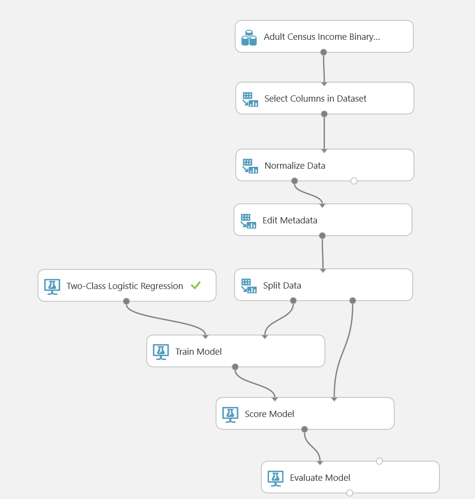

11.	实验运行结束后，在 **Score Model** 模块的输出端右键选中 Visualize ，并比较在 **Scored Labels** 列中的预测结果和在测试数据集中 **income** 列的原始真值间的异同。
12.	可视化 **Evaluate Model** 模块的输出结果，并检查ROC曲线（如下图）。曲线下的面积（由AUC值表示）越大，分类模型的预测能力越强。然后检查模型的 **Accuracy** 值. 是否在0.82左右。这表明该分类模型有82%的机会预测是正确的。对于一个初始模型来说，这个数字还不错。 

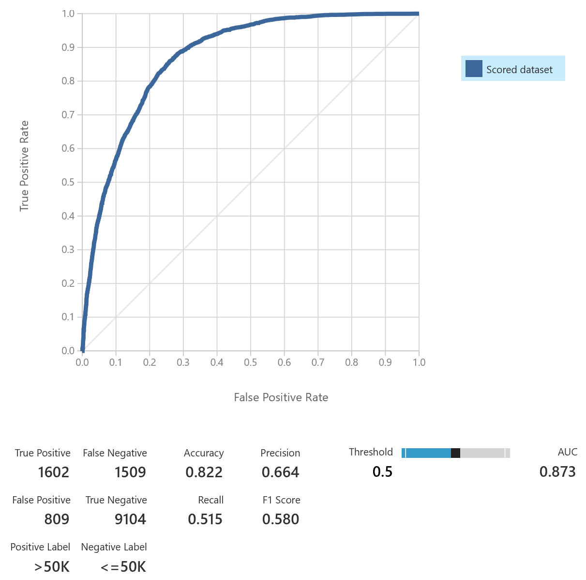

### 把模型发布成一个Web服务 ###

1.	在Adult Income Classification实验打开的状态下，点击页面下方的 **SET UP WEB SERVICE** 图标，并点击 **Predictive Web Service [Recommended]** 。 一个新的预测性实验的标签页会自动创建出来。 
2.	预测性实验会有些许重新布局。确保这个实验与下图类似: 

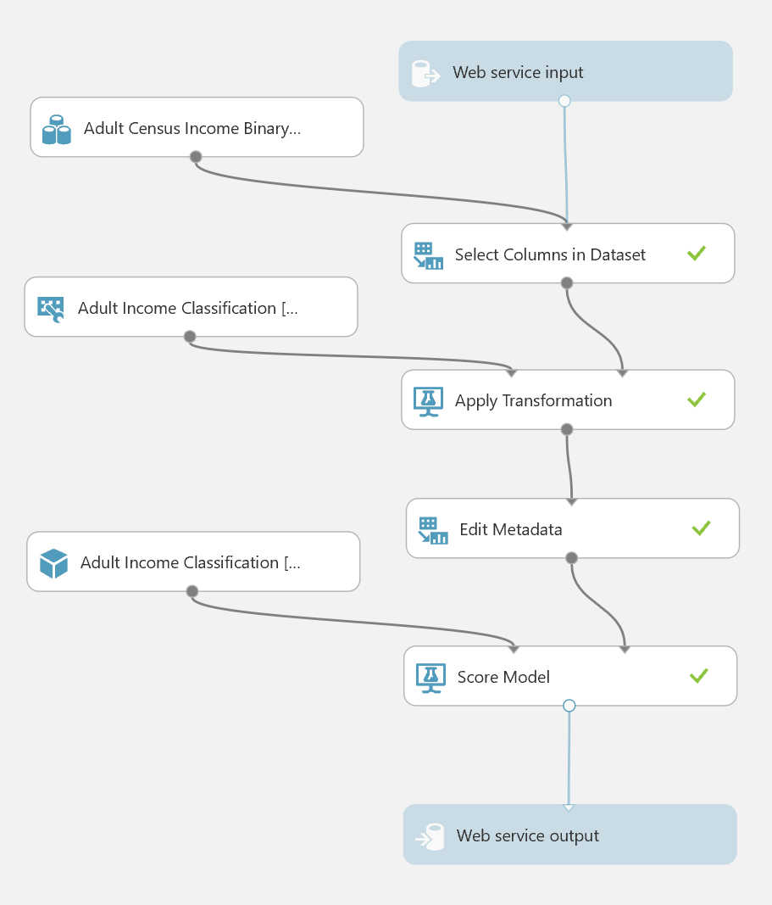

3.	删除 **Score Model** 模块和 **Web service output** 模块之间的连线。 
4.	在实验中拖入一个 **Select Columns in Dataset** 模块，把 **Score Model** 模块的输出端连到它的输入端。然后把 **Select Columns in Dataset** 模块的输出端连到 **Web service output** 模块的输入端。 
5.	选中 **Select Columns in Dataset** 模块，在属性面板上点击 **Launch column selector** ，只选择 **Scored Labels** 这一个列。这一步是为了让这个Web服务被调用时，仅仅返回预测的值。
6.	确保当前的预测性实验看上去与下图类似，然后保存并运行这个预测性实验：

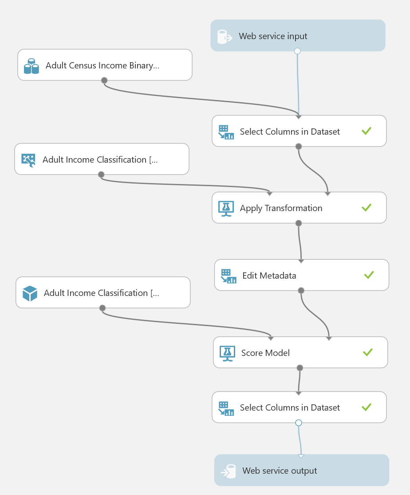

7.	实验运行结束后，把最后一个 **Select Columns in Dataset** 模块的输出可视化，验证是否仅有 **Scored Labels** 列被返回了。

### 部署和使用Web服务 ###

1.	在 Adult Income Classification [Predictive Exp.] 实验中，点击窗口下方的 **Deploy Web Service** 图标。
2.	当仪表板页面出现后，注意这里的 **API key** 和 **Request/Response** 链接。稍后您将要用到这些信息以便从一个客户端应用调用这个 Web 服务。

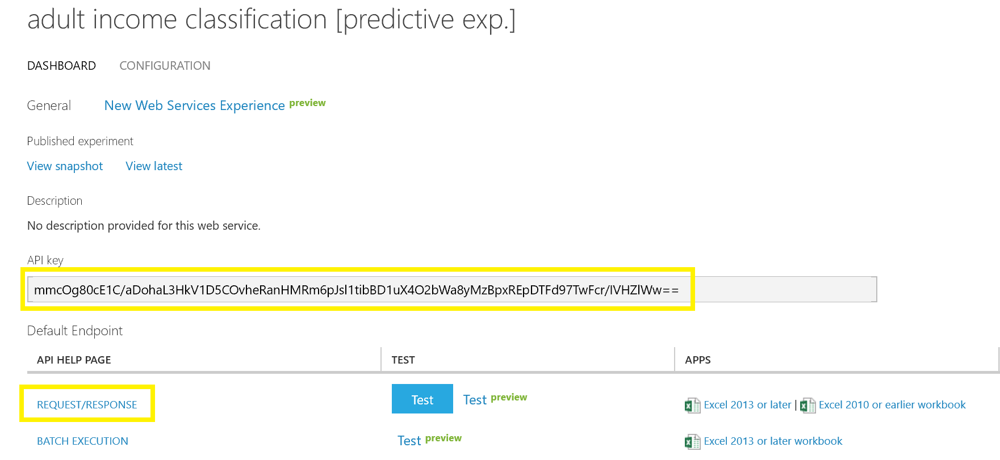

3.	在浏览器中，保持仪表盘页面的打开状态。并新建一个浏览器标签页。
4.	在新的浏览器标签页上，导航到 https://office.live.com/start/Excel.aspx。
如果有弹出页面，用您的微软账号登录。  
5.	在 Excel Online 中新建一个空白的工作簿。  
6.	在 **Insert/插入** 标签，点击 **Office Add-ins/加载项** 。然后在 **Office Add-ins/加载项** 对话框中，选择 **Store/应用商店** ，搜索 Azure Machine Learning ，然后把 **Azure Machine Learning** 插件添加进来，如下图：

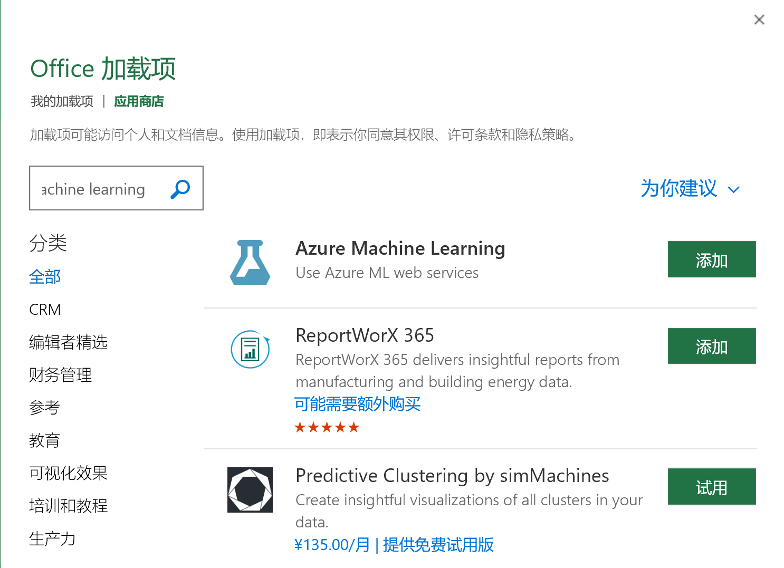

7.	插件安装以后，在 Excel 工作簿右侧的 **Azure Machine Learning** 面板上，点击 **Add Web Service** ，用于输入Web服务的 URL 和 API key 的输入框就出现了。 
8.	在浏览器中切换到打开着 Azure Machine Learning Web 服务的仪表板的那个标签页面，在 **Request/Response** 链接上右键将 Web 服务的 URL 保存到剪贴板，然后切换回打开着 Excel Online 工作簿的那个标签页面，把 URL 复制到对应的输入框。
9.	重复上一步的流程，但这次我们把 Azure 机器学习 Web 服务的 **API key** 复制到 Excel Online 工作簿中对应的 API key 输入框。 
10.	确保工作簿中 Azure Machine Learning 面板上的信息与下图类似，然后点击下方的 **Add** ： 

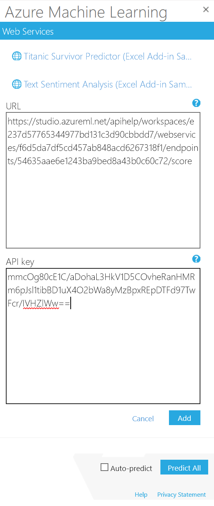

11.	Web 服务添加之后，在 Azure Machine Learning 面板上点击 **1. View Schema** 。 观察 Web 服务所需要的输入格式及其输出。
12.	在 Excel 的工作表中选中单元格 A1 。然后在 Azure Machine Learning 面板，收起 **1. View Schema** 部分，并在 **2. Predict** 部分点击 **Use sample data** 。一些样本输入就被添加到了工作表上。
13.	把第二行的样本数据按如下修改：

    - **age**: 39
    - **workclass**: Private
    - **fnlwgt**: 77500
    - **education**: Bachelors
    - **education-num**: 13
    - **marital-status**: Never-married
    - **occupation**: Adm-clerical
    - **relationship**: Not-in-family
    - **race**: White
    - **sex**: Male
    - **capital-gain**: 2200
    - **capital-loss**: 0
    - **hours-per-week**: 40
    - **native-country**: United-States
    - **income**: Unknown 

14.	选中包含输入数据的所有单元格(从 A1 到 O2)，并在 Azure Machine Learning 面板上点击选择输入区域的按钮，确保输入范围是 ‘Sheet1’!A1:O2 。 
15.	确认 **My data has headers** 选项被勾选。  
16.	在 **Output** 文本框输入 P1(也可以是其它单元格)，并确认 **Include headers** 选项被勾选。  
17.	点击 **Predict** 按钮，几秒钟后，就可以在 P2 单元格中看到预测的标签。 
18.	把 F2 单元格的 **marital-status** 的值改成 Married-civ-spouse ，并再次点击 **Predict** 。可以看到 Web 服务所预测的标签更新了。 
19.	接下来可以尝试随意更改几个输入变量，并预测新的收入状况的分类标签。也可以在输入数据区域增加多行，一次性预测不同的输入数据组合所对应的预测标签。

## 实验二：实现一个回归模型 ##

在本实验中，您将会基于一个汽车的数据集进行回归分析。数据集用一组特征来描述每一辆汽车，而您的任务，是利用这些汽车的特征来预测其售价。

### 数据准备 ###

1.	在 Azure Machine Learning Studio 中新建一个实验 Autos。
2.	创建一个新的数据集 autos.csv ，并把在本实验文件夹下的 Lab2-autos.csv 实验文件上传到 Azure Machine Learning Studio。
3.	创建第二个新的数据集 makes.csv，同样把本实验文件夹下的 Lab2-makes.csv 上传到 Azure Machine Learning Studio。
4.	把 autos.csv 和 makes.csv 这两个数据集拖入到 Autos 实验。
5.	在实验中拖入一个 **Apply SQL Transformation** 模块，并把 autos.csv 数据集的输出端连到 **Apply SQL Transformation** 模块的最左边输入端 **Table1** ，把 makes.csv 数据集的输出端连到其中间的输入端 **Table2** 。
6.	把 **Apply SQL Transformation** 模块中缺省的 SQL 脚本替换为本实验文件夹下 Lab2-PrepData.sql 中的代码。
7.	在实验中拖入一个 **Normalize Data** 模块，并将 **Apply SQL Transformation** 模块的输出端连到其输入端。
8.	在 **Normalize Data** 模块的属性面板，按如下设置：
    - **Transformation method**: ZScore
    - **Use 0 for constant columns when checked**: 不选
    - **Columns to transform**: 包含所有除 **lnprice** 外的数值型的列，如下图：

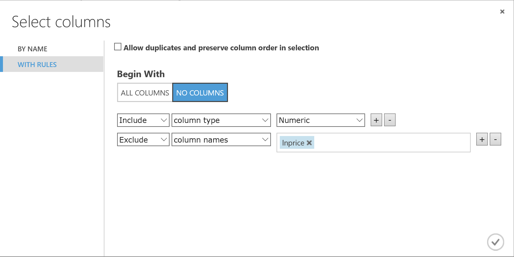

9.	您的实验看起来应与下图类似： 

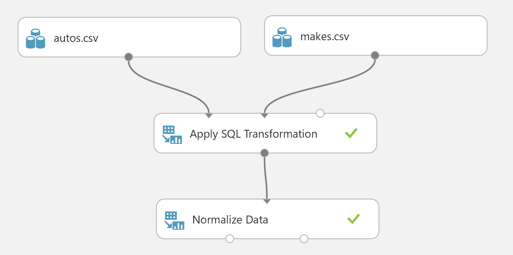

10.	保存实验并运行。在 **Normalize Data** 模块的左边输出端 **Transformed dataset** 选择 Visualize ，观察变换后的数据。

### 去除冗余列、数据划分 ###

您已经清洗和规范化了汽车数据集，并生成了一个名为 **lnprice** 的标签，是由原始数据集中的 **price** 列取自然对数而来。您要创建的模型根据汽车的其它特征来预测 **lnprice** ，因此 **price** 列就显得多余而需要去除。此外，数据集也需要被划分成两个子集，分别用于模型的训练和测试。

1.	在实验中拖入一个 **Select Columns in Dataset** 模块，并将 **Normalize Data** 模块的左边输出端 **Transformed dataset** 连到其输入端。
2.	在 **Select Columns in Dataset** 模块的属性面板点击 **Launch column selector**  来选择除 **price** 以外的所有列。 
3.	在实验中拖入一个 **Split Data** 模块，并将 **Select Columns in Dataset** 模块的输出端连到 **Split Data** 模块的输入端。这个模块会把输入的数据集划分成训练子集和测试子集。 
4.	按如下设置 **Split Data** 模块的属性：
    - **Splitting mode**: Split Rows
    - **Fraction of rows in the first output dataset**: 0.7
    - **Randomized split**: 选中
    - **Random seed**: 123
    - **Stratified split**: False 

### 训练和测试线性回归模型 ###

1.	在实验中拖入一个 **Train Model** 模块，并且把 **Split Data** 模块的左边输出端 **Results dataset1** 连到 **Train Model** 模块的右边输入端 **Dataset** 。
2.	在 **Train Model** 模块的属性面板上，点击 **Launch column selector** 并选择 **lnprice** 列。这步是把 **lnprice** 设置为回归模型要预测的标签特征。
3.	在实验中拖入一个 **Linear Regression** 模块，并且把 **Linear Regression** 的输出端连到 **Train Model** 模块的左边输入端 **Untrained model**。这步是用线性回归算法来训练回归模型。
4.	把 **Linear Regression** 模块的属性按如下设置：
    - **Solution method**: Ordinary Least Squares
    - **L2 regularization weight**: 0.001
    - **Include intercept term**: 不选
    - **Random number seed**: 123
    - **Allow unknown categorical levels**: 勾选
  
5.	在实验中拖入一个 **Score Model** 模块，然后把 **Train Model**T 模块的输出端连到 **Score Model** 模块的左边输入端 **Trained model** ，再把 **Split Data** 模块的右边输出端 **Results dataset2** 连到 **Score Model** 模块的右边输入端 **Dataset** 。
6.	在 **Score Model** 模块的属性面板上，确保 **Append score columns to output** 选项处于被勾选的状态。 
7.	在实验中拖入一个 **Evaluate Model** 模块，并且把 **Score model** 模块的输出端连到 **Evaluate Model** 模块的左边输入端 **Scored dataset** 。
8.	确保您的实验的下半部分与下图类似，然后保存并运行这个实验。

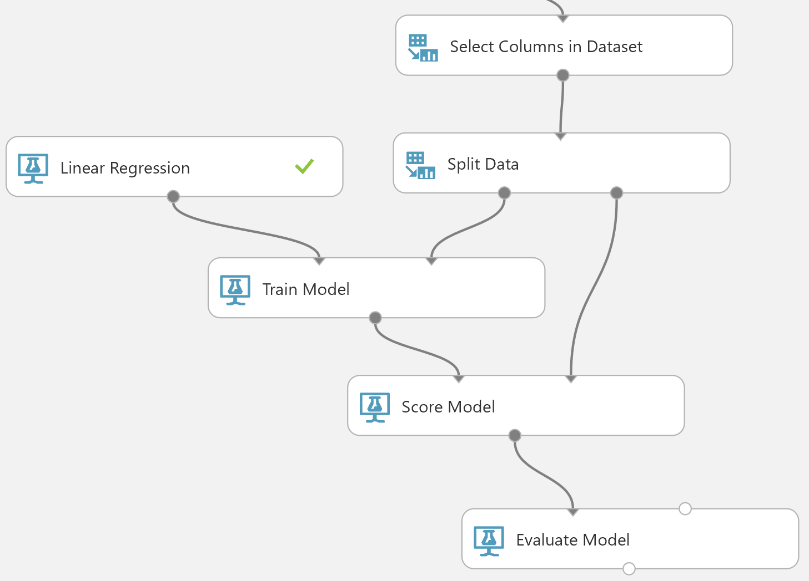

9.	实验运行结束后，在 **Score Model** 模块的输出端右键选择 Visualize 。先选择 **Scored Labels** 列，然后在 **compare to** 下拉框中选择 **lnprice** ，生成的散点图看起来应与下图类似：

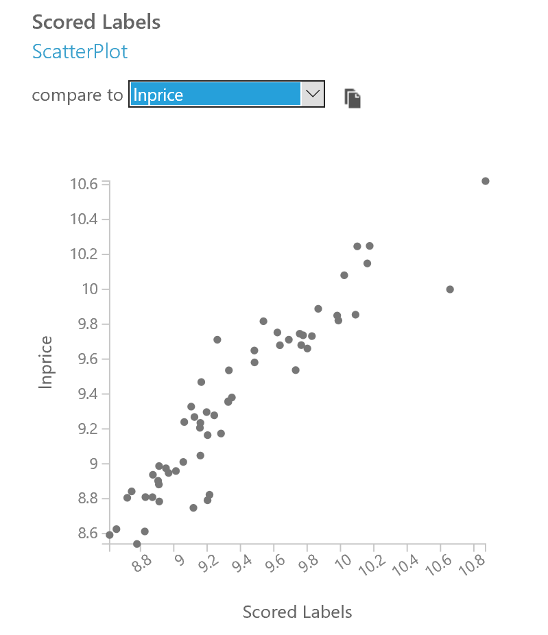

**说明**：**Scored Label** 和 **lnprice** 的值，基本上会落在一条虚拟的对角直线上，周围略有一些散点。这表明模型的拟合良好。

10.	把 **Evaluate Model** 模块的输出可视化，并观察模型的那些度量。均方根误差 (RMSE) 应为 0.183 左右，比源数据中 **lnprice** 列经过规范化之后的标准差（0.4左右）的一半还要小。这也表明模型拟合得相当好。

### 把回归模型发布为一个 Web 服务 ###

1.	在 Autos 实验打开的状态下，点击Azure Machine Learning Studio页面下方的 **SET UP WEB SERVICE** 图标，并点击 **Predictive Web Service [Recommended]** ，一个新的 **Predictive Experiment** 的标签页面就被自动创建出来了。
2.	经过些许重新布局之后，您的 **Predictive Experiment** 看起来和下图类似：

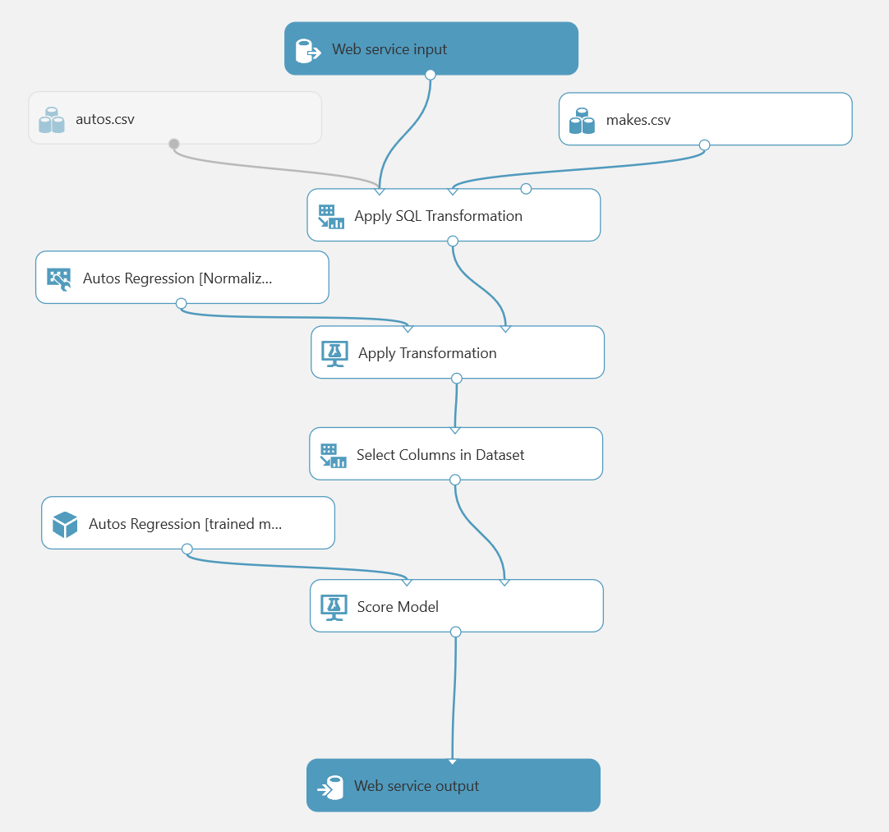

**说明**：这个 Web 服务当前除了返回预测的标签之外，也返回所有其它的数据列。您需要修改预测性模型，使其仅仅返回预测的售价。然而，本模型中所预测得到的数值标签，其实是汽车售价的自然对数。所以您还需要将其转换回真正的价格。

3.	把 **Score Model** 和 **Web service output** 两个模块之间的连线删除。
4.	在实验中拖入一个 **Select Columns in Dataset** 模块，并把 **Score Model** 模块的输出端连到它的输入端。然后在 **Select Columns in Dataset** 模块的属性面板上，点击 **Launch column selector** 并只选择 **Scored Labels** 列。 
5.	在实验中拖入一个 **Apply Math Operation** 模块，把 **Select Columns in Dataset** 模块的输出端连到它的输入端。然后把 **Apply Math Operation** 模块的属性设置如下：
    - **Category**: Basic
    - **Basic math function**: Exp
    - **Column set**: 点击 **Launch column selector** 选择 **Scored Labels** 列。
    - **Output mode**: ResultOnly
 
6.	确保预测性实验看起来和下图类似，然后保存和运行预测性实验。

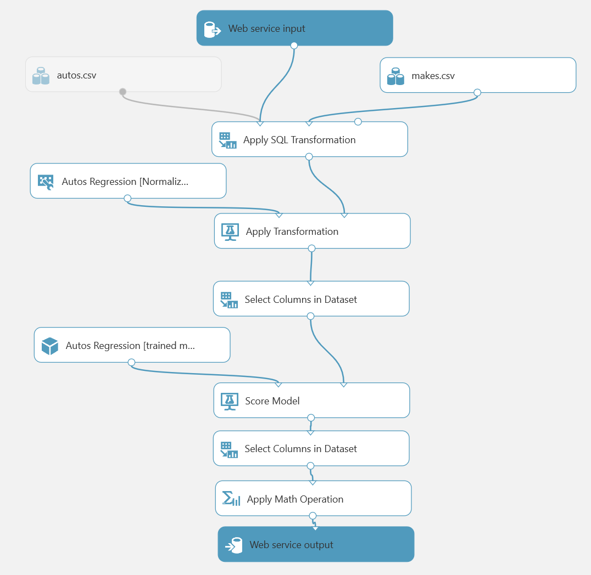

7.	实验运行结束后，在 **Apply Math Operation** 模块的输出端右键点击 Results Dataset-> Visualize ，确保返回的预测结果是售价。

### 部署和使用 Web 服务 ###

1.	在 Autos [Predictive Exp.] 实验中，点击Azure Machine Learning Studio页面下方的 **Deploy Web Service** 图标。 
2.	等待几秒钟直到仪表盘页面出现，注意上面的 **API key** 和 **Request/Response** 链接。 
3.	在 https://office.live.com/start/Excel.aspx 新建一个空白的 Excel Online 工作簿，安装 **Azure Machine Learning** 插件。然后添加 **Autos [Predictive Exp.]** Web 服务，并把 **Request/Response URL** 和 **API key** 粘贴到相应的输入框里。
4.	使用这个 Web 服务，根据如下的值预测一辆汽车的售价：
    - **symboling**: 0
    - **normalized-losses**: 0
    - **make-id**: 1
    - **fuel-type**: gas
    - **aspiration**: turbo
    - **num-of-doors**: four
    - **body-style**: sedan
    - **drive-wheels**: fwd
    - **engine-location**: front
    - **wheel-base**: 106
    - **length**: 192.5
    - **width**: 71.5
    - **height**: 56
    - **curb-weight**: 3085
    - **engine-type**: ohc
    - **num-of-cylinders**: five
    - **engine-size**: 130
    - **fuel-system**: mpfi
    - **bore**: 3.15
    - **stroke**: 3.4
    - **compression-ratio**: 8.5
    - **horsepower**: 140
    - **peak-rpm**: 5500
    - **city-mpg**: 17
    - **highway-mpg**: 22
    - **price**: 0 
5.	记录所预测的售价，然后把 **fuel-type** 改成 diesel 并再次预测售价。

## 实验三：创建一个聚类模型 ##

在本实验中，您将对进行 Adult Census Income Binary Classification 数据集进行 K-均值聚类分析。您将决定数据中蕴含着多少个自然簇，并评估哪些特征决定了这种簇结构。

### 数据准备 ###

**说明**：如果您还没有完成《实验一 实现一个分类模型》，您需要至少完成其中第一个环节——数据准备，然后才能继续下列步骤。

1.	在 Azure Machine Learning Studio 中，打开您在实验一中所创建的 Adult Income Classification 实验。
2.	在实验页面的底部，点击 **Save As** 创建当前实验的一个副本，并命名为 Adult Income Clustering 。
3.	在新的实验中，删除除下列模块以外的所有其它模块：

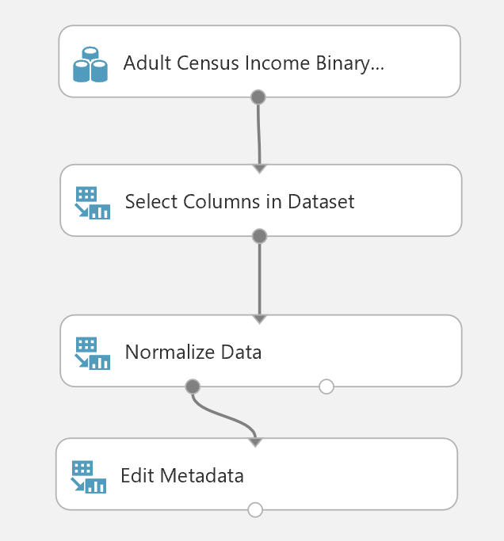

4.	在实验中拖入一个 **Convert to Indicator Values** 模块，并把 **Edit Metadata** 模块的输出端连到它的输入端。
5.	把 **Convert to Indicator Values** 模块的属性设置为选择所有的分类特征，如下图所示：

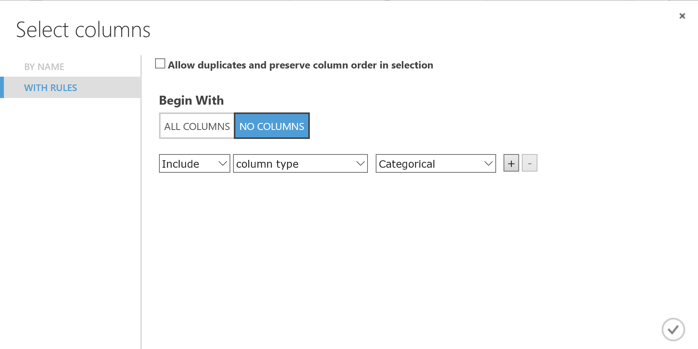

6.	在 **Convert to Indicator Values** 模块的属性中，勾选 **Overwrite Categorical Columns** 选项。
7.	保存并运行当前实验。实验结束运行后，在 **Convert to Indicator Values** 模块的输出端右键选择 Visualize ，可以观察到数据集中的所有分类特征现在都被表示为在每个分类值上取 0 或 1 的数值型的指示器特征。这种数据集的结构可以使得聚类算法更有效。

### 创建一个K-均值聚类模型 ###

数据准备好之后，现在可以创建一个聚类模型了。

1.	在实验中拖入一个 **K-Means Clustering** 模块，并把它的属性按如下设置：
    - **Create trainer mode**: Single Parameter
    - **Number of Centroids**: 2
    - **Initialization**: Random
    - **Random number seed**: 4567
    - **Metric**: Euclidian
    - **Iterations**: 100
    - **Assign Label Model**: Ignore label column
 
2.	在实验中拖入一个 **Train Clustering Model** 模块，并把 **K-Means Clustering** 模块的输出端连到它的左边输入端 **Untrained model** ，再把 **Convert to Indicator Values** 模块的输出端连到它的右边输入端 **Dataset** 。 
3.	把 **Train Clustering Model** 模块的属性设置为选择所有的特征，并勾选 **Check for Append or Unchecked for Result Only** 选项。
4.	在实验中拖入一个 **Select Columns in Dataset** 模块，并把 **Train Clustering Model** 模块的右边输出端 **Results** 连到它的输入端。
5.	设置 **Select Columns in Dataset** 模块的属性，使其选择所有特征。
6.	确保您的实验看起来与下图类似。然后保存并运行当前的实验。

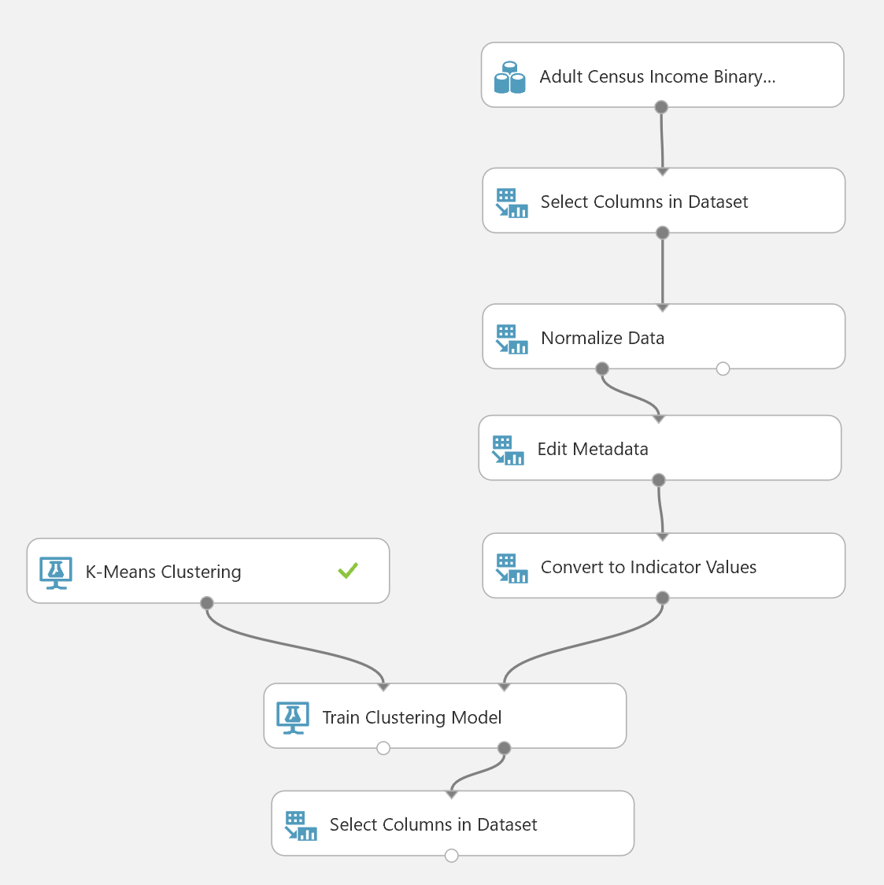

7.	实验运行结束后，在 **Train Clustering Model** 模块的右边输出端 **Results** 右键选择 Visualize ，可以观察到产生了两个簇，类似于下图：

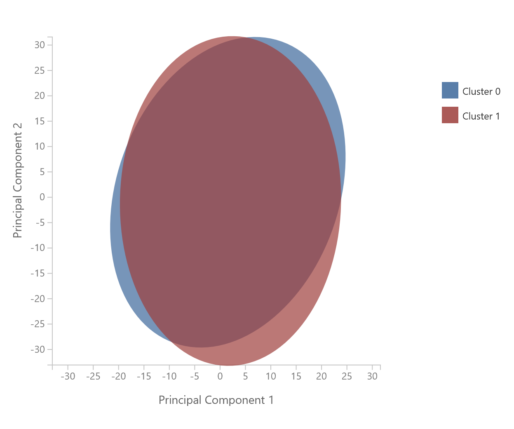

8.	把 **Select Columns in Dataset** 模块的输出端右键选择 Visualize ，可以观察到在表格的从右往左数第三列是 **Assignments** 列，代表了两个簇的编号 {0,1} 。图表展现了被分配到每一个簇的普查人口的比例。有趣的是，簇的分配与收入的高低分类状况不是太一致。这表明数据集当中存在着某些复杂的特征组合表征着数据个体的差异。如果要探索这些影响聚类的特征的分布情况，您可以把数据集导出，并在其它的数据分析工具（例如 Excel ）或者数据分析语言（例如 Python 和 R ）进一步的探索性分析。

## 实验小结 ##

在本实验中，您利用 Azure Machine Learning Studio ，或者基于内置的示例数据集，或者使用自定义数据集，成功地创建、部署和使用了机器学习中的分类、回归模型，并用聚类模型进一步探索了数据。

