# 自定义视觉服务实现分类器
Azure认知服务的视觉服务分类中，提供自定义视觉服务， 主要用来帮助用户创建自定义图像的分类器或者物品检测服务， 与普通视觉服务相比具有一定的定制化能力， 而且用户不需要为训练这个分类器投入太多成本来选择模型或者调整参数。用户只需要提供需要分类的物品图片，自定义视觉服务来帮助用户完成训练和服务发布的工作。

自定义视觉服务提供portal方式可以交互式创建自定义视觉服务，也提供SDK供开发人员通过程序方式创建自己的自定义视觉服务。本实验主要介绍如何用portal方式实现用户自定义图片的分类器。实验将包括以下内容：

- 创建自定义视觉服务
- 生成分类器
- 测试分类器模型
- 使用预测API

## 先决条件 ##
需要实验团队有Azure.com的订阅，用于创建自定义视觉服务。

## 创建自定义视觉服务 ##
1 . 登录[Azure管理门户](http://portal.azure.com)，点击创建服务“+”，搜索框输入custom Vision，选择创建Custom Vision服务。

2 . 输入Custom Vision服务名，订阅信息，位置信息，预测服务和训练服务的价格（这里选S0）等， 选择你的服务创建在哪个resource group；完成后点击Create。

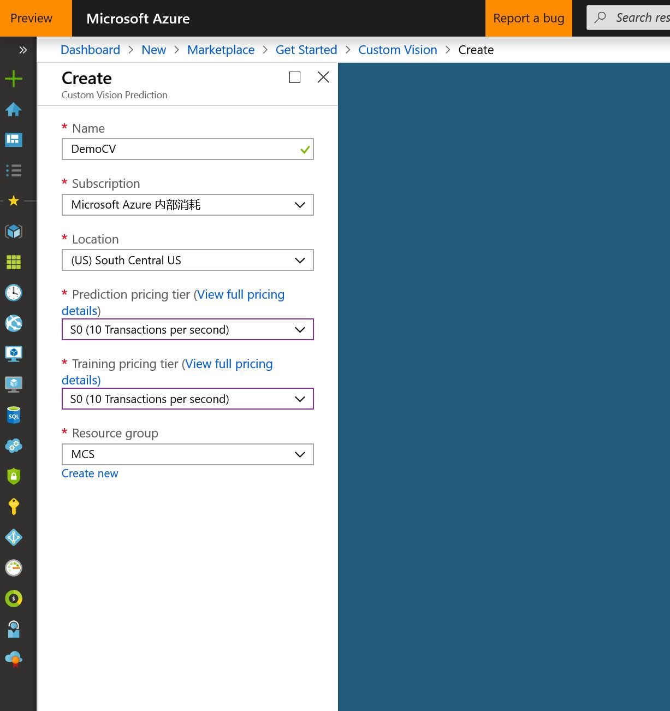

## 生成分类器 ##
1 . 使用Azure.com的订阅账号，登录[自定义视觉管理门户](http://customvision.ai) ，进入自定义视觉项目管理界面，点击“New Project”。 输入项目名称， 描述，选择上面步骤中创建的资源组。项目类型选择：分类（如果是做对象检测可以选择对象检测）；分类选择Multiclass每张图片单个标签；选择Domain为retail。如果需要把训练好的分类模型导出到ios/android的环境下使用，可选择compact模式。点击Create Project。

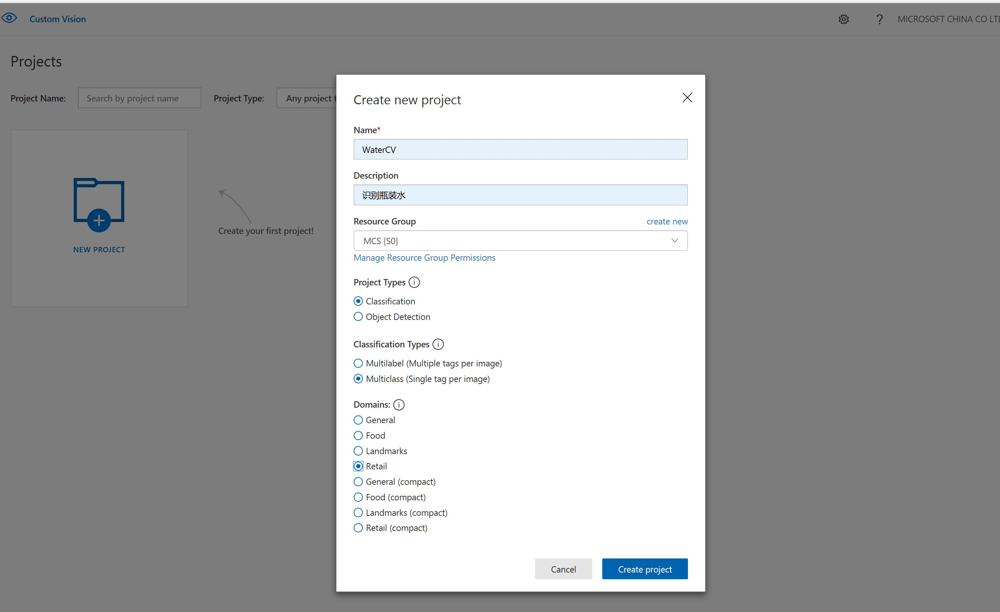

2 .项目创建成功后， 就可以点击Add images按钮添加图片，我们从网上下载了一些瓶装水的图片，保存在[src/cvimages.zip](./src/cvimages.zip) ，请下载到你的本地，解压后，在这里使用water目录下的图片。添加图片后，进入打标签页面，在My Tags下面输入瓶装水，点击upload按钮。

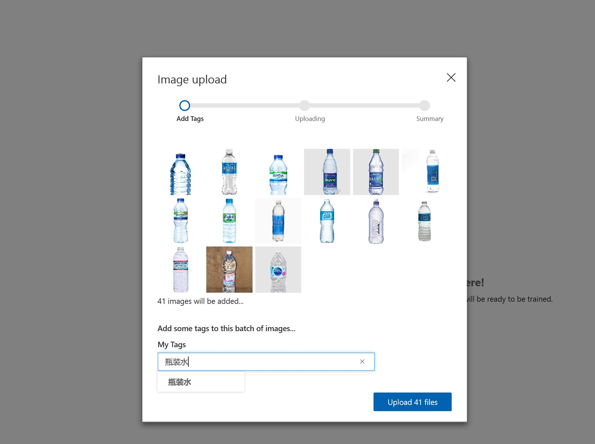

3 . 图片上传后，提示上传结果，比如有重复图片，或者上传失败图片。这次我们成功上传的图片有38张。

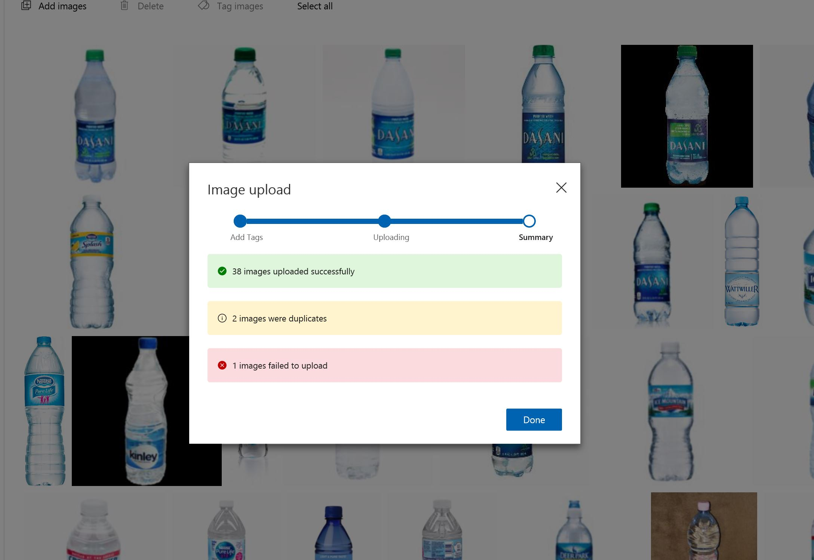

4 . 我们在按照2，3步骤导入听装饮料，使用tin目录下的图片。添加图片后，增加标签为听装饮料。

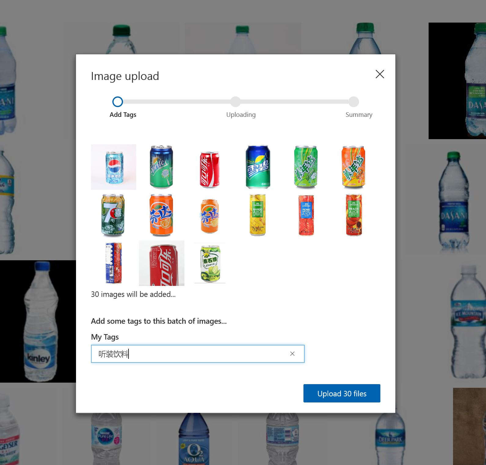

5 . 完成后，就可以开始Train，点击Train按钮，完成后，系统会提示训练完成。

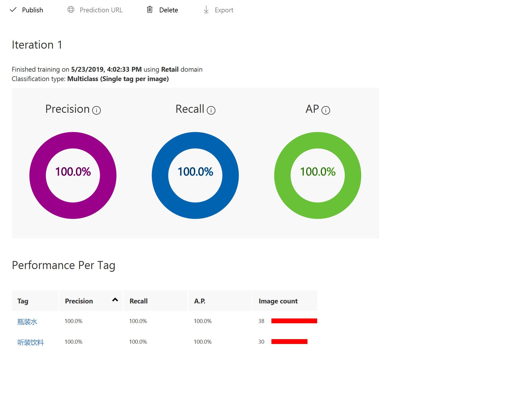

## 测试分类器 ##
1 . 图片训练完成后，可以测试分类器的效果，点击Quick Test，在Image URL中输入要测试的图片路径或者选择本地图片。这里我们用这个[https://img1.21food.cn/img/product/2013/4/16/www109yes1512028.jpg](https://img1.21food.cn/img/product/2013/4/16/www109yes1512028.jpg)，建议大家自己选择图片测试。结果非常正确地显示是瓶装水的概率是99.9%

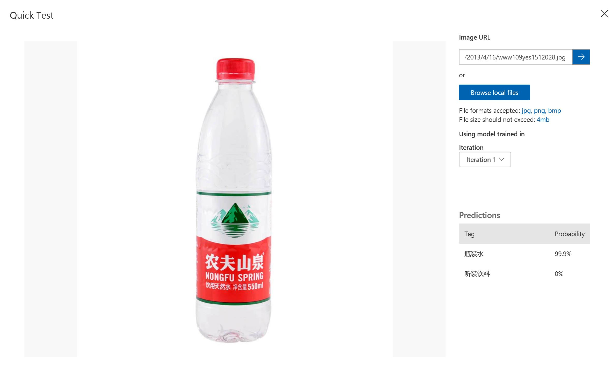

可以再试试[http://pic67.nipic.com/file/20150520/15079278_113134077000_2.jpg](http://pic67.nipic.com/file/20150520/15079278_113134077000_2.jpg)

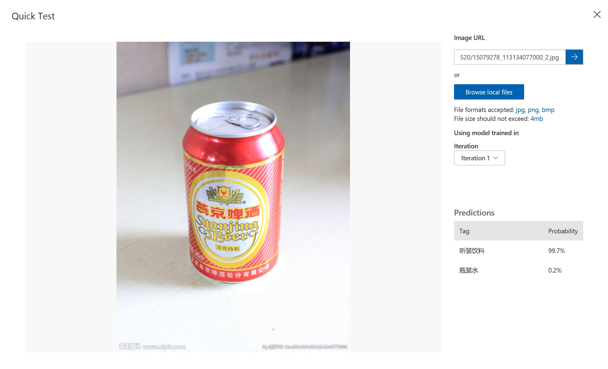

但是如果我们照一张乱入的图片呢？比如 [http://pic12.nipic.com/20101223/213291_165858068139_2.jpg ](http://pic12.nipic.com/20101223/213291_165858068139_2.jpg)，结果好尴尬

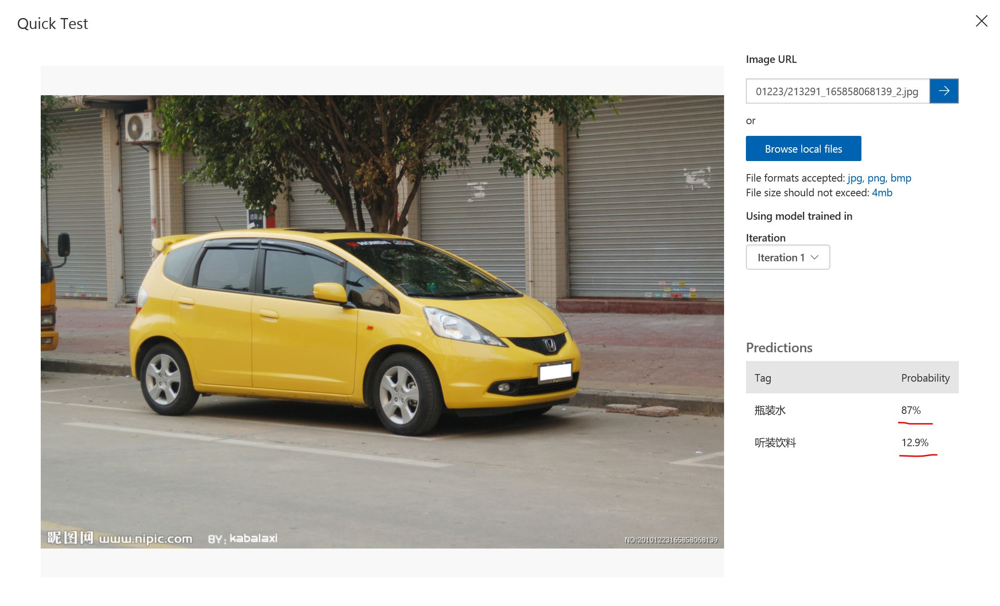

2 . 为什么会出现这种情况？就好像你教小孩子学东西，你只教会了他认识苹果和桔子，下次你拿来一个西瓜，他一定不知道是什么。 计算机视觉的训练也如此， 这里我们需要使用在创建一个其他的分类，里面增加一些不是瓶装水和听装饮料的的图片来做训练。增加“其他”这个分类标签的步骤如同上面创建分类器中步骤2，3。

3 . “其他”分类标签创建训练完成后，我们再测试之前的[http://pic12.nipic.com/20101223/213291_165858068139_2.jpg ](http://pic12.nipic.com/20101223/213291_165858068139_2.jpg) 这张照片。结果理想很多

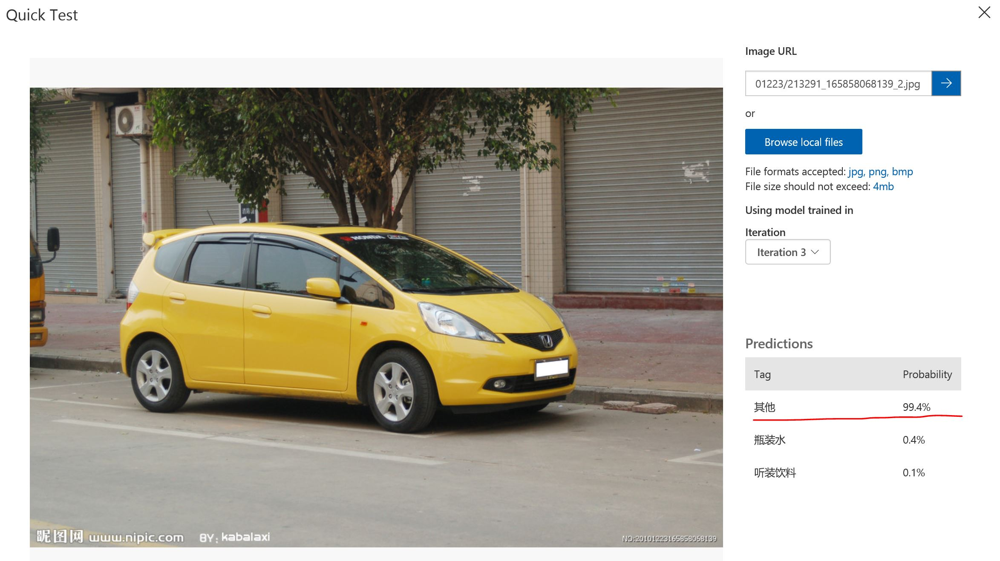

## 使用预测API ##

1 . 训练完成的分类器需要发布成预测API，提供给业务应用使用， 我们点击Performancen按钮进入项目性能界面，点击左边需要发布的Iteration，这里我们选择最新的Iteration3，然后点击左上方的publish按钮发布，确认发布。

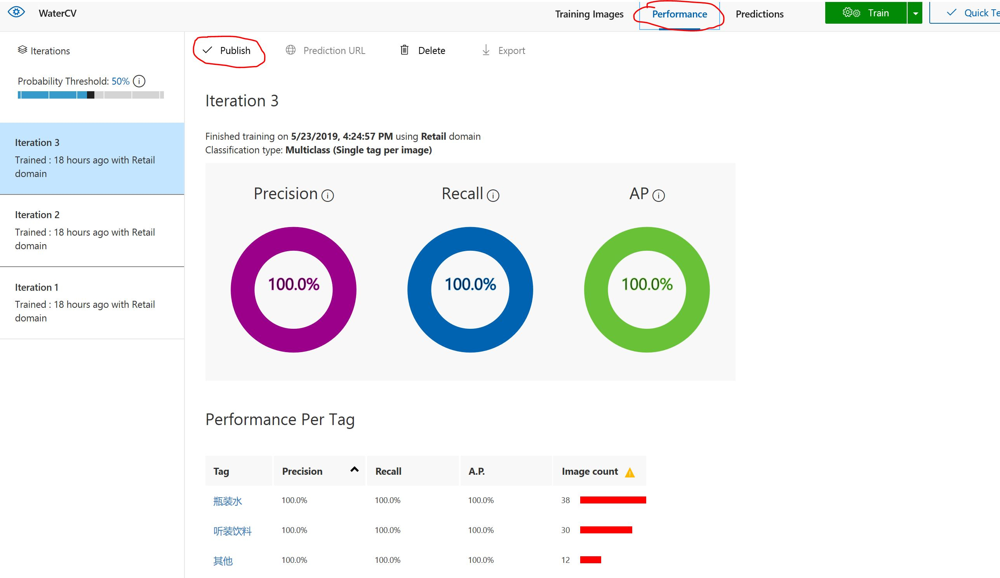

2 . 发布成功后，可以在左侧Iteration栏里面看到选择的Iteration上有published标签， 然后页面上方也会出现Prediction URL的标签了，点击Prediction URL。

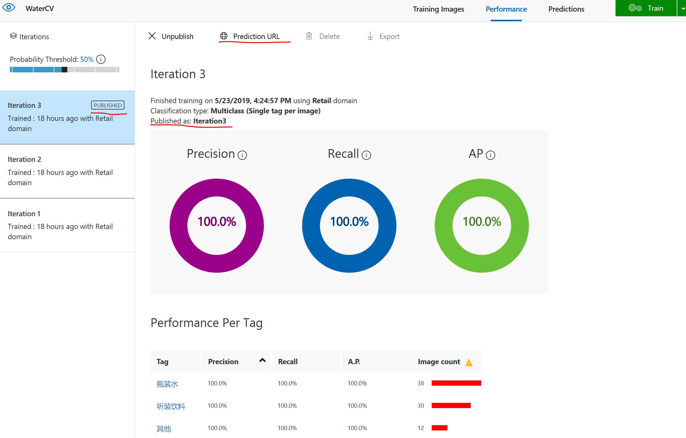

3 . 自定义视觉服务提供给开发者两种预测API接口， 一个是预测文件URL，一个是预测本地文件。开发者可以根据自己需要选择使用任何一种。使用预测API时需要提供Prediction-Key，这里的Key就是我们之前第一节中创建的自定义服务里面prediction服务下面的Key，可以在Portal查看到。

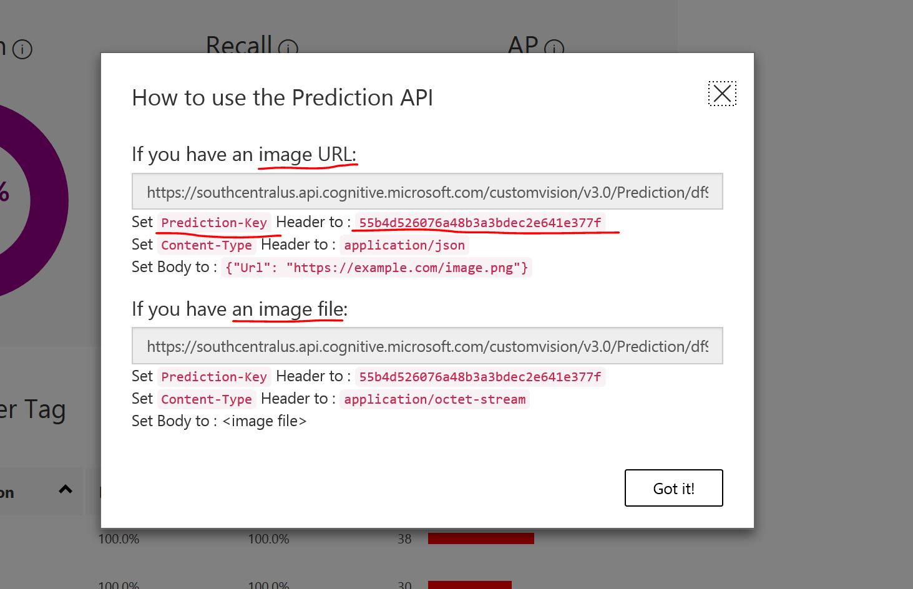

4 . 我们这里使用[Postman](https://www.getpostman.com/downloads/)来测试预测性API， 启动Postman，new request。输入使用URL预测的API链接，选择header，然后添加Prediction-Key和content-Type。

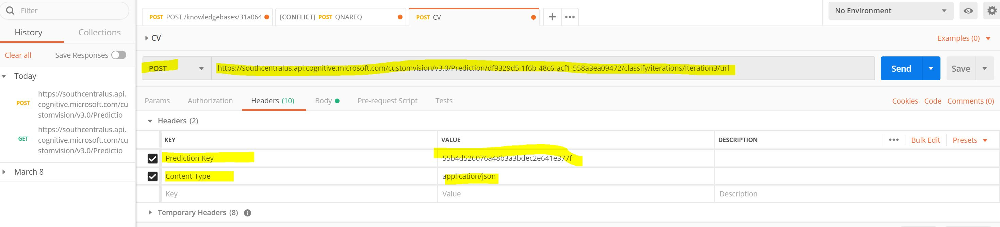

5 . 选择body，添加Json描述需要预测的URL信息，这里测试是[http://pic67.nipic.com/file/20150520/15079278_113134077000_2.jpg](http://pic67.nipic.com/file/20150520/15079278_113134077000_2.jpg)，然后选择Send按钮

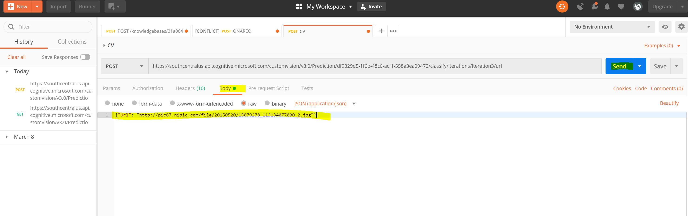

6 . 我们来看看结果

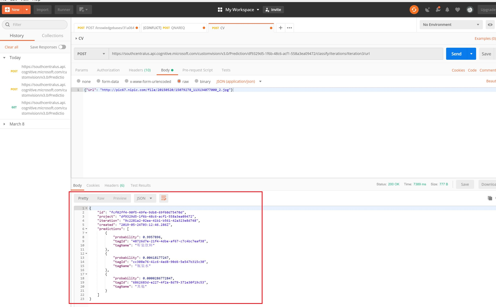

## 后续 ##
自定义视觉服务还支持模型的导出，可以将分类模型导出后应用在iOS、Android或者支持ONNX的设备上，但是模型的导出必须在创建项目时候选择compact的模式，然后才可以在训练完成后做导出操作。请悉知。

## 总结 ##
本实验主要完成了使用自定义视觉服务创建分类器并发布预测性API，为业务提供基于图片的分类识别服务。