# 语义理解服务LUIS在容器中部署
Azure Cognitive Service中的LUIS（语义理解服务）是提供给对话AI服务中识别用户语义的服务， 开发者可以通过[LUIS开发门户](http://luis.ai)完成LUIS应用的创建和训练，具体LUIS应用的创建和训练可以参考实验[基于LUIS的Voice Command创建](../Azure_LUIS/README.md)。

目前LUIS已经支持容器部署，开发者可以把自己训练好的LUIS应用部署到边缘设备或者本地服务中。本实验主要实践容器化LUIS应用部署与使用。

## 实验先决条件：
- Docker引擎并熟悉基本Docker知识
- LUIS资源和LUIS应用：可以参考[基于LUIS的Voice Command创建](../Azure_LUIS/README.md)生成LUIS服务和一个LUIS应用

## 实验将包括以下内容：
- 准备Docker环境
- 下载并安装LUIS镜像
- 导出LUIS应用
- 配置启动LUIS容器
- 测试LUIS容器

## 准备Docker环境 ##
1 . 在https://docs.docker.com/docker-for-windows/install/ 安装Docker for Windows，安装完成后，点击Settings菜单

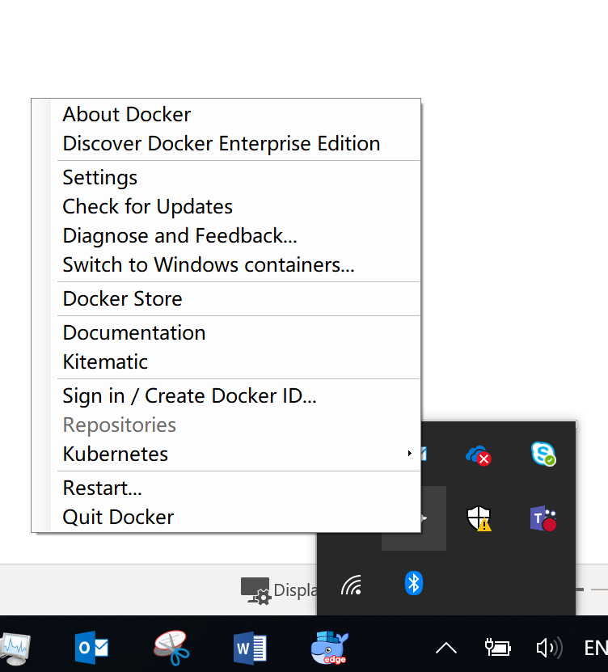

2 . 确保本地磁盘可以被docker访问


## 下载并安装LUIS镜像
1 . 使用docker pull命令从Azure上下载LUIS 的容器镜像，打开cmd，输入以下命令
```
docker pull mcr.microsoft.com/azure-cognitive-services/luis:latest
```
2 . 可以使用docker images命令查看已下载的images
```bash
docker images --format "table {{.ID}}\t{{.Repository}}\t{{.Tag}}"
```
确认LUIS镜像已经下载

 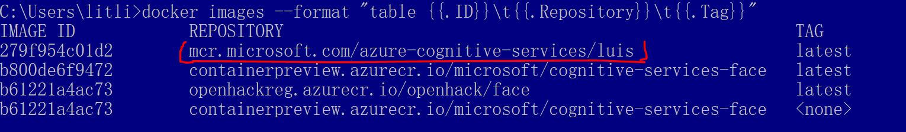

3 . LUIS本地容器就绪后，使用流程大体如下：

- 导出在LUIS.AI中创建的应用
- 创建一个input目录，将导出的LUIS应用包复制到input目录下
- 准备好在Azure Portal下面相关的LUIS的计费配置信息（endpoint和APIKey）
- 运行Docker Run的命令（带input、output目录和计费配置信息）
- 测试本地运行的LUIS应用
- 运行完毕后，可以将output目录下的log文件导入到LUIS.AI中，以帮助继续优化迭代应用
  
注意：开发者无法更改在容器中运行的应用。如要更改容器中的应用, 需要使用 LUIS 门户更改 LUIS 服务中的应用，然后训练和发布, 然后再下载一个新的包, 并再次运行容器。
  
## 导出LUIS应用
1 . 登录[LUIS门户](http://luis.ai)，进入MyApp，选择我们之前创建好的LUIS APP，点击Export->Export for container->Production slot

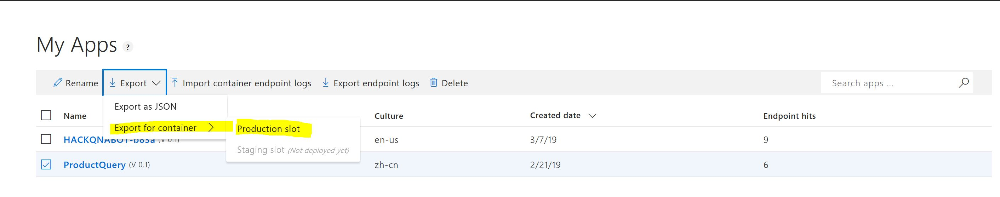
这里选择的是我们在LUIS应用实验中创建的商品查询的LUIS应用，将导出的文件下载到为Container运行创建的input目录（比如C:\Work\Hackfest\input)。

注意：不要对导出文件做重命名，解压或更改。
## 配置启动LUIS容器
1 . 启动LUIS容器还需要两个计费相关的参数，LUIS资源的API Key和Billing EndPoint，这里API Key不可以使用luis.ai下面的Starter Key，必须是Azure Portal中创建的LUIS服务的Key。

2 . 登录[Azure门户](http://portal.azure.com)，点击进入你的LUIS Resource， 选择Keys，复制Key到记事本，稍后启动时候使用。
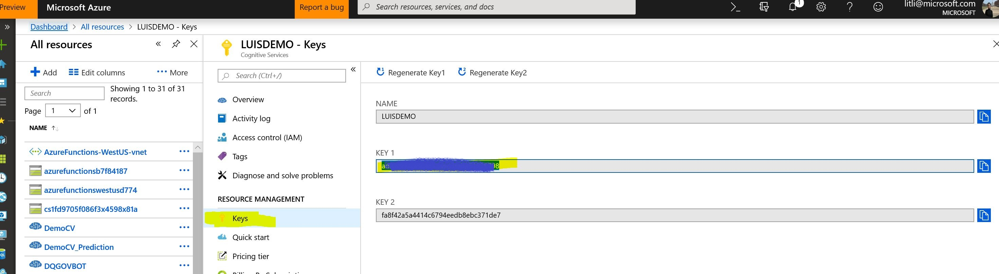

3 . 继续在当前LUIS Resource下面，选择Overview，复制endpoint到记事本，稍后启动使用。
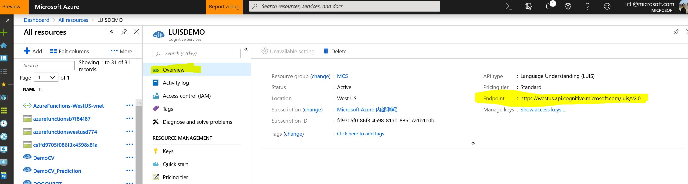

4 . 为LUIS Container运行创建一个output目录，用来保存运行过程中的log，如C:\Work\Hackfest\output

5 . 运行dorker run命令，具体命令脚本如下

```bash
docker run --rm -it -p 5000:5000 --memory 4g --cpus 2 
--mount type=bind,src=c:\Work\Hackfest\input,target=/input 
--mount type=bind,src=c:\Work\Hackfest\output,target=/output 
mcr.microsoft.com/azure-cognitive-services/luis 
Eula=accept 
Billing={BILLING_ENDPOINT} 
ApiKey={ENDPOINT_KEY}
```
将Billing和ApiKey后面设置为之前我们保存的endpoint和key信息。

6 . 运行成功后，提示如下：

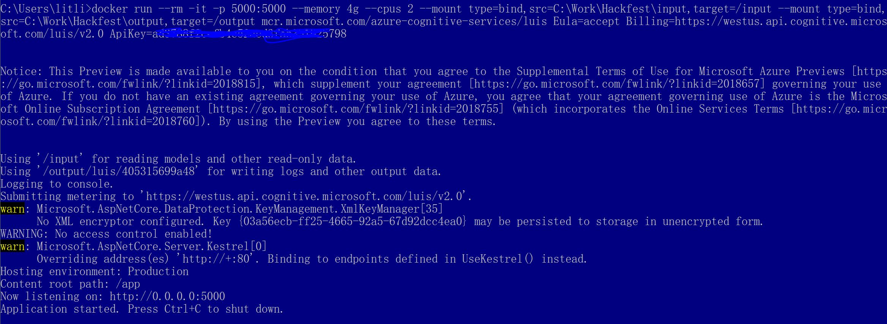

## 测试LUIS容器
在本地容器中运行的LUIS应用访问地址如下，需要使用LUIS应用的application ID
```
http://localhost:5000/luis/v2.0/apps/{APPLICATION_ID}?q=

```
1 . 进入[LUIS门户](http://luis.ai),进入My App，选择我们刚刚导出的ProductQuery的应用，点击右上角的Manage按钮，复制里面的APPLICATION ID到上面运行本地LUIS服务的URL中。
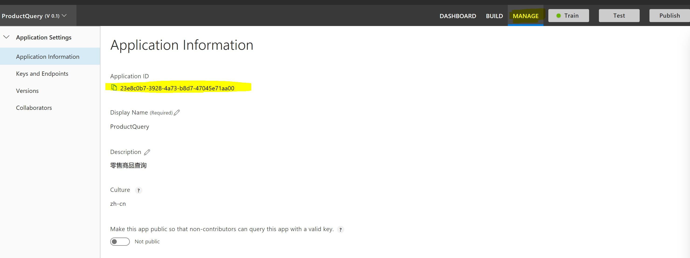

2 . 运行本地LUIS服务URL，并在“q=”后面添加你需要测试的语料，比如“请问可口可乐多少钱”，就可以从本地LUIS服务中获得语义判断结果，如下图

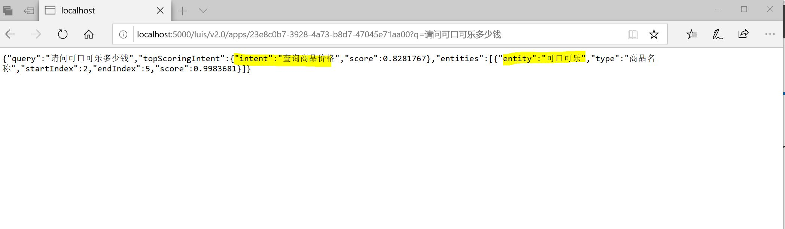

3 . 本地LUIS服务运行后，可以在设置的output目录下看到.csv的日志文件，可以将该文件导入到LUIS App中以帮助应用获得用户实际语料，进行意图训练，帮助LUIS应用迭代。进入[LUIS门户](http://luis.ai),进入My App，选择我们刚刚导出的ProductQuery的应用，点击Import container endpoint logs，选择output目录下.csv文件

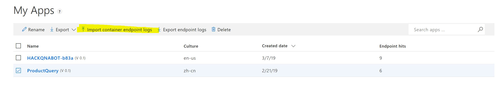
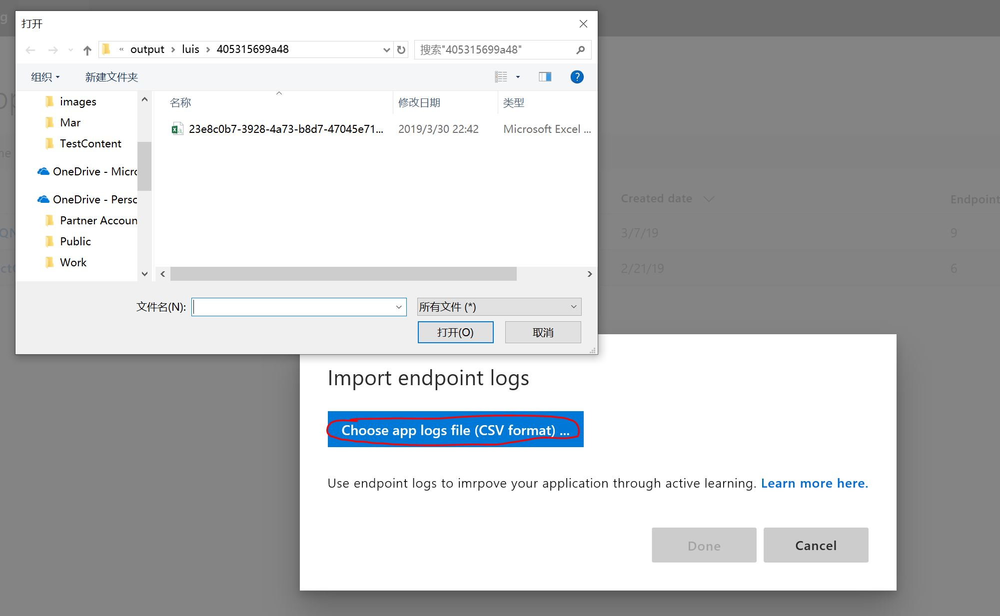

4 . Log文件导入后，可以在应用界面的Review endpoint utterances窗口中看到我们在本地服务测试的语料

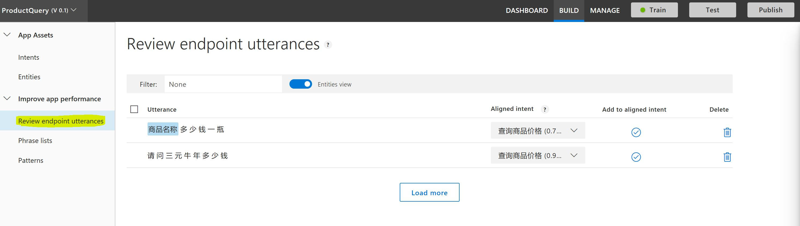

5 . 这样就可以对这些Utterances做对应的指定意图等操作。

## 总结 ##
容器化的语义理解服务允许开发者将LUIS应用运行在本地容器中，满足各种本地使用语义理解的应用场景，实现领活的本地部署。