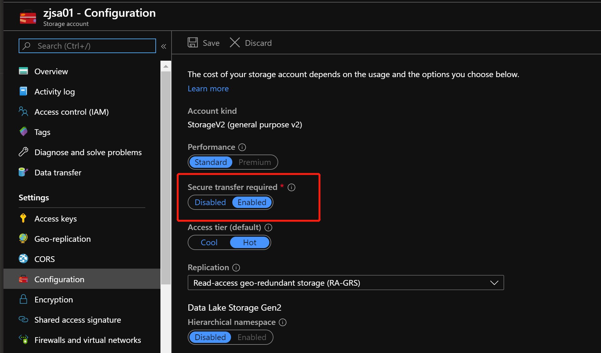
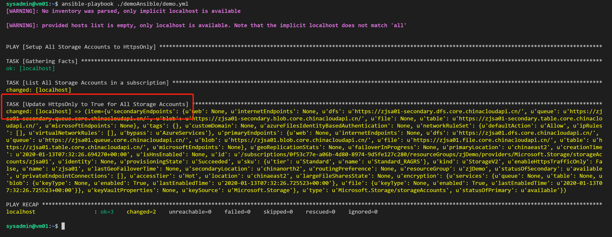
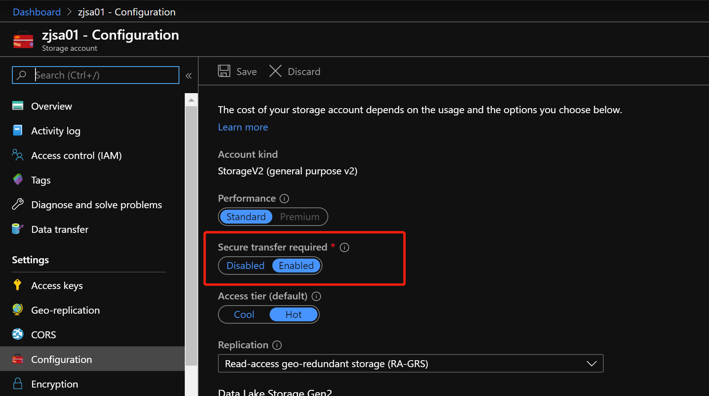
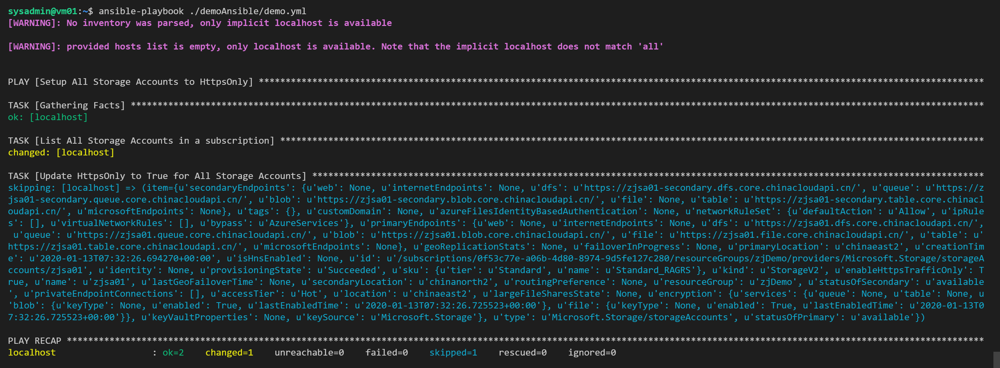

## Azure 运维篇 - 通过 Ansible 批量更改 Azure 资源

这篇文章主要介绍如何通过 Ansible 的 Playbook, 来批量更改 Azure 中的资源. 这里先声明, 选择Ansible的起因完全是自己不会写复杂的 Shell 脚本, 如果有大神看到这篇文章, 请自动右转哈哈.

本次实验, 其实做了一个比较简单, 但比较实用的事情, 将所有未设置 `HttpsOnly` 的 `Storage Account`, 设置成 `HttpsOnly`, 仅支持 Https 访问, 让访问更加安全.



当我们环境中有很多个 Storage Account 时, 一定是通过脚本来做. 脚本实现方式很多, 可以是 `Azure CLI & PowerShell & Python`, 也可以是 `Ansible 或者 Terraform`.

#### 搭建运行 Ansible 的环境

建议创建一台VM, 来完成今后的运维工作, 这台VM平时可以关掉, 节省费用, 需要的时候开启执行任务. 机器上除了安装Ansible, 未来很多运维工具, 甚至包括 Grafana 也可以放在这台机器上, 使这台机器的利用效率更高.

```
# 创建一台 Linux 虚拟机, 比如 Ubuntu 16.04, 并安装相对应的依赖包及Ansible
sudo apt-get update && sudo apt-get install -y libssl-dev libffi-dev python-dev python-pip
sudo pip install ansible[azure]

# 登陆到 Linux 虚机上, 安装 Azure CLI
curl -sL https://aka.ms/InstallAzureCLIDeb | sudo bash

# 切换云环境, 执行登陆Azure操作, 以后每次执行Ansible之前, 执行一次Azure登陆, 确保Ansible能够使用Azure登陆信息. 当然有其他的Ansible登陆凭证方式, 可选择尝试
az cloud set -n "AzureChinaCloud"
az login
```

#### 准备 Ansible Playbook, 更改所有 Storage Account 的 HttpsOnly

Ansible的一个概念叫做 Playbook, 执行一组 Task, 完成一个事情. 如果希望详细学习Ansible知识及结构的同学, 请自行查阅文末Ansible文档.

本次示例中, 用到的Playbook `azure_storageaccount_ops.yml`如下：

```
---
-  name: Setup All Storage Accounts to HttpsOnly
   hosts: localhost
   connection: localhost
   tasks:
   - name: List All Storage Accounts in a subscription
     command: az storage account list
     register: allStorageAccounts

   - name:  Update HttpsOnly to True for All Storage Accounts
     command: az storage account update -n {{ item.name }} -g {{ item.resourceGroup }} --https-only true
     with_items: "{{ allStorageAccounts.stdout | from_json}}"
     when: item.enableHttpsTrafficOnly == False
```

在 LInux VM 中创建一个文件夹 `azureops/ansible`, 并将 `azure_storageaccount_ops.yml` 放入其中.

```
# 执行 Ansible Playbook 非常简单
ansible-playbook ~/azureops/ansible/azure_storageaccount_ops.yml
```







由于 Ansible 是幂等的, 所以当第二次执行检查到 Storage Account 的 `HttpsOnly` 的状态已经是True的话, 就会跳过执行.

这里面其实有两个额外引申的话题，就留给大家了：

第一，其实我们可以把所有 Storage Account 相关的运维工作放在一个 Playbook 中, 通过Tag进行区分，通过Tag进行执行；

第二, 其实我写的Playbook非常的简单，且不算优美. Ansibel里面有很多针对于Azure不同服务的Module, 大家也可以尝试使用Module而非直接执行Azure CLI, 让Playbook变得更加优美.

记录一下，大家小年快乐 ！

### 参考资料

- [快速入门：在 Azure 中的 Linux 虚拟机上安装 Ansible](https://docs.microsoft.com/zh-cn/azure/virtual-machines/linux/ansible-install-configure)

- [Ansible 的使用](https://docs.ansible.com/ansible/latest/user_guide/basic_concepts.html)

- [Ansible中支持的Azure Modules](https://docs.ansible.com/ansible/latest/scenario_guides/guide_azure.html)

- [Github Azure Resources Playbook Examples](https://github.com/Azure-Samples/ansible-playbooks)