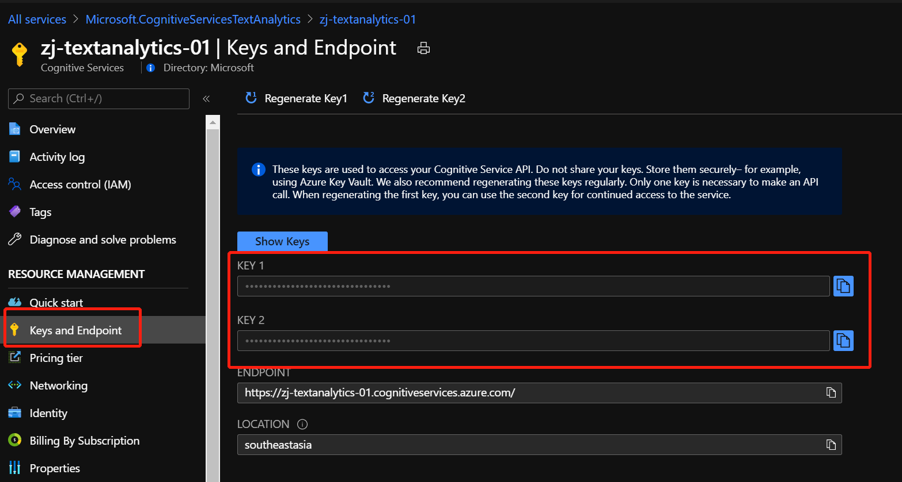

## Power Apps 与 Azure 服务的对接 (一) - 对接 AI 服务

最近在做一些实验，其中有一些涉及到 Power Apps 中的功能实现, 是通过调用 Azure 中的服务来完成的。正好借这个机会，整理一下, 抛个小砖, 希望能够启发到小伙伴们的思维.

Power Apps 是低代码开发平台 Power Platform 中的一个服务, 用来快速开发业务应用, 尤其是移动端应用. Power Platform 作为一个地代码开发平台, 包含如下服务：


Power Platform 中的服务, 虽然提供了很好的低代码开发体验, 但要想将低代码开发平台的能力最大化, 利用低代码来解决企业的需求, 加速应用的开发, 与外部平台的对接是必不可少的. 这种对接, 不单纯是数据层面的对接, 更是功能上的互补. 也体现了, 低代码开发工具的出现, 不是对于专业程序员的挑战, 而是参与应用开发的不同角色, 更为专注的干好自己的活. 在低代码应用开发中, 常常会有三个角色 : `公民开发者`, `IT 管理员`, `专业开发者`, 大家各司其职, 加速企业应用的开发.


整理了一下 Power Apps 与 Azure 上服务的对接方式, 来看下, Azure 的服务能够帮助 Power Apps 干什么.


这张图其实挺好的, 体现了大体上 Power Apps 与 Azure 服务结合的几个方面：

- 与 Azure 中 AI 服务的对接, 如 `Azure Cognitive Services` & `Azure Machine Learning Service`, 扩展应用的AI能力.
- 与 Azure 中 应用服务对接, 如 `Azure Function` & `Azure Kubernetes Service` & `Azure Container Instance` & `Azure Automation`, 扩展平台服务能力, 快速处理复杂业务逻辑.
- 与 Azure 中 运维管理服务对接, 如 `Azure DevOps` & `Azure Application Insights`, 提升 Power Apps 自身 `应用生命周期管理` 的能力.
- 与 Azure 中 数据服务的对接, 如 `Azure SQL` & `Azure CosmosDB` & `Azure Synapse`, 既能够做到快速的数据打通&数据读取, 同时也可以做到快速调用分析后的数据, 进行操作.

下面, 开始第一部分 `对接 Azure AI 服务` 的介绍

Power Apps 开发的应用, 想要获得 AI 的能力, 主要以下几个方式：


### Demo 1 利用 AI Builder, 实现快速的表单识别

`AI Builder` 是 Power Platform 中提供 AI 功能的模块, 提供了如下的 AI 能力


`AI Builder` 的使用非常简单, 从训练模型到应用开发, 只需准备好测试数据, 10分钟就可以搞定. 以 `表单识别` 为例, 

#### 第一步 准备并上传 测试数据, 训练模型

只需要准备5份格式相同的文档, 就可以开始训练. 训练结束后, 保存并发布模型, 后续随着数据的增多, 可以不断优化训练调整模型. 完整的实验手册请参阅参考文档.


#### 第二部 将训练好的模型, 应用到 Canvas App 中

添加 AI Builder 到应用中非常简单, 只需要插入 Component 并选择好所需要的模型, 剩下的, 就是看怎么利用好识别出来的数据. 可能在最初的时候, 模型训练有些不精准, 可以提供更多的训练数据进行校准, 例如: 实验中训练时都是打印体, 但使用时, 测试用了手写体, 就可以将手写体的测试文件也加入模型的训练, 增加准确率.


### Demo 2 利用 Azure Cognitive Services Connector

AI Builder 是实现 AI 能力最方便的方式, 但如果我们想要的一些AI功能, 没有包含在里面, 这个时候就可以使用 Azure Cognitive Services Connector, 对接 Azure 中的认知服务. 每一个支持的 Azure Cognitive Service Connector, 都已经封装好了一些常见且支持的功能, 方便上手. 这里就以 `Text Analytics` 为例, 完整的实验手册请参阅参考文档.

#### 第一步 创建 Text Analytics 认知服务

所有通过 Connector 进行的认知服务的调用, 第一步需要的就是在 Azure 上创建对应的服务, 并获取 `API Key`



#### 第二步 在 Canvas App 中创建 Text Analytics Connection, 并调用封装好的函数

新创建一个画布应用, 或者在已有的应用中，首先需要添加的是 `Text Analytics Connection`, 在添加 `Connection` 过程中, 需要输入 `Text Analytics` 的 `API Key`


接下来, 就是按照自己的需求, 调用包装好的函数, 对输入的文字进行文本分析


点击按钮的时候，会调用包装好的函数进行分析

```
If( chkLanguage.Value = true,
    ClearCollect( languageCollect, 
        TextAnalytics.DetectLanguageV2(
            {
                text: tiTextToAnalyze.Text
            }
        ).detectedLanguages.name
    )
);

If( chkPhrases.Value = true,
    ClearCollect( phrasesCollect, 
        TextAnalytics.KeyPhrasesV2(
            {
                language: "en", 
                text: tiTextToAnalyze.Text
            }
        ).keyPhrases
    )
);

If( chkSentiment.Value = true,
    ClearCollect( sentimentCollect, 
        TextAnalytics.DetectSentimentV2(
            {
                language: "en", 
                text: tiTextToAnalyze.Text
            }
        ).score
    )
)
```


接下来, 将分析出来的结果, 填入到对应的文本框, 就完成了


其实, 上述实验中, 针对 `Text Analytics Connector` 可以调用哪些函数, 具体参数是什么, 参数输入输出类型, 均可通过 Connector 文档进行查询, 可参见底部. 可以看到, 目前绝大部分 认知服务 都已经有官方的 Connector, 大家可以欢快的调用.


### Demo 3 利用 Azure Cognitive Services + Custom Connector, 自定义函数

但上述的使用上, 有时也会遇到问题, 比如: `新出来的 Cognitive Services 还没有官方 Connector怎么办? 有些 Cognitive Services 中提供的API调用方法并没有被封装, 调用不了怎么办?`, 这个时候, 都需要自己动手来打造适用于自己的定制化 API.

`Custom Connector` 是 Power Platform 中提供的一种快速集成现有开发好的 API 服务, 供终端用户使用的方法. `Custom Connector`在整个与Azure对接的过程中被反复用到, 这也是一种快速对接外部服务的方式.

针对于程序员开发好的API服务, 可以很方便的通过写好的 `Swagger` 描述文件进行导入.


当然, 也可以通过界面, 一个个添加功能, 主要包括了4块: `基础信息描述` & `身份认证方式定义` & `请求方法及参数定义/返回内容定义` & `测试`


感兴趣的小伙伴可以参照 [Power Apps 中加入 AI 的能力 - 实现一个简单的英汉词典](https://mp.weixin.qq.com/s?__biz=MzU0OTY0NDE1NA==&mid=2247484412&idx=1&sn=03e4659f7c5454dd297de6012327c748&chksm=fbadf1e9ccda78ff86fc9c2ef0634b9a2f0774d8d2d72138f78aa25077d63457b6502262022a&token=470228598&lang=en_US#rd), 通过 Custom Connector 调用 Azure Cognitive Service, 进行尝试.

### Demo 4 利用 Azure Machine Learning + Custom Connector, 自定义函数

最后一个实验, 仍然会用到 Custom Connector.

其实并不是所有的AI功能, Azure Cognitive Service 都可以cover. 在实际的应用中, 有很多场景, 需要用户自建机器学习算法模型, 所以 `TensorFlow` & `Pytorch` 等机器学习框架会流行. 算法科学家, 工程师千辛万苦弄出来的模型, 大多会部署成服务, 为业务场景提供服务, 比如高密度产品质量检测. 接下来的 Demo 主要是向大家介绍, 做好的机器学习模型, 发布在 Azure 上, 无论是 `Azure Function` & `Azure Container Instance` & `Azure Web Service`, 也是可以被 Power Apps所调用的.

#### 第一步 按照文档

请先按照文档描述 [教程：使用自动化机器学习预测需求](https://docs.microsoft.com/zh-cn/azure/machine-learning/tutorial-automated-ml-forecast#next-steps), 创建并发布模型.


证明目前模型调用正常.

#### 第二部 添加 Custom Connector

由于此模型直接提供 Swagger 文档, 非常的方便, 可以直接将此文件内容作为 `Custom Connector` 创建的依据.


测试通过, 证明此 Custom Connector 可用, 接下来, 在 App 开发中, 即可调用此机器学习模型, 预测共享单车未来的销量走势. 


通过 Azure Machine Learning + ACI + Custom Connector, 可以将很多实现的机器学习模型, 应用到目前的低代码开发中来.

### 参考文档

- [教程：使用 AI Builder 创建表单处理应用](https://docs.microsoft.com/zh-cn/azure/cognitive-services/form-recognizer/tutorial-ai-builder#:~:text=AI%20Builder%20is%20a%20Power,table%20data%20from%20form%20documents.)

- [在 Power Apps 中使用认知服务](https://docs.microsoft.com/zh-cn/powerapps/maker/canvas-apps/cognitive-services-api)

- [Text Analytics Connector 文档](https://docs.microsoft.com/en-us/connectors/cognitiveservicestextanalytics/)

- [从头开始创建自定义连接器](https://make.powerapps.com/environments/Default-c91f1f3d-2d59-41e3-a078-24fb31467c38/customconnectors)