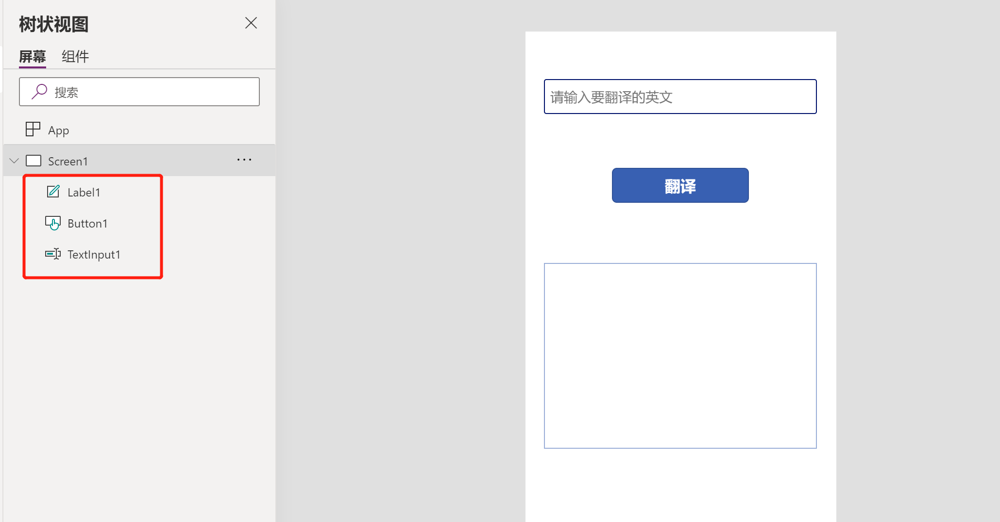

## Power Apps 中加入 AI 的能力 - 实现一个简单的英汉词典

最近 `Low-code / No-code Platform` 这个概念很火, 就如同 `Docker/Kubernetes` 刚出来一样. 在 Gartner `Top 10 Trends Impacting Infrastructure & Operations for 2020` 的分析报告中, `低代码开发` 也是其中之一, 以下是引用的原文:

```
Trend 8: Democratization of IT

Low-code and no-code platforms enable users to quickly build applications using minimal code approaches. This can enable “citizen development” intended to save time and resources. However, a poorly disciplined approach risks increasing the complexity of the IT portfolio. And, as use of the outputs of these tools scales, the likelihood of requests for I&O support increases (e.g., to provision user access).

I&O leaders must embed their support and exert influence over projects that will inevitably affect their teams and the broader organization. But to do that, they will need to build governance and support offerings that make it easier for users, not harder. I&O leaders risk alienating their customers if they reject low-code or no-code approaches outright, but it’s important to determine what approach is appropriate for the use case and scenario at hand. 
```

最近也一直在学习了解 `低代码开发平台`, 在学习 `Power Platform`, 也对 `低代码开发` 做了一些自己的理解, 以下是闲扯时间, 仅供参考 !

- `低代码开发` 并没有取代专业的程序开发, 而是与专业程序开发互补, 更快推进业务的创新: 其实目前的APP, 种类繁多, 有对内的, 有对外的, 有toB的, 有toC的. 不同的种类对于数据的要求, 并发的要求, 业务上线的需求, 甚至APP美观度的要求都不一样. `低代码开发`肯定无法满足全部的需求, `代码开发`也无法满足在有限的预算内满足全部需求, 双方需要互补;

- `Citizen Developer & Professional Developer` 的关系在某种程度上也跟 `Developer & Operator` 的关系类似: `DevOps` 模糊了运维开发的界限, 更好的来端到端的交付一款服务. Citizen Developer & Professional Developer 在某种程度也模糊了 程序员和业务人员 的界限, 能够更快的实现业务真正需求, 毕竟任何一个APP开发出来不是摆着参观的, 是用来辅助业务的, 也就包含了 `业务逻辑+数据源`, 双方合理, 能够加速这个过程;

- `低代码开发平台本身的能力有限, 更多的是需要与外部服务强有力的对接`: 就拿 `Power Platform` 举例, 无论是 `Power Apps & Automate`, 其自身的能力毕竟有限, 核心的部分在于其与数据源的对接, 例如: `SAP & OnPrem Datasource`, 在于 `Common Data Service`, 在于将 `Azure Data & AI` 的能力接入进来, 就会有更大的发会空间;

- `Common Data Service`: 引用我之前在培训里面听到的, 我觉得比较好. Common Data Service 不单单是数据服务, 更多的是通过 Common Data Service, 能够实现对于特定业务场景的创新, 对前端应用与后端数据源进行解耦.

- `Power Platform` 在某种意义上做到了当前很多公司一直想做的事情: 打通数据孤岛.

- 以前有个想法, 要把他付诸现实, 做个Demo还是有些困难, 现在用 `低代码开发` 还是可以很快做个原型出来: 光靠写代码开发应用, 很多想法来提高工作效率的, 还是挺难实现的, 什么都要懂, 前端后端数据库. 现在去 Demo 一个想法还是挺容易的, 至少下面的这个示例实现起来比较容易.

回到今天的正事, 周末实践了一个简单的APP, 用 `Power APP + Azure Translator Text API` 做了一个非常简陋的 `英译中` 的词典, 例子本身很简单, 其实是想表达, 借助于 `Customer Connector`, 我们可以将很多 `API服务&数据分析服务&机器学习服务` 集成进来.

虽然很多 `Cognitive Services` 已经有了现成的 `Connector`, 在这个示例中, 我还是通过 `Custom Connector` 的方式来实现, 考虑到后续实际场景中, 很多 `API服务` 的接入都是通过这种方式来做的.


#### 创建 Translate Text 服务

我们先来创建一个 `Translate API` 服务 `zj-translator-x1`


#### Power Apps 中创建 Custom Connector

登录到 Power Apps Studio `https://make.preview.powerapps.com/`, 创建一个 `Custom Connector - AzureTranslator`


`General 部分` 主要注意 `Endpoint` 地址


`Security 部分` 主要注意 `API Key 验证方式` Header 参数名为 `Ocp-Apim-Subscription-Key`


`Defination 部分` 主要就是根据 API服务提供的功能来定义 PowerApp 可以调用的功能. 由于是展示如何从0开始构建, 所以这步需要手动添加, 在很多场景中, 都可以通过 OPEN API 的模板, 将提供的所有API功能直接导入到 Connector 中.

本次示例只添加了一个功能, 名为 `Translate`


参考 `Translator API` 的 OpenAPI 指南, 我们来添加一个 POST 请求


针对输入的参数, 对于 `api-version`, 改变一下 Type, 改成 `string`


接下来添加 `default response` 的格式


`测试一下` 功能是否正常

首先, 来添加一个新的Connection, 这个步骤将会输入 `Translator API` 的 `Access Key`, 后续 `Power Apps` 中的调用也可以复用这个Connection


证明这个功能还是Work的

#### 制作 Demo App 英译中 翻译

登录到 Power Apps Studio `https://make.preview.powerapps.com/`, 创建一个 `Canvas App - TranslateApp`


添加三个控件, 非常简单, `一个是文本框, 用来输入英文`; `一个是按钮, 用来点击翻译`; `一个是显示框, 用来显示翻译后的中文`.



添加我们新创建的 Custom Connector `AzureTranslator`


接下来就是最关键的步骤, 我们要在 `Button` 中调用我们刚才 Custom Connector 中创建的功能


```
ClearCollect(translatedText, AzureTranslator.Translate({'api-version': 3.0,'Ocp-Apim-Subscription-Region':"eastasia",to:"zh",body:Table({'Text': TextInput1.Text})}))
```

最后, 在显示框中, 添加翻译后的文字


```
First(First(translatedText).translations).text
```

让我们来尝试一下


这样, 我们就可以很方便的把通过API提供的服务集成到我们用`Power Apps`开发的应用中, 更为有效的处理业务的部分.

### 参考资料

- [连接器文档](https://docs.microsoft.com/zh-cn/connectors/)

- [Translator API Open API 指南](https://docs.microsoft.com/zh-cn/azure/cognitive-services/translator/reference/v3-0-reference)

- [示例：使用文本分析服务创建Custom Connector](https://docs.microsoft.com/zh-cn/connectors/custom-connectors/define-blank)