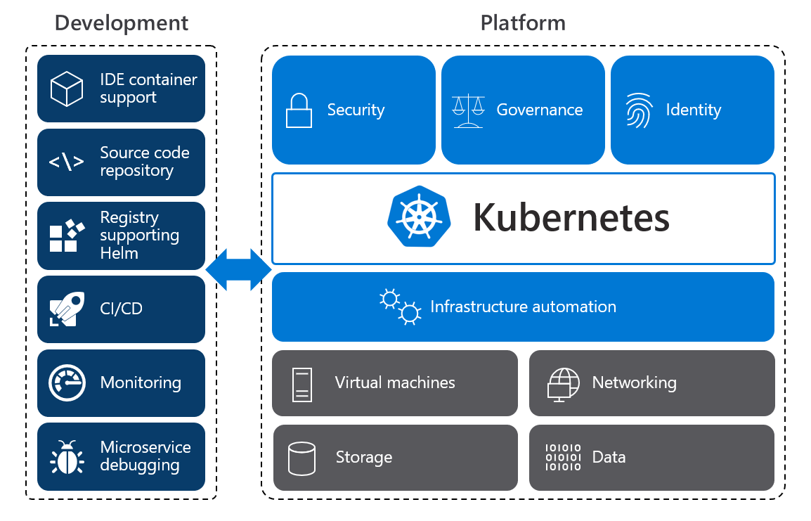

## WIP 如何用好 Azure Kubernetes Service - 概述

前段时间做了 `OpenHack for Container` 后, 重新学习了一下 `AKS`, 包括很对近期发布的新功能, 以及用法的最佳实践. 接下来根据自己的理解, 结合一些Demo, 与大家做一个分享.

`Kubernetes` 很火, 可以预见的能够看到, 其未来新的云端基础设施平台的地位. 但自建 `Kubernetes` 很难, 难在其本身平台的维护及周边服务的维护. 下图描述了, 在容器化改造过程中, 单单一个 `Kubernetes` 是没有办法完成左右工作的, 还需要考虑很多, 例如 `与研发工具的对接`, `存储管理`, `网络管理` 等问题.

`AKS` 全称是 `Azure Kubernetes Service`, 即云端提供的 托管的 `Kubernetes 服务`. `AKS` 的好处是, 借助于云平台的整体能力, 能够提供用户一个 `端到端的 Kubernetes 体验`. 简单来说, 上一个图中所涉及的问题, `AKS + Github + Visual Studio Code + Azure 云端服务` 能够闭环解决.

做了几个与容器相关的实验, 也看过一些关于 Kubernetes 的文章, 也有接触过的人在问, `AKS 最佳实践的架构设计是什么`. 参考了一些资料, 根据自己的理解, 画了下面的这张图

同时, 简单的虚构了一个场景, 在接下来的几篇文章中, 分别演示一下, 场景中的需求是如何实现的. 