## 借助 Node Pools & Windows Container 实现资源的混合部署

在5月的微软全球Builds大会期间，Azure针对AKS发布了多个期待已久的功能预览，其中就包括 `Node Pools` 的支持 & `集群节点自动扩容` 的支持，及 `Windows Server Container` & `Virtual Node` 的支持。

本次实验，将带大家搭建一个多节点池的AKS集群，并实际体验下如何将不同的应用，部署到不同的节点池中，且文末附赠了官网最佳实践，如何SSH到集群 `Worker Node` 进行操作。

本次实验的架构图如图所示

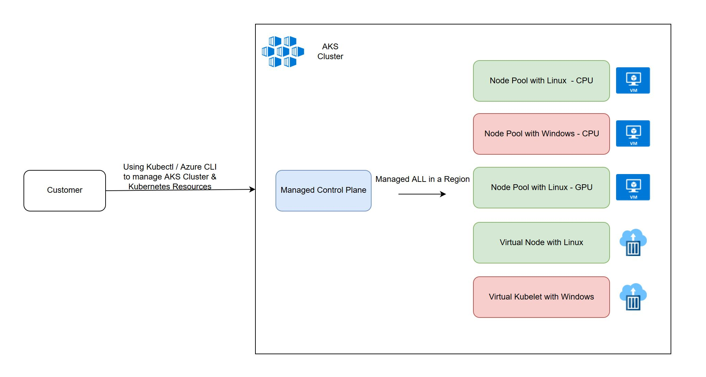

### 实验准备 

本次实验的所有资源都创建于 `WestUS2`; 本次实验的网络模型将使用 `Azure CNI`，主要是因为添加 `Virtual Node` 需要 `Azure CNI` 的支持以设置 VNET & Subnet; 本次实验 AKS 集群的版本为 `1.14.0` 。

##### 查看目前区域 westus2 支持的Kubernetes版本

```
az aks get-versions -l westus2 -o table
```

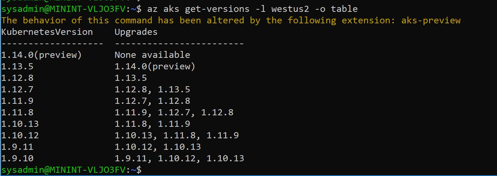

##### 创建资源组 zjdemox1

```
az group create -n zjdemox1 -l westus2
```

##### 创建 ServicePrincipal zjsp0626

```
az ad sp create-for-rbac -n "zjsp0526"
```

请存好创建的SP `zjsp0526` 的密码，以备后续资源创建时使用。

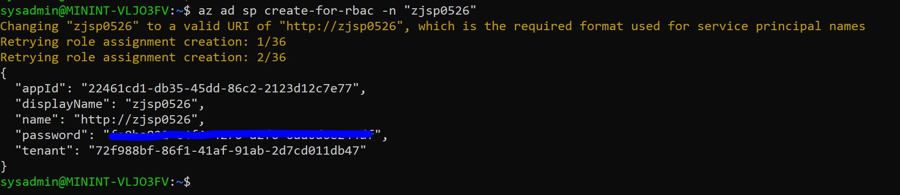

##### 创建 VNET vnet01 & Subnet subnet01

```
az network vnet create -g zjdemox1 -n vnet01 --address-prefixes 10.0.0.0/8 --subnet-name subnet01 --subnet-prefix 10.240.0.0/16
```

##### 创建 AKS 集群 zjaks01 : 集群默认Node Pool将被设置成为 `linuxCPU` , 机型为 `Standard_DS2_v2`, 数量为  `1`

```
# 创建AKS集群时，指定前面创建的Subnet subnet01，需要获取subnet01的ID
az network vnet subnet show -g zjdemox1 --vnet-name vnet01 -n subnet01 --query id -o tsv

# 创建AKS集群
az aks create -n zjaks01 -g zjdemox1 --node-count 1 --nodepool-name linuxcpu --service-principal $yourSPID --client-secret $yourSPPass -k 1.14.0 --network-plugin azure --service-cidr 10.0.0.0/16 --dns-service-ip 10.0.0.10 --docker-bridge-address 172.17.0.1/16 --vnet-subnet-id $yourSubnetID --enable-vmss --windows-admin-username azureuser --windows-admin-password $yourPass

# 查看创建好的集群节点信息
kubectl get nodes
```

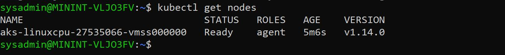

### Enable Node Pool 功能 & 创建 Linux GPU Node Pool 及 Windows CPU Node Pool

Node Pool 是 AKS 中一组配置相同的Worker Nodes集合，多节点池有助于我们更加方便的根据实际需求部署相应的工作负载，例如：将机器学习的任务部署到带有GPU的Node Pool中，将数据库服务部署在带有SSD磁盘的 Node Pool 中，也可以根据需要，针对单一的 Node Pool 进行版本升级或扩展。

需要安装针对于 `AKS Extension` 来管理  `Node Pool`，同时需要启用订阅中 `MultiAgentpoolPreview` & `VMSSPreview` 的功能。

##### 安装 aks-preview CLI Extension

```
az extension add --name aks-preview
```

##### 查看 Feature `MultiAgentpoolPreview` & `VMSSPreview` 是否已经启用

```
az feature list -o table --query "[?contains(name, 'Microsoft.ContainerService/MultiAgentpoolPreview')].{Name:name,State:properties.state}"
az feature list -o table --query "[?contains(name, 'Microsoft.ContainerService/VMSSPreview')].{Name:name,State:properties.state}"

# 如果状态显示为 `Not Registered`, 可以通过如下命令注册
az feature register --name MultiAgentpoolPreview --namespace Microsoft.ContainerService
az feature register --name VMSSPreview --namespace Microsoft.ContainerService

#刷新 Microsoft.ContainerService 资源提供程序的注册状态
az provider register --namespace Microsoft.ContainerService
```

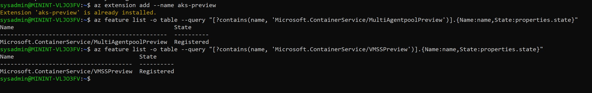

##### 创建 Linux GPU Node Pool `linuxgpu`，机型为 `Standard_NC6`, 数量为  `1`

```
# 在同一VNET内，创建 subnet02
az network vnet subnet create -n subnet02 --vnet-name vnet01 -g zjdemox1 --address-prefixes 10.241.0.0/16

# 获取 subnet02 ID
az network vnet subnet show -g zjdemox1 --vnet-name vnet01 -n subnet02 --query id -o tsv

# 创建 Node Pool linuxgpu，设置Kubernetes版本为1.13.5
az aks nodepool add -n linuxgpu --cluster-name zjaks01 -g zjdemox1 --os-type Linux --node-count 1 --node-vm-size Standard_NC6 -k 1.13.5 --vnet-subnet-id $yourSubnetID

# 查看目前集群中 Node Pool 情况
az aks nodepool list --cluster-name zjaks01 -g zjdemox1 -o table
```

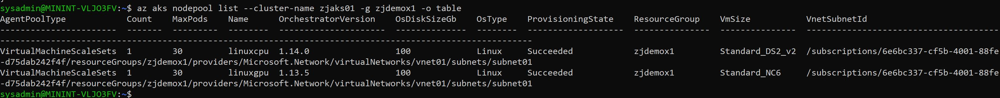

##### 创建 Windows CPU Node Pool `wincpu`，机型为 `Standard_D2s_v3`, 数量为  `1`

```
# 如上面一样，使用 Windows Container，需要检查 WindowsPreview 是否已经开启
az feature list -o table --query "[?contains(name, 'Microsoft.ContainerService/WindowsPreview')].{Name:name,State:properties.state}"

# 如果状态显示为 `Not Registered`, 可以通过如下命令注册
az feature register --name WindowsPreview --namespace Microsoft.ContainerService

#刷新 Microsoft.ContainerService 资源提供程序的注册状态
az provider register --namespace Microsoft.ContainerService

# 在同一VNET内，创建 subnet03
az network vnet subnet create -n subnet03 --vnet-name vnet01 -g zjdemox1 --address-prefixes 10.242.0.0/16

# 获取 subnet03 ID
az network vnet subnet show -g zjdemox1 --vnet-name vnet01 -n subnet03 --query id -o tsv

# 创建 Node Pool wincpu，设置Kubernetes版本为1.14.0
az aks nodepool add -n wincpu --cluster-name zjaks01 -g zjdemox1 --os-type Windows --node-count 1 --node-vm-size Standard_D2s_v3 -k 1.14.0 --vnet-subnet-id $yourSubnetID

# 查看目前集群中 Node Pool 情况
az aks nodepool list --cluster-name zjaks01 -g zjdemox1 -o table
```

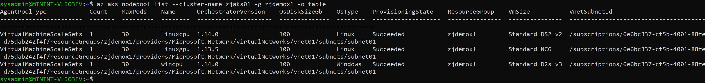

### Enable Virtual Node

目前，Virtual Node 还存在一定的限制，其中就包括暂时只支持 Linux 的Pod。

##### 确认 Microsoft.ContainerInstance 在环境中是否可用

```
az provider list --query "[?contains(namespace,'Microsoft.ContainerInstance')]" -o table

# 如果状态显示为 `Not Registered`, 可以通过如下命令注册
az provider register --namespace Microsoft.ContainerInstance
```

##### Enable Virtual Node

```
# 创建 Virtual Node 使用的 Subnet `subnet04`
az network vnet subnet create -n subnet04 --vnet-name vnet01 -g zjdemox1 --address-prefixes 10.243.0.0/16

# Enable Virtual Node Addons
az network vnet subnet create -n subnet04 --vnet-name vnet01 -g zjdemox1 --address-prefixes 10.243.0.0/16

# 查看集群中节点信息
kubectl get nodes
```

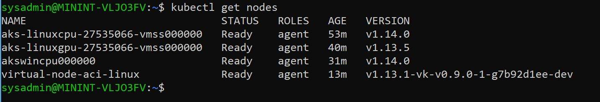

### 通过 Virtual Kubelet 添加支持 Windows Container 的虚拟节点

虽然现在 `Virtual Node` 还不支持 `Windows Container`，但如果大家如果还是想用ACI实现虚拟节点的概念的话，可以使用 `Virtual Kubelet`。这是一个开源项目，意在通过 `Virtual Kubelet`，将无服务的类似于ACI的服务添加入Kubernetes集群，使得集群在创建Pod时可以选择ACI作为Pod载体。

##### 配置 Helm

如果没有安装过 `Helm` , 请参照官方链接进行安装 `https://helm.sh/docs/using_helm/#installing-helm`； 启用相应的 Service Account & RBAC 请参阅 [rbac-virtual-kubelet.yaml](./files/190526/rbac-virtual-kubelet.yaml)

```
# 如果 AKS 群集已启用 RBAC，则必须创建服务帐户和角色绑定以便与 Tiller 一起使用
kubectl apply -f ./rbac-virtual-kubelet.yaml

# 配置 Helm 以使用 Tiller 服务帐户
helm init --service-account tiller --upgrade

# 创建 只针对于 `Windows` 的 `Virtual Kubelet`
az aks install-connector -n zjaks01 --connector-name win-vir-kubelet -g zjdemox1 --os-type Windows

# 查看集群中节点信息
kubectl get nodes
```

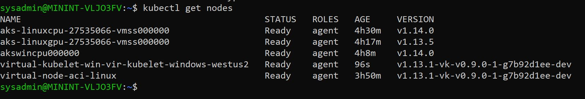

至此，整个实验环境就如架构图中描述的一样搭建成功，既可以支持Linux的负载，又可以支持Windows的负载，同时还启用了ACI及GPU，接下来，让我们通过一些实例，来看一下如何把这些工作负载指定到不同的节点中。

### 验证将Pod部署到不同节点中的过程

我们都知道，Kubernetes在部署Pod的时候，是通过 `kube-scheduler` 来完成资源的调度，选出最为合适的节点。在Kubernetes中，提供了几种方式，可以让你在节点选择上可以根据自己的意愿进行选择，这其中就包括 `借用 Node Taints & Tolerations 实现专有资源的隔离`， 例如： `GPU资源`，或`Windows资源`; `显示指定 Node Selector & 为 Node 指定标签 实现节点选择`，以及`Node Affinity & Pod Affinity`。

本次实验，将通过 `Node Taints & Tolerations` 结合 `Node Selector` 的方式，将工作负载部署到不同节点中。

##### 部署 `aci-helloworld` 到  Virtual Node

将工作负载部署到 Virtual Node，需要显示的指定 `nodeSelector 和 toleration`，具体资源内容参见 [virNodeLinux.yml](./files/190526/virNodeLinux.yml)

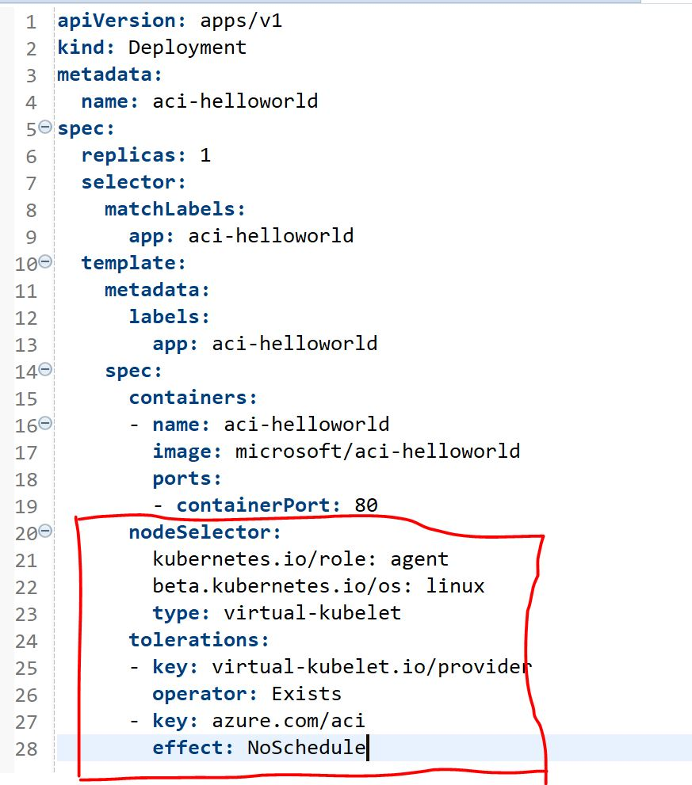

```
kubectl apply -f ./virNodeLinux.yml
```

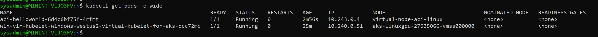

##### 部署 `aci-nanoserver-iis` 到  Virtual Kubelet

将工作负载部署到 Virtua Kubelet，同样需要显示的指定 `nodeSelector 和 toleration`，具体的资源内容参见 [virKubeletWins.yml](./files/190526/virKubeletWins.yml)

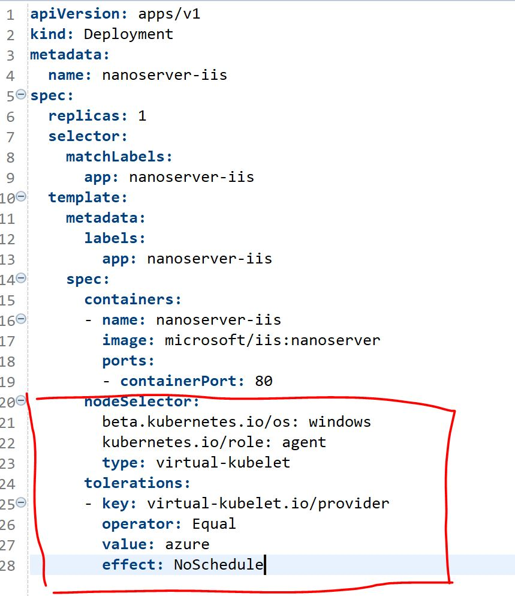

```
kubectl apply -f virKubeletWins.yml
```

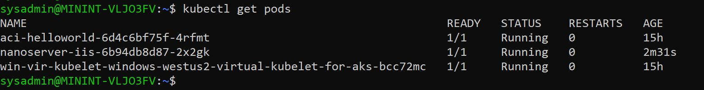

##### 针对不同工作负载设置不同的专用 `Node Pool`

由于目前集群中存在三个 `Node Pool`，分别针对 `Windows` & `Linux` & `GPU`，如果只通过 `Node Tag` 的方式进行调度，一旦在创建Pod时忘记显示的标记Tag，有可能将普通的负载运行在 GPU节点中，造成不必要的Cost，因此，我们需要通过 `Node Selector` 与 `Toleration`相结合的方式来调度我们的工作负载。

```
# 获取目前环境中节点信息
kubectl get nodes
```

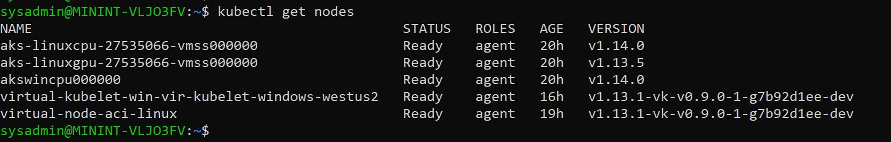

```
# 通过 Toleration的方式，将GPU的工作节点设置为专用
kubectl taint node aks-linuxgpu-27535066-vmss000000 sku=gpu:NoSchedule

# 为节点是设置Tag
kubectl label nodes akswincpu000000 osType=Windows
kubectl label nodes aks-linuxcpu-27535066-vmss000000 osType=Linux

# 查看节点的Tag信息
kubectl get nodes --show-labels
```

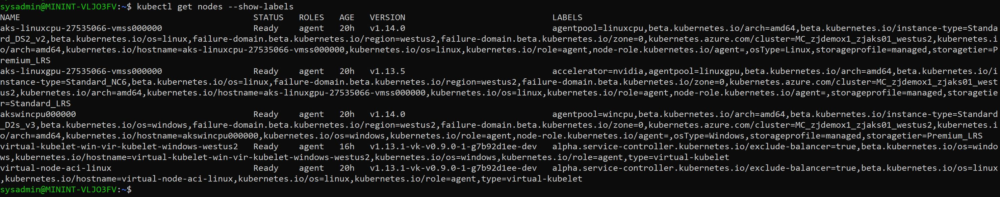

##### 部署 `nodepool-demo-linux` 到 Linxu Node 中

部署文件请参照 [nodePoolLinux.yml](./files/190526/nodePoolLinux.yml)

```
kubectl apply -f nodePoolLinux.yml
```

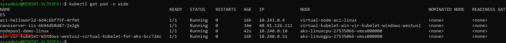

##### 部署 `nodepool-demo-windows` 到 Windows Node 中

部署文件请参照 [nodePoolWindows.yml](./files/190526/nodePoolWindows.yml)

```
kubectl apply -f nodePoolWindows.yml
```

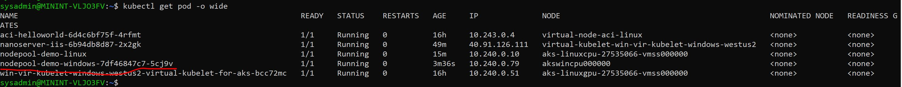

##### 部署 `nodepool-demo-gpu` 到 GPU Node 中

部署文件请参照 [nodePoolGPU.yml](./files/190526/nodePoolGPU.yml)

```
kubectl apply -f nodePoolGPU.yml
```

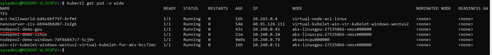

到此，我们的全部实验都已经做完，其实真实的环境远比这复杂的多，大家可以根据实际需要合理的设计我们的生产环境。

### 如何 SSH 到 AKS 集群的 Worker Node

很多人都会问，AKS集群中的工作节点是不是能够连上，怎么才能快速的连上呢？ 接下来就给大家Demo一下，其实这种方式官方是有介绍文档的，类似于一种 `JIM（Just IN Time）` 的方式，只有在必要的时候，SSH的连接通道是有时效性的，只有必要的时候才会开启连接，以减少安全风险。

```
# 查看 AKS 节点的 IP信息
kubectl get nodes -o wide
```

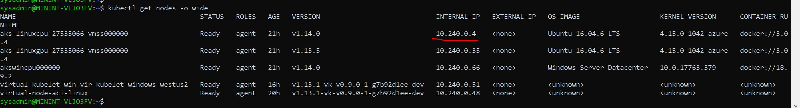

我们通过运行一个Pod，并借助 `kubectl exec`进入到Pod的`/bin/bash`，从而通过 SSH 连接到 Node

```
# 创建 SSH Pod，作为跳板Pod
kubectl run -it --rm aks-ssh --image=debian --overrides='{"apiVersion":"apps/v1","spec":{"template":{"spec":{"nodeSelector":{"beta.kubernetes.io/os":"linux"}}}}}'

# 安装并升级SSH组件
apt-get update && apt-get install openssh-client -y
```

在同一个Client中打开另外一个未连接到Pod的Terminal，将 SSH私钥发送到Pod中

```
kubectl cp ~/.ssh/id_rsa $your_pod_id:/id_rsa
```

回到进入Pod的Terminal中

```
# 检查SSH 私钥是否已经存在 & 并更改私钥文件权限
ls id_rsa
chmod 600 id_rsa

# SSH到AKS工作节点，本次实验以 aks-linuxcpu-27535066-vmss000000 为例，IP为10.240.0.4
ssh -i id_rsa azureuser@10.240.0.4
```

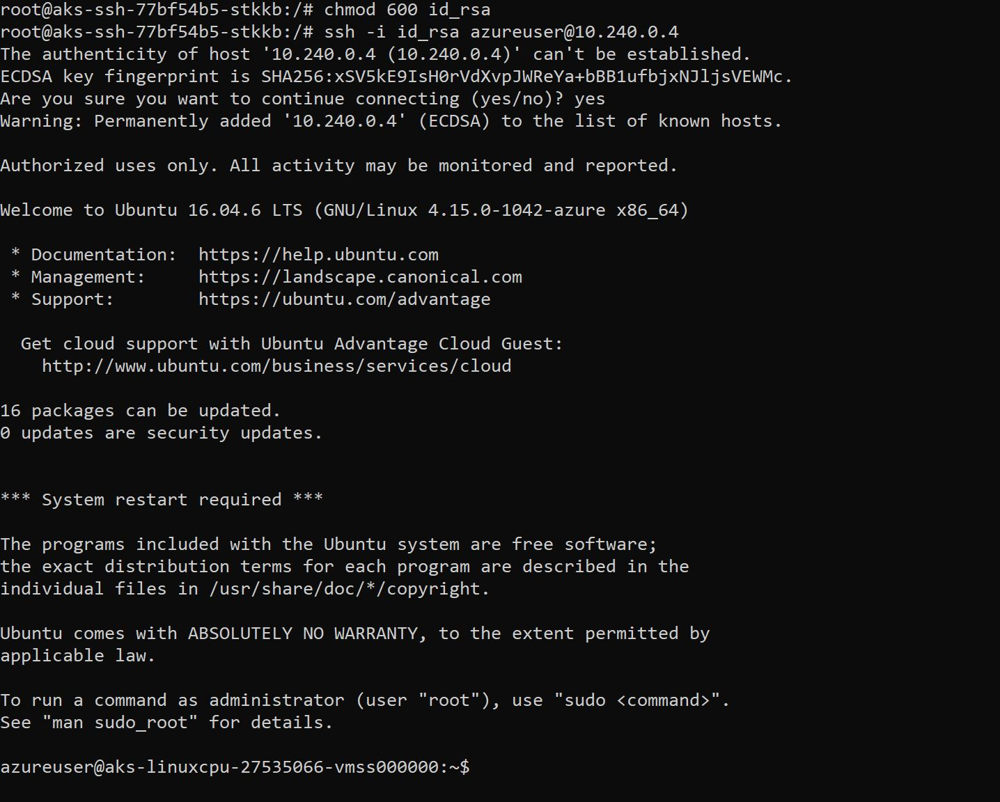

当我们执行完必要的操作后，只需要推出并清理创建的 `aks-ssh` 即可。


#### 参考资料

- Azure服务及更新 ： `https://azureheatmap.azurewebsites.net/?vm=hau`

- AKS最新更新 ：  `https://azure.microsoft.com/zh-cn/updates/?product=kubernetes-service`

- AKS 官方文档 : `https://docs.microsoft.com/zh-cn/azure/aks/`

- AKS 最佳实践 : `https://docs.microsoft.com/zh-cn/azure/aks/best-practices`

- 使用 SSH 连接到 AKS 群集节点 : `https://docs.microsoft.com/zh-cn/azure/aks/ssh`
