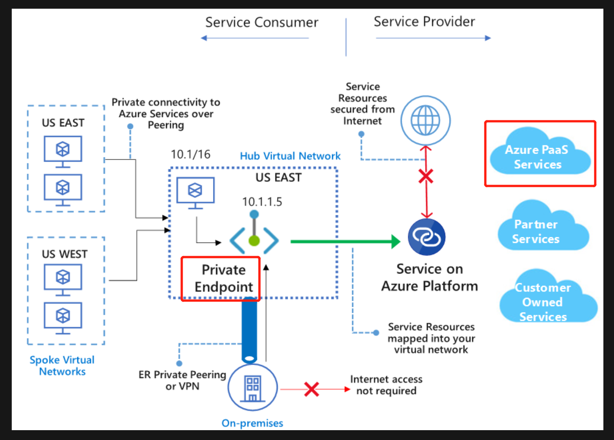
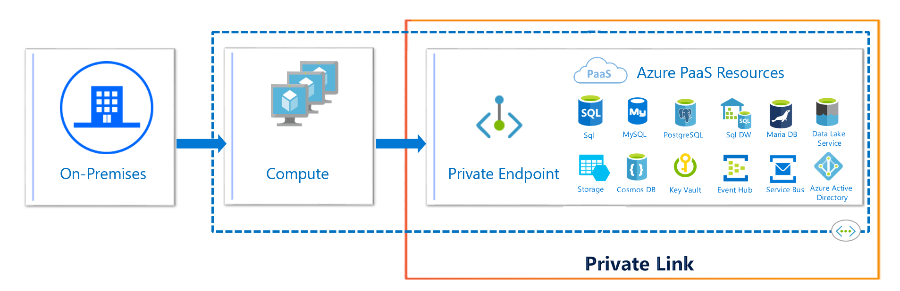
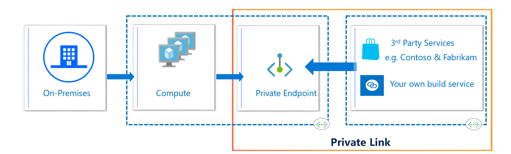
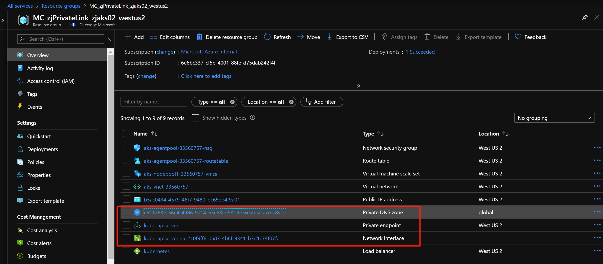
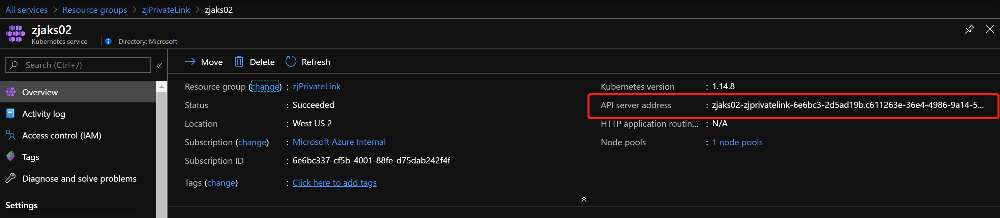
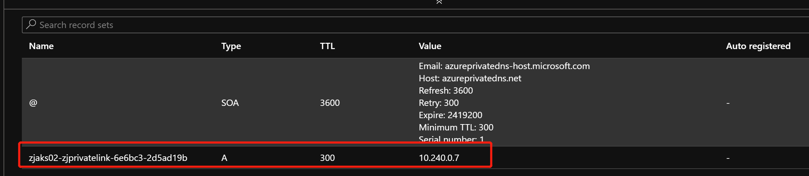
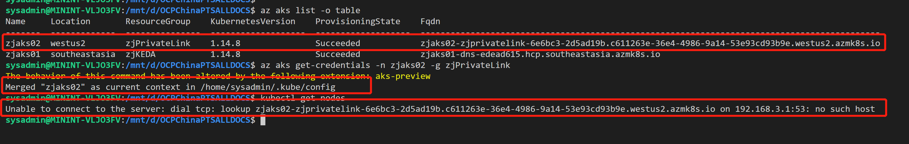
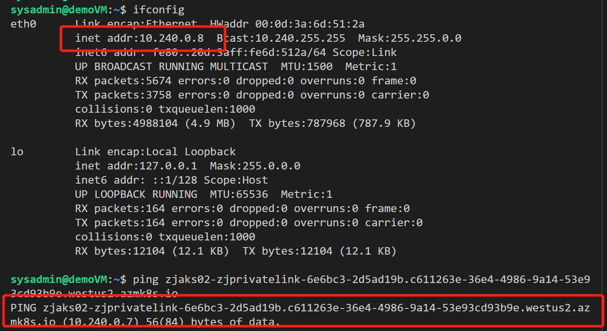
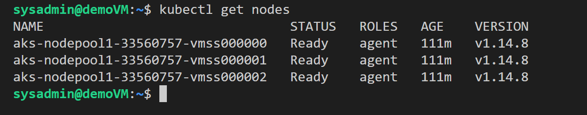

## 借助 Private Link 实现 AKS 集群的私有化访问

随着 `Azure Private Link` 的预览, 越来越多的 Azure PaaS 服务开始支持 `Private Link`. 近期 AKS 也开启的对于 `Private Link` 的预览功能, 我们可以通过内网地址访问并管理 AKS 集群, 连接 `API Server`.

让我们来瞄一眼 `审美是` 欢迎大家研究 `Private Link` & `Service Endpoint` & `VNET Injection` 的具体区别.



通过 `Azure Private Link`, VNET中的VM以及On-Prem中的VM可以通过内网地址访问Azure的PaaS服务, 如 `Azure Storage & CosmosDB & AKS等`, 网络流量通过Azure骨干网络进行传输.

`Azure Private Link` 在实际场景中, 有两种创建类型：

- 创建 `Private Endpoint`, 主要实现VNET中的VM通过内网地址访问Azure PaaS服务



- 创建 `Private Link Service`, 主要实现VNET中的VM通过`Azure Private Link & Private Endpoint`的能力, 访问第三方的应用



AKS 目前也通过 `Private Link` 支持专有集群, 来支持大家更多的实际需求. 接下来, 我们快速通过下面的实验, 验证一下 `开启 Private Link 的 AKS的功效`


目前已经创建的AKS集群暂不支持开启 `Private Cluster` 功能, 此功能只针对于新创建的集群.

```
# 准备 Azure CLI, 升级 aks-preview extension 版本
az extension add --name aks-preview
az extension update --name aks-preview

# 注册 PrivateLink 针对 AKS 服务的功能, 并确保注册状态已经是 Registered
az feature register --name AKSPrivateLinkPreview --namespace Microsoft.ContainerService
az feature list -o table --query "[?contains(name, 'Microsoft.ContainerService/AKSPrivateLinkPreview')].{Name:name,State:properties.state}"
az provider register --namespace Microsoft.ContainerService
az provider register --namespace Microsoft.Network

# 创建 AKS 集群, Enable private cluster 功能
az group create -n zjPrivateLink -l westus2
az aks create -n zjaks02 -g zjPrivateLink --load-balancer-sku standard --enable-private-cluster
```

我们从Portal中可以看到, 集群创建过程中, 自动创建了 `Private Endpoint` 供 AKS 集群使用



当集群创建好后, AKS对外访问接口也变成了内网地址, 从外部无法访问, 只能通过部署在同一VNET中的虚机, 或通过Azure Bastion进行访问, 真正做到了专有集群.











### 参考资料

- [Azure Private Link 简介](https://azure.microsoft.com/en-us/services/private-link/)

- [Private Azure Kubernetes Service cluster](https://docs.microsoft.com/zh-cn/azure/aks/private-clusters)