## 借助于 Global VNET Peering with GW Transit 实现 Hub-Spoke网络结构

随着Azure中国区新的数据中心 China East2 & China North2已经运行了有将近一年的时间，越来越多的小伙伴会针对新老数据中心进行资源的混合部署。寻求一种高效且经济的方式，一直是大家所关注的。 今天就带大家来动手搭建一个基于Global VNET Peering with GW Transit的Hub Spoke网络环境，来探究借助于GW Transit，两端虚机之间的通信延迟。

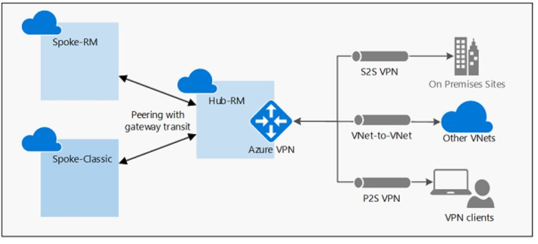

`Gateway Transit` 是VNET Peering的一个属性，允许一个虚拟网络利用对等互联的虚拟网络的 `VPN Gateway` 进行跨界连接或VNet到VNet连接。

本次实验的架构图如下

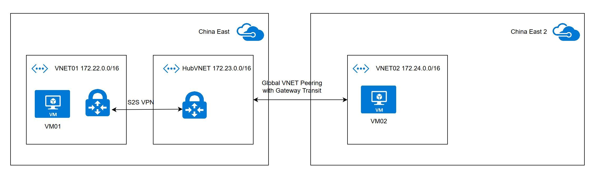

### 准备环境

##### 创建实验资源组 `zjdemo01` & `zjdemo02`

```
# zjdemo01 资源组在China East
az group create -n zjdemo01 -l chinaeast

# zjdemo02 资源组在 China East 2, 以符合资源组管理资源的最佳实践
az group create -n zjdemo02 -l chinaeast2
```

##### 创建实验VNET `VNET01` & `HubVNET` & `VNET02`

```
# 创建VNET01， Address为 172.22.0.0/16
az network vnet create -g zjdemo01 -n VNET01 --address-prefix 172.22.0.0/16 --subnet-name subnet01 --subnet-prefix 172.22.0.0/24

# 创建HubVNET， Address为 172.23.0.0/16
az network vnet create -g zjdemo01 -n HubVNET --address-prefix 172.23.0.0/16 --subnet-name subnet01 --subnet-prefix 172.23.0.0/24

# 创建VNET02， Address为172.24.0.0/16
az network vnet create -g zjdemo02 -n VNET02 --address-prefix 172.24.0.0/16 --subnet-name subnet01 --subnet-prefix 172.24.0.0/24
```

##### 创建实验需要的VM `VM01` & `VM02`

```
# 创建VM01
az vm create -n VM01 -g zjdemo01 --image "Canonical:UbuntuServer:16.04-LTS:16.04.201903130" --vnet-name VNET01 --subnet subnet01 --size Standard_D2_v2 --authentication-type password --admin-username $your_username --admin-password $your_password

# 创建VM02
az vm create -n VM02 -g zjdemo02 --image "Canonical:UbuntuServer:16.04-LTS:16.04.201903130" --vnet-name VNET02 --subnet subnet01 --size Standard_
D2_v2 --authentication-type password --admin-username $your_username --admin-password $your_password
```

##### 创建实验所需的VPN Gateway `GW01` & `HubGW`

```
# 由于VNET01与HubVNET之间的连接是通过S2S VPN，因此预先创建号VPN Gateway备用

# 为GW01准备公网IP Public01
az network public-ip create -g zjdemo01 -n Public01 --allocation-method Dynamic

# 为GW01创建GatewaySubnet
az network vnet subnet create -g zjdemo01 --vnet-name VNET01 -n GatewaySubnet --address-prefix 172.22.1.0/24

# 创建GW01
az network vnet-gateway create -n GW01 -g zjdemo01 --public-ip-address Public01 --vnet VNET01 --gateway-type Vpn --sku VpnGw1 --vpn-type RouteBased

# 为HubGW准备公网IP HubPublic
az network public-ip create -g zjdemo01 -n HubPublic --allocation-method Dynamic

# 为HubGW创建GatewaySubnet
az network vnet subnet create -g zjdemo01 --vnet-name HubVNET -n GatewaySubnet --address-prefix 172.23.1.0/24

# 创建GW02
az network vnet-gateway create -n HubGW -g zjdemo01 --public-ip-address HubPublic --vnet HubVNET --gateway-type Vpn --sku VpnGw1 --vpn-type RouteBased
```

### 配置 HubVNET 与 VNET02 之间的对等互联

配置对等互联的方法非常简单，且通过Portal配置，非常的清晰。

##### 配置从VNET02到HubVNET之间的对等互联

进入 `VNET02` , 点击 `Peerings` 进行配置 ， 点击 `Add`

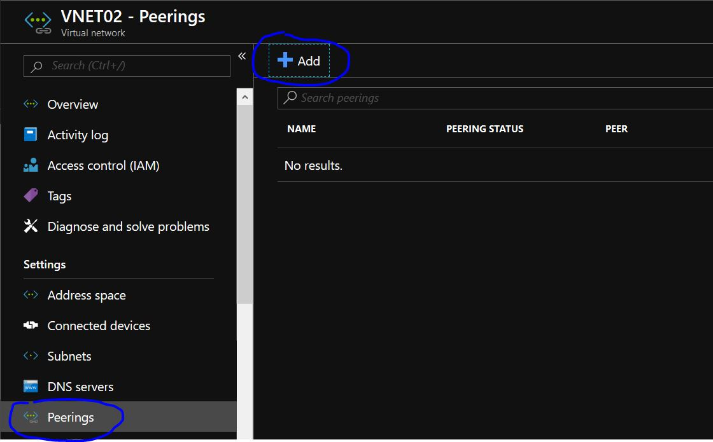

创建名为 `VNET02toHubVNET` 的Peering，并配置 `virtual network access settings` & `Remote Gateways settings`

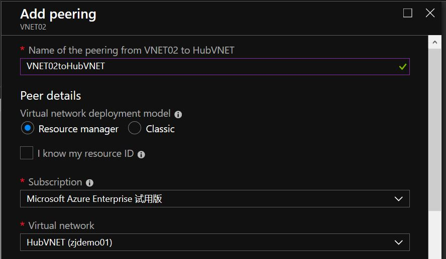

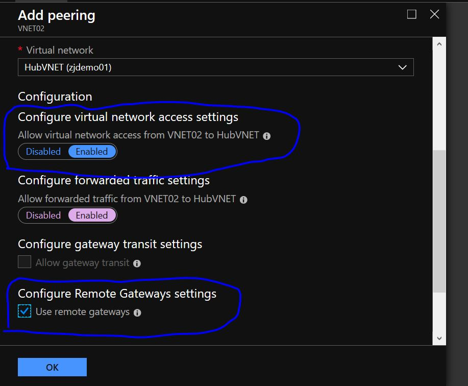

##### 配置从HubVNET到VNET02之间的对等互联

进入 `HubVNET` , 点击 `Peerings` 进行配置 ， 点击 `Add`

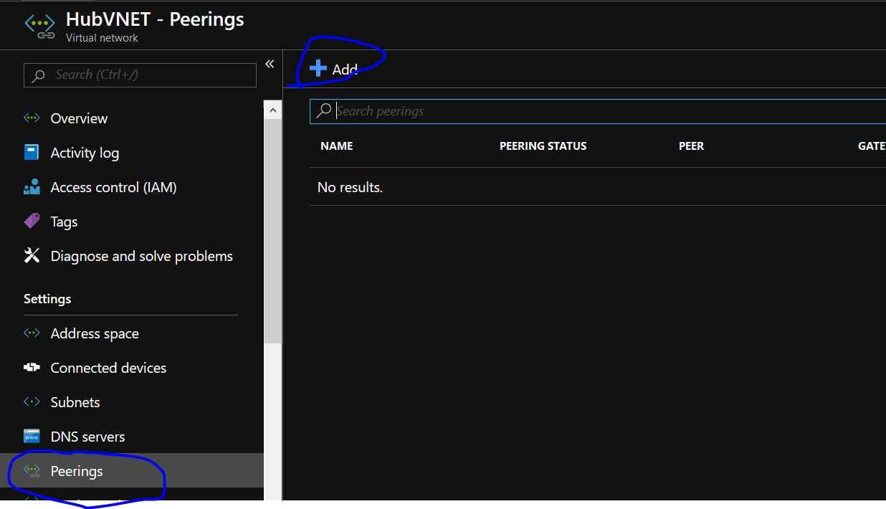

创建名为 `HubVNETtoVNET02` 的Peering，并配置 `virtual network access settings` & `Remote Gateways settings`

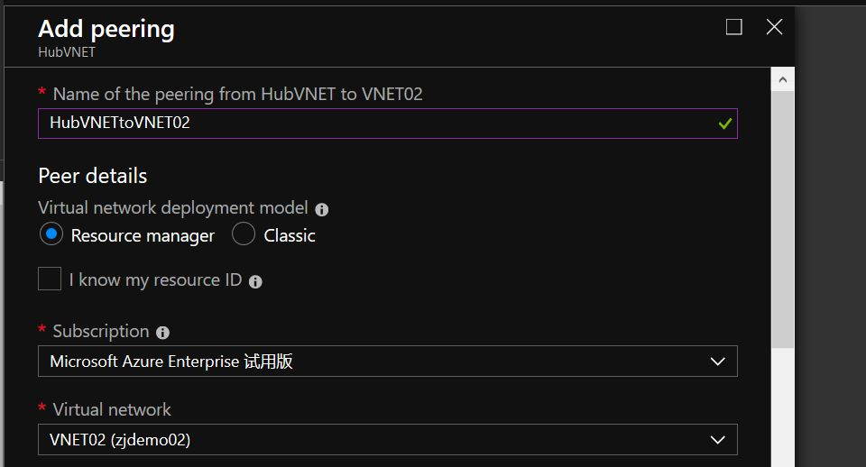

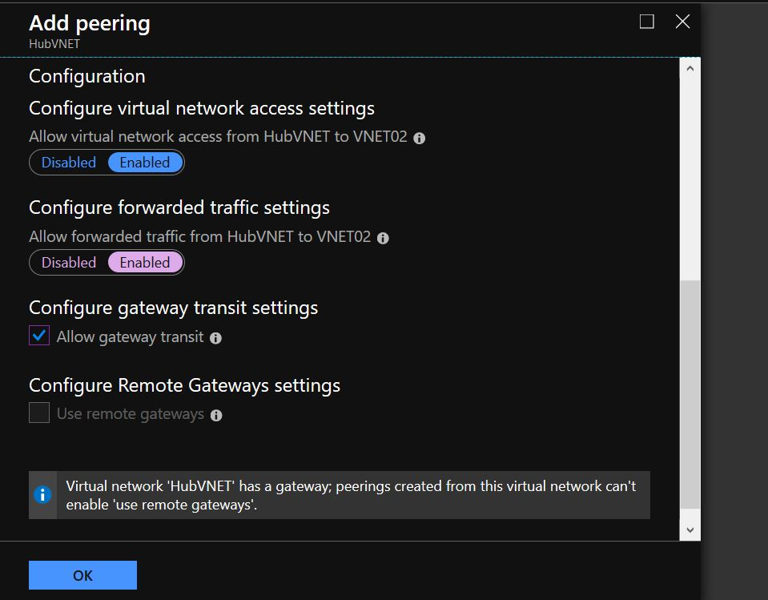

##### 检查对HubVNET与VNET02之间对等互联的状态，确保生效

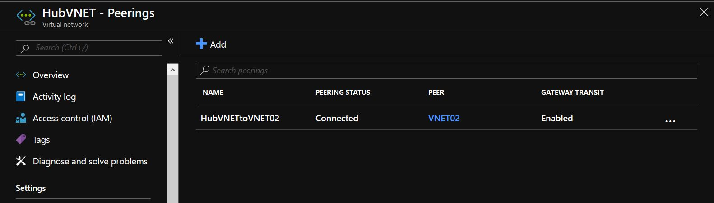

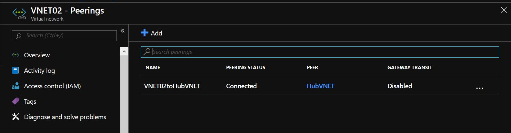

### 配置VNET01与HubVNET之间的S2SVPN

由于在准备环节已经创建好了相应的VNET及VPN GW资源，接下来主要演示如何通过Azure Portal进行S2S VPN的配置

##### 配置 VNET01 到 HubVNET的 VPN连接

进入 `GW01` ，点击 `Connections` , 点击 `Add` 进行连接创建

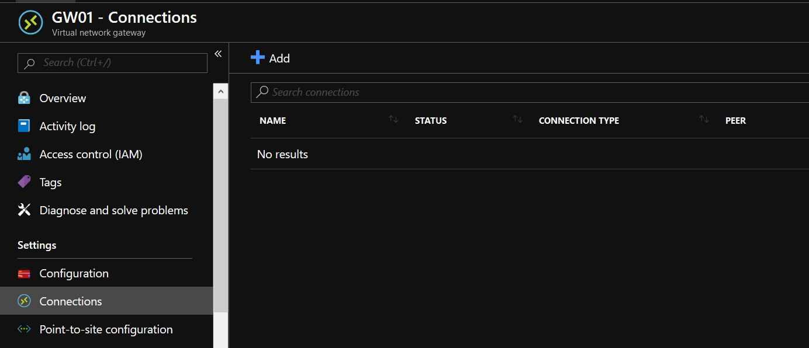

设置连接名称 `VNET01toHubVNET` , 选定 HubVNET 的 VPN GW `HubGW` 作为 `Second virtual network gateway` , 设置 `Shared key(PSK)` , 这个key可以根据符合安全标准随意设置，主要满足双方安全通信

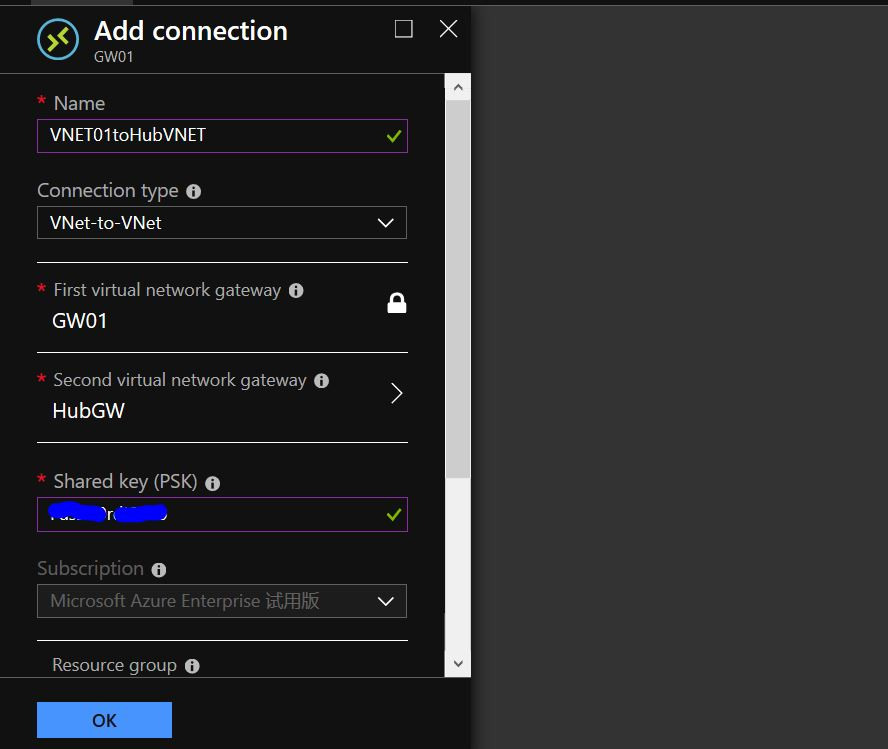

##### 配置 HubVNET 到 VNET01 的 VPN连接

进入 `HubGW` ，点击 `Connections` , 点击 `Add` 进行连接创建

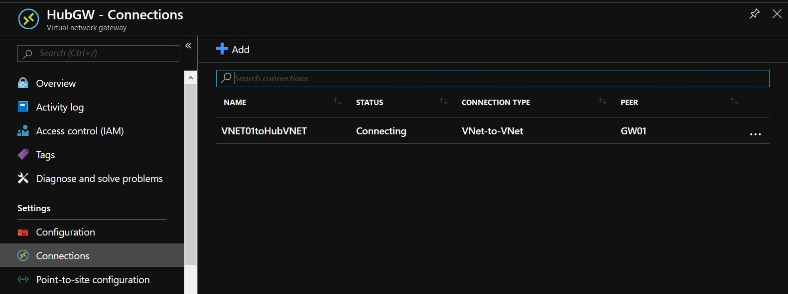

设置连接名称 `HubVNETtoVNET01` , 选定 VNET01 的 VPN GW `GW01` 作为 `Second virtual network gateway` , 设置 `Shared key(PSK)` , 这个key可以根据符合安全标准随意设置，主要满足双方安全通信

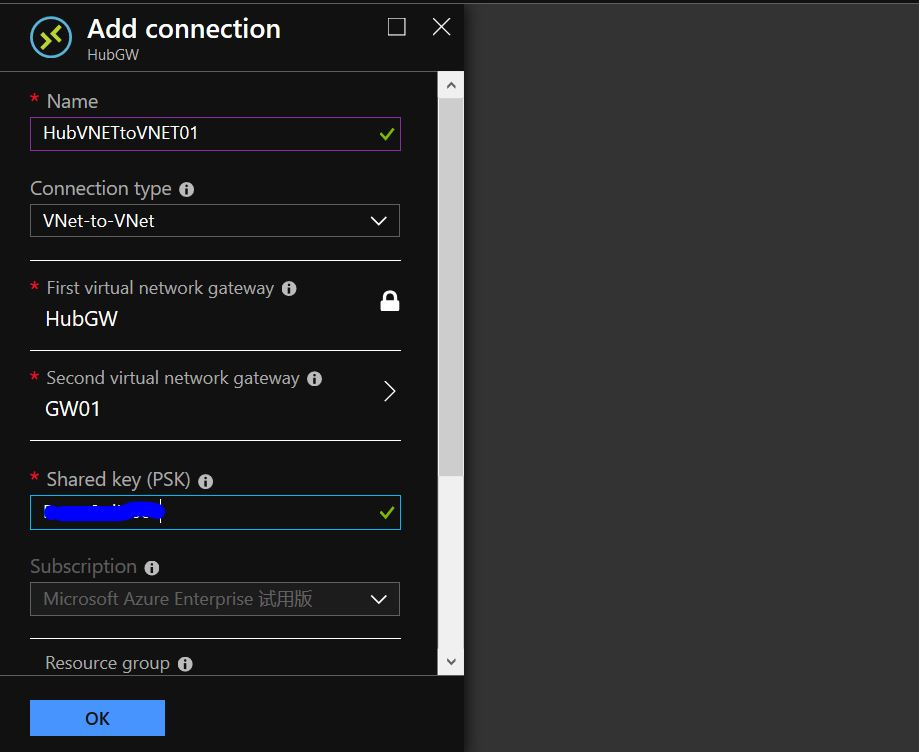

##### 验证连接是否已经Ready

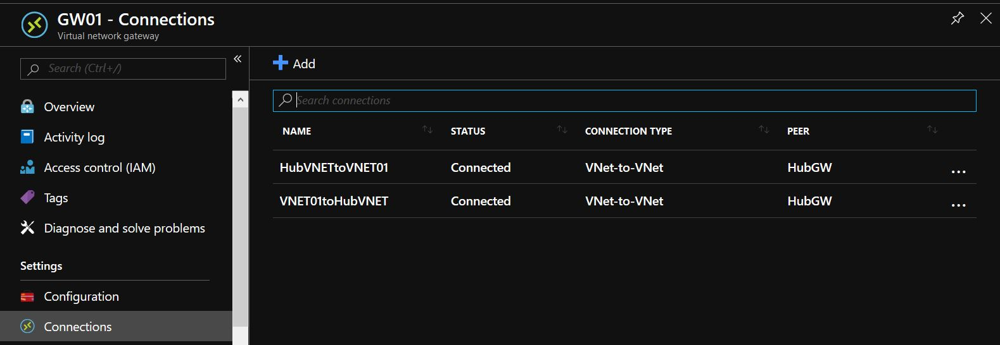

### 验证 VNET01 与 VNET02 中创建的VM01 & VM02 是否可以通信及连接延迟

根据前面步骤的准备可以看到，`VM01` 的 Private IP 为 `172.22.0.4` ; `VM02` 的 Private IP 为 `172.24.0.4`

登陆 VM01 ，并进行连通性测试

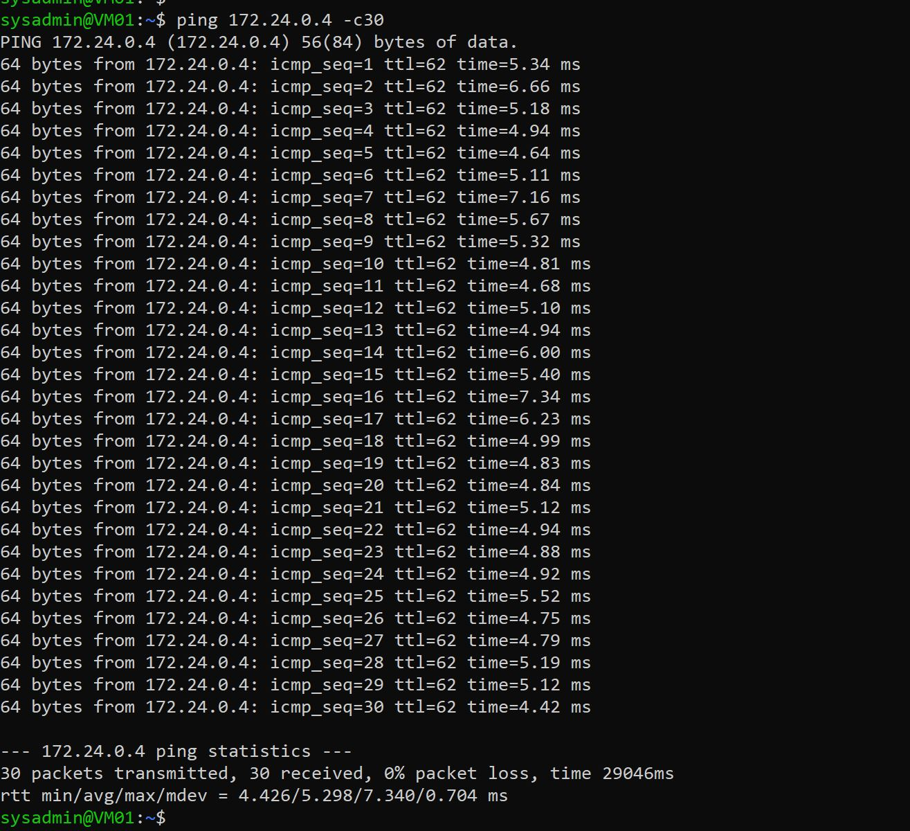

可以看到，借助于GW Transit到达VNET Peering，针对于延迟上，并未带来太大的影响。因此大家可以针对于不同的场景，合理的设置网络结构及连接，合理的使用Azure云端资源。

### 参考文档

- 针对虚拟网络对等互连配置 VPN 网关传输 : `https://docs.microsoft.com/zh-cn/azure/vpn-gateway/vpn-gateway-peering-gateway-transit`


- 教程：通过 Azure 门户使用虚拟网络对等互连连接虚拟网络 : `https://docs.microsoft.com/zh-cn/azure/virtual-network/tutorial-connect-virtual-networks-portal`


- 在 Azure 门户中创建站点到站点连接 : `https://docs.microsoft.com/zh-cn/azure/vpn-gateway/vpn-gateway-howto-site-to-site-resource-manager-portal`