## 借用 Azure Policy 强化云中资源管理

在云的使用中，很多时候管理云和使用资源是两拨不同的人。除了能够通过RBAC规范不同的用户创建资源的权限之外，管理员也特别希望能够
  按照一定的标准要求大家，确保创建出来的资源符合公司的要求。例如: 年初的时候，公司买了一批 `Standard_D3_v2` 的包年机器，当然希望
大家能够尽可能多的去利用这批机器。

本次实验，将模拟设置一系列策略限制云中资源的使用，包括：`虚拟机的类型`，`操作系统`，`所在区域`，`是否使用托管磁盘`，`是否使用高级存储`，`为资源填补默认的Tag` 等行为，来帮助大家体验一下 `Azure Policy` 在云端的管理功能。

目前在Azure云中，对于资源的组织如下所示：

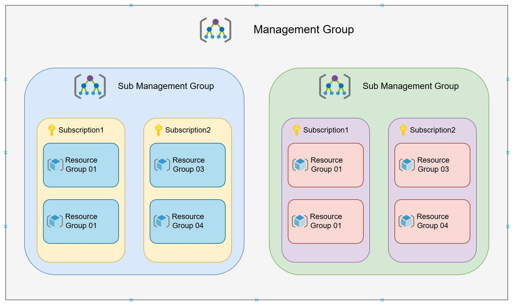

`Azure Policy` 可以将一系列定义的策略规则分配给不同的资源组织，即 `Management Group`, `Subscription`, `Resource Group` ，来实现对
  于资源的限制&管理。 `Azure Policy` 包含两种策略定义，即 `Policy` / `Initiative`，`Initiative`其实就是一组定义好的`Policy`，组合起来
实现对资源的管理。 可以将多个 `Policy` 或 `Initiative` 分配给同一个资源组织，实现不同类别的约束。

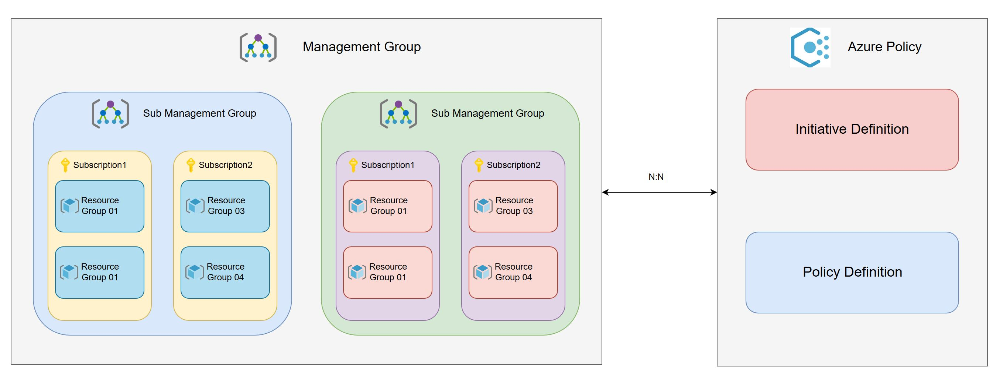

接下来我们瞄一眼 `Policy` 内容后，将直接动手实验，关于 `Policy` 完整的定义及参数详解，以及相关的示例 Policy，请参见参考资料。

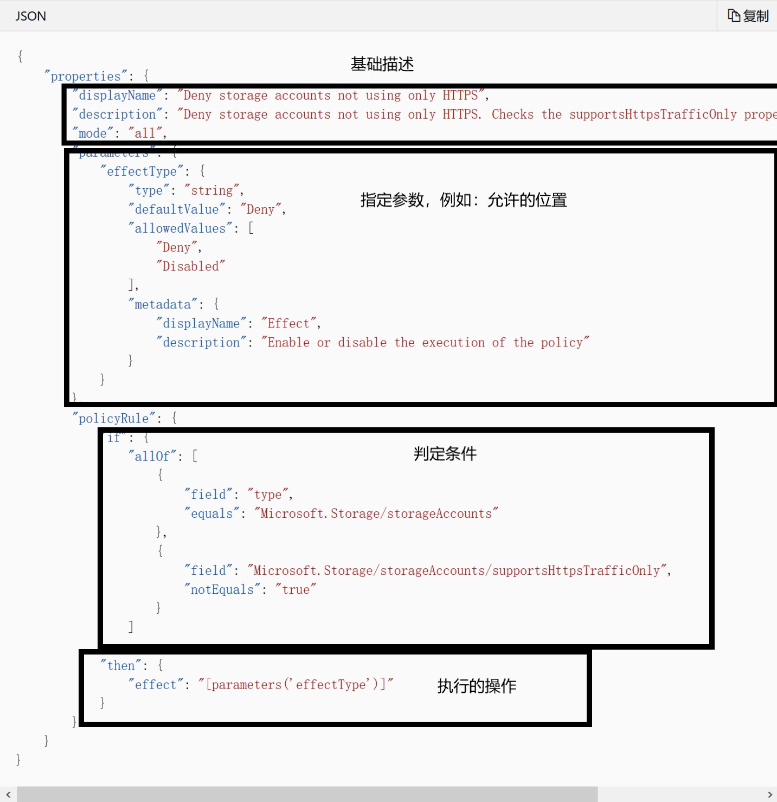

目前我的环境中暂无 `Management Group`, 只包含了一个订阅，同时创建了用于实验的资源组 `rg01`。

### HOL01 Subscription Level 允许资源创建的位置

选择 `All Services` -> `Policy` 进入 Azure Policy 页面，在系统中已经内置了一些常用的 `Policy` & `Initiative`，可以直接拿来使用

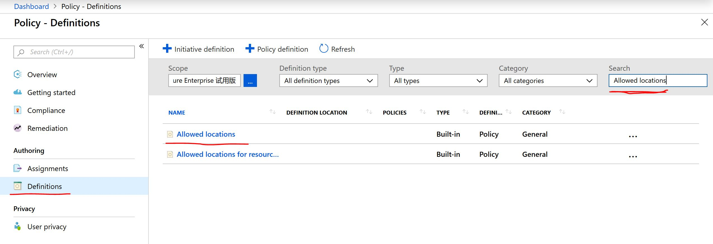

点击 `Allowed locations` -> `Assign`, 指定我们想要的区域，分配给需要的订阅

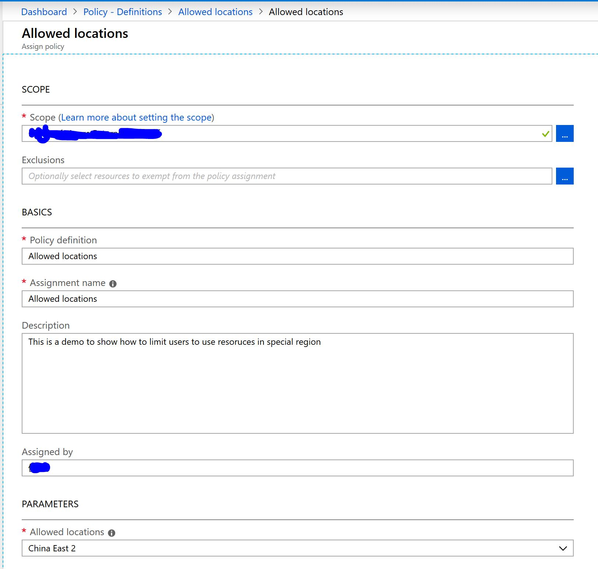

当 `Policy` 生效后，我们试着创建一个 Storage Account `zjsaverify`, Location选在`China North`，可以得到如下结果

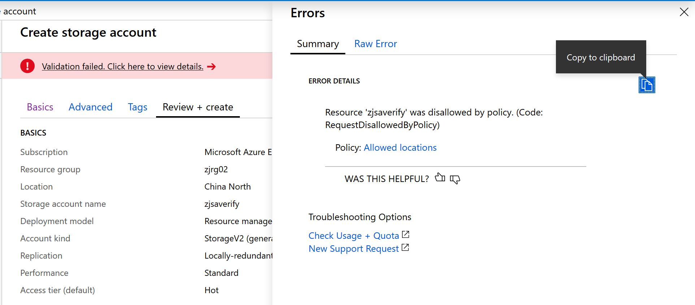

接下来的实验都将以资源组为基础完成，但这只是为了实验方便，现实情况还是根据事情情况选择合适的订阅或资源组。一种最佳实践方式是将概括性的策略
  应用到订阅，将具体细节的策略应用到资源组，通过策略叠加的方式管理资源。
  
这里先插播一句关于 当资源不符合 Policy 时，其实系统中是有几种不同的方式去做出反应，具体参加参考资料。 `Deny`是一种反应，就如HOL01，他会显式的
  阻止你去创建资源； `Audit` 是另外一种反应，他会在活动日志中创建警告事件，但不会停止请求； `Append`是HOL03中会用到的反应，会为资源添加
相应的字段。

### HOL02 Resource Group Level 为 `rg01` 下的新建的资源设定默认 TAG `demoProject:Nova`

我们都知道Azure中可以帮助创建的资源打上各种TAG，这样不仅可以通过TAG快速找到资源，也可以在分析账单时，根据TAG，定位花费。但是，手工的一个资源一个资源的添加TAG
  很精细，但不现实。这个HOL将带大家，使用Azure Policy中的 `Append` 操作，为资源组的所有新建资源添加 TAG。
  
__**注意:**__ 这不会改变已经创建的资源，并且还会将已经创建的资源标记为 `Non-compliant`

进入 Azure Policy，在 `Definition` 中找到 Build-In的Policy `Append tag and its default value`，分配给资源组 `zjrg01`

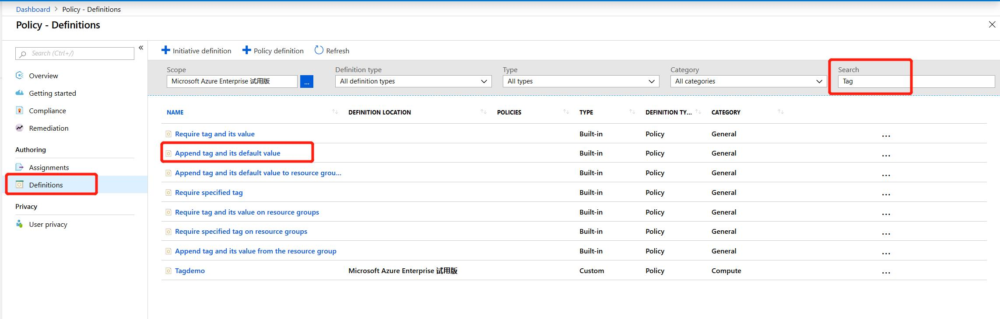

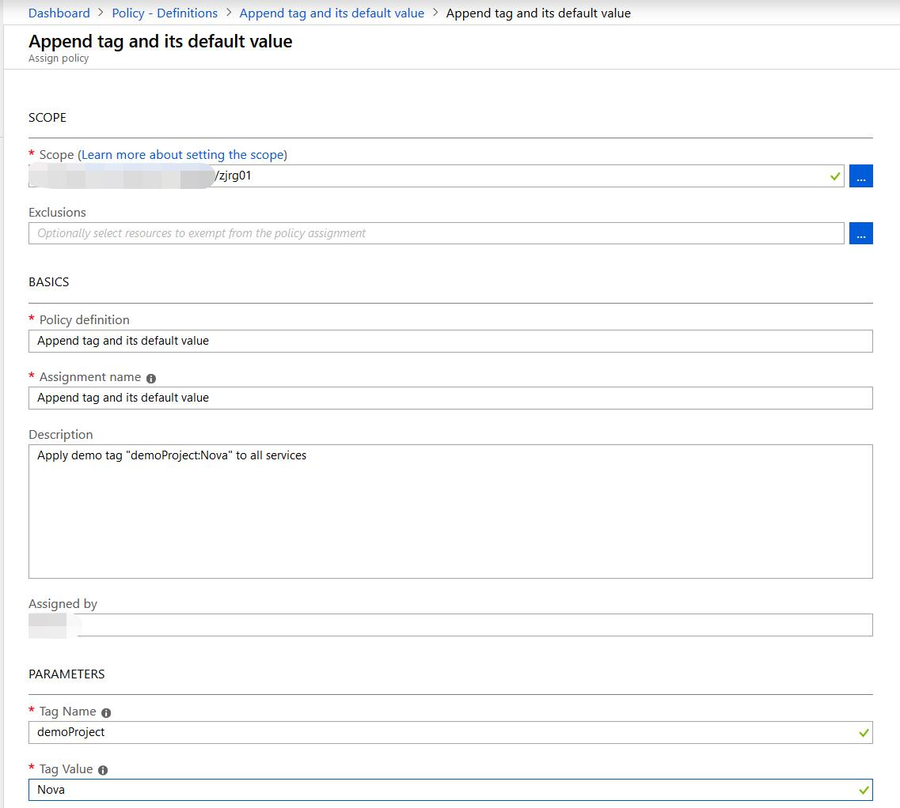

当 Policy 生效后，我们创建一个 Storage Account 看下效果

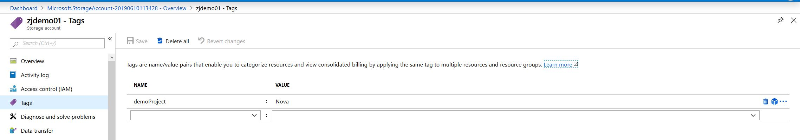

可以看到，默认的TAG已经应用到了新建的资源中。

### HOL03 Resource Group `zjrg01` 规范虚拟机的创建

之前的三个HOL，我们都是借用的 Azure Policy Build-In 的 Policy，且都是单条的Policy。 在实际使用中，如果我们需要自定义Policy，且需要将多个Policy组织起来，
  接下来就跟大家一起来熟悉一下 `Initiative`。本次HOL，将模拟虚拟机的创建过程，创建一个自定义的 `Initiative Definition`，及一组 `Policy Definition`，
包括了 `限制虚拟机的型号` & `限定使用托管磁盘` & `提示对于高级存储的使用`

本次实验，会创建一个 `Initiative Definition`，包含一组`Policy Definition`，包括： `限制虚拟机的型号` & `限定虚拟机的操作系统` & `限定使用托管磁盘` & `提示对于高级存储的使用`
  
##### Step 1 创建自定义的 `Initiative`

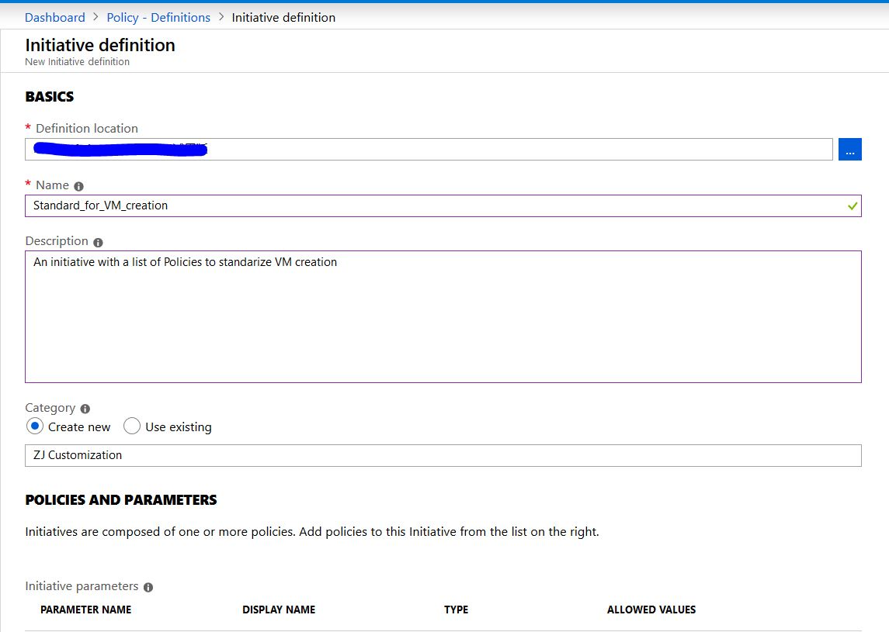

##### Step 2 选择右侧的 `Available Definitions -> Allowed virtual machine SKUs`，在 `Parameters` 中选择 `Standard_D1_v2` & `Standard_DS1_v2`

##### Step 3 创建自定义的 `Policy Definition`, 禁止用户使用非托管自盘, 并添加进入 `Initiative`

由于没有合适的Build-In Policy来限制用户只使用托管磁盘，因此需要我们创建一个自定义的Policy。

创建 `Policy definition` -> `Allowed_onlyuse_managed_disk`, 具体内容参见 [Allowed_onlyuse_managed_disk.json](./files/190608/Allowed_onlyuse_managed_disk.json)

将 Policy `Allowed_onlyuse_managed_disk` 添加给 `Initiative`

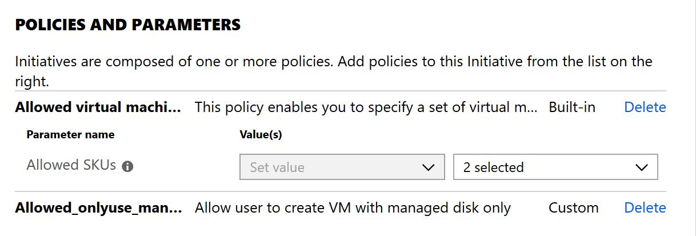

##### Step 4 创建自定义的 `Policy Definition`， 当用户使用高级托管磁盘时，在活动日志中产生警报，并添加进入 `Initiative`

由于没有合适的Build-In Policy来监控用户使用高级存储，因此需要我们创建一个自定义的Policy。

创建 `Policy definition` -> `Audit_usage_premium_managed_disk`, 具体内容参见 [Audit_usage_premium_managed_disk.json](./files/190608/Audit_usage_premium_managed_disk.json)

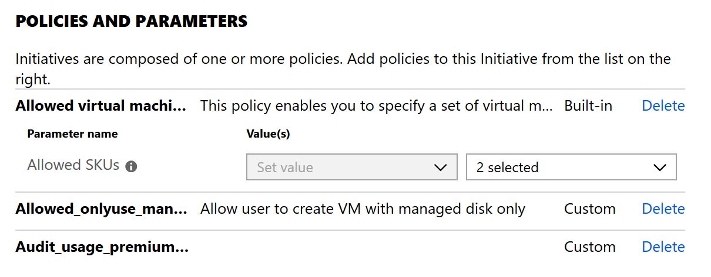

接下来，将 `Initiative - Standard_for_VM_creation` 分配给 Resource Group `zjrg01`

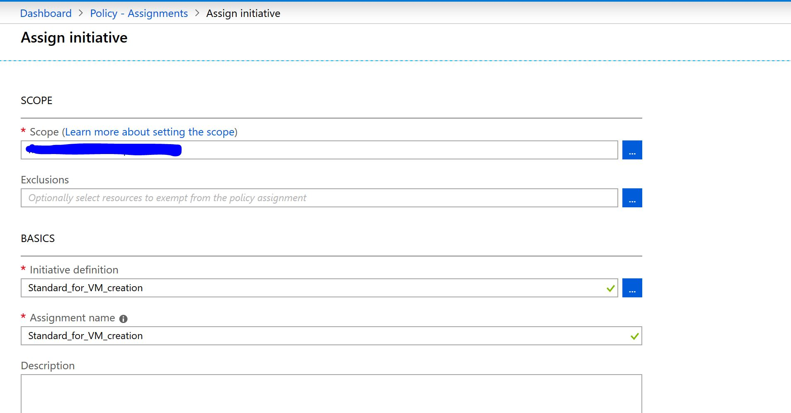

当 `Initiative` 生效后，我们可以

尝试创建一个F系列的VM，会出现如下报错：

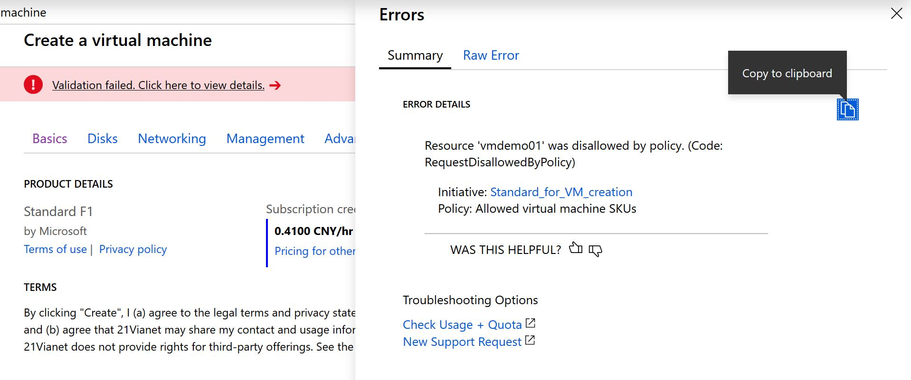

尝试创建一个D1_v2 VM， 且选择非托管磁盘，会出现如下报错：

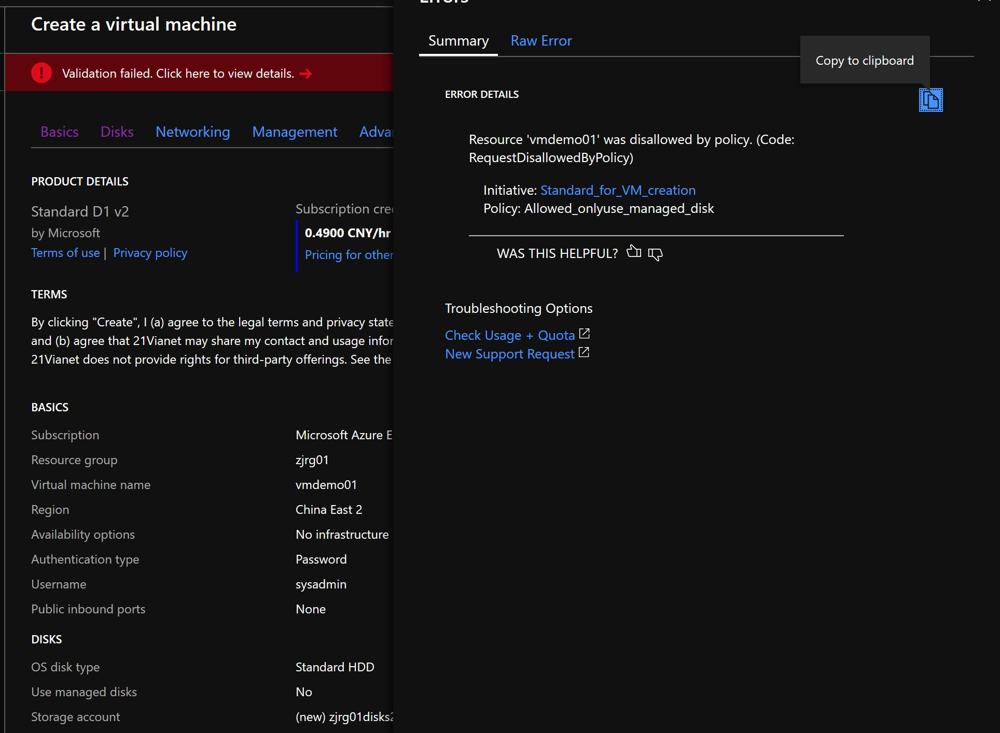

尝试创建一个DS1_v2 VM, 且磁盘选择Premium SSD，创建会成功，但在 `Policy -> Compliance`, 会提示如下结果：

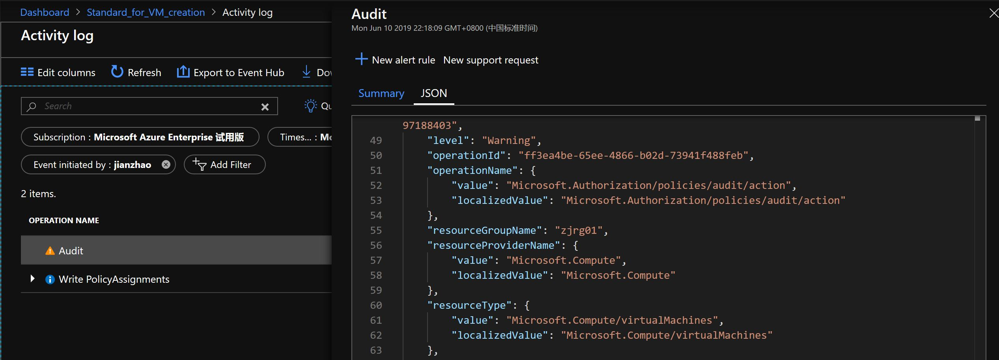

到目前为止，我们做了几个实验，其实有了一些体会，会发现，我们需要在灵活和规范中做些取舍，平衡，来达到更好的环境管理。

### 参考资料

- [Azure Policy 简介](https://docs.microsoft.com/zh-cn/azure/governance/policy/overview)

- [Azure Policy 结构](https://docs.microsoft.com/zh-cn/azure/governance/policy/concepts/definition-structure)

- [了解 Azure Policy 效果](https://docs.microsoft.com/zh-cn/azure/governance/policy/concepts/effects)

- [Azure Policy的一些Sample](https://github.com/Azure/azure-policy)

- [Azure China vs Global Azure REST API 终结点对照图](https://docs.microsoft.com/en-us/azure/china/resources-developer-guide)

