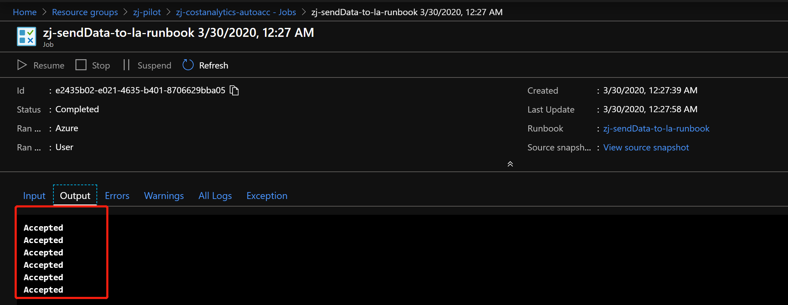
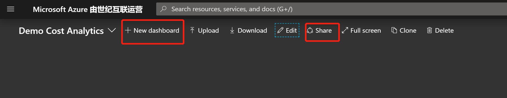

## 利用 Log Analytics，查询&分析 Azure 账单

最近兮爷喜欢上了乐高，每个周末都在拼乐高，难得这周有空把之前很久的一个想法试了一下。

`Log Analytics` 作为 Azure 上的日志中心, 可以将环境中的各种日志汇集在一起进行分析, 并制作监控大屏. 同时 `Log Analytics` 也支持自定义的数据, 可以通过 `REST API` 的方式将任何 `JSON` 的数据扔到 `Log Analytics` 里面做分析, 并汇总出来想要的图表.

今天, 我们就通过这个实验, 将 Azure Mooncake 的每月的详细账单文件的内容, 扔到 `Log Analytics` 里面做分析. 只需要下载账单, 上传到 Blob 中, 后续的所有流程都是自动化完成. 写了两个 `KUSTO Query` 在后面, 剩下的工作, 就留给大家 `DIY` 了. 也给大家留了另外一个 `DIY` 的空间, 其实整个流程做了一次是可以实现全部自动化的, 定时通过 `REST API` 下载账单文件, 扔到Blob里面, 这一个部分自动化的条件是具备的, 有 EA 账号的小伙伴可以自己去尝试一下.

所有相关的文档链接, 都可以去文末的参考资料中查看.

### 前期准备

我们需要去 EA Portal 下载需要分析的月份的账单的CSV文件. 下载好的文件保持文件名即可, 文件名并不需要特定成什么特殊的.

本次实验的文件, 取了一个名字 `demoCost.csv`

### 搭建账单文件导入到Log Analytics的工作流

#### 创建一个 Log Analytics workspace

创建了一个名叫 `zj-log02` 的 `Log Analytics workspace`, 后续所有账单的数据都是发送到这个 worksapce 里面.


#### 创建一个 Storage Account

创建一个名为 `zjcostanalytics` 的 Storage Account, 创建一个 `monthly-cost`


#### 创建一个 Automation Account

创建一个名为 `zj-costanalytics-autoacc`, 并创建一个名为 `zj-sendData-to-la-runbook` 的Runbook, 主要用来将上传的CSV文件中的内容进行相应的处理, 并发送到 Log Analytics workspace 中.


将 [sendDataToLogAnalytics.py](./files/200329/sendDataToLogAnalytics.py) 中的代码复制粘贴到 `zj-sendData-to-la-runbook` Runbook中.

在 Log Analytics 中, 找到相对应得 `Log Analytics ID & Key`, 并替换到代码中如下字段. 当然, 这段代码是 `Hard Code`, 因为比较懒, 感兴趣的可以把这部分内容换成 Runbook 的变量.


点击 `Save & Publish` 这个Runbook待用

#### 创建一个 Logic App

创建一个名为 `zj-costanalytics-logicapp`, 用来串起来一个工作流


在 Logic App Designer 里面, 选择 Trigger `When a blob is added or modified (properties only)`, 并选择需要 Monitor 的 `Storage Account`


选择 `monthly-cost` Container, 当有任何Blob更改的时候, 这个工作流就会触发


接下来, 添加一个 `Step Action`, 针对上传的Blob, 合成一个SAS Token, Automation Runbook就会通过SAS Token访问Blob的内容


由于我们没有办法知道每次上传的文件确切的名字, 所以我们就用变量代替


最后, 添加一个 `Step Action`, 触发一个 `Automation Job`


保存好 `Logic App` 之后, 就万事俱备, 准备开始我们的实验了.


#### 准备实验

将我们准备好的CSV文件 `demoCost.csv` 上传到 Storage Account 中


我们去 `Logic App`, 检查工作流, 发现已经触发完成


我们去 `Automation`, 检查 Job 的运行结果, 发现已经把数据发送到了 Log Analytics



#### 在 Log Analytics 中查询数据并制作花费大屏

我们先创建一个 Dashboard, 名为 `Demo Cost Analytics`, 并Share, 因为只有Share的Dashboard才能够放LogAnalytics的图标



我们进入 Log Analytics, 首先能够在左边查看到自定义的Table以及相应的字段


运行第一个查询语句, 查询按照每个服务的类别划分所花费的金额占比, 并钉在Dashboard中

```
TestCost_CL
| where Month_s == 6
| summarize sum(todouble(ExtendedCost_s)) by Meter_Category_s
```


运行第二个查询语句, 查看按照日期划分, 每天的花费

```
TestCost_CL
| where Month_s == 6
| summarize sum(todouble(ExtendedCost_s)) by Date_s
```


#### 有几点需要注意

- 第一次运行, 请耐心等待, Log Analytics中, 如果没有这张自定义的表及相应的字段,需要等较长的时间. 当这个Table&字段生成之后, 后续的数据发过去, 几乎是秒出

- 在字段设计上, 增加了一个字段叫做 `CostTableUpdated_d`, 是为了防止同一月份的账单不停的被上传, 需要拿最新一份数据, 大家写Query的时候可以充分利用

### 参考资料

- [使用 HTTP 数据收集器 API（公共预览版）将日志数据发送到 Azure Monitor](https://docs.azure.cn/zh-cn/azure-monitor/platform/data-collector-api)

- [下载使用量报告](https://docs.azure.cn/zh-cn/enterprise-agreement-billing/enterprise-agreement-billing-download-usage-report)