哈哈配图提醒一下广大看图的盆友们，马上七夕了，做好POE！

言归正传，当我们越来越多的在使用云服务，越来越多的应用放在云端，我们需要及时的了解云平台的状况，及时得到云平台出现问题的信息，及时拿到问题的反馈等等，我们需要一种手段来自动化的监视在云端的各项资源。就如同我们开的车一样，有各种各样的传感器，提示我们胎压是否正常，油量是否正常。今天我们将针对 `Global Azure`, 介绍一下如何通过 `Azure Service Health` & `Azure Resource Health` 来监控云平台的运行状况，并在出现问题时发送告警。

### Service Health

`Service Health` 可以帮助你了解Azure区域中各个服务的运行状况，及时通知你所在区域、所使用的服务是否存在平台的问题，及时了解Azure平台计划维护，及时掌握与你所使用服务有关的一些服务的更改或通知，比如：某些功能的弃用等。

`Service Health` 包含三个部分 ：

__*Service Issuses*__ , 即你所使用的区域，所使用的服务，是否出现了问题，以及近三个月来出现问题的历史记录及RCA报告; 当服务出现平台问题时，所有问题的调查进度及结果都会第一时间出现在这个地方。

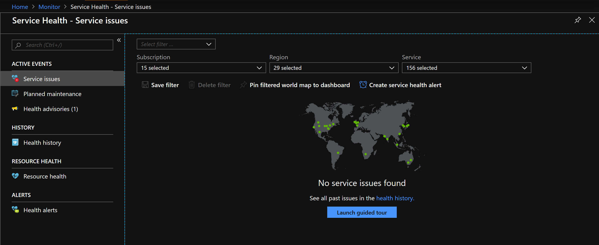

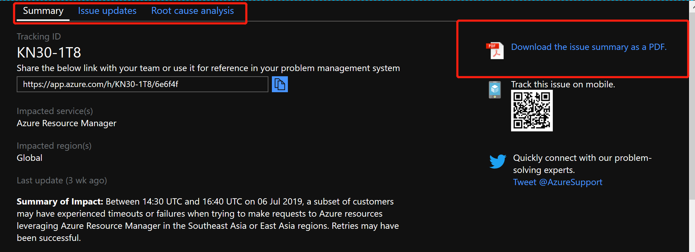

__*Planned maintenance*__ , 即平台针对某些服务计划的维护，需要通知用户的时候，都会将计划维护公告提前发布在这里，让客户提前做好相应的准备

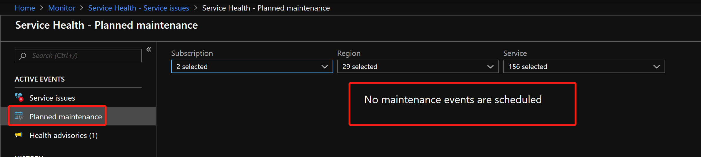

__*Health advisories*__ , 即平台针对某些服务的弃用或更改，或是需要用户 `Take Action` 的一些建议，都会发布在这里，提醒大家早做准备，例如前段时间的 `TCP SACK Panic`

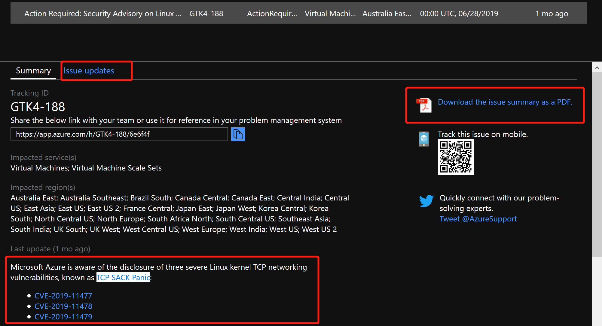

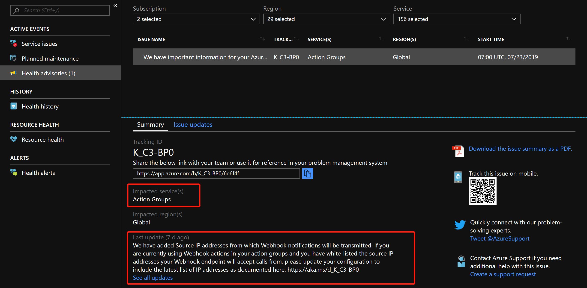

我们不可能一直盯着这些通告，需要设置警报来监控各个部分的通知，并在第一时间同时我们。接下来我们将设置一个针对于 `Service Issues` 的警报，当平台出现问题时，我的邮箱及手机会第一时间收到通知；警报的触发方式有很多，比如 `Email/SMS/Phone` & `Webhook` & `Azure Function/Logic Apps/Automation`，这里就不再赘述。

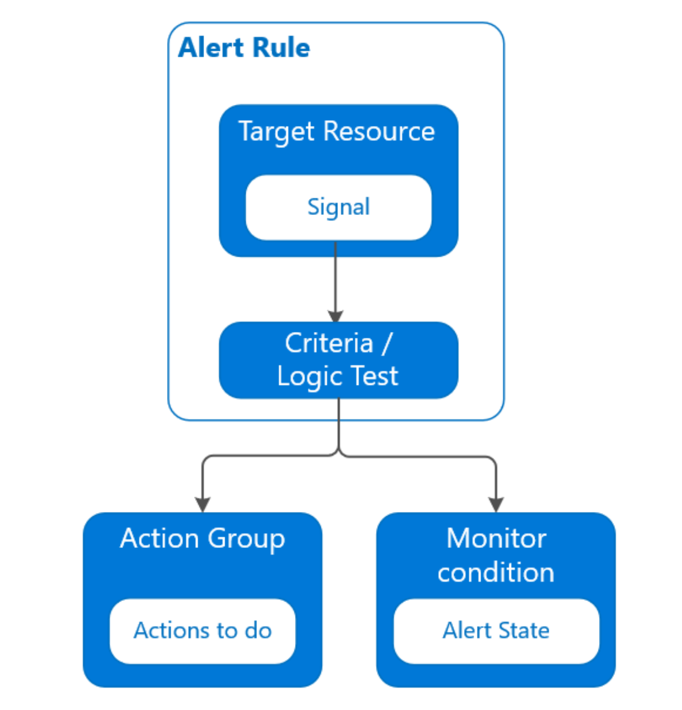

任何一个警报，都有几个关键的部分：所针对的资源 & 触发的条件 & 警报级别 & 所采取的操作

__*Step 1 创建 Action Group*__

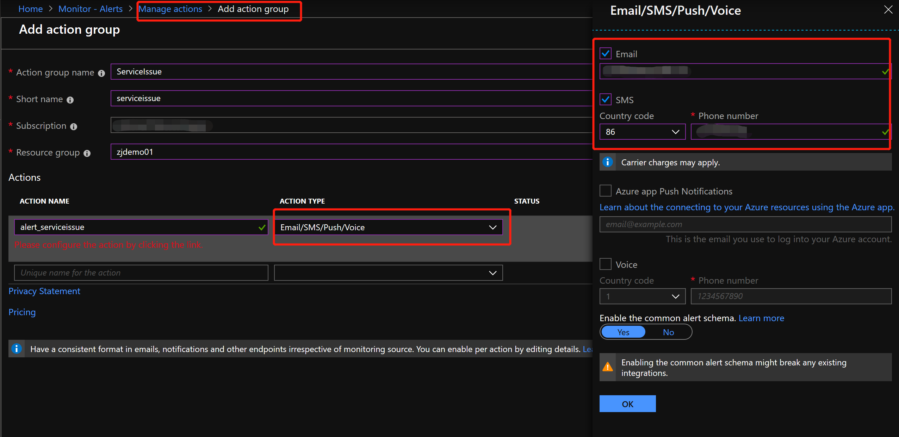

设置成功后，手机及邮箱会收到相应的通知

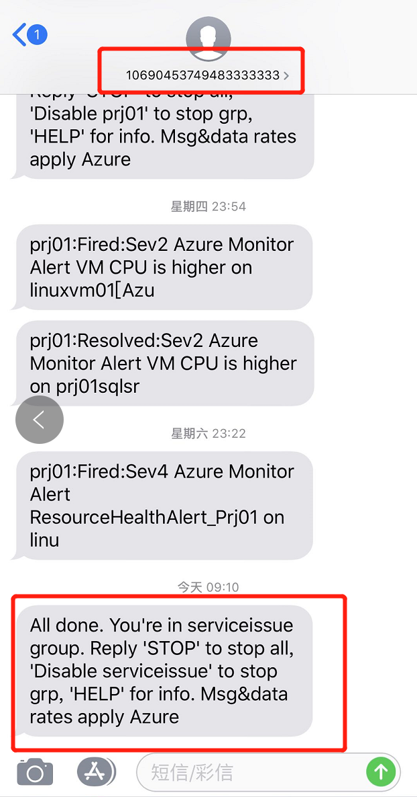

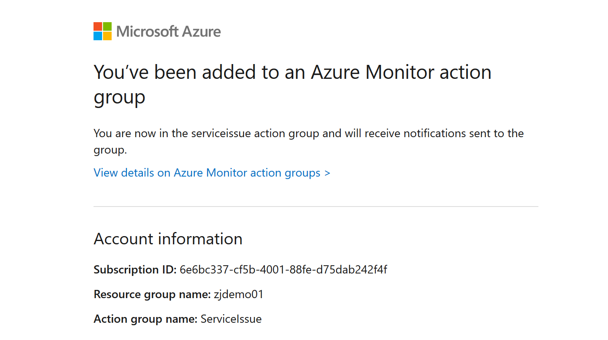

__*Step 2 创建 Service issues Alert*__

选定需要监控的`订阅`，`服务`，`区域`，`事件类别`，并设置 `Action Group`

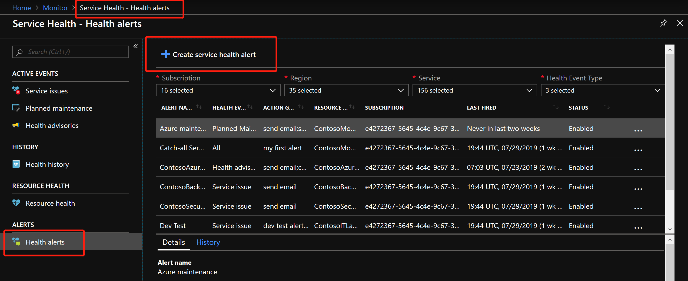

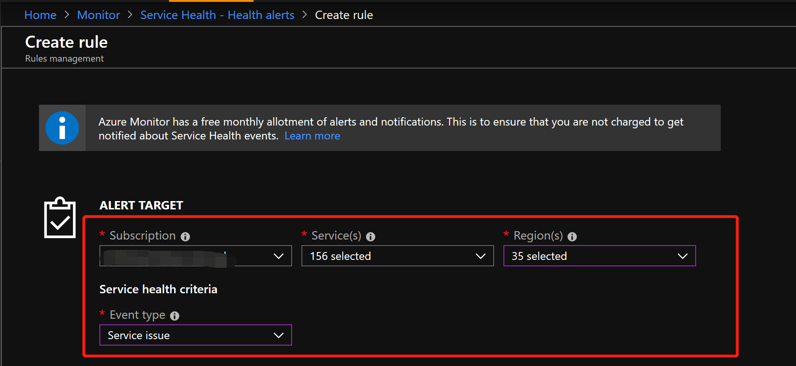

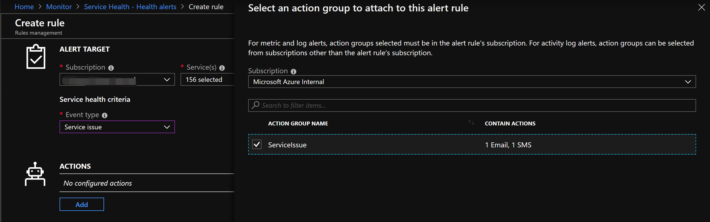

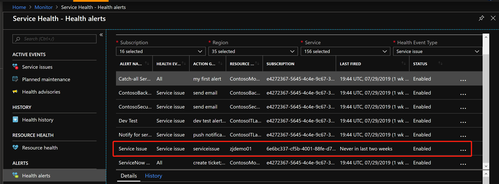

当下次出现平台问题时，你的邮箱及手机会第一时间收到告警。

### Resource Health

了解我们使用的每一个资源的可用状况，有助于帮助我们处理、定位环境中出现的问题。

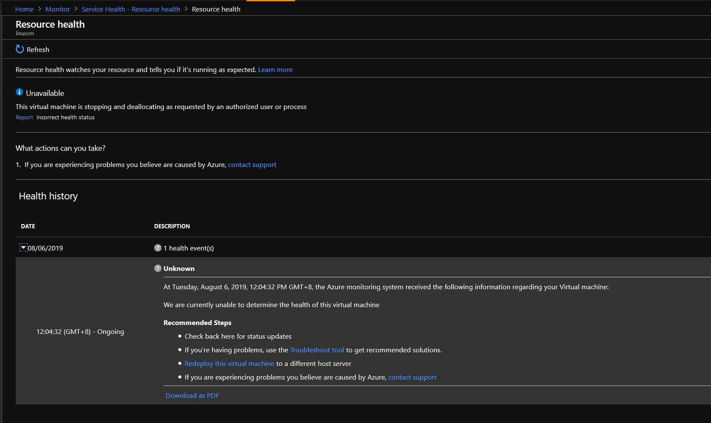

Azure资源会有四种状态

- `Available` 指你所使用的资源，目前是正常工作的，无论这个资源是虚机，数据库还是Web服务

- `Unavailable` 指你使用的资源变得不工作了，导致这种不工作会有两个状态，`Platform events` 平台问题导致的，`Non-platform events` 用户行为导致的

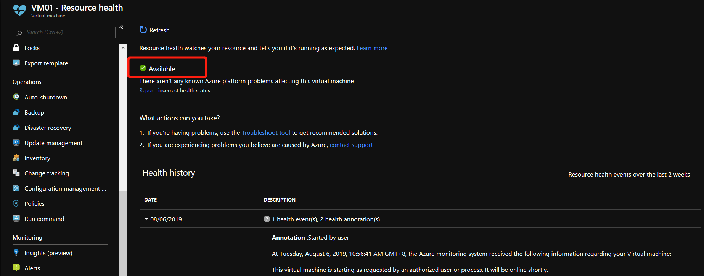

- `Unknown` 表示平台超过10mins未收到资源的信息，例如：长时间关闭VM等

- `Degraded` 表示虽然资源在运行，但性能下降，需要尽快查看资源是否出现问题

近14天的资源健康记录都可以在Azure Portal中查到


同样，我们需要为 `Resource Health` 设置告警，本次实验模拟 当某一资源组下的虚拟机从可用状态变为不可用时，就触发报警信息，通知相关人员

创建所需的 Template 请参阅 [monitor-resources-health.json](./files/190806/monitor-resources-health.json)

```
# 由于 Resource Health 无法通过 Portal 创建
#  本次实验通过 Azure CLI 结合 ARM Template 进行创建

# 获取ResourceID
az group show -n $yourRG --query id -o tsv

# 获取 Action Group ResourceID
az monitor action-group show -n $yourActionGroup -g $yourRG --query 'id' -o tsv

# 设置Resource Health的警报
az group deployment create --name ResourceHealth01 -g $yourRG --template-file monitor-resources-health.json --parameters activityLogAlertName="ResourceHealthAlert" --parameters '{ "scopes": {"value": ["$rgID"]}}' --parameters actionGroupResourceId='$actionGroupID'
```

这样，当我们去手动关停VM时，就会触发一个警报，这个警报同时会发到我设置的邮件及手机


### 参考资料

- [什么是 Azure 服务运行状况？](https://docs.microsoft.com/zh-cn/azure/service-health/overview)

- [服务运行状况概述](https://docs.microsoft.com/zh-cn/azure/service-health/service-health-overview)

- [资源运行状况概述](https://docs.microsoft.com/zh-cn/azure/service-health/resource-health-overview)

- [Azure Monitor Handson Lab](https://github.com/ericzhao0821/OCPChinaPTSALLDOCS/blob/master/03.Azure%E8%B5%84%E6%96%99%E5%90%88%E9%9B%86/%E5%8A%A8%E6%89%8B%E5%AE%9E%E9%AA%8C/CloudGovernance/Handson_Monitor.md)