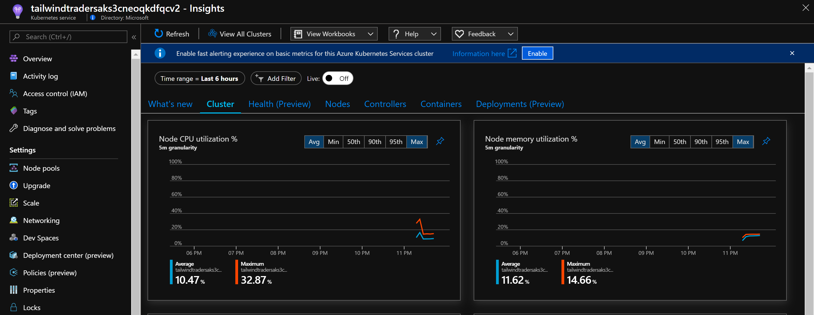

## 将 Prometheus 监控指标整合到 Azure Monitor, 丰富AKS监控

刚刚结束的 `Microsoft Ignite` 大会上, 有很多新的服务发布, 也有很多服务的功能GA, 其中就包括 `Azure Monitor 对于 Prometheus Metrics 的支持`. 目前, 针对托管的容器化服务 `AKS`, 除了能够通过 `Azure Monitor for Container` 提供第一方端到端的监控方案之外, 还能够将 `Prometheus 的指标`, 借助于 `Azure Monitor 的 Agent`, 收集到 `Azure Monitor` 中, 进行统一的展示, 极大的丰富了用户对于自定义指标监控的实现. 集成后, `Azure Monitor agent` 通过配置 `Prometheus 抓取指标的 Endpoint`, 将指标发送并存储到 `Log Analytics`, 不再需要额外的 `Prometheus Server`, 并能过与平台指标一起进行统一的分析.


接下来我们来看一下，如何将 `Prometheus Metrics` 集成到 `Azure Monitor` 中. 本次实验将使用 `Global Azure` 环境进行, 针对 `Prometheus 集成到 Azure Monitor` 的功能, 目前 `Azure China` 同样可以实现.

### 环境准备

#### Step 1 准备好 AKS 集群


#### Step 2 开启 AKS 集群的 Monitor 功能

在创建集群时，会提示用户是否打开Monitor功能, 如果环境中尚未打开Monitor功能, 需要先配置, 才能完成后续实验.

查看 AKS 集群的 Monitor Addon是否开启并配置相应的 Log Analytics workspace.




#### Step 3 安装 Grafana

最后我们将通过 Grafana 展示 Azure Monitor for Container 的监控大屏, Grafana 社区提供相应的大屏模板.

安装 Grafana 很简单, 请按照参考资料中的 `Grafana 在 Azure 中的安装` 进行.

```
# 获取 Grafana 的登陆密码
kubectl get secret --namespace default demo-grafana -o jsonpath="{.data.admin-password}" | base64 --decode ; echo

# 获取 Grafana 的登陆地址
kubectl get svc
```


#### Step 4 安装 Node Exporter & kube-state-metrics

Prometheus收集Kubernetes监控信息有很多个维度, 社区也提供了多个开源的exporter供用户选择；接下来, 我们将安装 Prometheus Node Exporter & kube-state-metrics, 来收集Kubernetes集群监控的信息

```
# 安装 Prometheus Node Exporter
helm install --name node-exporter stable/prometheus-node-exporter

# Git clone kube-state-metrics repo
git clone https://github.com/kubernetes/kube-state-metrics.git
cd kube-state-metrics/

# 安装 kube-state-metrics
kubectl apply -f ./examples/standard/
```


### 配置 Prometheus 与 Azure Monitor 集成

Azure Monitor 通过 `OMSAgent` 收集 `Nodes & Containers` 相关监控信息, 并将收集到的指标及日志传送到 `Azure Monitor`. AKS中, `OMS Agent` 以 DaemonSet 的形式运行, 相对应的配置文件可以通过 ConfigMap的方式进行挂载.


我们通过 `omsagent_configmap.yml` 创建 ConfigMap, 来自定义 `OMS Agent` 配置, 指定抓取 `Prometheus 指标的 Endpoint`.

默认 AKS 是不收取 `kube-system` namespace中的日志, 但很多时候我们还是需要查看这里的日志, 更改时可以顺手把这部分改掉, 改成收集 `kube-system` 日志.


通过添加 Endpoint, 指定收集 `Node Exporter & kube-state-metrics`的指标, 完整的配置文件请参阅 [omsagent_configmap.yml](./files/191207/omsagent_configmap.yml)


将新的OMS Agent ConfigMap应用到集群中

`kubectl apply -f ./files/aks_monitor_files/omsagent_configmap.yml`

我们回到 Azure Monitor Log Analytics, 查看是否能够查到 Prometheus 相应的数据

```
# KUSTO 查询语句
InsightsMetrics
| where Namespace == 'prometheus'
```


导入 Grafana 模板


导入完成之后, 这里 Grafana 目前针对于 Log Analytics 有个Bug, 只会默认选择第一个workspace, 导致所有数据显示不出来, 我们需要手动更改保存, 按如下页面进行更改


最终我们会得到如下的完整视图, 通过此视图，对于帮助我们了解整个集群的运行情况还是非常有帮助的.


经过上面一个小的实验我们可以看到, 原本 Prometheus 开源监控方案与Azure Monitor监控方案各有差别，如下：


现在, 将Prometheus整合到Azure Monitor后, 可以让我们针对于AKS的监控解决方案更加完整, 对于集群的管理维护更加的高效.

### 参考资料

- [文中示例 Tailwind Traders 环境的部署指导](https://github.com/microsoft/ignite-learning-paths-training-apps/blob/master/apps40/README.md)

- [Grafana 在 Azure 中的安装](https://github.com/ChinaOcpPTS/OCPChinaPTSALLDOCS/blob/master/03.Azure%E8%B5%84%E6%96%99%E5%90%88%E9%9B%86/%E5%8A%A8%E6%89%8B%E5%AE%9E%E9%AA%8C/CloudGovernance/Monitor/Prerequisite%20-%20%E5%AE%B9%E5%99%A8%E5%8C%96%20Grafana%E7%8E%AF%E5%A2%83.md)

- [Azure 容器监控动手实验](https://github.com/ChinaOcpPTS/OCPChinaPTSALLDOCS/blob/master/03.Azure%E8%B5%84%E6%96%99%E5%90%88%E9%9B%86/%E5%8A%A8%E6%89%8B%E5%AE%9E%E9%AA%8C/CloudGovernance/Monitor/Handson%20-%20Azure%20%E5%AE%B9%E5%99%A8%E7%9B%91%E6%8E%A7.md)

- [将抓取的 Prometheus 度量值配置为用于容器的 Azure Monitor](https://docs.microsoft.com/zh-cn/azure/azure-monitor/insights/container-insights-prometheus-integration)

- [Grafana模板 Azure Monitor for Containers - Metrics](https://grafana.com/grafana/dashboards/10956)

- [Azure Monitor Handson Lab](https://github.com/ChinaOcpPTS/OCPChinaPTSALLDOCS/tree/master/03.Azure%E8%B5%84%E6%96%99%E5%90%88%E9%9B%86/%E5%8A%A8%E6%89%8B%E5%AE%9E%E9%AA%8C/CloudGovernance/Monitor)