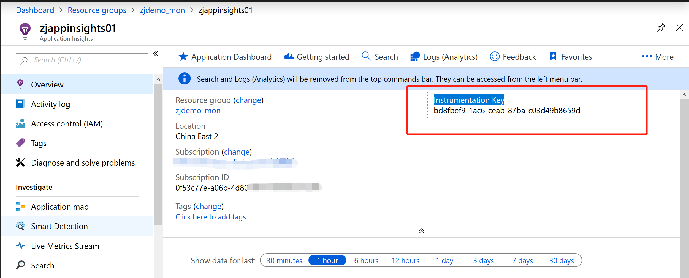

## 聊聊Application Insights中功能之可用性监控

前段时间有小伙伴在使用 `Azure Mooncake` 上的 `Application Insights` 时候发现，针对于网站可用性的 `URL Ping Test`, 创建方法与 `Global Azure` 有些差别


相比于 `Global Azure`, 这里提供了一种更为自助的方式来完成 `URL Availability Test` 的工作，通过 `Azure Function`. 你可以在更为灵活的去安排测试点的分布，而不再局限于`Azure`提供的预制的测试点位置；如果是 `Azure Mooncake`, 想要测试国内的网站可用性，你可以创建两个 `Azure Function`, 位于 `China East 2` & `China North 2`， 来监测你的网站对于`北方&南方`的客户是否都可用；如果站点位于 `Global Azure`, 你也可以在任意拥有 `Azure Function` 的创建测试，选择你服务的地区，测试站点的可用性。

接下来，我就拿 `Bing.com` 为例，来测试其可用性。

### Step 1 创建 Application Insights

预先准备好 Application Insights, 准备好 `Instrumentation Key`



### Step 2 创建 Time Trigger 的 Azure Function

关于 Time Trigger 的 Azure Function 的详细解释请参照参考资料

__**创建 `App Service Plan`**__

由于 Function App 支持的另外一种付费模式 `Consumption Plan` 只有 `China North` 可选，所以暂时先使用 `App Service Plan` 来完成；


__**创建 `Function App`**__


__**创建 `添加 Time Trigger Function`**__


### Step 3 定制化网站可用性测试的代码

我们先回到刚才创建好的 `Application Insights` 实例，进入 `Availability`, 选择 `+ Add Test`, 你会找到一整段完成的示例代码


这段代码实现了 `针对指定的URL链接，发送HTTP Request，并拿到返回结果，将返回结果中的 return code & response body，与你预先指定的进行比对，如果一致，证明网站可用，如果不一致，证明网站不可用，并通过Application Insights的SDK将数据发送到Application Insights`

这里只提供了`C#`的代码，且逻辑功能比较简单，小伙伴们完全可以增加逻辑，或者使用`Java/Node.js`的 `Application Insights SDK` 来完成这个功能。

我们需要对这段示例代码做些修改，针对我们要测试 `Bing.com` 网站的可用性

```
# 需要将 EndpointAddress 的地址改为中国区用来做 Application Insights TelemetryChannel 的Endpoint
new TelemetryConfiguration(InstrumentationKey, new ServerTelemetryChannel() { EndpointAddress = "https://dc.applicationinsights.azure.cn/v2/track" });
```

```
# 需要确保 URI 为你想要测试的URI，contentMatch为你发送HttpRequest后返回的ResponseBody中的content，这里我们希望得到的ResponseCode默认为CRUD的成功返回，即Get为200
await AvailabilityTestRun(
        name: testName,
        location: location,
        uri: "https://cn.bing.com",
        contentMatch: "",
        log: log
);
```

我们来看一下判断的逻辑，其实非常简单，默认我们标记网站的可用性为`False`；然后我们发起HTTPGet访问，如果ResponseCode为200，且ResponseBody中的Content与contentMatch对的上，我们就标记网站的可用性为`True`


当然，在这个Demo中，我们只测试了ResponseCode这一个值；在正常的网站可用性检测时，合理的做法是网站或应用会留一个CheckHealth的API接口，并有相应的返回值，可以调用此链接进行测试，但同时需要注意调用时的一些TimeOut等特殊情况的判断。

### Step 4 添加项目编译文件

添加名为 `function.proj` 的文件，这个文件主要是用来辅助编译 `run.csx` 时需要用到的一些包文件


```
<Project Sdk="Microsoft.NET.Sdk">
    <PropertyGroup>
        <TargetFramework>netstandard2.0</TargetFramework>
    </PropertyGroup>
    <ItemGroup>
        <PackageReference Include="Microsoft.ApplicationInsights.AspNetCore" Version="2.6.1" />
    </ItemGroup>
</Project>
```


### Step 5 添加 Azure Function 的环境信息

实验环境中，有两个系统变量是需要设置的

__**APPINSIGHTS_INSTRUMENTATIONKEY**__ 主要用来发送数据到 `Application Insights`


__**TEST_LOCATION**__ 主要用来标记测试点的位置


### Step 6 调整 Azure Function 的运行时间，每一分钟运行一次


接下来，我们需要的就是耐心的等待，等待数据慢慢的积累起来，吃好晚饭回来看一下 `Bing.com` 的可用性


### 参考资料

- [在 Azure 中创建由计时器触发的函数](https://docs.azure.cn/zh-cn/azure-functions/functions-create-scheduled-function)

- [中国区 替代默认终结点的 Application Insights](https://docs.azure.cn/zh-cn/azure-monitor/app/custom-endpoints)