## 聊聊大月饼上的AKS容器监控

马上要到中秋了，给大月饼再贡献一篇文章，聊聊Azure Monitor针对AKS原生的监控，能够做哪些事情。配图有新意！

Kubernetes大热，也带火了容器平台的监控，Prometheus。很多人一提到Kubernetes监控，第一个想到的，也是目前很多公司在用的，就是基于Prometheus的监控方案

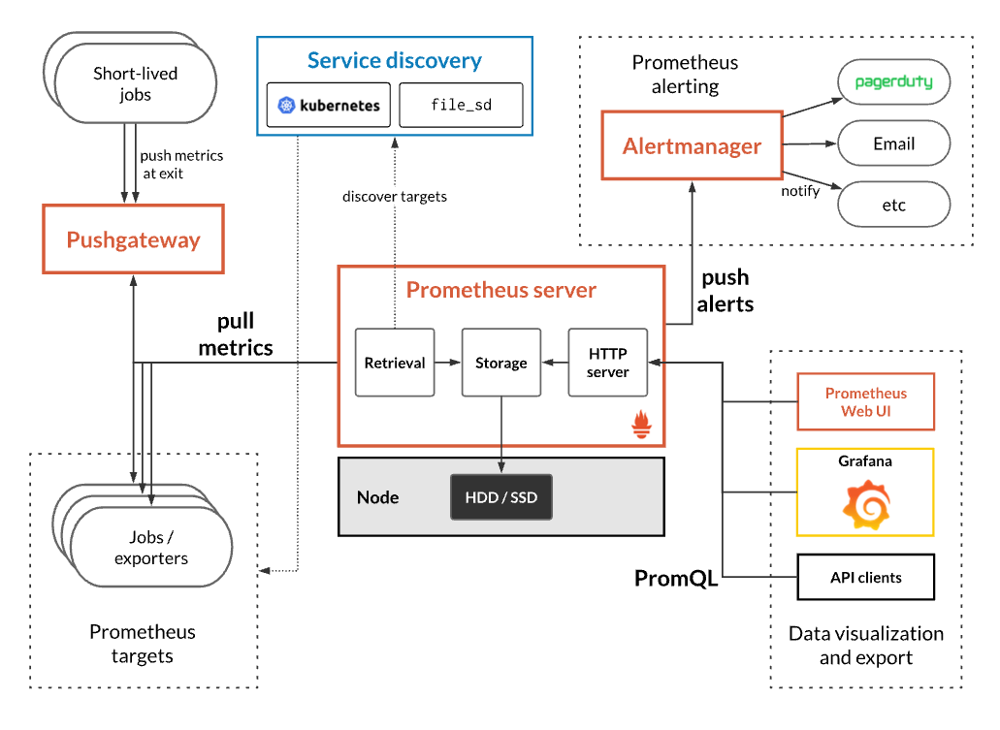

如果还要收集 `Logs`, 就会想到 `Prometheus + EFK/ELK` 的解决方案

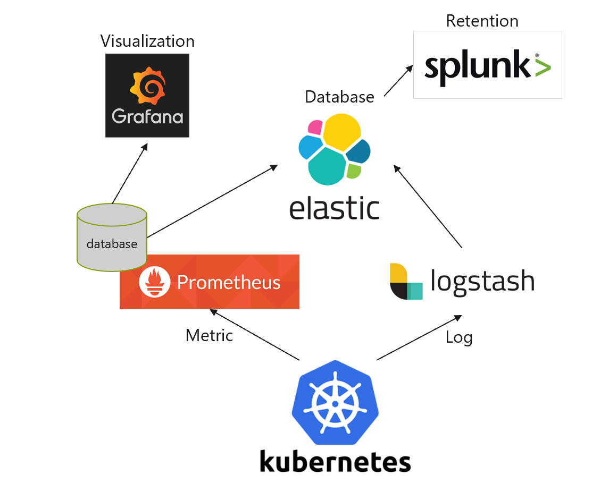

以上的开源解决方案在Azure中当然可以由用户去自由构建，并自主管理，我之前也写了一篇博客介绍此解决方案 [搭建基于Prometheus&EFK的监控平台，时刻掌握AKS集群动向](./搭建基于Prometheus&EFK的监控平台，时刻掌握AKS集群动向.md)

今天这篇文章，主要介绍的是基于Azure平台的监控，来实现容器集群的监控。毕竟如果平台原生已经提供了针对容器化监控的解决方案，对于很多公司来说，就可以借用这些平台监控手段，而无需再另外构建。

我简单列举了一下，在Azure上，监控容器平台不同维度可以用到的服务, 并列举了 `Prometheus` 与 `Azure Monitor for Container` 两种方案的对比

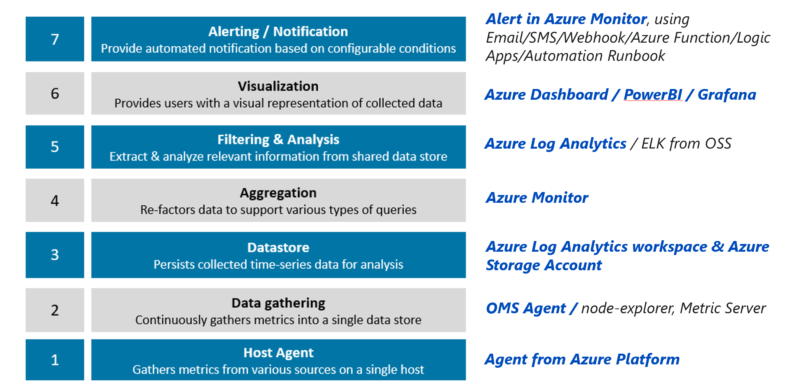

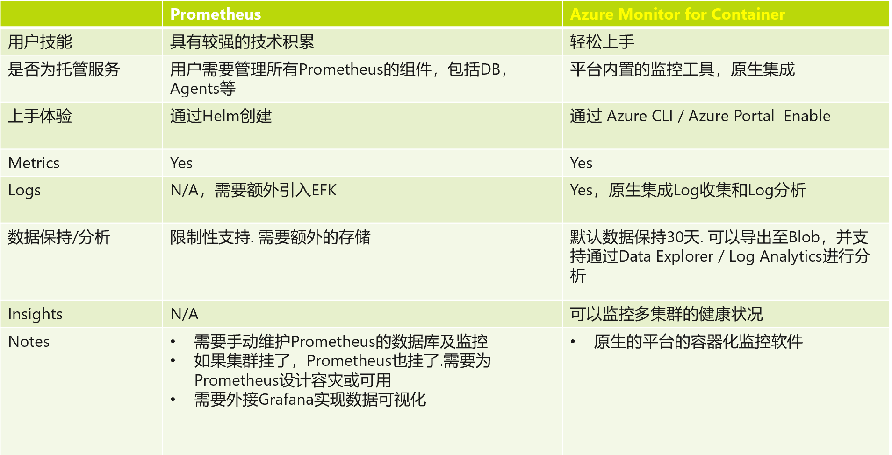

### 前提准备

本次实验之前，你需要准备要一个可用的AKS集群，且创建集群时，打开`Monitoring Addon`，同时，随便创建一个`Deployment`，主要是为了用于后续的监控。

### 定制好的整套监控大屏

AKS默认定制好了一套完整的监控大屏，通过 `Monitoring - Insights`, 我们可以了解整个集群 `节点CPU负载` & `节点内存负载` & `集群中节点状态` & `集群中Pods状态`

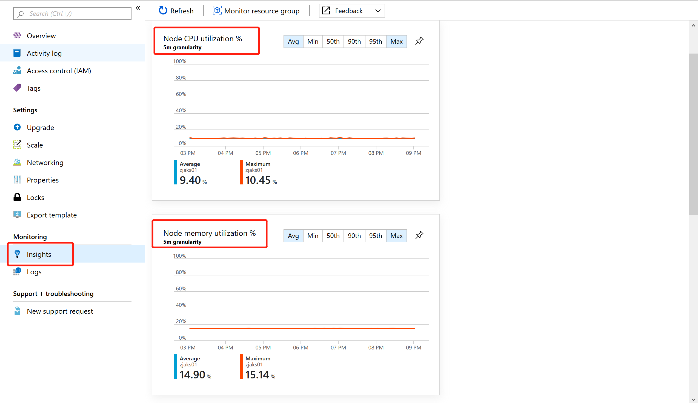

可以 `Drill down` 到每个节点，查看到每个节点的详细信息，以及每个节点中所运行的容器所占用的`CPU&Memory`等信息

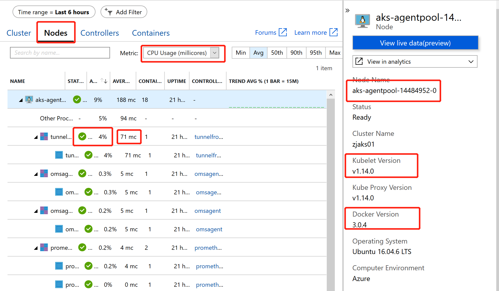

可以 `Drill down` 到每个Container，查看到每个容器的详细信息

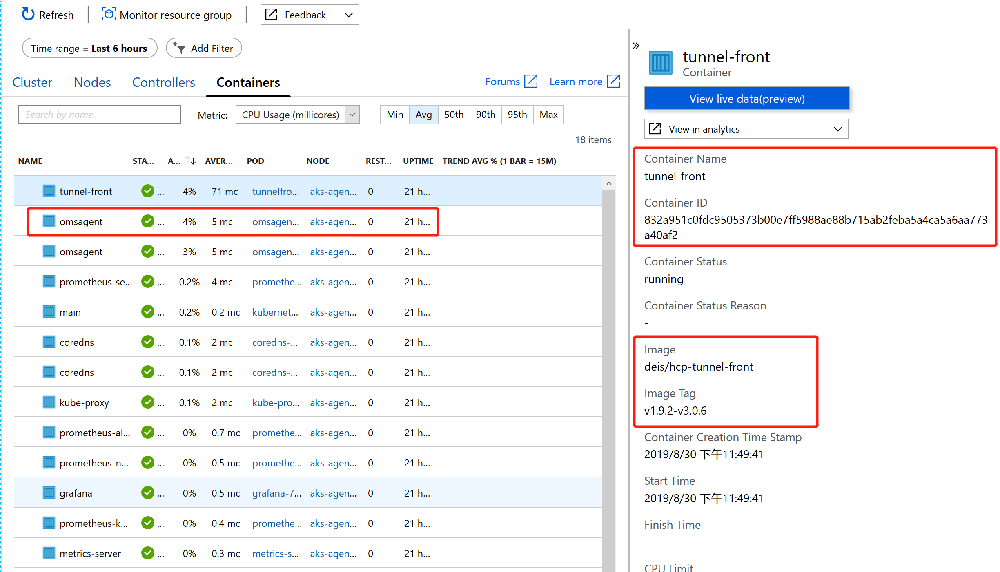

同时，可以在Portal中实时查看容器中的日志

```
# 注意 ：如果集群中已经开启了RBAC，需要额外创建ClusterRoleBinding，以确保能够读取到日志数据
apiVersion: rbac.authorization.k8s.io/v1 
kind: ClusterRole 
metadata: 
   name: containerHealth-log-reader 
rules: 
   - apiGroups: [""] 
     resources: ["pods/log", "events"] 
     verbs: ["get", "list"]  
--- 
apiVersion: rbac.authorization.k8s.io/v1 
kind: ClusterRoleBinding 
metadata: 
   name: containerHealth-read-logs-global 
roleRef: 
    kind: ClusterRole 
    name: containerHealth-log-reader 
    apiGroup: rbac.authorization.k8s.io 
subjects: 
   - kind: User 
     name: clusterUser 
     apiGroup: rbac.authorization.k8s.io
```

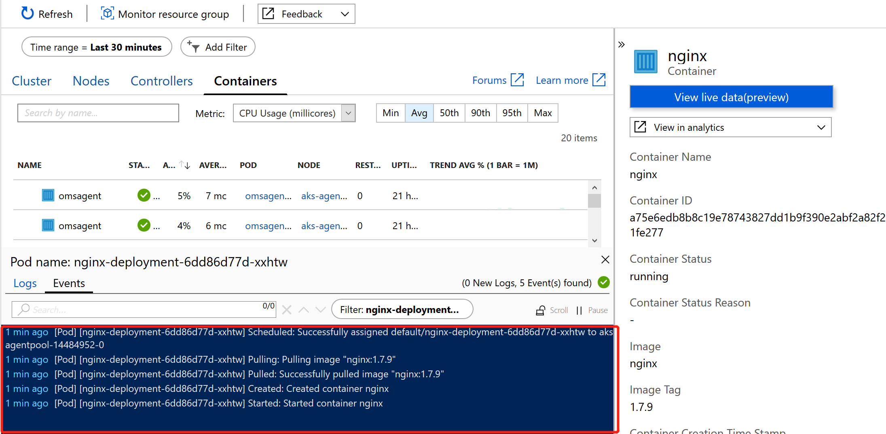

### 收集 kube-system Namespace 下的容器日志

默认情况下，`kube-system`下的容器日志收集是禁止的，但我们可以通过配置方式，收集`kube-system`下的日志数据

我们通过如下文件，创建一个 `configmap`, 这个 `configmap` 会更新 `omsagent` 的配置信息，从而开始收集 `kube-system` 下的日志

```
kind: ConfigMap
apiVersion: v1
data:
  schema-version:
    #string.used by agent to parse config. supported versions are {v1}. Configs with other schema versions will be rejected by the agent.
    v1
  config-version:
    #string.used by customer to keep track of this config file's version in their source control/repository (max allowed 10 chars, other chars will be truncated)
    ver1
  log-data-collection-settings: |-
    # Log data collection settings
    [log_collection_settings]
       [log_collection_settings.stdout]
          # In the absense of this configmap, default value for enabled is true
          enabled = true
          # exclude_namespaces setting holds good only if enabled is set to true
          # kube-system log collection is disabled by default in the absence of 'log_collection_settings.stdout' setting. If you want to enable kube-system, remove it from the following setting.
          # If you want to continue to disable kube-system log collection keep this namespace in the following setting and add any other namespace you want to disable log collection to the array.
          # In the absense of this configmap, default value for exclude_namespaces = ["kube-system"]
          # exclude_namespaces = ["kube-system"]
       [log_collection_settings.stderr]
          # Default value for enabled is true
          enabled = true
          # exclude_namespaces setting holds good only if enabled is set to true
          # kube-system log collection is disabled by default in the absence of 'log_collection_settings.stderr' setting. If you want to enable kube-system, remove it from the following setting.
          # If you want to continue to disable kube-system log collection keep this namespace in the following setting and add any other namespace you want to disable log collection to the array.
          # In the absense of this cofigmap, default value for exclude_namespaces = ["kube-system"]
          # exclude_namespaces = ["kube-system"]
       [log_collection_settings.env_var]
          # In the absense of this configmap, default value for enabled is true
          enabled = true
  agent-settings: |-
    # agent health model feature settings
    [agent_settings.health_model]
      # In the absence of this configmap, default value for enabled is false
      enabled = false
metadata:
  name: container-azm-ms-agentconfig
  namespace: kube-system
```

### 收集 kube-apiserver / kube-scheduler / kube-controllermanager 的日志信息

我们都知道 AKS 是托管的Kubernetes集群，Master相关的组件是托管给Azure的，为了更好的了解 Master 节点的状态，我们可以设置收集主节点中主要Component的日志，来进行分析。收集 `kube-apiserver / kube-scheduler / kube-controllermanager` 很简单，只需要配置诊断日志即可。

进入AKS集群所在的资源组，并设置诊断日志， 诊断日志建议保存在`SA & LA`各一份，LA用于近期内的分析，SA用于长期保存。

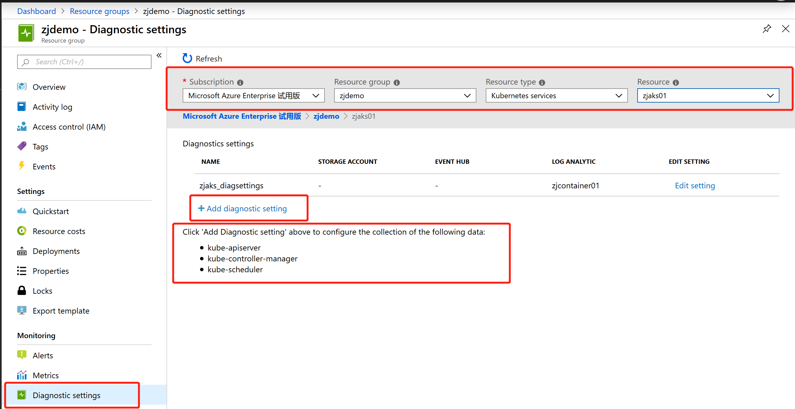

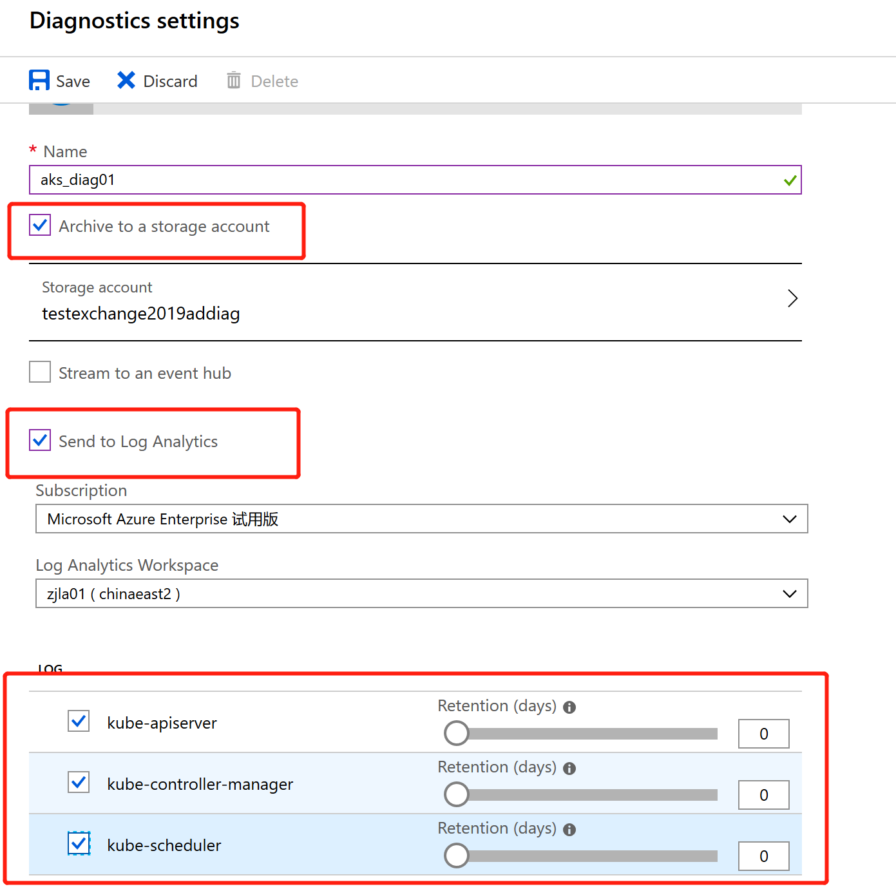

设置完成后，经过一段时间的初始化，你就可以在设置的 `Log Analytics Workspace` 中查看日志了

```
AzureDiagnostics
| where Category == "kube-apiserver"
| project log_s
```

**ToBeDone**

### 通过 Log Analytics，丰富展示内容

`omsagent`收集并发送到`Log Analytics`的数据内容非常丰富，可以帮助用户建立多维度的查询，如下是部分收集数据的截图，详情请参照 [容器记录](https://docs.microsoft.com/zh-cn/azure/azure-monitor/insights/container-insights-log-search#container-records)

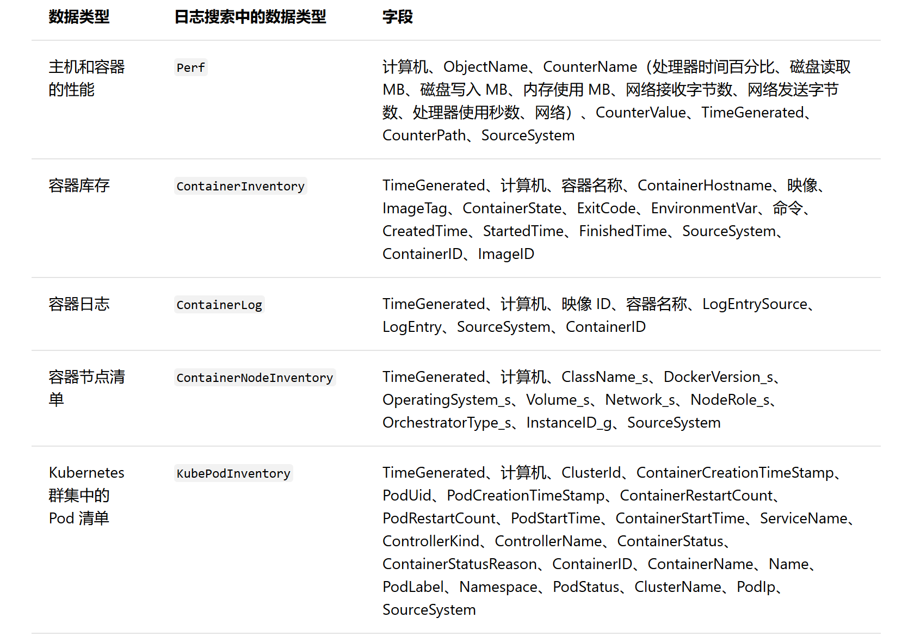

以下列举一些常见的Demo查询，大家可以根据自己的需要，查询自己需要的数据

#### 查看容器所占用的CPU

```
Perf
| where ObjectName == "K8SContainer" and CounterName == "cpuUsageNanoCores" 
| summarize AvgCPUUsageNanoCores = avg(CounterValue) by bin(TimeGenerated, 30m), InstanceName
```

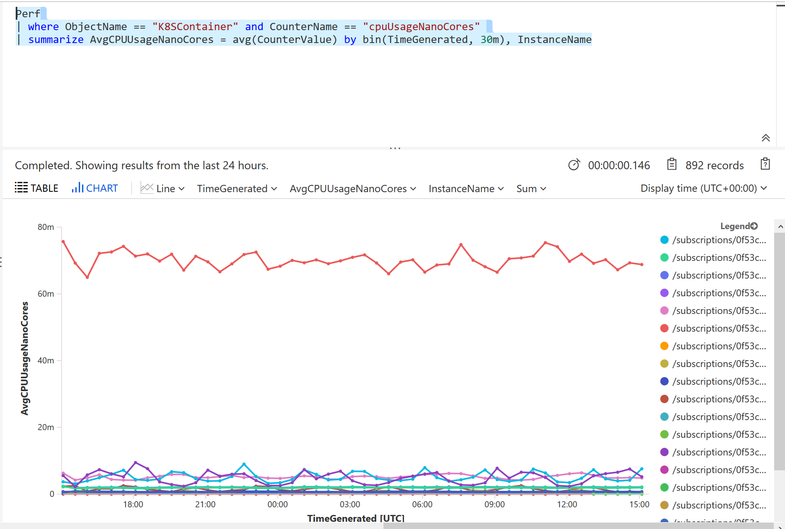

#### 查看环境中容器运行的状态

```
ContainerInventory
| where TimeGenerated >= ago(30m)
| summarize AggregatedValue = dcount(ContainerID) by ContainerState
```

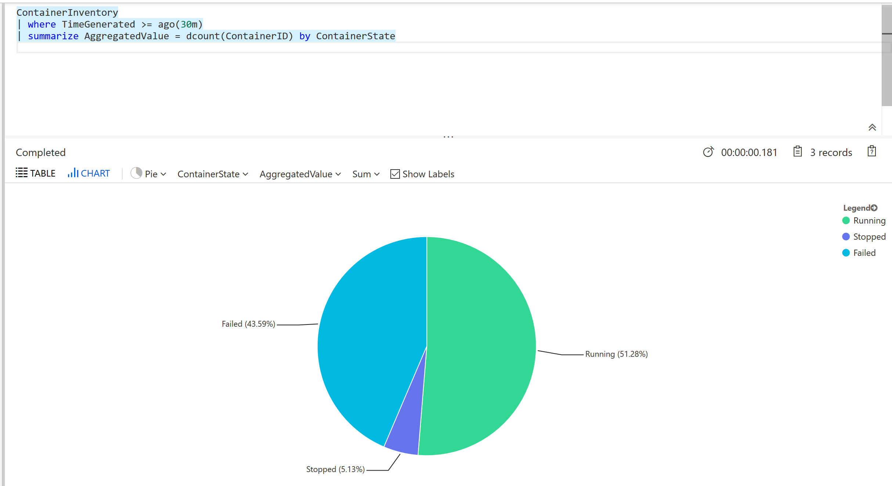

#### 查看环境中各工作节点的磁盘容量

```
let selectedStateDisks = dynamic(["*"]);
let data = InsightsMetrics
| where Origin == 'container.azm.ms/telegraf'
| where Namespace == 'disk' or Namespace =~ 'container.azm.ms/disk'
| where Name == 'used_percent'
| extend Tags = todynamic(Tags)
| extend HostName = tostring(Tags.hostName), Device = strcat('/dev/', tostring(Tags.device))
| extend NodeDisk = strcat(HostName, Device)
| where "*" in ('*') or HostName in ('*')
| where "*" in ('*') or Device in ('*')
| where NodeDisk in (selectedStateDisks) or '*' in (selectedStateDisks);
let mostUsedDisks = data
| top-nested 100 of NodeDisk by MaxVal = max(Val);
data
| where NodeDisk in (mostUsedDisks)
| make-series ['Used Disk %'] = max(Val) default = 0 on TimeGenerated from ago(21600s) to now() step 10m by NodeDisk
```

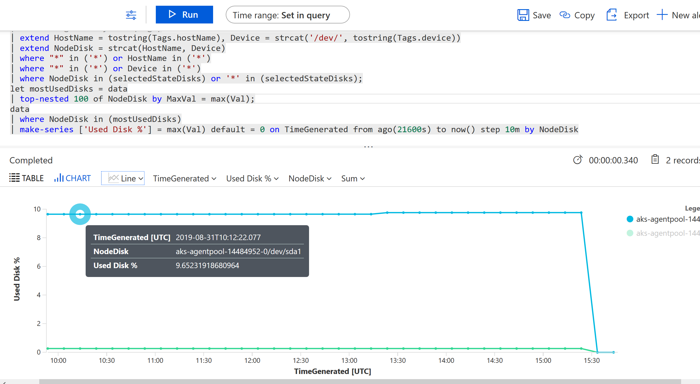


### 收集 Prometheus 得数据，并通过 oms-agent 发送至 LA

**ToBeDone**

---

很多企业今天的环境都会是跨云或者多云的，如果希望将云环境中的监控数据放到一个统一的系统中进行管理，`Grafana`将会是一个非常不错的选择。今天，`Grafana`原生集成了`Azure Monitor`的模块，大家只需要通过简单的配置，就可以将`Azure Monitor & Azure Log Analytics & Azure Application Insights`中的数据直接对接到Grafana中，在接下来，我会在另外一篇文章中给大家举例，大家也可以查阅官方文档 [在 Grafana 中监控 Azure 服务](https://docs.microsoft.com/zh-cn/azure/azure-monitor/platform/grafana-plugin)