本篇文章主要介绍, 当我想开启 `Azure Security Center`, 保护云端资源时, 我该如何做

### Step 1 你需要设置一个 Azure Policy

设置 Azure Policy 是第一步, 设置 Policy 的目的为了能够直观的看到, 哪些 VM 安装了 Monitor Agent, 被 Security Center 接管了, Azure Policy 会不断的验证环境中的 VM 状态, 无论是现有的 VM, 还是新创建的 VM, 这样我们通过定期的Review, 可以确保环境中的重要机器都已经被Security Center所管理. 

Azure Policy 已经包含了很多写好的规则，帮助我们快速去进行设置.

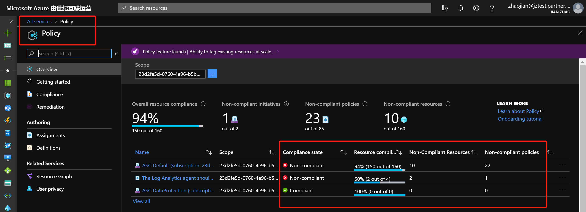

点击 `Definitions`, 找到 `The Log Analytics agent should be installed on virtual machines`, 点击进入

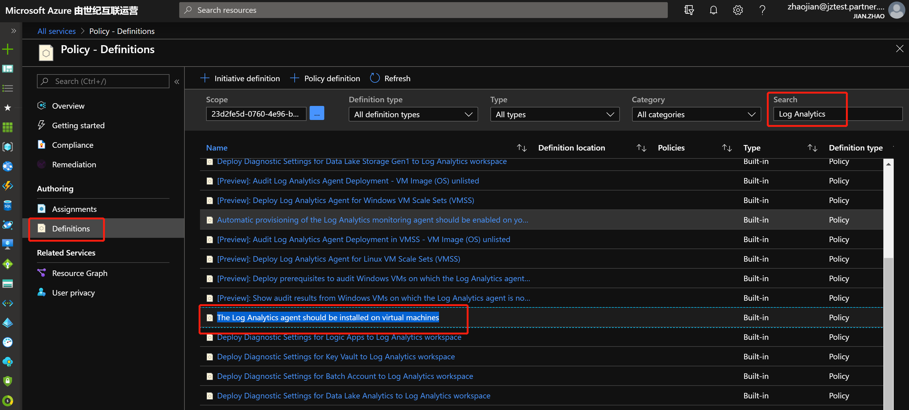

点击 `Assign`, 我们将这个 Policy 应用到 Subscription. 目前 Policy支持应用在 `Management Group`, `Subscription`, `Resource Group`.

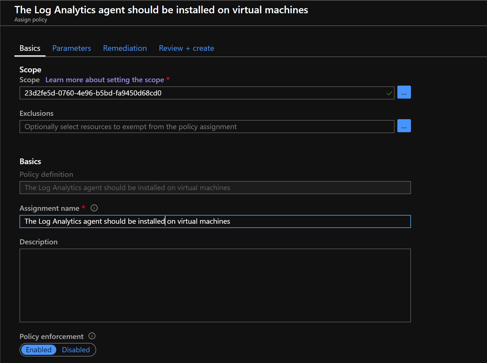

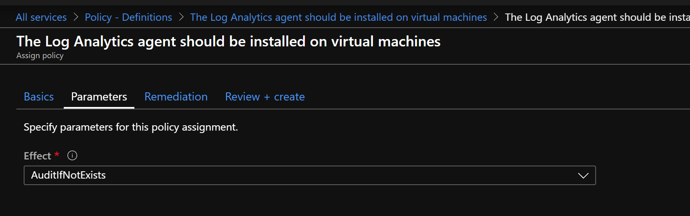

设置完成后, 需要一段时间生效, 生效后我们可以看到他就会自动筛选出环境中 Compliant / Non-Compliant 的资源

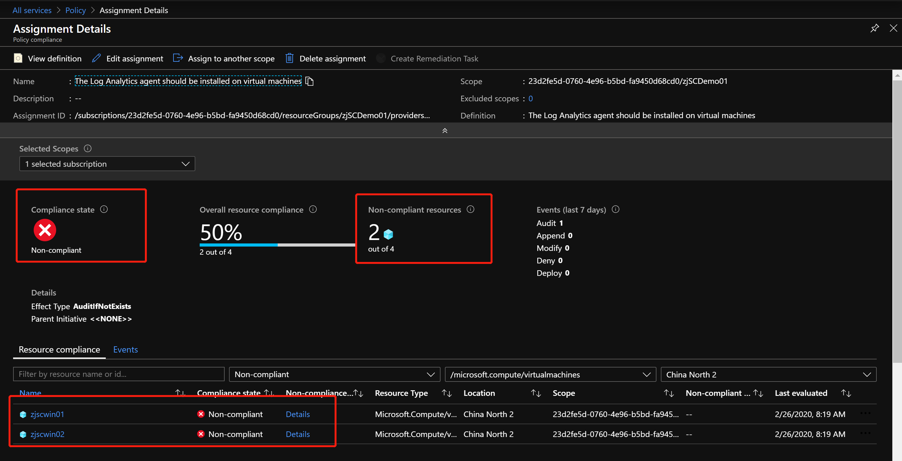

随后, 当我们创建一台新的Linux机器时, 也会提示目前环境中没有安装相应的Agent

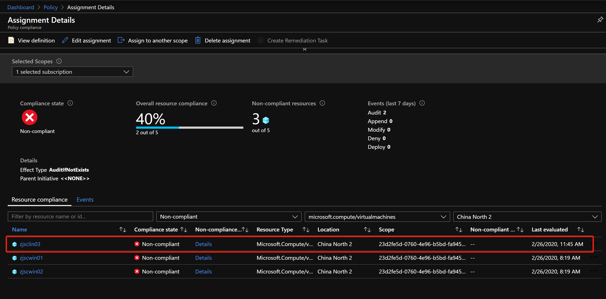

### Step 2 你需要创建一个 Log Analytics 的 workspace

虽然, 第三步中全自动安装方式, 会创建默认的workspace, 但是默认workspace的命名是系统默认的, 可读性差, 还是切换到自定义的workspace, 能够更好的存储管理监控数据, 也便于后续的监控数据统一化分析.

创建 `workspace` 非常简单, 按照建议命名标准, 本次 `workspace` 叫做 `la-cne2-monitor-infralog`

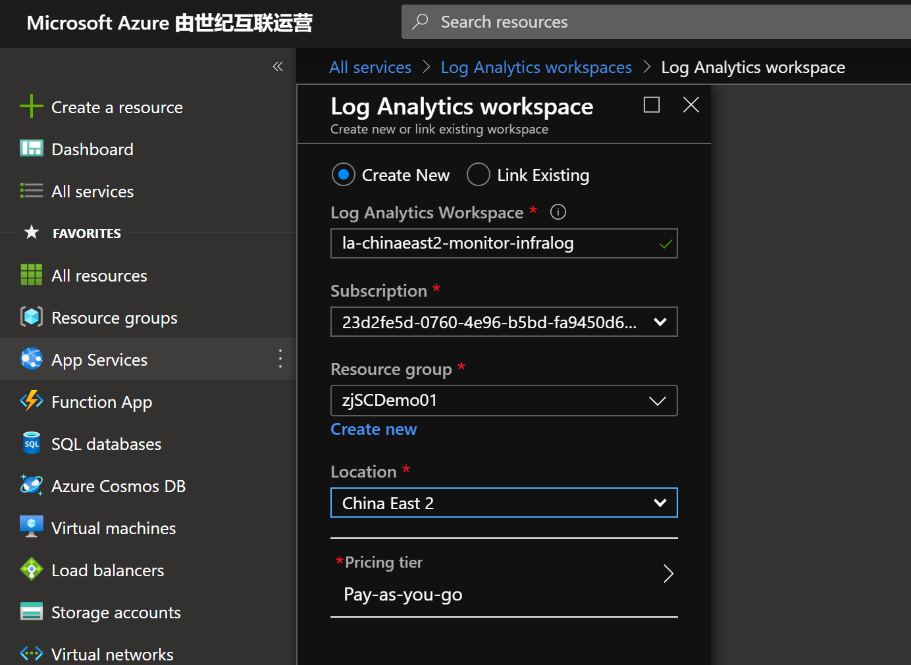

### Step 3 你需要选择订阅下全部VM安装 Monitor Agent, 还是只针对生产环境中的机器安装 Monitor Agent

#### Option 1 针对订阅下的全部VM安装 Monitor Agent

如果想要针对订阅下的VM, 全部安装 `Monitor Agent`, 比较简单, `Security Center` 提供了 `Auto Installation` 的选项, 只需要做简单的配置, 会针对环境中现有的VM, 以及未来创建的新的VM, 都全部安装 `Monitor Agent`, 受 `Security Center` 所接管

点击 ` Pricing & settings`, 选择想要设置的订阅

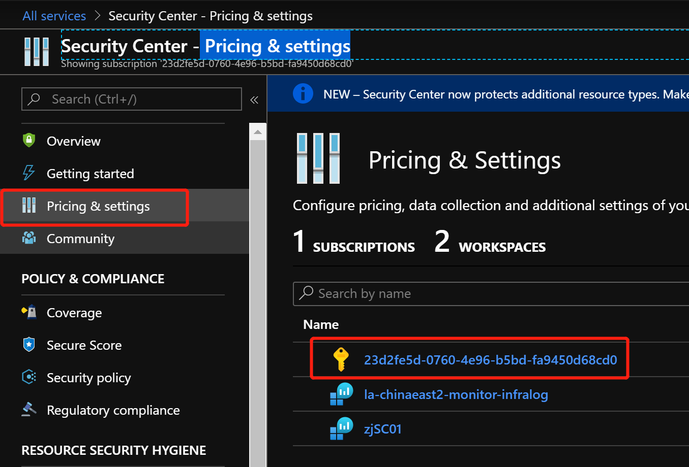

选择 `Data Collection`, 设置 `Log Analytics workspace` 以及 `Auto Installation`

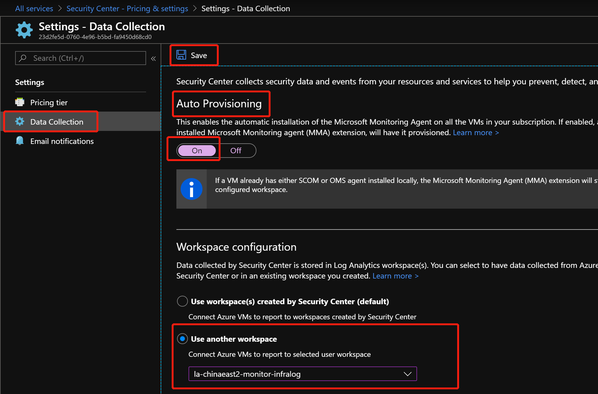

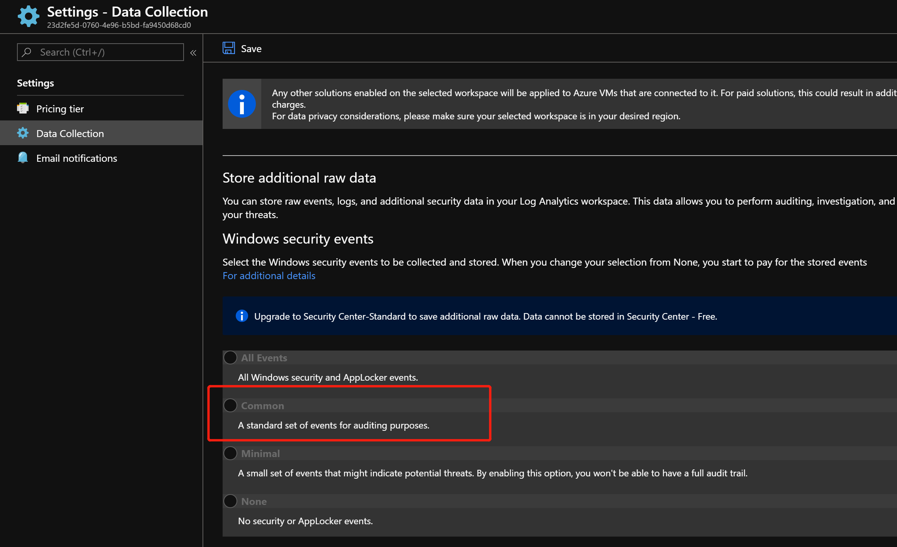

先择 `Pricing tier`, 将 `Security Center` 的定价层从 `Free` 变为 `Standard` 就可以了, 这样就完成了全部的设置.

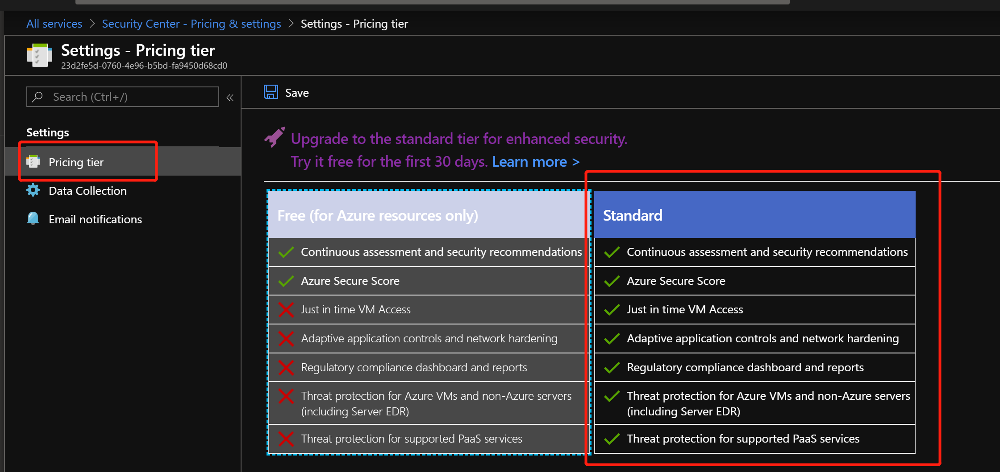

#### Option 2 针对订阅下的VM, 出于 Cost 优化的考量, 只希望针对于生产环境中的VM安装 Monitor Agent

这个目前也是实际遇到的情况, 云端不光有生产环境, 也有一些开发测试环境, 对于这类机器, 暂时先不想安装 Monitor Agent, 如何选择性安装部分的机器.

其实, 无论是想选择性安装部分机器, 还是第一部分中看到了有些机器没有安装 Monitor Agent, 都是可以通过 `Azure Security Center` 进行批量的安装

首先, 我们先要将 `Auto Installation` 关闭, 避免系统自动安装. 选择 `Data Collection`, 将 `Auto Installation` 关掉

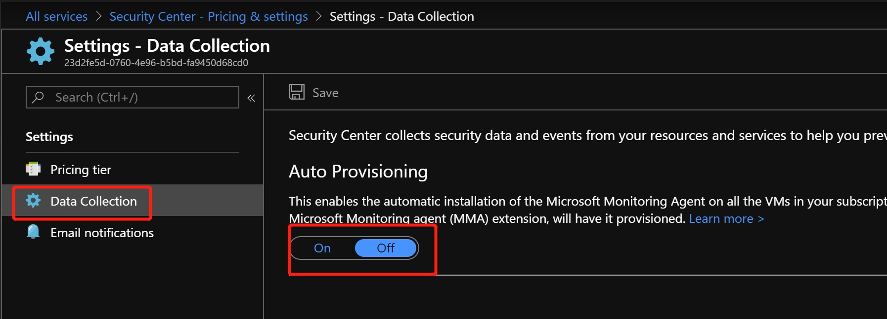

其次, 还是要将 Security Center 定价层设置为 `Standard`

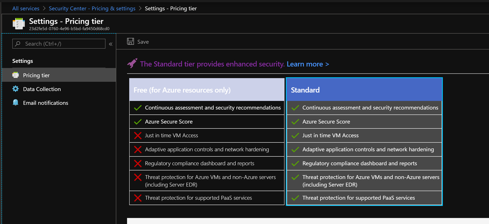

最后, 回到 `Security Center - Recommendations`, 我们可以找到这样一条建议 `Install monitoring agent on your virtual machines`

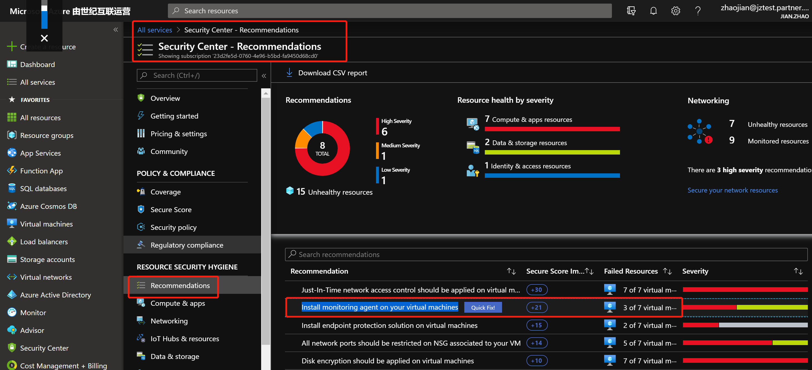

点击进入后, 即可选择想要安装的VM进行Monitor Agent的安装

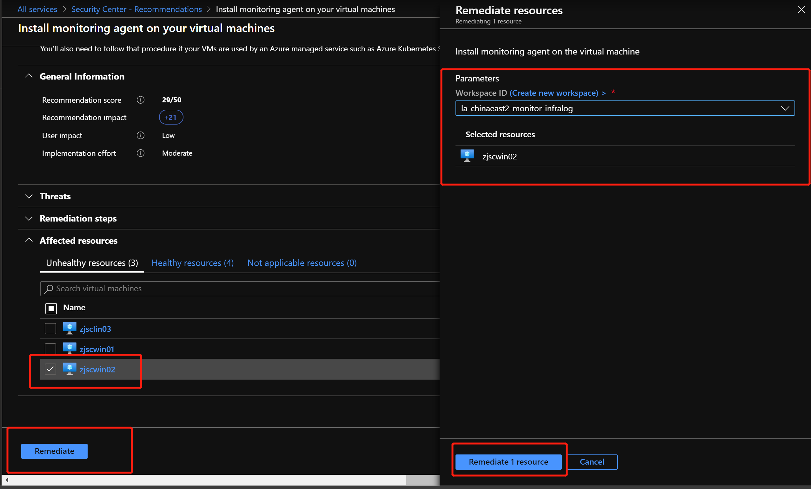

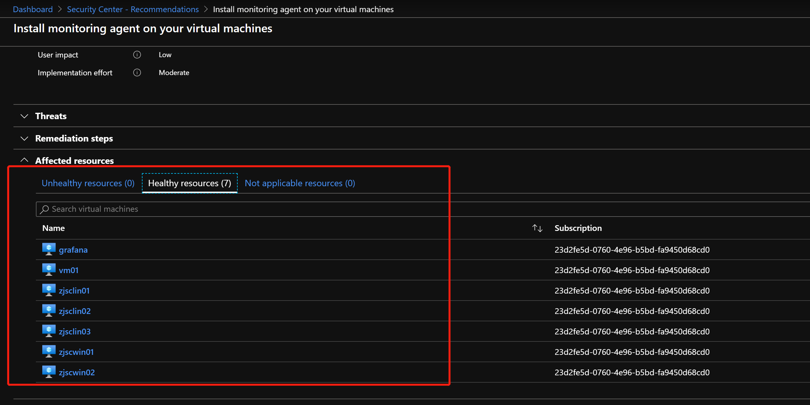

在 `Security Center - Compute & apps` 中, 每一台被管理的机器的详细信息中, 都会记录其数据存储在哪个 workspace 下, 以及目前的状态.

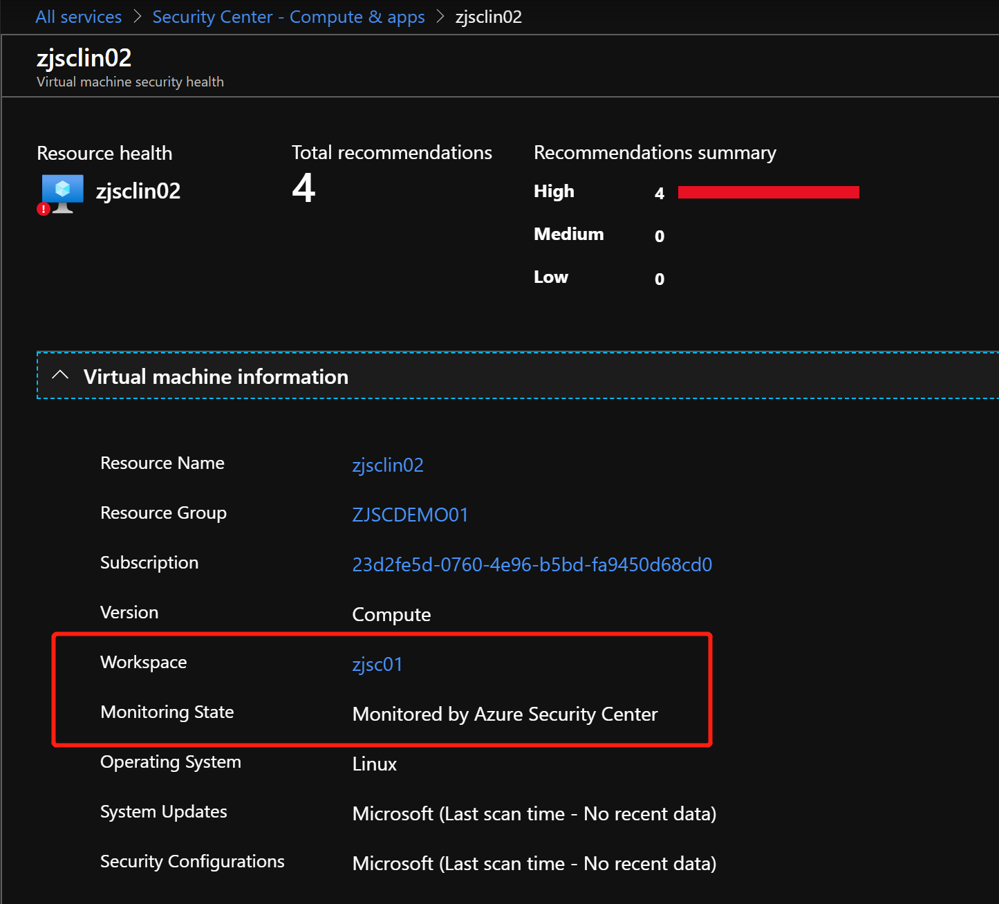

当然, 针对安装Monitor Agent会不会对生产环境产生影响, 以及会不会影响性能等常见客户关心的问题，都可以在 FAQ 里面找到答案 . [Azure 安全中心常见问题 (FAQ)](https://docs.azure.cn/zh-cn/security-center/security-center-faq)

### 番外篇 - 通过 CLI 安装 Monitor Agent

以上是最简单, 也是最直观的操作方式. 不过, 如果环境是通过脚本化, 自动化的方式来进行运维的话, Azure也是提供了相应的CLI/Powershell, 支持对 Linux & Windows 机器进行Agent的安装, 以CLI为例, 我们来安装余下的两台机器, 后续大家需要, 可以将下面的命令集成到运维脚本中.

关于 Log Analytics workspace 得相关信息, 可以通过如下获得:

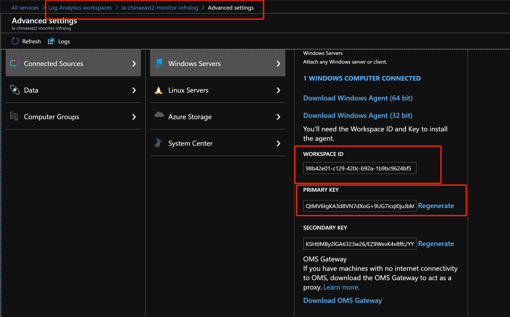

```
# 通过 Azure CLI 为 Linux VM 安装 Monitor Agent
az vm extension set \
  --resource-group zjSCDemo01 \
  --vm-name zjsclin03 \
  --name OmsAgentForLinux \
  --publisher Microsoft.EnterpriseCloud.Monitoring \
  --version 1.12.25 --protected-settings '{"workspaceKey":"$your_loganalytics_key"}' \
  --settings '{"workspaceId":"$your_la_workspaceid"}'
```

```
# 通过 Azure CLI 为 Windows VM 安装 Monitor Agent
az vm extension set \
  --resource-group zjSCDemo01 \
  --vm-name zjscwin01 \
  --name MicrosoftMonitoringAgent \
  --publisher Microsoft.EnterpriseCloud.Monitoring \
  --version 1.0.18018 --protected-settings '{"workspaceKey":"$your_loganalytics_key"}' \
  --settings '{"workspaceId":"$your_la_workspaceid"}'
```

### 参考资料

- 如何在Linux下安装Monitor Agent, 请参照 ：[适用于 Linux 的 Log Analytics 虚拟机扩展](https://docs.microsoft.com/zh-cn/azure/virtual-machines/extensions/oms-linux), 其中 `代理和 VM 扩展版本`部分描述了目前可用的版本

- 如何在Windows下安装Monitor Agent, 请参照 : [适用于 Windows 的 Log Analytics 虚拟机扩展](https://docs.microsoft.com/zh-cn/azure/virtual-machines/extensions/oms-windows), 其中 `代理和 VM 扩展版本`部分描述了目前可用的版本