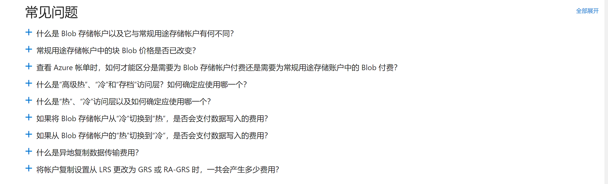

## 新客户 Onboard 需要了解的 Azure 基础概念及最佳实践

---
本文内容, 针对即将采用 `Azure Cloud` 的用户, 为用户带来直观的云上体验. 第一章主要介绍 `Azure` 相关的资源购买, 组织, 管理以及问题支持等方面；第二章包含各种动手实践，旨在熟悉Portal和资源的情况；第三章是各种常用链接。请各位按需读取。

## 1. Azure资源管理

### 1.1 Azure 云端的资源管理

当账号拿到之后, 以下两个链接将会经常被用到

#### EA Portal : https://ea.azure.cn

EA Portal 主要包括 合约信息的查询, 组织结构的分配, 订阅的创建管理, 账户余额查询, 资源花费查询, 详细花费下载, 查看价目表等内容, 更多内容请参见 [EA门户入门](https://docs.microsoft.com/zh-cn/azure/cost-management-billing/manage/ea-portal-get-started) 及 [EA 操作指南](./files/EA 入门指南.pdf)

EA 中涉及到的主要资源包括 Enrollment, Department, Account, Subscription, 具体结构如下：

由图片可以看到，根据职能、商业角度和地理位置等，可以针对一个企业结构进行不同的部门划分，不同的部门由不同的负责人进行管理，而针对更细化的项目或者应用需求，还可以划分出不同的订阅，进行更细化的管控。

**部门** - 创建部门有助于将成本细分为逻辑分组，然后在部门级别设置预算或配额.

**帐户** – 帐户是 Azure EA 门户中用于管理订阅的一个组织单位。 帐户也用于报告.

**订阅** – 订阅是 Azure EA 门户中的最小单位.

EA账户体系提供五个不同的企业管理用户角色来帮助用户进行管理：

**企业管理员**

企业管理员角色拥有最高级别的访问权限。 具有该角色的用户可以：

- 管理帐户和帐户所有者
- 管理其他企业管理员
- 管理部门管理员
- 管理通知联系人
- 查看所有帐户的使用情况
- 查看所有帐户的未开单费用

可以在一个企业注册中分配多个企业管理员。可以向企业管理员授予只读访问权限。这些管理员全部继承部门管理员角色。

**部门管理员**

具有该角色的用户可以：

- 创建和管理部门
- 创建新的帐户所有者
- 查看他们所管理的部门的使用情况详细信息
- 查看成本（如果已获取所需权限）

可为每个企业注册分配多个部门管理员。可向部门管理员授予只读访问权限。若要授予只读访问权限，请编辑或新建部门管理员，并将只读选项设置为“是”。

**帐户所有者**

具有该角色的用户可以：

- 创建和管理订阅
- 管理服务管理员
- 查看订阅的使用情况

每个帐户需要唯一的工作、学校或 Microsoft 帐户。

**服务管理员**

服务管理员有权在 Azure 门户中管理服务，以及将用户分配到共同管理员角色。

**通知联系人**

通知联系人接收与注册相关的使用通知。

EA 门户概览及组件功能如下：

#### Azure Portal : https://portal.azure.cn

Azure Portal 是创建, 管理 Azure 中资源的统一控制台；针对资源的创建, 管理, 更新, 删除以及工单提交等具体操作都是在 Azure Portal 中完成.

Azure Portal 涉及的资源包括 Management Group, Subscription, Resource Group, Resource

**用户帐户**

所有 Microsoft 云服务的用户帐户均存储在 Active Directory (Azure AD) 租户中，其中包含用户帐户和组。 通过使用基于 Windows 服务器的服务 Azure AD Connect，Azure AD 租户可与你现有的 Active Directory 域服务 (AD DS) 帐户同步。 这叫做目录同步。

**Tenant**

对于 SaaS 云服务，租户是承载提供云服务的服务器的区域位置。例如，Contoso 公司选择欧洲地区为其巴黎总部的 15,000 名工作人员托管其 Office 365、EMS 和 Dynamics 365 租户。

Azure PaaS 服务和在 Azure IaaS 中托管的基于虚拟机的工作负荷可以在世界范围内的任何 Azure 数据中心拥有租户。在创建 Azure PaaS 应用或服务或 IaaS 工作负荷的元素时，应指定 Azure 数据中心（称为位置）。

Azure AD 租户是包含帐户和组的 Azure AD 的特定实例。Office 365、Dynamics 365 或 Intune/EMS 的付费或试用版订阅包括免费的 Azure AD 租户。此 Azure AD 租户不包括其他 Azure 服务，且与 Azure 试用版或付费订阅不同。

以下是快速回顾：
- 组织可进行多个订阅
- 订阅可具有多个许可证
- 许可证可分配给各个用户帐户
- 用户帐户存储在 Azure AD 租户中

**Management Group**

如果你的组织有多个订阅，则可能需要一种方法来高效地管理这些订阅的访问权限、策略和符合性。 Azure 管理组提供订阅上的作用域级别。 可将订阅组织到名为“管理组”的容器中，并将管理条件应用到管理组。 管理组中的所有订阅都将自动继承应用于管理组的条件。 不管使用什么类型的订阅，管理组都能提供大规模的企业级管理。 单个管理组中的所有订阅都必须信任同一个 Azure Active Directory 租户。

例如，可将策略应用到限制创建虚拟机 (VM) 的区域的管理组。 此策略将应用到该管理组下面的所有管理组、订阅和资源，只允许在该区域中创建 VM。

**订阅**

订阅是与 Microsoft 就使用一个或多个 Microsoft 云平台或服务签订的协议，其费用基于每个用户许可证费用或云资源使用累计。

- Microsoft 基于软件即服务 (SaaS) 的云服务（Office 365、Intune/EMS 和 Dynamics 365）按用户收取许可证费用。
- Microsoft 的平台即服务 (PaaS) 和基础设施即服务 (IaaS) 云服务 (Azure) 根据云资源使用量收取费用。

**Resource Group**

资源组是用于保存 Azure 解决方案相关资源的容器。 资源组可以包含解决方案的所有资源，也可以只包含想要作为组来管理的资源。 根据对组织有利的原则，决定如何将资源分配到资源组。 通常可将共享相同生命周期的资源添加到同一资源组，以便将其作为一个组轻松部署、更新和删除。

Azure Portal 各部分功能介绍可参照 :

下表是各个组件及其说明：

组件 |	说明
:---|:---
1	|页眉。 显示在每个门户页面的顶部并保存全局元素。
2	|全局搜索。 使用搜索栏快速查找特定的资源、服务或文档。
3	|全局控件。 与所有全局元素一样，这些功能在门户中保持不变，包括： Cloud Shell、订阅筛选器、通知、门户设置、帮助和支持，并向我们发送反馈。
4	|你的帐户。 查看有关你的帐户、切换目录、注销或使用其他帐户登录的信息。
5	|门户菜单。 门户菜单是一个全局元素，可帮助您在服务之间导航。 有时也称为边栏，门户菜单模式可以在门户设置中进行更改。
6	|资源菜单。 许多服务都包含一个资源菜单，可帮助您管理该服务。 你可能会看到此元素称为左窗格。
7	|命令栏。 命令栏上的控件与当前焦点相关。
8	|工作窗格。 显示有关当前处于焦点的资源的详细信息。
9	|导航. 您可以使用痕迹链接在工作流中上移。
10	|用于在当前订阅中创建新资源的主控件。 展开或打开门户菜单，查找 " + 创建资源"。 搜索或浏览 Azure Marketplace，了解要创建的资源类型。
11	|收藏夹列表。 若要了解如何自定义列表，请参阅添加、删除和排序收藏夹。

### 1.2 Azure 云端费用管理

使用 Azure 云中的服务, 费用是如何计算的, 是经常被提起的话题.

Azure 云中资源的计费相对透明, 针对 Azure 云中的计费, 可以在 [Azure 定价](https://www.azure.cn/pricing/) 中, 查看需要服务的定价模式. 以 Azure Blob 为例, 在定价页中, 我们可以看到 Blob 存储的计费模式, 以及常见的问题列表：

Azure 云端的计费示例请参照 [计费场景举例](https://docs.azure.cn/zh-cn/billing/billing-azure-services-scenarios?toc=/enterprise-agreement-billing/toc.json&bc=/enterprise-agreement-billing/breadcrumb/toc.json)

针对 Azure VM, 企业客户可以通过购买包年虚机（CPP），获得优惠的价格，实现更高的性价比, 具体CPP的介绍请参见：[Compute Pre-Purchase](https://docs.azure.cn/zh-cn/enterprise-agreement-billing/enterprise-agreement-billing-check-cpp), 关于CPP的购买及价格，请咨询销售.

在使用过程中, 用户可以通过 EA Portal 查看资源的消耗情况, 以及详细的费用清单.

- 关于如何查看 Azure 费用摘要, 请参照 [看懂使用量摘要](https://docs.azure.cn/zh-cn/enterprise-agreement-billing/enterprise-agreement-billing-understand-usage-summary)

- 关于如何下载 Azure 使用量报告, 请参照 [下载使用量报告](https://docs.azure.cn/zh-cn/enterprise-agreement-billing/enterprise-agreement-billing-download-usage-report)

从使用日期开始算起，最长可能需要延迟五天，其费用才会显示在报告中。

CSV报告中包含有大量的字段信息，下面是每个字段代表的含义：

中文字段名 | 英文字段名 | 说明 | 是否常用
:---|:--- | :---|:---
账户所有者 | AccountOwnerId | 表示该订阅创建的账户id | -
账户名称 | Account Name | 账户名称 | -
服务管理员 | Live Id |Service Administrator Id|-	 	
订阅ID|SubscriptionId| |	- 	
订阅GUID|	SubscriptionGuid|	表示订阅的GUID	| - 
订阅名称|	AccountOwnerId|	表示订阅的显示名称|	是
日期|	Date|	表示该计费资源的计费时间，比如2019-06-01	|是
月	|Month|	表示该计费资源，所属的月份，比如6|	是
日|	Day	|表示该计费资源，所属的日期，比如1	|是
年|	Year|	表示该计费资源，所属的日期，比如2019|	是
产品|	Product|	计费单元所属的产品|	
资源GUID|	Meter ID	|资源的GUID |-	
服务|	Meter Category |	服务的一级分类	|-
服务类型|	Meter Sub-Category| 	服务的 二级分类	|-
服务区域|	Meter Region |	服务所在的区域	|-
服务资源|	Meter Name |	服务资源	|-
已消耗的资源数量|	Consumed Quantity |	计费的资源数量,比如虚拟机计算资源，是按照小时来收费的。如果虚拟机开了24小时，则该列会显示24。对于存储来说，是按照GB来收费的。如果存储用了1GB，则改了会显示1。计费数量的单位，请参考列：Unit of Measure |	是
资源费率|	Resource Rate |	计费单价，比如虚拟机计算资源，是按照小时来收费的。该列会显示虚拟机每小时费用的单价。对于存储来说，是按照GB来收费的。该列会显示每GB每月费用单价|	是
扩展的成本|	ExtendCost |	等于，列：已消耗的资源数量 (乘以) 列：资源费率是单个计费资源产生的费用|	是
服务子区域|	Resource Location 	|不经常使用 |-	
服务信息|	Consumed Service |	不经常使用  |-	
组件|	Instance ID|	资源的唯一ID，对于ARM资源来说，组件展现的形式如下：/subscriptions/{订阅ID}/resourceGroups/{资源组名称}/providers/Microsoft.Compute/virtualMachines/{虚拟机名称}	|-
服务信息1 |	ServiceInfo1|	不经常使用 	|-
服务信息2|	ServiceInfo2 |	不经常使用 	|-
附加信息|	AdditionalInfo 	|不经常使用 	|-
Tags|	Tag	|资源的标签TAG |	是
Store Service Identifier	| | 不经常使用 	|-
Department||资源所属的部门，部门只在EA Portal里面定义|	是
Cost Center	 ||	资源所属的Cost Center成本中心 ，成本中心只在EA Portal里面定义	|是
Unit of Measure	 ||	列：已消耗的资源数量的单位，比如虚拟机计算资源，是按照小时来收费的，则该列显示为Hour。对于存储来说，是按照GB来收费的。则该列会显示GB|	是
资源组|Resource Group|	资源所属的资源组名称|	是

下面以Azure Mooncake出发，实际看一下EA CSV报告解读。

Azure可以通过下载Excel表格，将一段时间内Azure的详细账单，通过CSV文件格式进行下载，然后用户可以通过透视表的方式进行自定义查询。

1.	点击报表，下载使用量。

2.	点击上图的按钮，就可以下载使用量的详细数据。如果未显示下载按钮，则点击下图的“刷新”按钮

3.	下载完毕后，打开下载的CSV文件。

如果想查看每个订阅每个月产生的费用情况，用户需要关心的列有：
- 订阅名称
- 年
- 月
- 扩展的成本 
    
如果想查看每个资源组每天产生的费用情况，需要关心的列有：
+ 年
+ 月
+ 日
+ 扩展的成本
+ Resource Group

用户还可以通过编辑数据透视表，来对CSV文件进行统计。打开CSV文件，全选第3行的列明，然后按CTRL + SHIFT + END，选中所有的表格内容。然后点击，插入，数据透视表。如下图：

在透视表中，拖动资源。

即可以得到分析示图：

### 1.3 Azure 云端资源使用准备

云端资源会有 Quota 的概念, 比如: 针对虚拟机, 账户下默认的Core数Quota是350个, 当环境中超过了这个值, 会导致资源创建失败. 但这个Quota是可以通过提交工单进行调整的, 所以, 部署资源之前, 检查环境中资源的Quota Limitation, 确保不会因为Quota不足导致资源创建不出来.

通过 Azure Portal, 我们可以查看正在使用的订阅下 Quota 情况, 例如：

针对系统默认的 Quota Limitation, 请参照 [Azure 订阅和服务限制、配额和约束](https://docs.azure.cn/zh-cn/azure-subscription-service-limits)

如果遇到 Quota Limitation 问题, 请及时开Case, 后台相关团队会协助调整

### 1.4 Azure 云端 Ticket & SLA & RCA

当我们在 Azure 云端遇到问题, 包括 产品咨询, 配置问题, 服务不可用, 平台Bug 等等, 请第一时间开Ticket, 联系后台工程师协助解决.

登陆到 Azure Portal, 选择 `Help + Support`, 根据实际严重程度选择 A/B/C 严重等级, 提供相应问题描述

目前 Azure China 的企业用户, 已经免费附赠了 Azure Standard Plan, 可以协助客户解决Azure云上的问题, 具体Support Plan的支持请参照 [Azure China 支持计划](https://www.azure.cn/support/plans/)

关于 Azure China Support 流程可参见如下 :

 
技术case：
1.	客户通过在线网站或者支持热线提交问题，case 随即生成并会被自动分派到对应 的技术支持 POD。 
2.	由微软 CSS （微软全球技术支持中心）和 21V 的工程师共同组成 POD 支持团队，其中，21V 工程师将作为客 户联系的唯一接口；CSS 的 Technical Advisor (TA) 和 Support Escalation Engineer (SEE) 负责后端技术升级支持。 
3.	经由客户的许可，21V 可以引入微软 CSS 与客户进行三方沟通，形式可以是邮件、 电话或者远程协助。 
4.	如确定为产品导致的影响客户生产环境的紧急问题，21V 工程师或者微软 CSS 将给 21V WASU 提交紧急程度为 2 的内部工单，使其安排微软后端产品开发团队进行平 台排查。 
5.	如问题需要产品团队协助排查，但问题本身并不紧急或者已有 workaround，微软 CSS 将向后端产品开发团队提交紧急程度为 3 的内部工单。
6.	微软 CSS 将提供原厂技术支持服务，包括问题排查和咨询，TAM 也将全程参与。

针对平台级出现的问题, 包括平台故障, 计划升级等, 用户均可通过 `Azure Service Health`, 第一时间查看相关信息及更新, 并下载相应的RCA报告；同时也可以设置相应的告警, 出现问题第一时间通知负责的同事查看环境, 采取相应的措施.

当然, 每个服务的SLA也是用户所关心的一个问题. 目前, 大部分Azure中的服务都具有SLA保障, 关于各服务SLA的详细描述及赔偿方案, 请参照 [服务级别协议](https://www.azure.cn/support/legal/sla/)

例如, 通过虚拟机SLA的页面, 我们可以找到虚拟机支持的SLA描述, 故障时间计算, 以及事故后赔偿方案

### 1.5 Azure 云端的安全&合规

针对 Azure 云端所有 `安全性` & `合规性` & `隐私管控` 方面的内容, 均可在信任中心中找到 [信任中心](https://www.trustcenter.cn/zh-cn/default.html)

针对 Azure 中对外服务的网站, 应法律法规要求, 请及时做好`ICP备案`&`公安部备案`, ICP备案请参照[ICP 备案](https://www.azure.cn/support/icp/), 公安部备案请参照[公安备案](https://www.azure.cn/support/announcement/public-security-registration/)

### 1.6 Azure 服务可用性及Roadmap了解

了解 Azure China 有哪些服务可用, 以及想用但暂时中国区还没有的服务的落地时间, 对于项目规划阶段非常有用, 能够帮助用户更好的计划项目周期. 请参照 [Products available by region](https://azure.microsoft.com/en-us/global-infrastructure/services/?products=all)查看各区域的服务落地情况

对于服务的发布落地, Azure 严格遵循着相应的流程, 确保平台及用户不受影响. 用户在使用 Azure 服务时, 经常能够听到 `Private Preview` & `Public Preview` & `GA` 三个阶段, 这三个阶段分别对应着 `邀请客户试用` & `公共预览` & `正式商用` 三个阶段, 如下是服务上线所遵循的流程：

---

## 2.	动手实践

### 2.1 熟悉云上资源的创建

如下三个实验, 是一个进阶的过程, 从易到难帮助大家熟悉Azure资源的操作管理

- 第一个实验, 带我们熟悉, 通过 Azure Portal 及命令行工具, 创建并管理最基本的IaaS层资源（虚机/磁盘/网络等）- [管理 Azure 中的基础设施资源](https://docs.microsoft.com/zh-cn/learn/paths/administer-infrastructure-resources-in-azure/)

- 第二个实验, 更为全面的带大家熟悉常用的Azure资源的操作方法 - [AZ-103-MicrosoftAzureAdministrator](https://github.com/MicrosoftLearning/AZ-103-MicrosoftAzureAdministrator/tree/master/Instructions/Labs)

- 第三个实验, 结合 Whiteboard Design + Handson Lab, 帮助我们了解, 企业级应用搭建在云端所需要考虑的方面 - [Enterprise-ready-cloud](https://github.com/Microsoft/MCW-Enterprise-Ready-Cloud)

### 2.2 开启云端之旅

针对用户上云的方方面面, 微软总结了一套可以落地的方法论实践, Cloud Adoption Framework, 希望大家不止用云, 更能够用好云, 详细文档请参照 [适用于 Azure 的 Microsoft 云采用框架](https://docs.microsoft.com/zh-cn/azure/cloud-adoption-framework/)

跟大家密切相关的两个部分 

- Cloud Adoption Framework Ready [为云采用计划准备好环境](https://docs.microsoft.com/zh-cn/azure/cloud-adoption-framework/ready/) : 计划一个标准化的 Landing Zone, 对于后续系统上云的构建有指导意义

- Cloud Adoption Framework Governance [适用于 Azure 的 Microsoft 云采用框架中的治理](https://docs.microsoft.com/zh-cn/azure/cloud-adoption-framework/govern/) : 从上云的第一天开始，就做好云端的管理工作, 相比于后期改造, 能够节省成本, 同时以最佳实践的方式结合用户的实际情况, 管理好云, 能够更大限度的促进云使用的成功

### 2.3 更为丰富的 Azure 资料

另外, 以下一些相关的资料, 对于大家熟悉Azure具有参考价值

- [Azure 文档](https://docs.azure.cn/zh-cn/) : 相关服务的快速入门, 详细配置描述, 均可通过文档链接查看

- [Microsoft Learn](https://docs.microsoft.com/zh-cn/learn/) : 包含系统化的Learning Path, 帮助用户学习微软的服务, 包括Azure/M365/Dynamics365/Power Platform

- [Azure 解决方案](https://azure.microsoft.com/zh-cn/solutions/) : 找到可满足应用程序或业务需求的解决方案

- [案例研究](https://customers.azure.cn/) : 中国区Azure客户案例

- [Microsoft Cloud Workshop](https://microsoftcloudworkshop.com/) : 针对不同的workload, 模拟业务场景, 帮助大家了解基于不同业务场景下的架构设计, 以及动手实践

- [Azure 概览](https://microsoftapc.sharepoint.com/:b:/t/OCPPRCPTSTeam/EbM6PUPPSgtIhHsjD7dSBpABq8BKHnd7KVHfb_YKu4SWnQ?e=M5l9S7) 