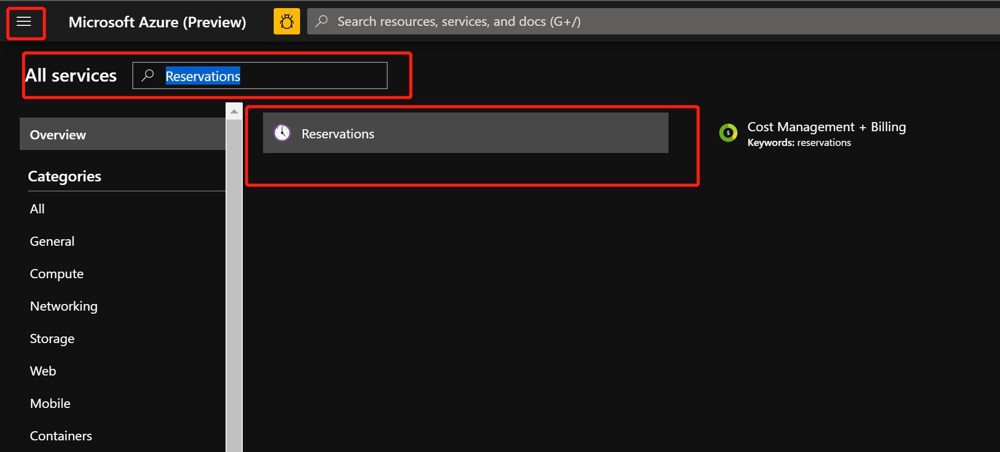
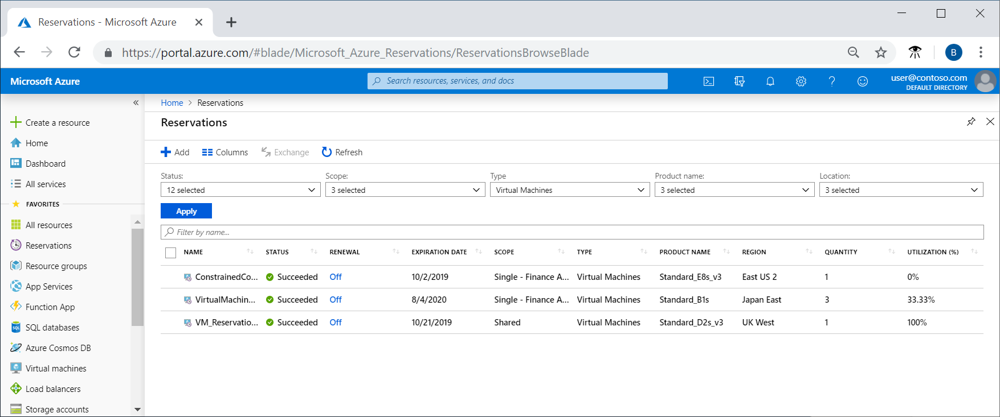
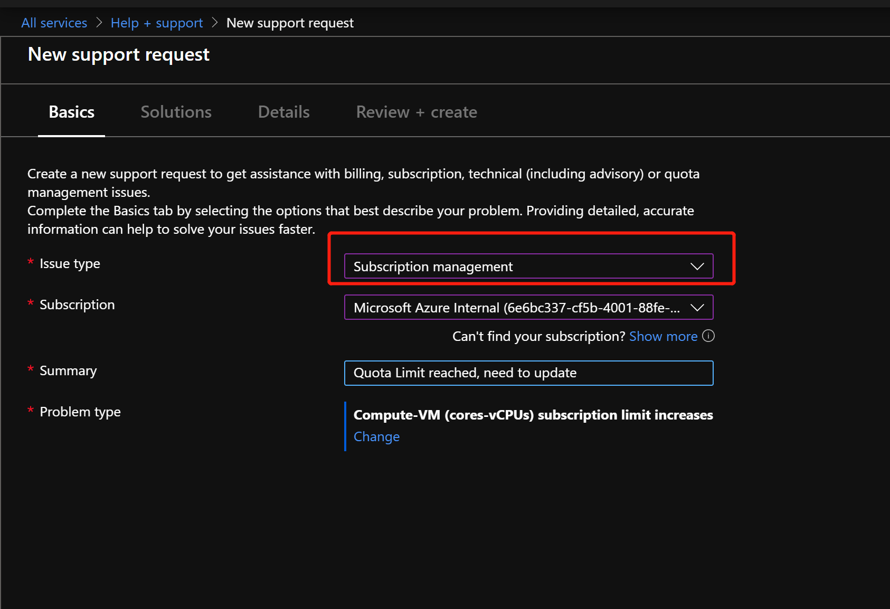
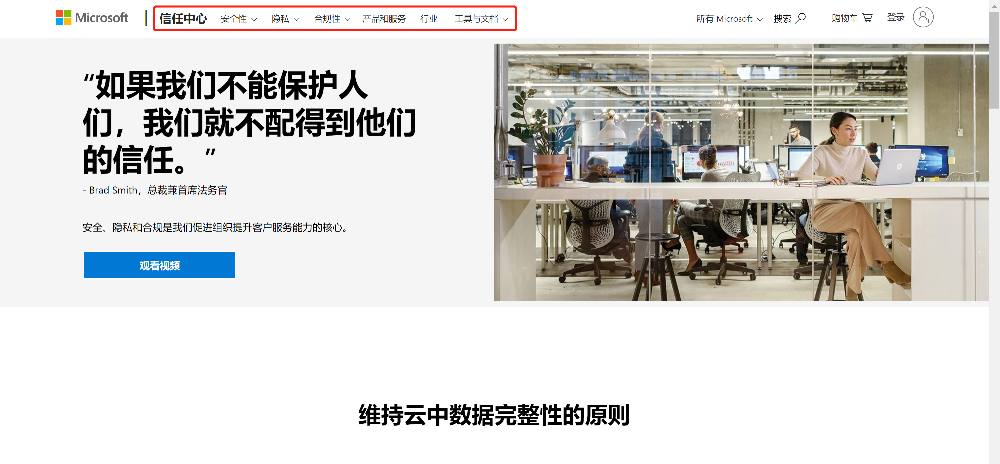
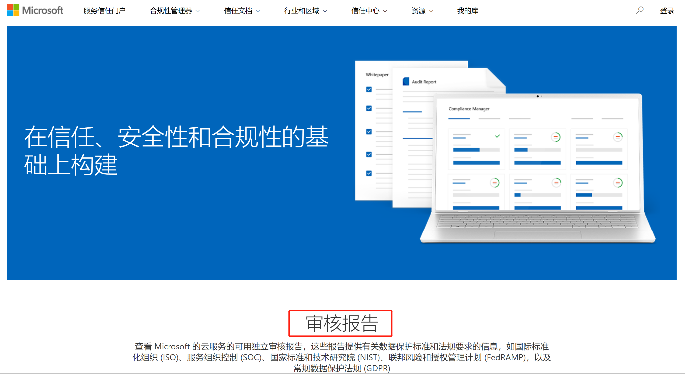
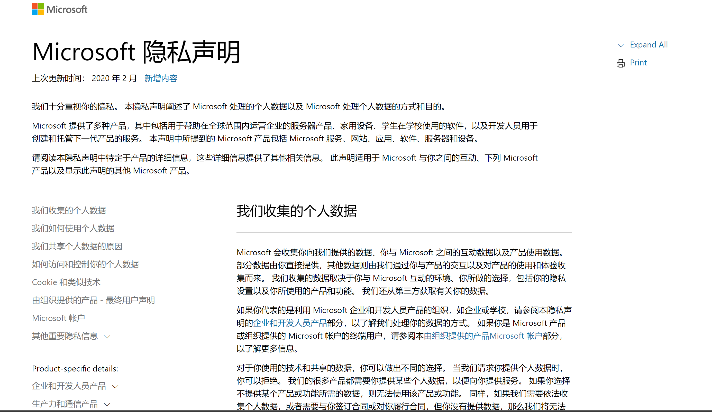

## 新客户 Onboard 需要了解的 Azure 基础概念及最佳实践

---
本文内容, 针对即将采用 `Azure Cloud` 的用户, 为用户带来直观的云上体验. 第一章主要介绍 `Azure` 相关的资源购买, 组织, 管理以及问题支持等方面；第二章包含各种动手实践，旨在熟悉Portal和资源的情况；第三章是各种常用链接。请各位按需读取。

## 1. Azure资源管理

### 1.1 Azure 云端的资源管理

当账号拿到之后, 以下两个链接将会经常被用到

#### EA Portal : https://ea.azure.com

EA Portal 主要包括 合约信息的查询, 组织结构的分配, 订阅的创建管理, 账户余额查询, 资源花费查询, 详细花费下载, 查看价目表等内容, 更多内容请参见 [EA门户入门](https://docs.microsoft.com/zh-cn/azure/cost-management-billing/manage/ea-portal-get-started) 及 [EA 操作指南](./files/EA 入门指南.pdf)

EA 中涉及到的主要资源包括 Enrollment, Department, Account, Subscription, 具体结构如下：

由图片可以看到，根据职能、商业角度和地理位置等，可以针对一个企业结构进行不同的部门划分，不同的部门由不同的负责人进行管理，而针对更细化的项目或者应用需求，还可以划分出不同的订阅，进行更细化的管控。

**部门** - 创建部门有助于将成本细分为逻辑分组，然后在部门级别设置预算或配额.

**帐户** – 帐户是 Azure EA 门户中用于管理订阅的一个组织单位。 帐户也用于报告.

**订阅** – 订阅是 Azure EA 门户中的最小单位.

EA账户体系提供五个不同的企业管理用户角色来帮助用户进行管理：

**企业管理员**

企业管理员角色拥有最高级别的访问权限。 具有该角色的用户可以：

- 管理帐户和帐户所有者
- 管理其他企业管理员
- 管理部门管理员
- 管理通知联系人
- 查看所有帐户的使用情况
- 查看所有帐户的未开单费用

可以在一个企业注册中分配多个企业管理员。可以向企业管理员授予只读访问权限。这些管理员全部继承部门管理员角色。

**部门管理员**

具有该角色的用户可以：

- 创建和管理部门
- 创建新的帐户所有者
- 查看他们所管理的部门的使用情况详细信息
- 查看成本（如果已获取所需权限）

可为每个企业注册分配多个部门管理员。可向部门管理员授予只读访问权限。若要授予只读访问权限，请编辑或新建部门管理员，并将只读选项设置为“是”。

**帐户所有者**

具有该角色的用户可以：

- 创建和管理订阅
- 管理服务管理员
- 查看订阅的使用情况

每个帐户需要唯一的工作、学校或 Microsoft 帐户。

**服务管理员**

服务管理员有权在 Azure 门户中管理服务，以及将用户分配到共同管理员角色。

**通知联系人**

通知联系人接收与注册相关的使用通知。

EA 门户概览及组件功能如下：

#### Azure Portal : https://portal.azure.com

Azure Portal 是创建, 管理 Azure 中资源的统一控制台；针对资源的创建, 管理, 更新, 删除以及工单提交等具体操作都是在 Azure Portal 中完成.

Azure Portal 涉及的资源包括 Management Group, Subscription, Resource Group, Resource

**用户帐户**

所有 Microsoft 云服务的用户帐户均存储在 Active Directory (Azure AD) 租户中，其中包含用户帐户和组。 通过使用基于 Windows 服务器的服务 Azure AD Connect，Azure AD 租户可与你现有的 Active Directory 域服务 (AD DS) 帐户同步。 这叫做目录同步。

**Tenant**

对于 SaaS 云服务，租户是承载提供云服务的服务器的区域位置。例如，Contoso 公司选择欧洲地区为其巴黎总部的 15,000 名工作人员托管其 Office 365、EMS 和 Dynamics 365 租户。

Azure PaaS 服务和在 Azure IaaS 中托管的基于虚拟机的工作负荷可以在世界范围内的任何 Azure 数据中心拥有租户。在创建 Azure PaaS 应用或服务或 IaaS 工作负荷的元素时，应指定 Azure 数据中心（称为位置）。

Azure AD 租户是包含帐户和组的 Azure AD 的特定实例。Office 365、Dynamics 365 或 Intune/EMS 的付费或试用版订阅包括免费的 Azure AD 租户。此 Azure AD 租户不包括其他 Azure 服务，且与 Azure 试用版或付费订阅不同。

以下是快速回顾：
- 组织可进行多个订阅
- 订阅可具有多个许可证
- 许可证可分配给各个用户帐户
- 用户帐户存储在 Azure AD 租户中

**Management Group**

如果你的组织有多个订阅，则可能需要一种方法来高效地管理这些订阅的访问权限、策略和符合性。 Azure 管理组提供订阅上的作用域级别。 可将订阅组织到名为“管理组”的容器中，并将管理条件应用到管理组。 管理组中的所有订阅都将自动继承应用于管理组的条件。 不管使用什么类型的订阅，管理组都能提供大规模的企业级管理。 单个管理组中的所有订阅都必须信任同一个 Azure Active Directory 租户。

例如，可将策略应用到限制创建虚拟机 (VM) 的区域的管理组。 此策略将应用到该管理组下面的所有管理组、订阅和资源，只允许在该区域中创建 VM。

**订阅**

订阅是与 Microsoft 就使用一个或多个 Microsoft 云平台或服务签订的协议，其费用基于每个用户许可证费用或云资源使用累计。

- Microsoft 基于软件即服务 (SaaS) 的云服务（Office 365、Intune/EMS 和 Dynamics 365）按用户收取许可证费用。
- Microsoft 的平台即服务 (PaaS) 和基础设施即服务 (IaaS) 云服务 (Azure) 根据云资源使用量收取费用。

**Resource Group**

资源组是用于保存 Azure 解决方案相关资源的容器。 资源组可以包含解决方案的所有资源，也可以只包含想要作为组来管理的资源。 根据对组织有利的原则，决定如何将资源分配到资源组。 通常可将共享相同生命周期的资源添加到同一资源组，以便将其作为一个组轻松部署、更新和删除。

Azure Portal 各部分功能介绍可参照 :

下表是各个组件及其说明：

组件 |	说明
:---|:---
1	|页眉。 显示在每个门户页面的顶部并保存全局元素。
2	|全局搜索。 使用搜索栏快速查找特定的资源、服务或文档。
3	|全局控件。 与所有全局元素一样，这些功能在门户中保持不变，包括： Cloud Shell、订阅筛选器、通知、门户设置、帮助和支持，并向我们发送反馈。
4	|你的帐户。 查看有关你的帐户、切换目录、注销或使用其他帐户登录的信息。
5	|门户菜单。 门户菜单是一个全局元素，可帮助您在服务之间导航。 有时也称为边栏，门户菜单模式可以在门户设置中进行更改。
6	|资源菜单。 许多服务都包含一个资源菜单，可帮助您管理该服务。 你可能会看到此元素称为左窗格。
7	|命令栏。 命令栏上的控件与当前焦点相关。
8	|工作窗格。 显示有关当前处于焦点的资源的详细信息。
9	|导航. 您可以使用痕迹链接在工作流中上移。
10	|用于在当前订阅中创建新资源的主控件。 展开或打开门户菜单，查找 " + 创建资源"。 搜索或浏览 Azure Marketplace，了解要创建的资源类型。
11	|收藏夹列表。 若要了解如何自定义列表，请参阅添加、删除和排序收藏夹。

### 1.2 Azure 云端费用管理

**Azure计费**

使用 Azure 云中的服务, 费用是如何计算的, 是经常被提起的话题.

Azure 云中资源的计费相对透明, 针对 Azure 云中的计费, 可以在 [Azure 定价](https://azure.microsoft.com/en-us/pricing/) 中, 查看需要服务的定价模式. 以 Azure Blob 为例, 在定价页中, 我们可以看到 Blob 存储的计费模式, 以及常见的问题列表：

**价格计算器**

Azure价格计算器可以配置 Azure 产品并估算成本，选择想要评估的SKU，选择地区和付款方式，即可看到对应SKU的价格。还可以将价格计算器的结果导出成表格，进行进一步的测算和比较。

**Azure资源优惠**

企业客户可以通过购买 RI （保留实例），获得资源更为优惠的价格，实现更高的性价比。Azure 预留承诺预付适用于`虚拟机`、`Azure Blob 存储`或 `Azure Data Lake Storage Gen2`、`SQL 数据库计算容量`、`Azure Cosmos DB 吞吐量`或其他 Azure 资源的一年或三年计划，为用户节省资金。 通过承诺预付，能够以折扣价购买所用资源。 预留可显著将资源的成本，最多减少至即用即付价格的 72%。 预订提供计费折扣，并且不会影响资源的运行时状态。

如果使用大容量/高吞吐量或者长时间运行的虚拟机、Blob 存储数据、Azure Cosmos DB 或 SQL 数据库，那么购买预留项可以获得最实惠价格。 例如，如果持续运行四个服务实例，在不购买预留项的情况下，需按即用即付价格付费。 如果购买这些资源的预留项，则将立即获得预留折扣。 这些资源不再按即用即付费率收费。
预留项涵盖的计划：

- 虚拟机预留实例 - 预留项仅涵盖虚拟机计算成本。 而不涵盖软件、网络或存储等其他费用。
- Azure 存储预留容量 - 该预留项涵盖用于 Blob 存储或 Azure Data Lake Gen2 存储的标准存储帐户的存储容量。 不涵盖带宽或事务费率。
-	Azure Cosmos DB 预留容量 - 预留项涵盖为资源预配的吞吐量的费用。 但它不涵盖存储和网络费用。
-	SQL 数据库预留 vCore - 预留项仅包含计算成本。 许可证单独计费。
-	SQL 数据仓库 - 预留项涵盖 cDWU 用量。 它不涵盖与 SQL 数据仓库用量相关的存储或网络费用。
-	应用服务印花费 - 预留项涵盖印花使用费。 它不适用于辅助角色，因此与印花相关的任何其他资源将单独收费。
-	Azure Database for MySQL
-	Azure Database for PostgreSQL
-	Azure Database for MariaDB
-	Azure 数据资源管理器
-	高级 SSD 托管磁盘

以存储为例，下面看一下预留折扣应用于存储的收费以及如何申请预留实例：

**折扣示例**：
假设在美国西部 2 区域购买了一年期 100 TB 的预留容量。 预留适用于热访问层中的本地冗余存储 (LRS)。
按照100TB存储来计算，如预留一年的预留的成本为 18,540 美元，$1,545/月。 如预留三年，则预留成本为14,928美元，$1,244/月。而如果按照即用即付计算的话，那么将花费 0.0184*50*1024 + 0.0177*50*1024 = 1,848.32‬美元/月，一年成本将高达22,179.84‬美元，如果按照预留3年的价格来算，将节省32.7%的成本。

**购买 Azure 存储预留容量**：
可以通过[Azure 门户](https://portal.azure.com/)购买 Azure 存储预留容量。 提前支付预订费用，按月支付。 若要详细了解每月支付的费用，请参阅提前或按月支付购买[Azure 预订](https://docs.microsoft.com/zh-cn/azure/billing/billing-monthly-payments-reservations)。

以Blob为例，可以按照以下步骤购买预留容量：

1. 导航到 Azure 门户中的 "购买预订" 窗格。
2. 选择 " Azure Blob 存储" 以购买新的保留。
3. 填写必填字段。

4. 选择预订参数后，Azure 门户会显示成本。 该门户还显示 "即用即付" 计费的折扣百分比。
5. 在 "购买预订" 窗格中，查看预订的总成本。 还可以提供预订的名称。

购买保留后，它将自动应用于任何现有的 Azure 存储块 blob 或与保留条款匹配的 Azure Data Lake Storage Gen2 资源。 如果尚未创建任何 Azure 存储资源，则每次创建与预订条款相匹配的资源时，将应用保留。在这两种情况下，预订期限会在成功购买后立即开始。

**查看预留**：

1. 登录 Azure 门户

2. 在 "All Services 中搜索 Reservations", 点击 "Reservations" 进入

3. 可以在这里查看已经购买的预留资源的信息

**Azure Cost Management**

Cost Management可以有效规划和控制企业成本。成本管理任务通常由财务、管理和应用程序团队共同执行。Azure Cost Management + Billing可以帮助组织在计划时考虑到成本。它还有助于有效地分析成本，并采取行动优化云支出。要了解更多关于如何将成本管理作为一个组织来处理的信息，请阅读[Azure成本管理最佳实践文章](https://docs.microsoft.com/en-us/azure/cost-management-billing/costs/cost-mgt-best-practices)。

若要通过Cost Management查看成本，请在 Azure 门户打开范围并在菜单中选择“成本分析” 。 例如，转到“订阅”，从列表中选择订阅，然后在菜单中选择“成本分析” 。 使用“范围” 框可在成本分析中切换到不同的范围。 有关范围的详细信息，请参阅[了解并使用范围](https://docs.microsoft.com/zh-cn/azure/cost-management-billing/costs/understand-work-scopes)。

所选的范围将用于整个成本管理，以提供数据整合和控制对成本信息的访问。 使用范围时，不要多选它们。 而应先选择一个汇总了其他范围的较大范围，然后筛选出所需的嵌套范围。 了解此方法很重要，因为某些用户可能无法访问单个涵盖多个嵌套范围的父范围。

初始成本分析视图包括以下方面。

**累计成本视图**：表示预定义的成本分析视图配置。 每个视图包含日期范围、粒度、分组依据和筛选器设置。 默认视图显示当前计费周期的聚合成本，但可以更改为其他内置视图。 有关详细信息，请参阅[自定义成本视图](https://docs.microsoft.com/zh-cn/azure/cost-management-billing/costs/quick-acm-cost-analysis#customize-cost-views)。

**实际成本**：显示当前月份的总使用量和购买成本。这些购买成本是应记成本，会显示在账单上。

**预测**：显示所选时间段的预测成本总计。

**预算**：显示所选范围的计划支出限额（如可用）。

**累计粒度**：显示从计费周期开始算起的累计每日成本总额。 为计费帐户或订阅创建预算后，可快速查看对预算而言的支出趋势。 将鼠标悬停某个日期上以查看该天的累计成本。

**透视图（圆环图）** ：提供动态透视，按一组常见标准属性分解总成本。 它们显示当前月成本（从最大到最小排列）。 通过选择不同的透视，可以随时更改透视图。 成本按服务（计量类别）、位置（区域）和子范围（默认）分类。 例如，注册帐户在计费帐户之下，资源组在订阅之下，资源在资源组之下。

**资源消耗情况查看**

在使用过程中, 用户可以通过 EA Portal 查看资源的消耗情况, 以及详细的费用清单.

企业管理员可以在 Azure EA 门户中查看其使用情况数据、货币承诺消耗量，以及与其他用途相关的费用的摘要。费用以摘要形式显示，适用于所有帐户和订阅。还可以使用“月份报告下载”页将多份报告下载为 CSV 文件。 

CSV报告中包含有大量的字段信息，下面是每个字段代表的含义：

中文字段名 | 英文字段名 | 说明 | 是否常用
:---|:--- | :---|:---
账户所有者 | AccountOwnerId | 表示该订阅创建的账户id | -
账户名称 | Account Name | 账户名称 | -
服务管理员 | Live Id |Service Administrator Id|-	 	
订阅ID|SubscriptionId| |	- 	
订阅GUID|	SubscriptionGuid|	表示订阅的GUID	| - 
订阅名称|	AccountOwnerId|	表示订阅的显示名称|	是
日期|	Date|	表示该计费资源的计费时间，比如2019-06-01	|是
月	|Month|	表示该计费资源，所属的月份，比如6|	是
日|	Day	|表示该计费资源，所属的日期，比如1	|是
年|	Year|	表示该计费资源，所属的日期，比如2019|	是
产品|	Product|	计费单元所属的产品|	
资源GUID|	Meter ID	|资源的GUID |-	
服务|	Meter Category |	服务的一级分类	|-
服务类型|	Meter Sub-Category| 	服务的 二级分类	|-
服务区域|	Meter Region |	服务所在的区域	|-
服务资源|	Meter Name |	服务资源	|-
已消耗的资源数量|	Consumed Quantity |	计费的资源数量,比如虚拟机计算资源，是按照小时来收费的。如果虚拟机开了24小时，则该列会显示24。对于存储来说，是按照GB来收费的。如果存储用了1GB，则改了会显示1。计费数量的单位，请参考列：Unit of Measure |	是
资源费率|	Resource Rate |	计费单价，比如虚拟机计算资源，是按照小时来收费的。该列会显示虚拟机每小时费用的单价。对于存储来说，是按照GB来收费的。该列会显示每GB每月费用单价|	是
扩展的成本|	ExtendCost |	等于，列：已消耗的资源数量 (乘以) 列：资源费率是单个计费资源产生的费用|	是
服务子区域|	Resource Location 	|不经常使用 |-	
服务信息|	Consumed Service |	不经常使用  |-	
组件|	Instance ID|	资源的唯一ID，对于ARM资源来说，组件展现的形式如下：/subscriptions/{订阅ID}/resourceGroups/{资源组名称}/providers/Microsoft.Compute/virtualMachines/{虚拟机名称}	|-
服务信息1 |	ServiceInfo1|	不经常使用 	|-
服务信息2|	ServiceInfo2 |	不经常使用 	|-
附加信息|	AdditionalInfo 	|不经常使用 	|-
Tags|	Tag	|资源的标签TAG |	是
Store Service Identifier	| | 不经常使用 	|-
Department||资源所属的部门，部门只在EA Portal里面定义|	是
Cost Center	 ||	资源所属的Cost Center成本中心 ，成本中心只在EA Portal里面定义	|是
Unit of Measure	 ||	列：已消耗的资源数量的单位，比如虚拟机计算资源，是按照小时来收费的，则该列显示为Hour。对于存储来说，是按照GB来收费的。则该列会显示GB|	是
资源组|Resource Group|	资源所属的资源组名称|	是

### 1.3 Azure 云端资源使用准备

云端资源会有 Quota 的概念, 比如: 针对虚拟机, 账户下默认的Core数Quota是350个, 当环境中超过了这个值, 会导致资源创建失败. 但这个Quota是可以通过提交工单进行调整的, 所以, 部署资源之前, 检查环境中资源的Quota Limitation, 确保不会因为Quota不足导致资源创建不出来.

通过 Azure Portal, 我们可以查看正在使用的订阅下 Quota 情况, 例如：

针对系统默认的 Quota Limitation, 请参照 [Azure 订阅和服务限制、配额和约束](https://docs.microsoft.com/en-us/azure/azure-resource-manager/management/azure-subscription-service-limits)

如果遇到 Quota Limitation 问题, 请及时开Case, 后台相关团队会协助调整

### 1.4 Azure 云端 Ticket & SLA & RCA

当我们在 Azure 云端遇到问题, 包括 产品咨询, 配置问题, 服务不可用, 平台Bug 等等, 请第一时间开Ticket, 联系后台工程师协助解决.

登陆到 Azure Portal, 选择 `Help + Support`,或者点击右上角的问号，根据实际严重程度选择 A/B/C 严重等级, 提供相应问题描述

具体Support Plan的支持请参照 [Azure支持计划](https://azure.microsoft.com/en-us/support/plans/)

在Azure中，可以针对下面四类大的问题开case：

提出一个case时，需要填以下三类信息，以方便后台收集问题信息并及时处理：

1. 开case时，第一步需要收集case的基本问题，如出现问题的订阅以及 SKU。

2. 平台会根据填写的基本内容，推荐可以尝试的解决方法。

3. 填写case的严重等级（A/B/C），并填写更加详细的细节，比如问题出现的时间等等。

4. 最后一步确认用户的联系人选项和联系信息，以方便进行及时沟通。根据问题的严重程度，用户可能会被要求表明，是希望在办公时间与用户联系，还是希望提供24小时7小时的答复，这意味着平台可能随时与用户联系。如果选择中文服务，则case将会是台湾或者上海的工程师接收，但提供支持的时间是北京时区的工作时间。如果是选择英文服务，则case会是英语语种工程师进行跟踪，可以达到7×24小时的支持服务。

针对平台级出现的问题, 包括平台故障, 计划升级等, 用户均可通过 `Azure Service Health`, 第一时间查看相关信息及更新, 并下载相应的RCA报告；同时也可以设置相应的告警, 出现问题第一时间通知负责的同事查看环境, 采取相应的措施.

当然, 每个服务的SLA也是用户所关心的一个问题. 目前, 大部分Azure中的服务都具有SLA保障, 关于各服务SLA的详细描述及赔偿方案, 请参照 [服务级别协议](https://azure.microsoft.com/en-us/support/legal/sla/)。

例如, 通过虚拟机SLA的页面, 我们可以找到虚拟机支持的SLA描述, 故障时间计算, 以及事故后赔偿方案

### 1.5 Azure 云端的安全&合规

上云的安全与合规是每个企业都十分关注的问题，怎么构建更加安全可信赖的云上环境十分重要。

Azure提供了几个工具，帮助客户更好地查询云端安全合规方面的信息，这些信息，在用户上云，尤其是将`Mission Critical`应用迁移上云时，往往是需要了解的。

__**通过 Microsoft Trust Center, 了解 Azure 云服务在 安全/合规/隐私/透明方面是如何做的**__

具体可登陆 [Microsoft Trust Center](https://www.microsoft.com/zh-cn/trust-center)

__**通过 Service Trust Portal , 可以找到所有Azure相关的合规Report以及合规相关的信息，比如，SOC1，SOC2的报告**__

具体可登陆 [Service Trust Portal](https://servicetrust.microsoft.com/)

__**通过 Compliance Manager, 可以对目前使用的Azure资源进行自检，看目前的环境与一些期望的证数，如 SOC1，SOC2等, 在哪些方面需要提高**__

具体可登陆 [Compliance Manager](https://servicetrust.microsoft.com/ComplianceManager/V3)

__**通过 Microsoft Privacy Statement, 可以了解微软对隐私保护相关的信息**__

具体可登陆 [Microsoft Privacy Statement](https://privacy.microsoft.com/zh-cn/privacystatement)

下图是列出了云端安全保护方面涉及到的一些服务，供大家参考：

**身份**:通过Azure Active Directory提供的行业领先的身份和访问管理解决方案，可以更好地控制身份威胁。基于角色的访问控制、MFA或身份保护等功能将确保正确的用户获得适当级别的访问权限，并将帮助用户最小化与身份盗窃或滥用管理特权相关的风险。

**数据保护**:利用虚拟机、数据库和存储中静态数据的多种加密选项，确保数据的机密性和完整性。从虚拟机到存储、SQL、CosmosDB和Azure Data Lake，数据加密控制都内置在服务中。Azure密钥库使您能够保护和控制云应用程序和服务使用的密钥和其他机密。

**网络安全**:您可以使用虚拟网络、网络安全组、VPN和ExpressRoute来建立到Azure及其内部的安全连接。保护并确保您的应用程序的可用性，通过Web应用程序防火墙、Azure防火墙和Azure DDoS保护等服务来抵御网络层的威胁

**威胁保护和安全管理**:最后，持续评估安全状态也同样重要，特别是在云工作负载动态变化的情况下。Azure Security Center将帮助您监视Azure资源和混合工作负载的安全状态。它将提供一个动态安全记分卡和建议，以在一个集中的控制台中改进安全性，使跨不同资源的安全性管理更容易。你可以在许多服务中得到高级的威胁保护，比如虚拟机、服务器、应用程序、Azure SQL、存储、VMs上的容器——在微软智能Graph的支持下，你可以在这些服务中快速检测和响应威胁。Azure还提供了一个健壮的日志管理系统，您可以从日志分析中获得更多的见解。

最后，您可以使用专门为Azure平台构建的丰富的产品阵列来扩展Azure的安全功能。Azure市场包括用于防病毒、网络安全、加密、监视和警报、应用程序安全、身份验证等的合作伙伴解决方案。您可以使用您信任的安全合作伙伴来跨混合环境保护资源。

### 1.6 Azure 服务可用性及Roadmap了解

Azure在全球有57个地区，共计140个国家都具有可用性。能够给用户提供低延迟的网络，更方便的服务。

了解产品的地区可用性, 对于项目规划阶段非常有用, 能够帮助用户更好的计划项目周期. 请参照 [Products available by region](https://azure.microsoft.com/en-us/global-infrastructure/services/?products=all)查看各区域的服务落地情况

对于服务的发布落地, Azure 严格遵循着相应的流程, 确保平台及用户不受影响. 用户在使用 Azure 服务时, 经常能够听到 `Private Preview` & `Public Preview` & `GA` 三个阶段, 这三个阶段分别对应着 `邀请客户试用` & `公共预览` & `正式商用` 三个阶段, 如下是服务上线所遵循的流程：

---

## 2.	动手实践

### 2.1 熟悉云上资源的创建

如下三个实验, 是一个进阶的过程, 从易到难帮助大家熟悉Azure资源的操作管理

- 第一个实验, 带我们熟悉, 通过 Azure Portal 及命令行工具, 创建并管理最基本的IaaS层资源（虚机/磁盘/网络等）- [管理 Azure 中的基础设施资源](https://docs.microsoft.com/zh-cn/learn/paths/administer-infrastructure-resources-in-azure/)

- 第二个实验, 更为全面的带大家熟悉常用的Azure资源的操作方法 - [AZ-103-MicrosoftAzureAdministrator](https://github.com/MicrosoftLearning/AZ-103-MicrosoftAzureAdministrator/tree/master/Instructions/Labs)

- 第三个实验, 结合 Whiteboard Design + Handson Lab, 帮助我们了解, 企业级应用搭建在云端所需要考虑的方面 - [Enterprise-ready-cloud](https://github.com/Microsoft/MCW-Enterprise-Ready-Cloud)

### 2.2 开启云端之旅

针对用户上云的方方面面, 微软总结了一套可以落地的方法论实践, Cloud Adoption Framework, 希望大家不止用云, 更能够用好云, 详细文档请参照 [适用于 Azure 的 Microsoft 云采用框架](https://docs.microsoft.com/zh-cn/azure/cloud-adoption-framework/)

跟大家密切相关的两个部分 

- Cloud Adoption Framework Ready [为云采用计划准备好环境](https://docs.microsoft.com/zh-cn/azure/cloud-adoption-framework/ready/) : 计划一个标准化的 Landing Zone, 对于后续系统上云的构建有指导意义

- Cloud Adoption Framework Governance [适用于 Azure 的 Microsoft 云采用框架中的治理](https://docs.microsoft.com/zh-cn/azure/cloud-adoption-framework/govern/) : 从上云的第一天开始，就做好云端的管理工作, 相比于后期改造, 能够节省成本, 同时以最佳实践的方式结合用户的实际情况, 管理好云, 能够更大限度的促进云使用的成功

### 2.3 更为丰富的 Azure 资料

另外, 以下一些相关的资料, 对于大家熟悉Azure具有参考价值

- [Azure 文档](https://docs.microsoft.com/zh-cn/azure/) : 相关服务的快速入门, 详细配置描述, 均可通过文档链接查看

- [Microsoft Learn](https://docs.microsoft.com/zh-cn/learn/) : 包含系统化的Learning Path, 帮助用户学习微软的服务, 包括Azure/M365/Dynamics365/Power Platform

- [Azure 解决方案](https://azure.microsoft.com/zh-cn/solutions/) : 找到可满足应用程序或业务需求的解决方案

- [Microsoft Cloud Workshop](https://microsoftcloudworkshop.com/) : 针对不同的workload, 模拟业务场景, 帮助大家了解基于不同业务场景下的架构设计, 以及动手实践

- [Azure 概览](https://microsoftapc.sharepoint.com/:b:/t/OCPPRCPTSTeam/EbM6PUPPSgtIhHsjD7dSBpABq8BKHnd7KVHfb_YKu4SWnQ?e=M5l9S7) 
