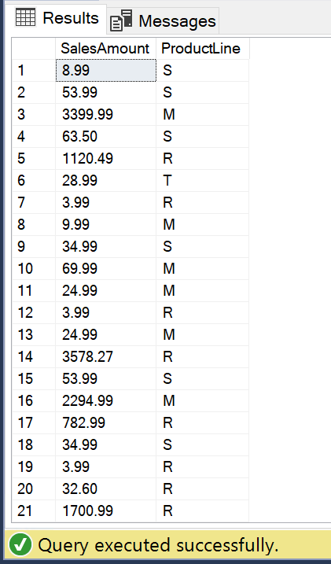

# Azure Synapse Analytics的创建和连接

## Exercise 1： 准备Azure存储账户
1.	打开Azure Portal: portal.azure.cn
2.	点击+ create a resource，选择Storage， 创建storage account
3.	storage account配置页面如下：

    

    -	资源组：点击create new创建一个新的资源组
    -	Storage account name ：自定义
    -	**Location： China North2**

4.	点击Blobs存储

    
 
5.	点击+Container, 创建新的Container

    

    Container创建完成后，点击存储账户的“Access keys”，复制Key1，我们要将Azure Storage Explorer连接到该存储账户。
    
    

6.	打开Azure Storage Explorer, 选择使用存储账户名密钥登陆

    

    将存储账户名和复制的密钥填入其中

    
 
    连接成功后，可以在Azure Storage Explorer中看到自己的存储账户，右键点击Blob Container, 选择Create Blob Container, 输入名称“labcontainer2”
 
7.	返回Azure portal查看存储账户下的blob container，可以看到刚才在虚拟机中通过Azure Storage Explorer创建的新的container
 
    

## Exercise 2: 创建Azure Synapse Analytics

1.	在Azure portal中点击“create a resource”，选择“Azure Synapse Analytics”，然后进入以下界面。

    

    -	资源组选择刚才已创建的资源组；
    -	创建SQL Server，在Server项点击“Create new”，Location选择**China North 2**
    -	Performance level选择“DW100c”

 
    DW的计算和存储的计费是独立的，这样做的好处是如果有一段时间不需要使用数据仓库，可以通过暂停计算资源来节省成本。

2.	配置完成后，点击Next ：Additional setting

    

	选择Sample, 创建样本数据。然后可以点击“Review+Create”

3.	点击创建，稍等片刻，待创建成功

## Exercise 3 : 从客户端连接到Azure Synapse

1.	打开刚才创建好的Azure Synapse
2.	稍后在通过SSMS连接时，需要用到Server name，可以点击复制 
3.	配置防火墙：点击“show firewall setting”，检查“Allow Azure services and resources to access this server”是否打开，如果没有，请打开允许访问

    

4.	打开SSMS(SQL Sever Management Studio)，输入Server name。
Authentication选择“SQL Server Authentication”，然后输入SQL Server的用户名和密码；

    

5.	连接成功之后，点击new query，选择220xdw作为运行环境

    

    在新的query窗口中输入下列T-SQL语句，点击Execute

    ```SELECT SalesAmount, ProductLine FROM dbo.SalesByCategory;```

    执行结果如下：

    


