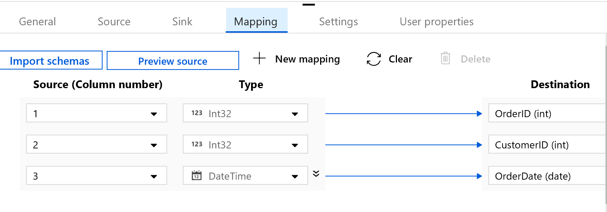
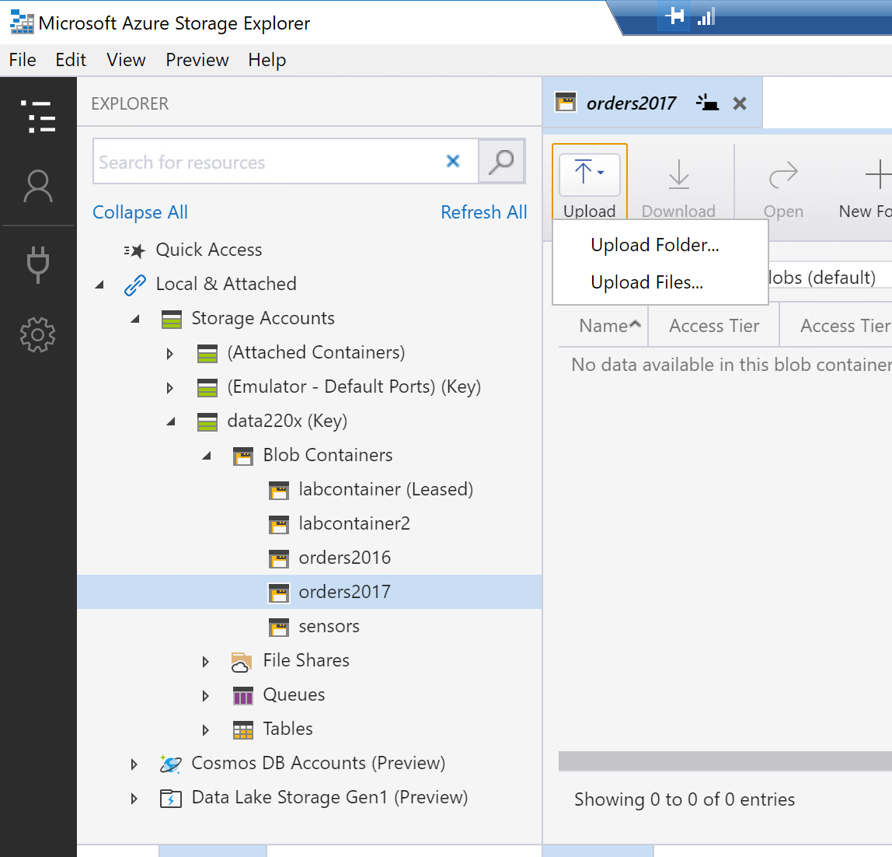
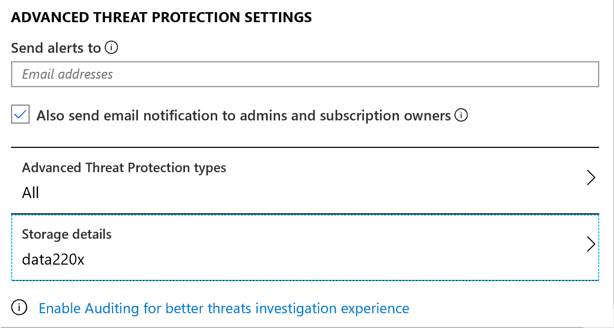
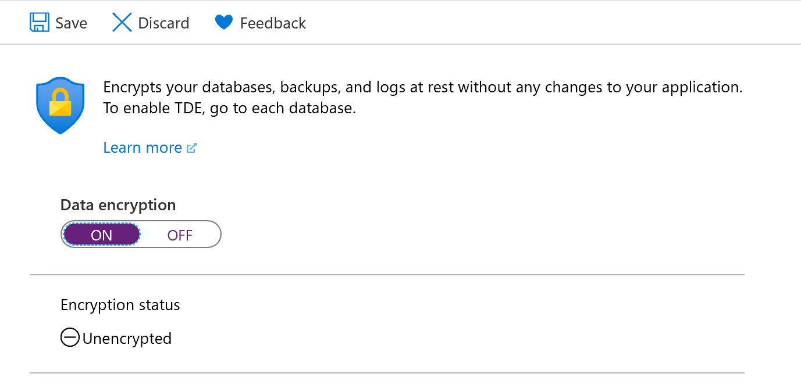
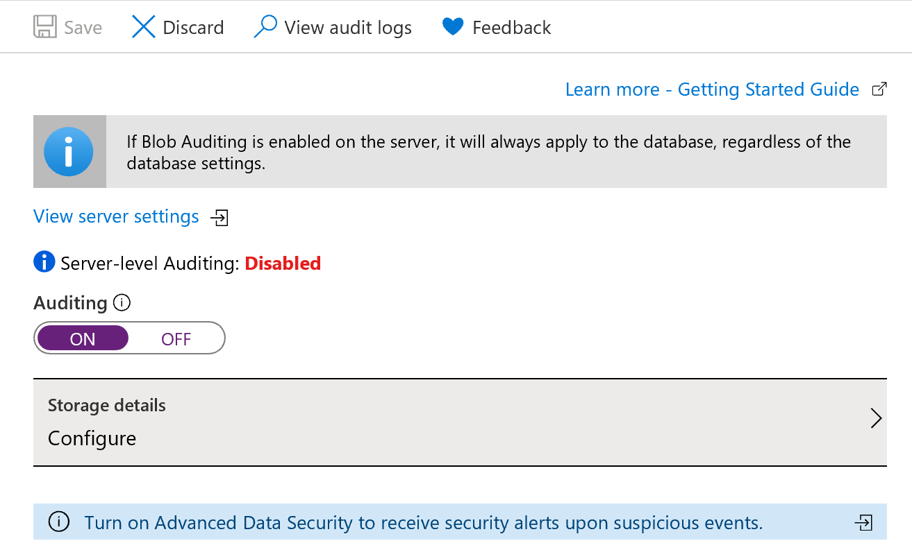

# Azure Synapse Analytics的数据集成与处理

本实验将会指导您使用Azure Blob存储、Azure数据工厂、Azure流分析和Polybase加载数据，并将数据转移到Azure Synapse Analytics中。

## Exercise 1: 上传数据到Azure Blob Storage

1.	在虚拟机中打开以下链接，并点击download；将文件下载至本地之后进行解压缩
https://github.com/MicrosoftLearning/Dat220x-Azure-SQL-DW/blob/master/DAT220xLab3.zip
 
2.	打开Azure Storage Explorer，找到自己的存储账户，右键点击Blob Containers, 选择Create Blob Container。 进行三次该操作分别给container命名“orders2016”、“orders2017”和“sensors”；
 
3.	上传文件，点击已创建好的container “orders2016”点击Upload，将“2016Orders.csv”上传上去，注意暂时不用上传“2017Orders.csv”。
 
4.	点击已创建好的container “sensors”点击Upload，将“BeachWeatherStationsAutomatedSensors.csv”上传上去

## Exercise 2: 通过Azure Data Factory转移数据
1.	打开SSMS， 点击New Query window，输入以下T-SQL命令，该命令用于创建一个Orders表，点击执行
    ```
    IF OBJECT_ID('dbo.Orders','U') IS NOT NULL DROP TABLE dbo.Orders;
    CREATE TABLE [dbo].[Orders]
    (
    [OrderID] [int] NOT NULL,
    [CustomerID] [int] NOT NULL,
    [OrderDate] [date] NOT NULL
    )
    WITH
    (
    DISTRIBUTION = ROUND_ROBIN,
    CLUSTERED COLUMNSTORE INDEX
    )
    GO
    ```

2.	在azure portal中创建Azure Data Factory
    

    注意：选择已存在的资源组，Location选择China North 2
 
3.	打开已创建好的data factory，点击“Author & Monitor”

    
 
4.	在新的页面中，点击Create Pipeline
 
    

    在Actitives中搜索“copy”关键字，并将“copy data”拖拽到面板中，接下来我们进行该pipeline的配置。
 
5.	配置Pipeline的源，点击+new
    
    

    选择Azure Blob Storage，格式选择DelimitedText
  
    

    配置Source信息：选择订阅，输入自己存储账户的名称。配置完之后点击Test Connection， 测试是否可以连接成功。
 
    file path点击browse 将orders2016添加进来

    
 
 
6.	回到Azure Data Factory 页面，与配置Source类似，配置Sink

    注意要点击Test connection，测试一下连接是否成功。
 
 
7.	然后，我们要来配置Source和Sink中数据类型的mapping。点击Mapping

    
 
8.	配置完成之后，点击Add trigger -> Trigger now

    
 
9.	在最左侧边栏，点击红色的“Monitor”选项卡， 可以看到刚才我们创建的pipeline正在运行，待状态变为Succeeded， 表示执行成功

    
 
10.	验证Pipeline执行结果 ：在SSMS中 , 输入以下T-SQL命令，可以查看通过Azure Data Factory从Azure Blob中导入的数据

    ```SELECT * FROM Orders```

    

## Exercise 3 利用Azure流处理进行实时数据传输

在本小节中，您会尝试使用Azure Stream Analytics服务，通过该服务实现Azure Blob存储和DW数据的实时同步
1.	创建Azure Stream Analytics服务, **Location选择China North 2**

    

2.	配置stream analytics的输入

    点击inputs，在inputs页面点击+Add stream input，选择Blob storage。本练习做blob存储到SQL DW的数据同步
 
    

3.	同理，配置输出端，选择SQL Database
 
    

4.	在Query窗口中输入具体的同步命令
    ```
    SELECT
        OrderID,
        CustomerID,
        OrderDate
    INTO
        orderoutput
    FROM
        orderinput
    ```

5.	启动Stream Analytics job，点击Start,  选择Now
    
    
 
注意待启动成功之后再执行下面的操作

6.	在windows VM上打开2017Orders.csv文件，添加一行数据

    ``` 1000,6,5/16/2017```

    

    将本地“2017Orders.csv”上传到Azure Blob中

    
 
 
7.	上传完之后，在SSMS query windows中运行查询命令

    ```SELECT * FROM Orders```
    
    

    可以看到2017年的数据被同步到SQL DW中。
 
    在Azure Portal的stream analytics页面可以看到Monitor监测到数据的输入输出。此外，stream analytics还可以与PowerBI连接，实现数据的实时监控。

    

## Exercise 4: 利用Polybase加载和转换数据

PolyBase是一种可通过T-SQL语言从外部数据源读取数据的技术。在SQL Server 2016及更高版本可以访问Hadoop和Azure Blob存储中的外部数据。从SQL Server 2019开始，可以使用PolyBase访问SQL Server、Oracle、Teradata和MongoDB中的外部数据。

本节练习，我们利用Polybase从Azure blob存储中导入数据至Azure Synapse。

1.	打开portal页面，在自己的资源组中，点击进入已创建的storage account  -> 点击Access Keys，复制Key1中的Key值，填入第二步中的<StorageAccountKey1>处，注意保留单引号。


2.	在SSMS中输入以下命令，这些命令用于配置访问外部数据的凭证。 .

    \<StorageContainer>用sensors替换，sensors是在Exercise1中创建的blob容器名；\<StorageAccount>用自己的存储账户名称替换

    ```
    CREATE MASTER KEY;
    CREATE DATABASE SCOPED CREDENTIAL LabStorageCredential WITH IDENTITY = 'user',
    SECRET = '<StorageAccountKey1>';

    CREATE EXTERNAL DATA SOURCE LabStorage WITH (
    TYPE = HADOOP,
    LOCATION =
    'wasbs://<StorageContainer>@<StorageAccount>.blob.core.chinacloudapi.cn', CREDENTIAL = LabStorageCredential
    );

    CREATE EXTERNAL FILE FORMAT TextFile WITH (
    FORMAT_TYPE = DelimitedText, FORMAT_OPTIONS (FIELD_TERMINATOR = ',')
    );
    ```
    ```
    CREATE EXTERNAL TABLE dbo.BeachSensorsExternal ( 
        StationName VARCHAR(50) NOT NULL, 
        MeasurementTimestamp VARCHAR(50) NOT NULL, 
        AirTemperature DECIMAL(9,2) NULL, 
        WetBulbTemperature DECIMAL(9,2) NULL,
        Humidity DECIMAL(9,2) NULL,
        RainIntensity DECIMAL(9,2) NULL, 
        IntervalRain DECIMAL(9,2) NULL, 
        TotalRain DECIMAL(9,2) NULL,
        PrecipitationType DECIMAL(9,2) NULL, 
        WindDirection DECIMAL(9,2) NULL, 
        WindSpeed DECIMAL(9,2) NULL,
        MaximumWindSpeed DECIMAL(9,2) NULL, 
        BarometricPressure DECIMAL(9,2) NULL, 
        SolarRadiation DECIMAL(9,2) NULL, 
        Heading DECIMAL(9,2) NULL,
        BatteryLife DECIMAL(9,2) NULL, 
        MeasurementTimestampLabel VARCHAR(50) NOT NULL, 
        MeasurementID VARCHAR(100) NOT NULL
    )
    WITH (
        LOCATION='/',
        DATA_SOURCE=LabStorage, FILE_FORMAT=TextFile
    );
    ```
3.	在右侧边栏可以看到，Tables下面有一个External Tables分支，即外表。我们可以用SELECT语言进行查询：

    ```
    SELECT TOP 10 * FROM dbo.BeachSensorsExternal;
    ```
 
4.	既然你已经引入外表中的数据，下面你可以在SQL DW中创建一张表，加载转换外表中的数据。在query windows中输入以下命令，这些命令在SQL DW中创建一个新的表 BeachSensor，然后取外表的子集。该命令返回BeachSensor中记录的数量。

    ```
    CREATE TABLE [dbo].[BeachSensor]
    WITH (
    DISTRIBUTION = ROUND_ROBIN,
    CLUSTERED COLUMNSTORE INDEX
    ) AS
    SELECT
    StationName,
    CAST(MeasurementTimestamp as DATETIME) AS MeasurementDateTime,
    AirTemperature,
    WetBulbTemperature,
    Humidity,
    RainIntensity,
    IntervalRain,
    TotalRain,
    PrecipitationType,
    WindDirection,
    WindSpeed,
    MaximumWindSpeed,
    BarometricPressure,
    SolarRadiation,
    Heading,
    BatteryLife
    FROM dbo.BeachSensorsExternal;
    SELECT COUNT(*) FROM dbo.BeachSensor;
    ```


# Azure Synapse的配置和管理

## Exercise1: SQL DW的性能分析工具

系统动态管理视图（Dynamic Management Views, DMVs）工具可用于监视服务器实例的运行状况、诊断故障以及优化性能。可用于SQL Server、Azure SQL数据库、Azure SQL DW以及并行数据仓库。
动态管理视图和函数分为两种类型：

-	服务器范围内的动态管理视图和函数。此类型需要具有该服务器的VIEW SERVER STATE权限
-	数据库范围内的动态管理视图和函数。此类型需要具有该数据库的VIEW DATABASE STATE权限
所有动态管理视图的函数都存在于sys架构中，并遵循dm_*命名约定。

在本小节练习中，您将使用DMVs工具分析查询性能

1.	在SSMS中，打开query windows输入以下T-SQL命令

    下列命令中使用了两个DMVs：sys.dm_pdw_exec_requests和sys.dm_pdw_exec_sessions
    ```
    SELECT es.[status],
    es.query_count,
    er.[status],
    er.submit_time, 
    er.start_time,
    er.end_time,
    er.total_elapsed_time,
    er.[label],
    er.resource_class,
    er.command
    FROM sys.dm_pdw_exec_requests er
    JOIN sys.dm_pdw_exec_sessions es ON er.session_id = es.session_id
    ```
    查询结果展示了数据库的很多关键信息，例如命令的执行状态，命令执行所用的时间，以及使用的资源类型，通过DMVs可以方便的查看系统性能。
 
    我们可以继续修改query语句，使用动态管理视图sys.dm_pdw_waits模块，该模块可以保存在命令执行过程中所有需要等待的状态信息，包括等待的类型，受影响的对象有哪些以及受影响对象的类型等。
    ```
    SELECT w.[type],
    w.[object_type],
    w.[object_name],
    w.[state],
    es.[status],
    es.query_count,
    er.[status],
    er.submit_time,
    er.start_time,
    er.end_time,
    er.total_elapsed_time,
    er.[label],
    er.resource_class,
    er.command
    FROM sys.dm_pdw_exec_requests er
    JOIN sys.dm_pdw_exec_sessions es ON er.session_id = es.session_id
    JOIN sys.dm_pdw_waits w ON es.session_id = w.session_id
    ```


## Exercise2: 管理SQL DW 用户和组

本练习中，您将会学习创建和使用SQL DW用户、组和相应的权限。

1.	 打开两个query windows窗口，运行环境分别选择master和sql dw

2.	在第一个窗口，master database上运行下列命令：创建一个新的SQL Login ：ApplicationLogin，并设置一个强密码，点击Execute

    ```CREATE LOGIN ApplicationLogin WITH PASSWORD = 'Awes0me_P@ssw0rd!';```
3.	在第二个窗口，再次检查是否连接至SQL DW database，然后输入下面的命令：基于master上新创建的Login来创建一个新的用户（user）：ApplicationUser

    ```CREATE USER ApplicationUser FOR LOGIN ApplicationLogin;```

    输入下列的T-SQL，创建一个role：dw_admin

    ```CREATE ROLE dw_admin;```

    为刚才创建的dw_admin这个role配置相应的权限

    ```
    GRANT
    ALTER,
    CONTROL,
    DELETE,
    EXECUTE,
    INSERT,
    SELECT,
    UPDATE,
    TAKE OWNERSHIP,
    VIEW DEFINITION
    ON SCHEMA::dbo
    TO dw_admin;
    ```

    通过下列命令，将ApplicationUser用户加到dw_admin这个role中

    ```EXECUTE sp_addrolemember N'dw_admin', N'ApplicationUser'```
    
    查询系统sys.database_principals这个表，每一行对应一个安全规则。
    
    ```SELECT * FROM sys.database_principals ```
 
## Exercise 3: 管理安全Feature

本小节将会学习使用安全功能，包括高级数据安全、透明数据加密(Transparent Data Encryption)、 审核、防火墙和虚拟网络配置
 
1.	高级数据安全（Advanced data security, ADS）
高级数据安全(ADS)是SQL高级安全功能的统一程序包，包括以下三个方面的功能：
    -	发现和分类敏感数据
    -	漏洞评估：可以直观查看安全状态，给出解决安全问题的可操作步骤，及时发现、跟踪和帮助修正潜在的数据库漏洞；
    -	高级威胁防护：用于检测异常活动，防御SQL注入攻击，及时检测异常数据库访问模式，并提供及时的安全警报。
    -	

    1）在左侧边栏点击“高级数据安全”，进入页面后点击setting

    

2)  打开高级数据安全防护，也可以打开周期性扫描数据库漏洞。Azure每七天会对database进行一次扫描，大约在每个周日的凌晨12:00AM UTC进行，设置存储账户用来存储扫描的结果。

    
 

3) 还可以配置邮件地址，一旦有alerts产生，会自动的发送邮件通知。

        
 
配置完成之后，点击保存。Azure SQL DW现在就可以主动监测和监测异常的数据库活动，并将日志结果记录在指定的存储账户中。

2.	透明数据加密（Transparent data encryption, TDE）

    透明数据加密可以对静态数据进行加密和解密，避免恶意活动造成的威胁。在加密数据库时，可以对关联的备份和事务日志文件加密，无需对应用程序进行任何修改。

    启用方法：

    1）	点击侧边栏中“透明数据加密”

    
 
    2）	打开data encryption 然后点击保存，稍等几分钟后Encryption status显示为Encrypted。
 
    

3.	审核Auditing

    SQL DW中审核(Auditing)安全功能可用于定义服务器级和数据库级别的审核策略，并帮助保留选定时间的审核痕迹；报告数据库活动；分析报告，查找可疑事件及异常活动。

    1）	点击侧边栏中“审核”选项卡

    2）	如果想设置服务器审核策略，可以选择数据库审核页中的“View server settings”查看服务器设置链接，然后可查看或修改服务器审核设置。服务器审核策略应用于此服务器上所有现有和新建数据库。

    3）	如果希望在数据库上启用审核功能，请将下面的按钮保持为“ON”的状态
 
     
     
    点击进入配置详情，对审核日志存储位置进行配置。您可以将日志写入Azure存储账户、Azure Monitor日志的Log Analytics工作区，或使用事件中心管理日志，也可以将这些功能组合起来搭配使用，从而满足更全面的需求。
  

