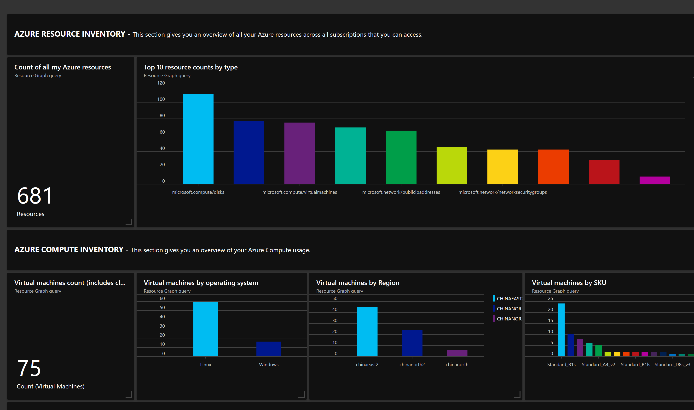

## WIP - Azure Governance Services Hands on Lab

---

## Azure Governance - Azure Resource Graph Hands on Lab

Azure Resource Graph 是 Azure 中的一项服务，旨在通过提供高效和高性能的资源浏览来扩展 Azure 资源管理器，它能够跨给定的订阅组进行大规模查询，使你能够有效地管理环境。

Azure Resource Graph 是 Azure 中提供的一种对资源进行查询整理的方式，可以根据需要，定制化查询结果，并针对查询结果做相应的操作，比如 `形成可视化的图表`, `导出成Excel表格`等，方便了运维人员对于云端资源的管理。

Azure Resource Graph 始终保持与环境中资源更新的同步，资源管理器会将资源的更新同步给 Resource Graph；Azure Resource Graph 使用 `Kusto` 作为查询语言，以确保用户对于 Azure 云端查询语言的一致性。

### 通过 Azure Portal，运行自己的第一个查询

Azure Portal 针对 Azure Resource Graph 提供了便捷的查询工具 `Azure Resource Graph Explorer`，可以允许用户进行快速的查询，并将查询结果可视化到 Dashboard中，便于直观的了解环境中的资源。

点击进入  `Azure Resource Graph Explorer`


运行示例查询语句，查看 Azure 中 `Windows` / `Linux` 操作系统的虚机个数

```
# 查询语言如下
where type =~ 'Microsoft.Compute/virtualMachines'
| summarize count() by tostring(properties.storageProfile.osDisk.osType)
```


### 制作 Azure 资源的显示大屏

通过 `参考资料` 中提供的示例，导入做好的资源模板，资源模板针对`环境中的整体资源` / `计算资源` / `存储资源` / `网络资源` / `数据库资源` / `Web App资源`


可以看到，创建了一个名为 `Resource Graph Explorer - Sample Dashboard #1` 的 Dashboard


接下来，我们可以根据需要，对 Demo 模板做适当的修改

__*更改一 添加一个图表，显示各个区域虚机的数量分布*__

```
# 查询语言如下
where type == "microsoft.compute/virtualmachines"
| summarize VMCount=count() by location
| order by VMCount desc
|extend ['Count (Virtual Machines)']=VMCount
| project location, ['Count (Virtual Machines)']
```


__*更改二 添加一个图表，显示各个型号机器的数量分布*__

```
# 查询语言如下
where type == "microsoft.compute/virtualmachines"
| extend Size = tostring(properties.hardwareProfile.vmSize)
| summarize VMCount=count() by Size
| order by VMCount desc
```


__*更改三 添加一个图表，显示SSD/HDD的数量*__

```
# 查询语言如下
where type == "microsoft.compute/disks"
| summarize DiskCount=count() by SKU=tostring(sku.name)
| order by DiskCount desc
| extend ["Count (Disks)"]=DiskCount
| project SKU, ["Count (Disks)"]
```


### 借助 Log Analytics 扩展资源显示的大屏

`Azure Resource Graph` 功能很强大，可以帮助我们快速的去查找，整理环境中的资源；虽然有些资源的信息，在 `Azure Resource Graph` 中无法拿到，比如 `运行状态`，或者用户有些针对资深的定制化需求，这个时候，我们可以借助于 `Logic Apps` + `Automation` + `Log Analytics` 来补足这块的缺失，让我们的资源显示更加的完整。


接下来的实验，将借助于 `Logic Apps` + `Automation` + `Log Analytics`, 查询环境中机器的运行情况，每15分钟查询一次，并将结果存储到Log Analytics中

__*准备工作*__

- 创建一个 Log Analytics workspace `resourceGraphLA`, Log Analytics主要是用来收集存储用户自定义的数据

- 创建一个 Logic App `zjLogicApp`, Logic App的作用主要是为了弥补Automation的Scheduler无法分钟级别运行Runbook

- 创建一个 Automation `resourceGraphExtend`

__*编写 Python Runbook，通过 Python SDK 收集虚机的运行信息，并发送至LA*__

通过 `Log Analytics API` 发送数据到 `Log Analytics workspace`, 需要 `workspaceid` & `key`


在 Automation 中创建一个名为 `logAnalyticsCreds`, 所有需要向`Log Analytics`发送数据的 `Runbook` 都可共享此 `Creds`, 其中 `username` 为 `workspaceid`, `password` 为 `primary key`


创建一个名为 `vmStateGraphExtend` 的 `Runbook`, 用来收集所有VM的运行状况，并发送至 `Log Analytics`，具体代码请参见 [vmStateGraphExtend.py](./files/governance/arg/vmStateGraphExtend.py)，然后发布


进入 `Logic App`, 创建一个新的工作流，选择定时触发，每15分钟运行收集一次，并调用 `Automation Runbook` 将数据发送至 `Log Analytics`


进入 `Log Analytics workspace`, 我们能够看到，自定义的数据已经发送过来了，查询形式如下：


这样我们就可以通过 `Log Analytics`, 创建自定义的查询，实时掌握环境中虚机运行状态及各个状态的数量

```
# 查询语句
vmExtendGraph_CL
| where graph_tag_s == 'extend_graph_vm_state'
| summarize count(vm_name_s) by vm_state_s, bin(TimeGenerated, 15m)
```


这样，我们就可以通过这种方式，增强了资源查询和展示的方式。

最后我们要做的就是好好调整下Dashboard的布局，留下我们想要的，如下：




关于本次实验的 Dashboard 的文件，可以通过这里找到 [labDashboard.json](./files/governance/arg/labDashboard.json)

### 参考资料

- [Azure Resource Graph 服务概述](https://docs.microsoft.com/zh-cn/azure/governance/resource-graph/overview)

- [示例Dashboard](https://github.com/Azure-Samples/Governance/blob/master/src/resource-graph/portal-dashboards/sample-2/resourcegraphexplorer-sample-1.json)

- [使用 HTTP 数据收集器 API, 将日志数据发送到 Azure Monitor](https://docs.azure.cn/zh-cn/azure-monitor/platform/data-collector-api)

---