# Azure 监控平台 Whitepaper & Handson

---

## 实验环境准备

### 第一部分 被监控资源的环境准备

环境准备，需要预先搭建准备的环境，并准备相应的数据，以便在实验中更为形象的展示监控的能力。环境准备并不是本次白皮书的重点，请参照以下列出的材料进行准备或寻求相关的帮助。

本次实验预先准备了两个环境，分别为两个网站，分别部署了基于 `IaaS (虚机&SQL VM)` 进行构建的网站，以及基于 `AKS` 构建的网站。在创建资源时，请将`环境一 IaaS (虚机&SQL VM)`放入资源组`Prj01`, 将`环境二[基于 AKS]`放入资源组`Prj02`; 另外创建`Admin`资源组，作为平台级资源管理；资源组名称后续实验有涉及。

#### 实验环境一 相关资料

>请参照 [Azure Monitoring Hackathon Deployment Guide](./docs/Deployment_Setup_Guide.docx) 完成环境的构建

>单独部署一台LinuxVM

#### 实验环境二 相关资料

> 请参照 [教程1-4](https://docs.microsoft.com/zh-cn/azure/aks/tutorial-kubernetes-prepare-app) 完成 `AKS集群&ACR&Demo应用程序` 部分的构建

实验一&实验二的环境暂时以 `Global Azure` 为基准，如果部署在 `Azure Mooncake`，需要做适当的调整。

---

## 配置并收集 实验环境中 各资源的监控数据

### 规划创建监控使用的 Storage Accounts & Log Analytics workspaces

本次实验，将会通过 `ARM Template` 结合 `Azure CLI`部署出环境需要的 `Log Analytics workspaces` 及 `Storage Accounts`.

本次实验的规划思路为：

- 订阅级别的 Activity Log 建议放在单独的 Log Analytics workspace 中, 订阅级别的 Activity Log 存档保存在单独的 Storage Account中

- 订阅下的 Azure Resources，以 Project 为单位进行划分

本次实验，将创建名为 `CentralLAWS` & `Prj01LAWS` & `Prj02LAWS` 三个 Workspace，分别位于 Resource Group `Admin` & `Prj01` & `Prj02`。部署的模板请参阅 ：[loganalytics_deploy.json](./files/monitor/arm-templates/loganalytics_deploy.json)

```
# 通过 az cli 创建 CentralLAWS
az group deployment create --resource-group Admin --name deploy01 --template-file loganalytics_deploy.json  --parameters workspaceName=CentralLAWS --parameters dataRetention=90

# 通过 az cli 创建 Prj01LAWS
az group deployment create --resource-group Prj01 --name deploy01 --template-file loganalytics_deploy.json  --parameters workspaceName=Prj01LAWS --parameters dataRetention=90

# 通过 az cli 创建 Prj02LAWS
az group create -n $yourGroupName -l eastus
az group deployment create --resource-group $yourGroupName --name deploy01 --template-file loganalytics_deploy.json  --parameters workspaceName=project01WS
```

本次实验，将创建名为 `centralsa` & `prj01sa` & `prj02sa` 三个 Storage Account, 分别位于 Resource Group `Admin` & `Prj01` & `Prj02`;

```
# 通过 az cli 创建 centralsa
az storage account create -n centralsa -g Admin --sku Standard_LRS

# 通过 az cli 创建 prj01sa
az storage account create -n prj01sa -g Prj01 --sku Standard_LRS

# 通过 az cli 创建 prj02sa
az storage account create -n prj02sa -g Prj02 --sku Standard_LRS
```
# 创建存储账户 storageaccdiagvms, 用于存储Project01中VM的诊断设置
az storage account create -n storageaccdiagvms -g project01WS --sku Standard_LRS

>参考资料 : [使用 Azure CLI 2.0 创建 Log Analytics 工作区](https://docs.microsoft.com/zh-cn/azure/azure-monitor/learn/quick-create-workspace-cli)

### 配置开启资源中的诊断日志，并将诊断日志配置到 Log Analytics workspace & Storage Account

并不是所有的资源都支持诊断日志，请参考上文中的链接，获取支持诊断日志的服务。建议在生产环境中开启重要资源的诊断日志，以便在出现问题时，能够有更多的数据分析根本原因。默认诊断日志是不开启的。

诊断日志可以存储在 `存储账户` & `Event Hub` & `Log Analytics`，建议将诊断日志存储于Log Analytics workspace中，同时配置Storage Account用于长期保存数据。

针对`Prj01`, 我们可以通过 `Azure Monitor - Diagnostics Settings` 中查看到诊断日志的设置状态。

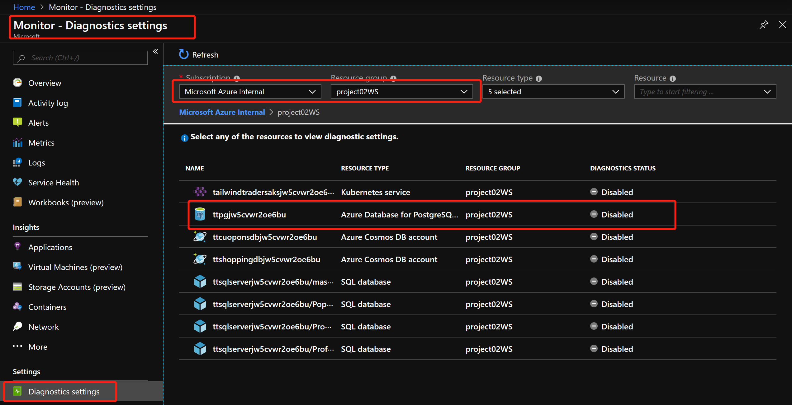

Step 1 在 Portal 中，通过`Azure Monitor`设置`NIC - Diagnostic Settings`

本次实验将通过 Azure Portal，实现针对 Diagnostics Settings 的设置; 对于所有状态为 `Disabled` 的资源，都可以通过Portal完成诊断日志的设置，以 `Prj01sqlSrv16Nic` 为例：

选择 `Add diagnostic setting`

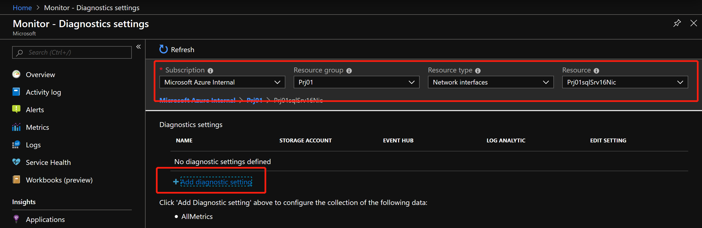

设置相应参数，将诊断日志保存在 Log Analytics 中，针对诊断日志，建议的命名方式为 `name-resource-diag`，便于后续的维护人员确认。

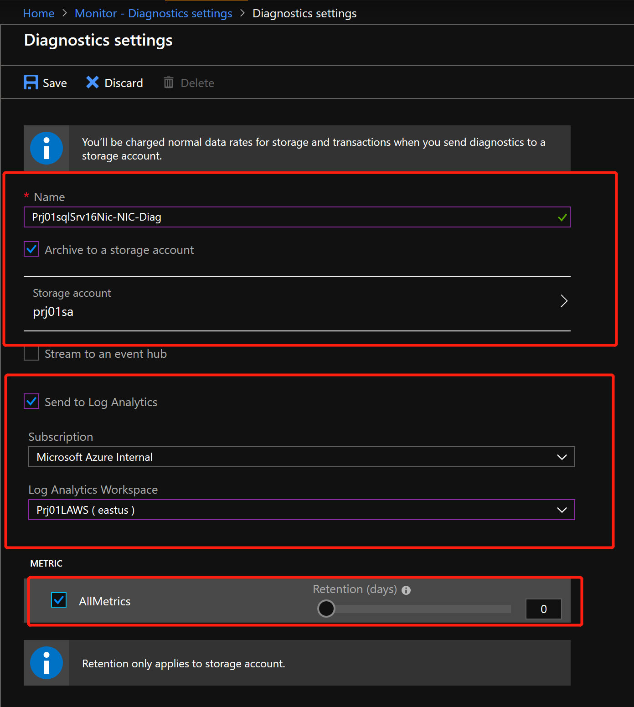

Step 2 为 VM 配置诊断设置，并读取到 `Log Analytics`

Azure中有一些特殊资源，例如 `Service Fabric` & `VM`, 他们设置诊断日志的时候，只能存储在Storage Account中。为了将数据可以集中于Log Analytics，我们可以在设置到存储账户后，设置Log Analytics，从存储账户中读取日志信息，以供后续的分析。我们可以在环境中按照项目，设置存储账户用来收集诊断日志信息。

本次实验的对象为 VM `LinuxVM01`。由于VM的诊断配置中，需要配置存储账户，会将所有的数据（Metrics&Logs）存放于此，因此，建议一个Project中使用一个存储账户存储所有VM的数据，便于管理。

进入选中的VM，点击 `Diagnostic settings`,  选择 `Storage Account` - `prj01sa`, 开启VM的诊断日志

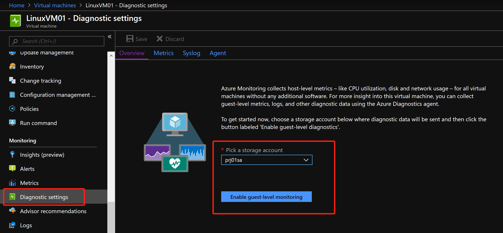

检查诊断日志默认收集的数据

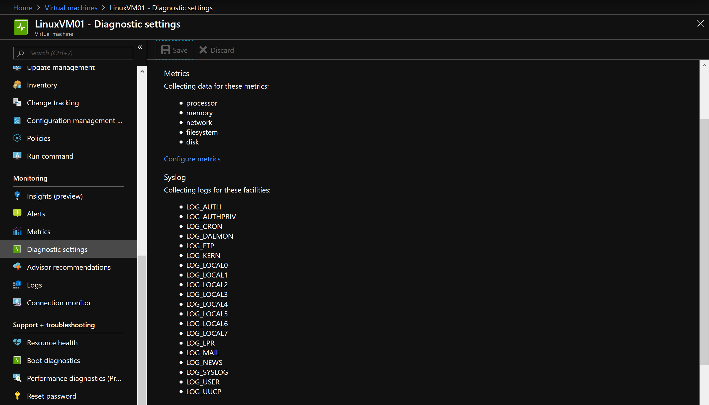

我们根据如上步骤，设置好`Prj01`中所有VM的诊断设置；设置好所有的VM之后，通过 Azure Portal，将存储账号与Log Analytics进行设置连接，这样，就可以通过Log Analytics统一接收并分析多个资源的日志数据。

进入 Log Analytics 工作区 `Prj01LAWS`, 并点击`Storage accounts log`, 添加`Add`

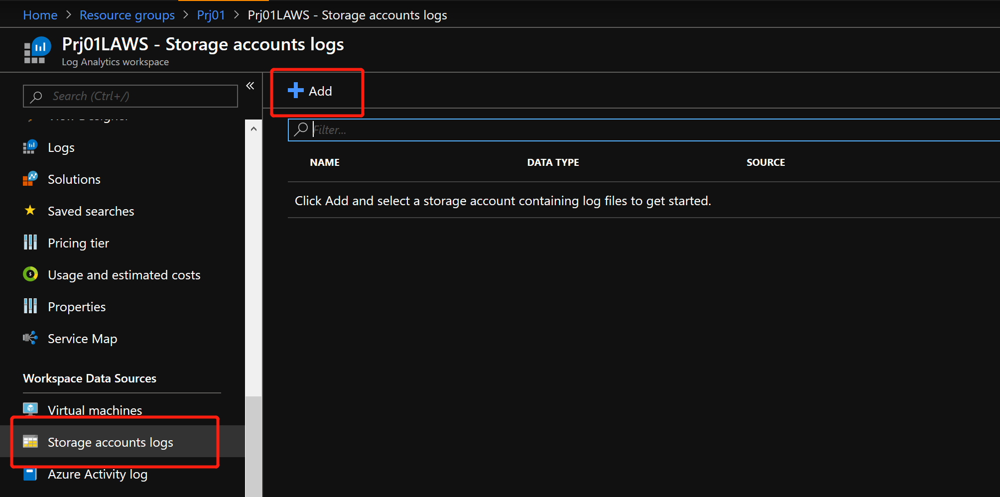

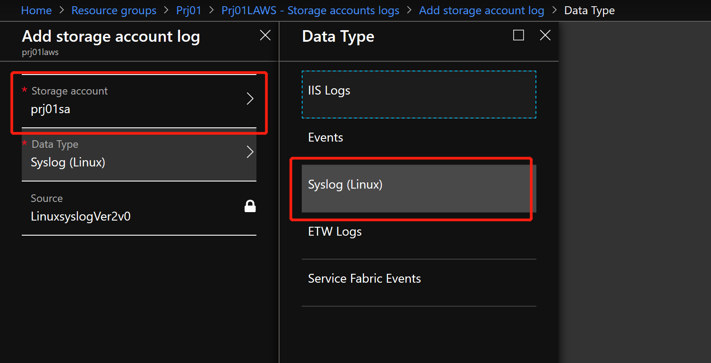

初次设置，需要等待30mins，就可以在 Log Analytics中看到数据。

> __*资料参考：*__
>- [如何在Portal设置诊断日志](https://docs.microsoft.com/zh-cn/azure/azure-monitor/platform/diagnostic-logs-stream-log-store#stream-diagnostic-logs-using-the-portal)
>- [在虚拟机中为事件日志和 IIS 日志收集启用 Azure 诊断](https://docs.microsoft.com/zh-cn/azure/azure-monitor/platform/azure-storage-iis-table#enable-azure-diagnostics-in-a-virtual-machine-for-event-log-and-iis-log-collection)
>- [使用 Azure 门户从 Azure 存储中收集日志](https://docs.microsoft.com/zh-cn/azure/azure-monitor/platform/azure-storage-iis-table#use-the-azure-portal-to-collect-logs-from-azure-storage)
>- [az vm diagnostics 详细解释](https://docs.microsoft.com/en-us/cli/azure/vm/diagnostics?view=azure-cli-latest)
>___


## Application Insights SDK Part Hands-on Lab


**第一部分 准备部署应用**
1.	到github下载本次动手实验需要用到的文件
https://github.com/rkuehfus/AzureMonitoringHackathon 
    


2.	解压后，打开其中的DeployMonHackEnv.ps1，可以使用vscode，也可以使用任何文本工具。随后更新最新的powershell

    ```Install-Module -Name AzureRM -Force -Scope CurrentUser -AllowClobber```

3.	首先在脚本文件中更改5个小写字符的名字
    ```Example: $MonitoringHackName = 'mon17'```

4.	在powershell中登录你的azure订阅
    ```Connect-AzureRmAccount```

    

5.	跑脚本文件中的前面两行，建立keyvault

    

6.	随后会跳出输出用户密码，输入你想用的密钥，并且记住

    

7.	接下来跑脚本中的这条命令，并且复制结果中的高亮部分。
    

8.	把高亮复制的内容，黏贴到azuredeploy.parameters.json文件中，并且注意更新对应的prefix

    
    

9.	跑脚本中最后的一条命令，估计要等半小时左右，所有的资源会部署完毕。

    


**第二部分** 在App Insights中观测应用的数据


1.	在Portal中新建一个App Insights的Workspace

    

2.	进入之前部署的跳板机

    

3.	在Visual Studio里打开相对应的project

    

    

    


    接下来就能看到打开的eshop网站了。
    
    


4.	接下来让我们来安装一下application insights的SDK。在右侧“Web”那里点击邮件，然后点击安装sdk。

    

    


5.	注意选择相对应的subscription等信息

    

    


6.	测试一下安装了SDK的程序是否正常运行，同时观测一下app insights的telemetry有没有正常运作。可以尝试做一些商品浏览，登录，添加商品到购物车等操作，然后观测app insights里面的信息。

    

    


7.	好了，现在来更新一下applicaton insights的Nuget Packege。装完之后再运行一遍程序，保证一切都没有问题。

    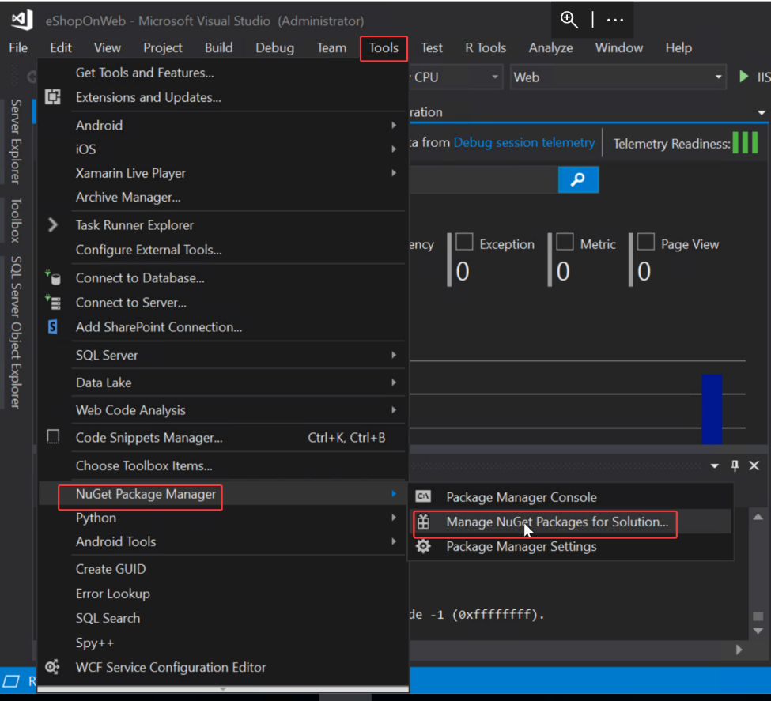

    

    


8.	把加入SDK的程序重新发布一下，我们吧这个程序发布到后端的VMSS里面，分别在1号机器，和2号机器做相同的操作。

    

    


    先选择第一台vmss的主机
    
    

    

    

    
    
    

    把vmss里面第二台机器也部署一下

    


9.	现在我们在portal里试一下ping的test，查看事件有没有被捕捉到。
    
    

    

    


10.	通过手工的脚本，在你的笔记本或者jump server上运行一下，把脚本中的url替换成你部署的eshop当中的url。在尝试看一下app insights的数据收集。
    ```
    for ($i = 0 ; $i -lt 100; $i++)
    {
    Invoke-WebRequest -uri http:// mon19webscalesetlb.eastus.cloudapp.azure.com/
    }
    ```

    

    
    Sclaeout 的规则

    


    Scalein的规则

    

    

11.	过5分钟之后，应该可以看到性能数据了，并且可以看到vmss按照规则开始自动扩展。


    

    


12.	尝试触发一个登录错误。打开网站的主页

    

    

    尝试更新一下密码

    

    

    从app insights里找到这个错误

    

    


## Application Insights Container Part Hands-on Lab


**第一部分 准备AKS集群，Application Insights**

1.	在Portal中选择创建AKS集群，注意选择的Node节点要稍微选内存和CPU大一点的型号，因为之后用到的Istio会用到比较多的资源。

    .png)

2.	建立集群的选择用Service Principle作为认证机制，这样对连接之后的ACR也会比较方便

    .png)

3.	网络的工作模式选在高级的模式，这样可以直接支持CNI。

    .png)

4.	当AKS集群建立之后，通过Kubectl命令（需要事先在客户端安装好），获得Secret。此处使用Powershell Console

    ``` az aks get-credentials --resource-group <myResourceGroup> --name <myAKSCluster> ```

5.	创建Application Insights，并且记下instruments，之后在配置中会用到。

    .png)


**第二部分 安装Helm，Istio**
1.	在本地客户端安装Helm，根据不同的的本地操作系统可以选择相应的安装方法

    https://helm.sh/docs/using_helm/#installing-helm

    比如windows可以选择用Choclolate安装

    ```choco install kubernetes-helm```

2.	创建Helm使用的Service Account，使用yaml文件进行创建

    [helm-rbac.yaml](./files/monitor/AppInsights/helm-rbac.yaml)

    ```kubectl apply -f helm-rbac.yaml```

3.	初始化AKS服务器端的Helm Tiller进程，此处使用Powershell Console

    ```helm init --service-account tiller```

4.	下载Istio，此处使用Powershell Console
```
# Specify the Istio version that will be leveraged throughout these instructions
$ISTIO_VERSION="1.1.3"

# Windows
# Use TLS 1.2
[Net.ServicePointManager]::SecurityProtocol = "tls12"
$ProgressPreference = 'SilentlyContinue'; Invoke-WebRequest -URI "https://github.com/istio/istio/releases/download/$ISTIO_VERSION/istio-$ISTIO_VERSION-win.zip" -OutFile "istio-$ISTIO_VERSION.zip"
Expand-Archive -Path "istio-$ISTIO_VERSION.zip" -DestinationPath .
```

5.	安装Istio，此处使用Powershell Console

```
# Copy istioctl.exe to C:\Istio
cd istio-$ISTIO_VERSION
New-Item -ItemType Directory -Force -Path "C:\Istio"
Copy-Item -Path .\bin\istioctl.exe -Destination "C:\Istio\"

# Add C:\Istio to PATH. 
# Make the new PATH permanently available for the current User, and also immediately available in the current shell.
$PATH = [environment]::GetEnvironmentVariable("PATH", "User") + "; C:\Istio\"
[environment]::SetEnvironmentVariable("PATH", $PATH, "User") 
[environment]::SetEnvironmentVariable("PATH", $PATH)
```

6.	Istio通过CRD来管理它的配置信息，下面通过helm来安装CRD，注意的是要在之前下载并解压的Itsio的根目录下运行命令。此处使用Powershell Console

    ```helm install install/kubernetes/helm/istio-init --name istio-init --namespace istio-system```

7.	安装Istio，此处使用Powershell Console
```
helm install install/kubernetes/helm/istio --name istio --namespace istio-system `
  --set global.controlPlaneSecurityEnabled=true `
  --set mixer.adapters.useAdapterCRDs=false `
  --set tracing.enabled=true 
```

8.	通过下面的命令查看Istio相关的Pods是不是都正常启动了。

    ```kubectl get pods --namespace istio-system```


**第三部分 使用Application Insights监控AKS里的服务**

1.	我们先通过Istio的功能把sidecar注入打开，这样新建的pod都会有一个sidecar pod注入进去，用来监控进出的流量，以及把相应的监控数据可以发给Application Insights

    ```kubectl label namespace default istio-injection=enabled```

2.	下载Application Insights adapter，链接地址如下
https://github.com/Microsoft/Application-Insights-Istio-Adapter/releases/

3.	进入这个目录/src/kubernetes/  ， 找到“ISTIO_MIXER_PLUGIN_AI_INSTRUMENTATIONKEY“，并且把这个替换成之前在Application insights里记下的Instrument Key。

4.	在之前的目录下执行命令，让所有的yaml文件部署

    ```kubectl apply -f .```

5.	执行以下命令，查看adapter是否正确运行

    ```kubectl get pods -n istio-system -l "app=application-insights-istio-mixer-adapter"```

6.	打开application insights的实时展现数据的页面，观察到已经有一个server链接上了，这个就是我们刚刚部署的adapter

    .png)

7.	现在我们来部署两个应用，一个叫sleep，一个叫httpbin。先进入之前下载并解压的Istio根目录，执行下面的部署命令。
```
    kubectl apply -f samples/sleep/sleep.yaml
    kubectl apply -f samples/httpbin/httpbin.yaml
```

8.	随后我们要从sleep发送请求到httpbin，为了发送请求我们要储存一个变量，这个命令在Bash里运行。（你可以使用WSL）

    ```export SOURCE_POD=$(kubectl get pod -l app=sleep -o jsonpath={.items..metadata.name})```

9.	从 sleep 向 httpbin 发送一个请求，这个命令在Bash里运行。（你可以使用WSL）

    ```kubectl exec -it $(kubectl get pod -l app=sleep -o jsonpath={.items..metadata.name}) -c sleep -- curl -v httpbin:8000/status/418```

10.	我们回到application insights的界面，可以观测到之前发送的这个请求已经被adapter发送到了app insights，并且实施展现在了仪表盘上。

    .png)

---
## 可视化环境中的监控信息

在上一个章节，我们完成了对于不同资源，不同环境下的数据的收集工作，接下来，我们需要做的是通过可视化的手段，呈现资源目前的一个状态，对于运维人员来说，可以直观的了解到环境中的健康状况。

### 创建 Prj01 虚机&存储&网络监控 Dashboard

本次实验是创建一个Dashboard，用于定制化环境中虚机&存储&网络指标

创建一个名为 `Prj01-Infrastructure` 的Dashboard

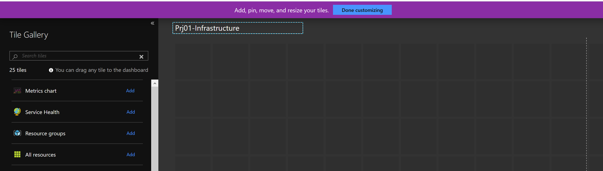

添加 `Metrics chart`

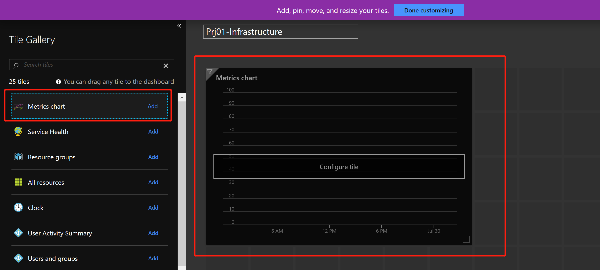

设置添加的`Metrics chart`, 配置 Title为 `VMs - Percentage CPU`，对象为 VM `LinuxVM01` & `Prj01sqlSrv16` & `Prj01VSSrv17`

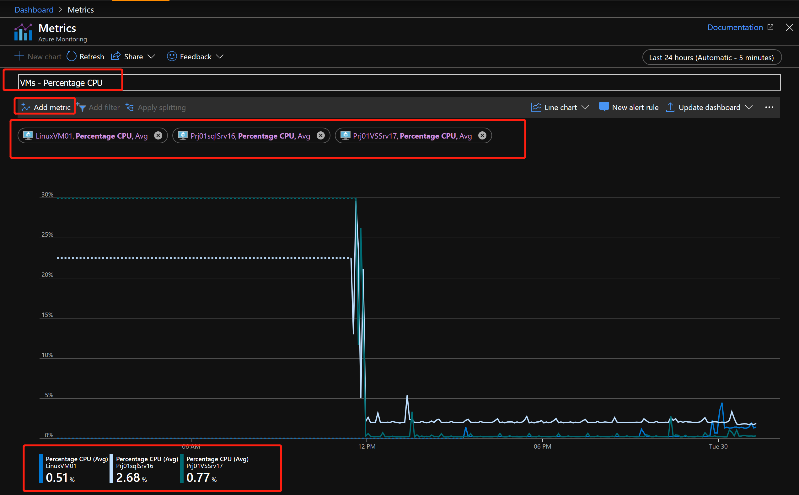

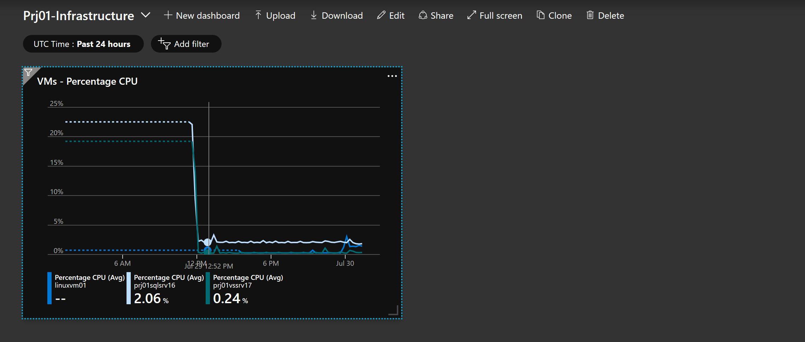

在 Dashboard 中，我们就可以实时的观测到整个环境中虚机的情况，同时，可以根据需要，Drill down到每台虚机去查看具体情况。接下来，按照上述方式，设置 `VMs- Percentage Memory`, `VMs - Network In`, `VMs - Network Out`, `VMs - Disk Available`

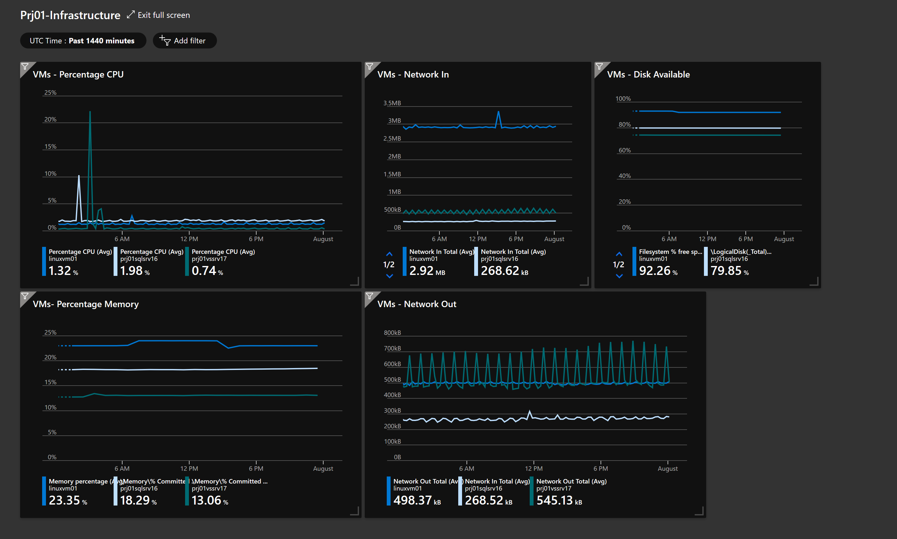

接下来，按照同样的方式，添加存储账户的监控指标，分别为`Storage Account - Availability`, `Storage Account - Used Capacity`, `Storage Account - Success E2E Latency(ms)`, `Storage Account - Blob Capacity`, `Storage Account - Table Capacity`

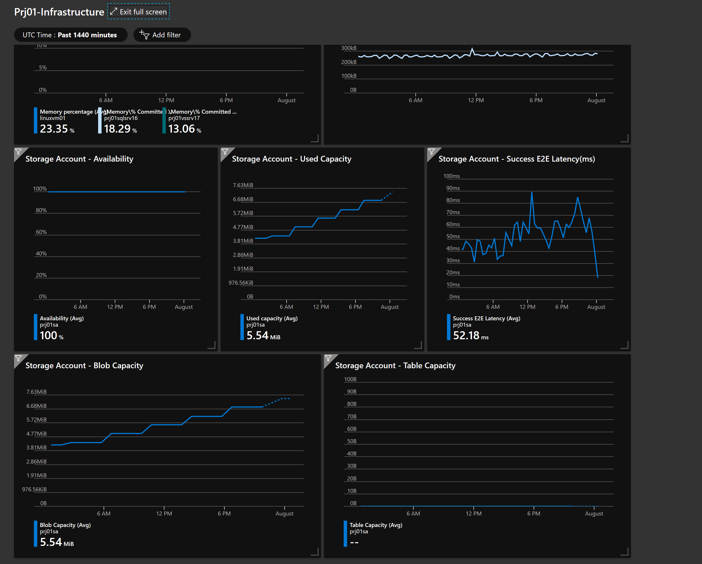

接下来，按照同样的方式，添加网络部分的监控指标，分别为`Network - Under DDoS or not`, `Network - NIC Bytes Sent`, `Network - NIC Bytes Received`

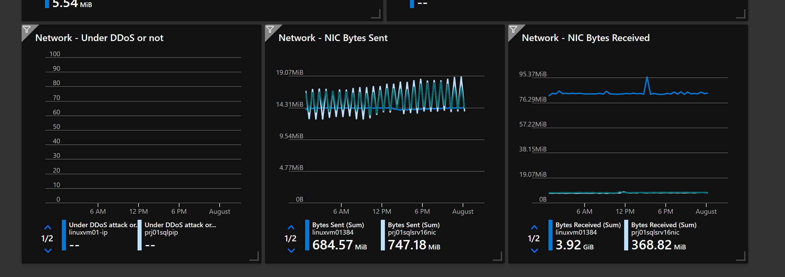

### 环境中通用信息

最后，我们创建一个 Dashboard, 名为`General - Dashboard`，用来设置环境中的快捷键，比如：`始终` & `Service Health` & `Help + Support`, 以及环境中各资源的数量。

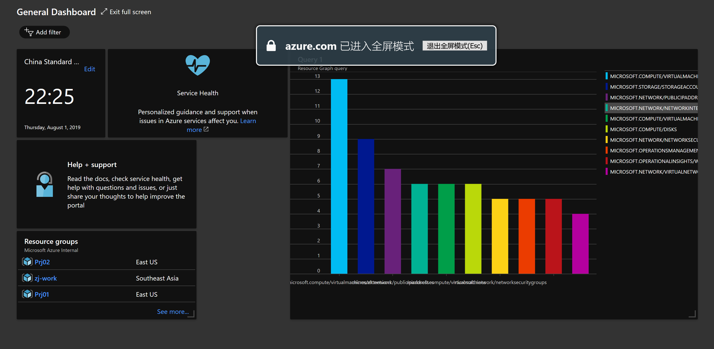

---

## 完善环境中的警报机制及后期采取的行动

经过以上两组实验，我们针对实验环境收集了数据，并建立了监控大屏，让用户可以直观的了解环境目前的运行情况。但运维人员不能一刻不停的盯着大屏，运维人员需要的是能够在环境出问题的时候，第一时间获得通知，快速修复问题，这是提高环境自动化，优化环境可用性的一个关键。警报是监控系统的一种关键手段，合理的设置关键数据的警报，能够帮助运维人员更好且自动化的监控云端环境。

如下展示了一个警报的产生过程，和处理方式：

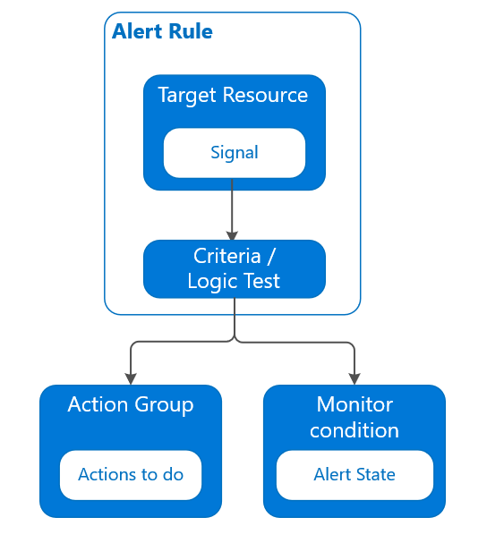

任何一个警报，都有几个关键的部分：`所针对的资源` & `触发的条件` & `警报级别` & `所采取的操作`

`Azure Alerts`支持为Azure中资源产生的`Metrics` & `Logs from Log Analytics` & `Activity Log` & `Azure 平台运行状况`等作为触发警报的数据源

`Azure Alerts`支持用户将警报定义为 `Sev0` & `Sev1` & `Sev2` & `Sev3` & `Sev4`五个等级，分别代表警报涉及的资源对当前环境的影响大小，`Sev0`最为严重

`Azure Alerts`支持用户设置不同的`Action Group`来相应不同级别的警报，响应手段包括`Email\SMS\电话` & `Webhook` & `Azure Function` & `Azure Logic Apps` & `Automation Runbook`等

### 预先规划好环境中的 Action Group

`Action Group`与`Alert Rules`是多对多的关系，双方可以互相匹配。因此在规划监控系统时，可以预先设定一些常用的通知手段，且随着自动化水平的增加，逐渐更新。

本次实验，先预先设定一些`Action Group`，主要针对环境中的警报提供`邮件/短信/电话`报警的支持。本次实验会设置三个`Action Group`，分别针对于`Admin` & `Prj01` & `Prj02`, 且`Admin`的只使用Email，`Prj01`使用`Email & SMS`，`Prj02`使用`Email`. 将完成`Admin` `Action Group`的设置，留下另外两个自行完成。

```
# 通过 Azure CLI 完成 Action Group的创建
az monitor action-group create -n General -g zjmon01 --short-name general --action email operation01 jianzsh0821@163.com

# 如果希望创建SMS的Action Group, 可通过如下命令查看完整参数
az monitor action-group create -h
```

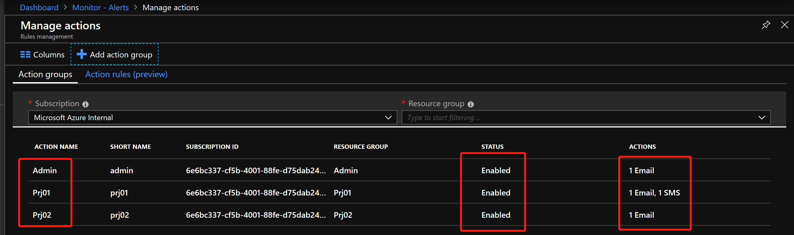

且设置生效后，相对应的邮箱或手机会收到设置成功的通知

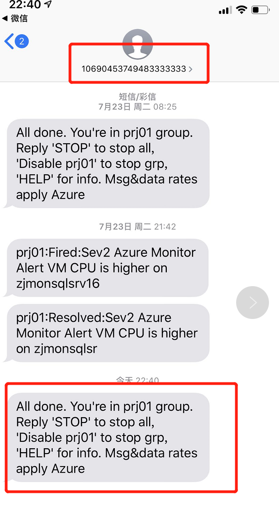

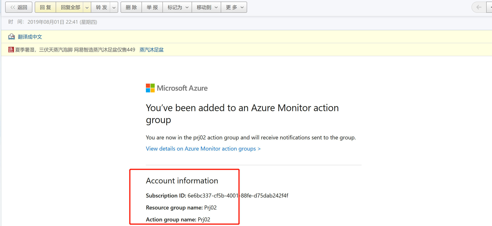

__*参考资料：*__

- [语音、短信、电子邮件、Azure 应用推送通知和 webhook 帖子的速率限制](https://docs.microsoft.com/zh-cn/azure/azure-monitor/platform/alerts-rate-limiting)

- [在 Azure 门户中创建和管理器操作组](https://docs.microsoft.com/zh-cn/azure/azure-monitor/platform/action-groups)

### 设置警报规则

#### 针对Azure资源设置警报

本次实验，将模拟几个经常会遇到的场景，针对虚拟机，当`CPU超过75%`时，通知相应的人员进行处理；针对容器，当环境中出现`Pending的Pod`时，通知相应的人员进行处理；

本次实验所使用到的模板均存在于 [arm-templates](./files/monitor/arm-templates/) 下

```
# 本次实验将使用 Azure CLI 结合 ARM 模板完成
# 针对虚拟机，设置CPU报警
# 获取ResourceID，将针对RG下面的所有VM进行警报设置
az group show -n Prj01 --query id -o tsv

# 获取 Action Group ResourceID
az monitor action-group show -n Prj01 -g Prj01 --query 'id' -o tsv

# 创建针对CPU过高的告警
az group deployment create --name VMCPUAlertDeploy -g Prj01 --template-file monitor-vms-in-rg.json --parameters @vm-cpu-high.parameters.json --parameters targetResourceRegion="EastUS" --parameters '{ "targetResourceGroup": {"value": ["$rgID"]}}' --parameters actionGroupId='$actionGroupID'
```

当警报生效后，环境中的虚机出现CPU过高时，邮箱及手机就会收到如下警告：

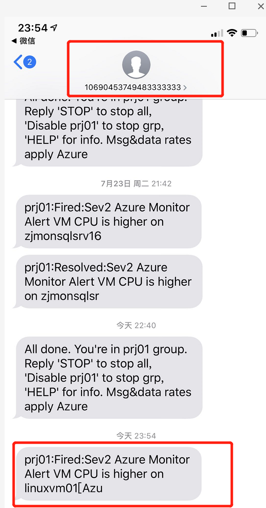

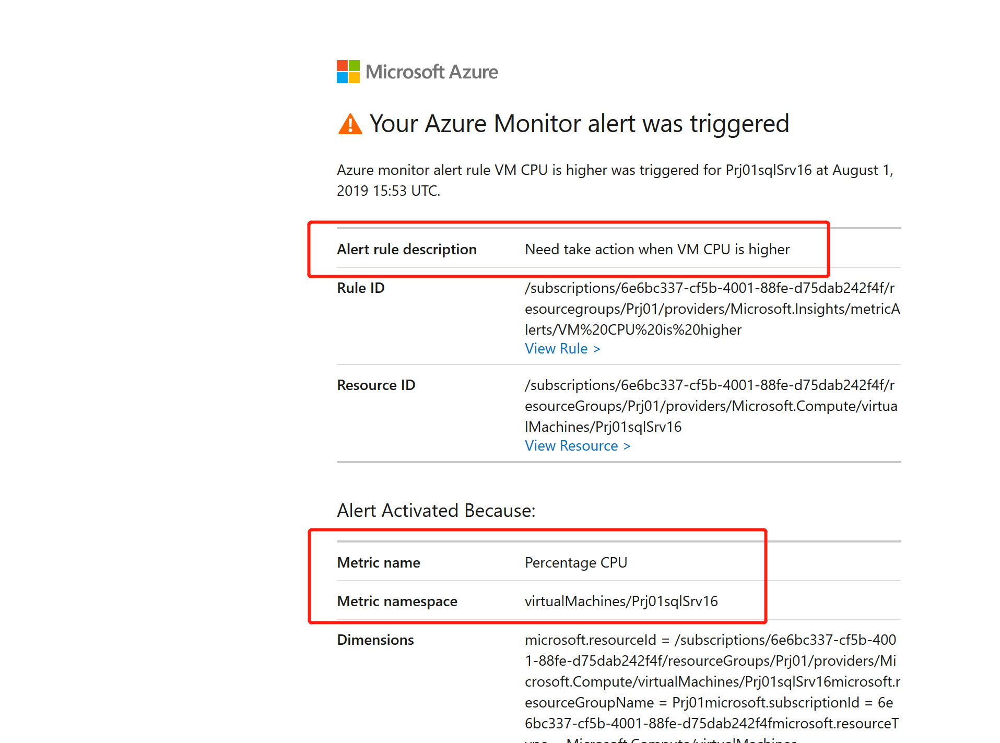

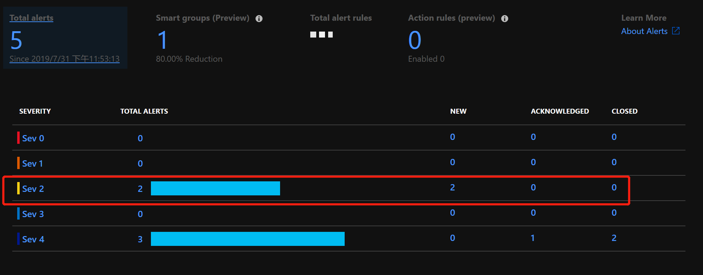

__*参考资料：*__

- [使用 Azure Monitor 创建、查看和管理指标警报](https://docs.microsoft.com/zh-cn/azure/azure-monitor/platform/alerts-metric)

- [使用 Resource Manager 模板创建指标警报](https://docs.microsoft.com/zh-cn/azure/azure-monitor/platform/alerts-metric-create-templates)

- [使用 Azure Monitor 创建、查看和管理日志警报](https://docs.microsoft.com/zh-cn/azure/azure-monitor/platform/alerts-log)

- [Azure Monitor 中的日志警报](https://docs.microsoft.com/zh-cn/azure/azure-monitor/platform/alerts-unified-log)
