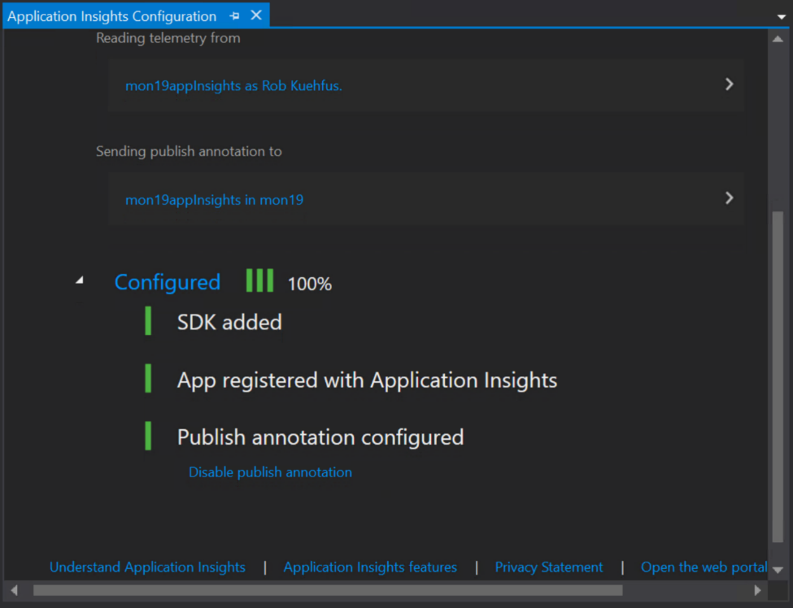

## Application Insights SDK Part Hands-on Lab


**第一部分 准备部署应用**
1.	到github下载本次动手实验需要用到的文件
https://github.com/rkuehfus/AzureMonitoringHackathon 
    


2.	解压后，进入 `AzureMonitoringHackathon-master\Student\Resources`, 打开其中的DeployMonHackEnv.ps1，可以使用vscode，也可以使用任何文本工具。随后更新最新的powershell

    ```Install-Module -Name AzureRM -Force -Scope CurrentUser -AllowClobber```

3.	首先在脚本文件中更改5个小写字符的名字
    ```Example: $MonitoringHackName = 'mon17'```

4.	在powershell中登录你的azure订阅
    ```Connect-AzureRmAccount```

    创建资源组：
    ```shell
    $MonitoringHackName = 'mon17'
    New-AzureRMResourceGroup -Name $MonitoringHackName -Location 'East US'
    $rg = get-AzureRmresourcegroup -Name $MonitoringHackName

    ```

    

5.	跑脚本文件中接下来的两行，建立keyvault

    ```shell
    $MonitoringHackVaultName = $MonitoringHackName + 'MonitoringHackVault'
    New-AzureRmKeyVault -VaultName $MonitoringHackVaultName -ResourceGroupName $rg.ResourceGroupName -Location $rg.Location -EnabledForTemplateDeployment
    ```
    

6.	随后会跳出输出用户密码，输入你想用的密钥，并且记住

    ```shell
    Set-AzureKeyVaultSecret -VaultName $MonitoringHackVaultName -Name "VMPassword" -SecretValue (Get-Credential).Password
    ```

    

7.	接下来跑脚本中的这条命令，并且复制结果中的高亮部分。

    ```shell
    (Get-AzureRmKeyVault -VaultName $MonitoringHackVaultName).ResourceId
    ```
    

8.	把高亮复制的内容，黏贴到azuredeploy.parameters.json文件中，并且注意更新对应的prefix

    
    

9.	跑脚本中最后的一条命令，估计要等半小时左右，所有的资源会部署完毕。

    


**第二部分** 在App Insights中观测应用的数据


1.	在Portal中新建一个App Insights的Workspace

    

2.	进入之前部署的跳板机

    

    接下来都在win server跳板机里进行操作。

3.	在Visual Studio里打开相对应的project

    

    点击 `eShopOnWeb`, 用Visual Studio打开，

    

    

    选择 `Web`，点击运行 `IIS Express`。

    


    接下来就能看到打开的eshop网站了。
    
    


4.	接下来让我们来安装一下application insights的SDK。在右侧“Web”那里点击右键 -> `add` -> `Application Insights Telemetry`, 然后点击安装sdk。

    

    


5.	注意选择相对应的subscription等信息

    

    


6.	测试一下安装了SDK的程序是否正常运行，同时观测一下app insights的telemetry有没有正常运作。可以尝试做一些商品浏览，登录，添加商品到购物车等操作，然后观测app insights里面的信息。

    

    


7.	好了，现在来更新一下applicaton insights的Nuget Package。装完之后再运行一遍程序，保证一切都没有问题。
    先停止应用程序。然后点击 `Tools` -> `NuGet Package Manager` -> `Manage NuGet Packages for Solution`.

    

    

    

    然后再运行下程序。


8.	把加入SDK的程序重新发布一下，我们把这个程序发布到后端的VMSS里面，分别在1号机器，和2号机器做相同的操作。

    

    


    先选择第一台vmss的主机。如何查看Server: 进入 `<xxx>webScaleSet`

    

    

    
    
    

    

    

    
    
    

    把vmss里面第二台机器也部署一下

    


9.	现在我们在portal里试一下ping的test，查看事件有没有被捕捉到。
    
    

    

    


10.	通过手工的脚本，在你的笔记本或者jump server上运行一下，把脚本中的url替换成你部署的eshop当中的url。在尝试看一下app insights的数据收集。
    ```
    for ($i = 0 ; $i -lt 100; $i++)
    {
    Invoke-WebRequest -uri http:// mon19webscalesetlb.eastus.cloudapp.azure.com/
    }
    ```

    

    
    Sclaeout 的规则

    


    Scalein的规则

    

    

11.	过5分钟之后，应该可以看到性能数据了，并且可以看到vmss按照规则开始自动扩展。


    

    


12.	尝试触发一个登录错误。打开网站的主页

    

    

    尝试更新一下密码

    

    

    从app insights里找到这个错误

    

    