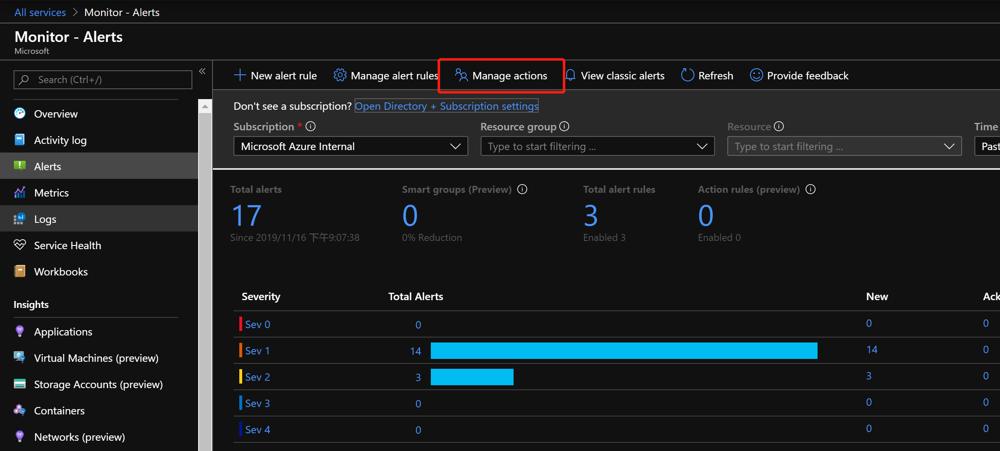
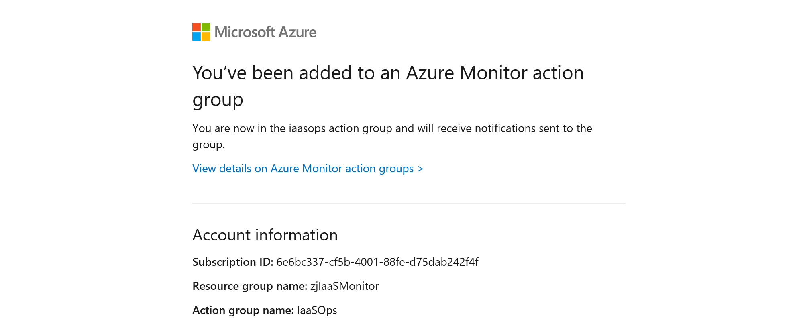

## Azure IaaS 基础设施监控

本次实验，带大家了解一下，如何通过 Azure Monitor 对 Azure 基础设施资源提供监控. 本次实验主要涉及 `虚拟机 & 存储 & 网络`.

### 环境准备

- 资源组 ：`zjIaaSMonitor`

- 虚拟机 ：`demoVM01`

- 存储账户 ：`zjdemosa`, Demo存储账户, 用来演示存储账户监控信息获取, 请随机上传几个文档到 Azure Blob

- 存储账户 ：`zjmonitordataarchive`, 用于存放长期保存备份的监控数据

- Log Analytics workspace ：`zjIaaSMonitor`, 实现日志中心功能, 用于存储需要实时查看分析的日志

### 开启诊断日志, 规划监控数据的生命周期

默认情况下, Azure资源只提供基本级别的指标信息；很多详细的日志信息, 及丰富的指标, 需要通过开启诊断日志实现. 绝大部分诊断日志提供三种收集模式：`Storage Account` / `Event Hub` / `Log Analytics`

我们建议客户规划监控数据的存储主要从以下几个方面：

- 同时将数据存储在 `Log Analytics` & `Storage Account`, 并设置不同的数据保存时间

- 存储在 `Log Analytics` 中的数据, 设置数据保存周期为 60 天；根据调查发现, 大部分监控数据会在出现的前45天被用到

- 存储在 `Storage Account` 中的数据, 可以是因为法律法规要求, 必须满足保存年限, 或者需要定期(每年/每半年)进行一次海量多维度的数据分析

#### 虚机诊断日志设置

虚机的诊断日志是Azure中比较特殊的. Azure VM 没有办法直接设置 Log Analytics；只能设置保存到存储账号.

开启诊断设置很简单, 只需按照如下方式进行：


#### 针对虚机, 设置 Log Analytics Data Sources 的连接, 并配置从存储账号中读取日志文件

进入 workspace `zjIaaSMonitor`, 点击 `Workspace Data Sources`, 选择 `Virtual machines`


确保连接状态OK, 如果是Disconnect的状态, 可手动点击 `Connect`, 进行连接

点击 `Workspace Data Sources`, 选择 `Storage account logs`, 点击添加 (由于本次实验使用的是Linux虚机, 选择相对应的Linux日志文件)


#### 配置存储账号的诊断设置

存储账号的诊断设置是另外一个比较特殊的资源, 需要单独进行设置. 点击进入存储账户 `zjdemosa`, 选择诊断设置; 注意：请配置所有类型 - Blob & File & Table & Queue


#### 开启其他资源的诊断设置

除虚机以外, 所有资源诊断设置是否Enable, 可以从 `Azure Monitor -> Diagnostics Settings` 查看, 可以根据特定的信息进行过滤, 找到关心的资源;


点击相应的资源, 开启诊断设置, 我们以 NSG `demoVM01-nsg`为例, 进行设置；__**请大家自行设置其他两个资源**__


### 实践 Ad-hoc 查询, 并创建监控大屏 - 使用 Azure Dashboard

数据收集之后, 接下来需要做的就是展现. 由于Azure目前平台中的数据主要以 `Metrics & Logs` 为主, 所以相对应的查询展现方式也有两种: 1) 通过 `Azure Metrics` 查看指标数据; 2) 通过 `Azure Log Analytics` 查看日志数据；

#### 创建 Dashboard, 名为 Monitor Dashboard

如果希望通过 Azure 完成云平台中资源的监控, Azure Dashboard 可以允许你定义一个数据企业内部的监控大屏.


创建监控大屏很简单, 从 `All Services - Dashboard`, 选择新建 Dashboard, 左侧提供了很多插件, 可以帮助你定义比较Fancy的画面


将创建好的Dashboard, 设置Share, 这样后续接触到的Log Analytics的部分, 可以将通过`Kusto`语句完成的监控, 也放在同一个Dashboard中.


#### 实践如何使用 Metrics Explorer

Metrics Explorer, 点击 `Monitor -> Metrics`, 找到后, 可以根据资源类型及名称, 查找这个资源支持的指标数据, 并且可以根据查询的数据, 添加到监控大屏 `Pin to dashboard`；


我们先来看看虚机的`Percentage CPU`, 目前使用的CPU有多少


我们再来看看Storage Account的`E2E Latency`


#### 实践如何使用 Log Analytics, 使用KUSTO语言, 可视化日志数据

在设置完整个环境的监控数据收集配置后, 日志数据全部存在了Log Analytics中, 我们可以利用KUSTO语言, 实时的分析展现环境中的信息.

点击进入 Log Analytics `zjIaaSMonitor` workspace, 点击 `Log`, 即可执行 `Ad-hoc` 查询; 在左侧 `Active - LogManagement` 下提供了所有可用的日志Table以及相对用可用的Items


首先, 通过 Log Analytics, 来查看CPU的使用, 并将获得的查询视图添加到监控大屏; 

__**目前Azure China暂时还无法实现此功能, 如需通过Log Analytics来完成Dashboard的制作,请使用 Log Analytics View Designer**__


查询语言如下：

```
Perf
| where Computer startswith "demo" 
| where CounterName == @"% Processor Time"
| summarize avg(CounterValue) by Computer, bin(TimeGenerated, 1m) 
```


接下来, 我们来查看NSG日志中, 有多少外界的访问被`Rules Block`, 并将获得的查询视图添加到监控大屏

__**目前Azure China暂时还无法实现此功能, 如需通过Log Analytics来完成Dashboard的制作,请使用 Log Analytics View Designer**__


查询语言如下：

```
AzureDiagnostics
| where ResourceType == "NETWORKSECURITYGROUPS" and Category == "NetworkSecurityGroupRuleCounter" and type_s == "block"
| summarize AggregatedValue = sum(matchedConnections_d) by ruleName_s , bin(TimeGenerated, 1h)
| where AggregatedValue >0
|render timechart
```


我们可以查看下目前我们的监控大屏上已经存在了做好的4张图表.

#### (Homework) 制作一个适合于自己环境的监控大屏 (60-90Mins)

根据工作经验及实际环境, 制作一个适合自己环境的监控大屏; 需要确认需要哪些Metrics/Logs, 如何写KUSTO查询语句.

### (Optional) 创建监控大屏 - 使用 Grafana

除了Azure Dashboard之外, 我们也可以将Azure Monitor中的Metrics/Logs数据显示在 Grafana 中. Azure Monitor作为数据源, 已经收到 Grafana 的全面支持.

请按照 [Prerequisite - 容器化 Grafana 环境 for Azure Monitor Handson](https://github.com/ChinaOcpPTS/OCPChinaPTSALLDOCS/blob/master/03.Azure%E8%B5%84%E6%96%99%E5%90%88%E9%9B%86/%E5%8A%A8%E6%89%8B%E5%AE%9E%E9%AA%8C/CloudGovernance/Monitor/Prerequisite%20-%20%E5%AE%B9%E5%99%A8%E5%8C%96%20Grafana%E7%8E%AF%E5%A2%83.md) 搭建环境, 并配置数据源.

创建一个 Dashboard 名为 `Monitor Dashboard`, 并按照上一章节的四个Section, 在Grafana中制作可视化页面

#### 添加第一个Section, 查看虚机的Percentage CPU


#### 添加第二个Section, 查看StorageAccount的E2E Latency


#### 添加第三个Section, 通过Log Analytics Query, 查看虚机的Percentage CPU

Grafana除了接收Azure Metrics作为数据以外, 也可直接运行 KUSTO Query, 实现查询


#### 添加第四个Section, 查看NSG Block Rules的数量


#### (Homework) 制作一个适合于自己环境的监控大屏 (60-90Mins)

任选一种方式(Azure Dashboard/Grafana), 根据工作经验及实际环境, 制作一个适合自己环境的监控大屏; 需要确认需要哪些Metrics/Logs, 如何写KUSTO查询语句

### 建立环境中的报警机制, 出现问题, 及时通知相关人员

运维人员不能一刻不停的盯着大屏，运维人员需要的是能够在环境出问题的时候，第一时间获得通知，快速修复问题，这是提高环境自动化，优化环境可用性的一个关键。警报是监控系统的一种关键手段，合理的设置关键数据的警报，能够帮助运维人员更好且自动化的监控云端环境。

如下展示了一个警报的产生过程，和处理方式：


任何一个警报，都有几个关键的部分：`所针对的资源` & `触发的条件` & `警报级别` & `所采取的操作`

`Azure Alerts`支持为Azure中资源产生的`Metrics` & `Logs from Log Analytics` & `Activity Log` & `Azure 平台运行状况`等作为触发警报的数据源

`Azure Alerts`支持用户将警报定义为 `Sev0` & `Sev1` & `Sev2` & `Sev3` & `Sev4`五个等级，分别代表警报涉及的资源对当前环境的影响大小，`Sev0`最为严重

`Azure Alerts`支持用户设置不同的`Action Group`来相应不同级别的警报，响应手段包括`Email\SMS\电话` & `Webhook` & `Azure Function` & `Azure Logic Apps` & `Automation Runbook`等

### 针对 IaaS 环境, 建立 Action Group, 设置警报

`Action Group`与`Alert Rules`是多对多的关系，双方可以互相匹配。因此在规划监控系统时，可以预先设定一些常用的通知手段，且随着自动化水平的增加，逐渐更新。

#### 设定一个 Action Group IaaSOps, 当环境中出现告警, 第一时间发送邮件给相应的运维人员

点击进入 `Azure Monitor - Alerts`, 选择 `Manage actions`, 创建 Action Group




或通过命令行创建

```
# 通过 Azure CLI 完成 Action Group的创建
az monitor action-group create -n IaaSOps -g zjIaaSMonitor --short-name iaasops --action email sendEmail jianzsh0821@163.com

# 如果希望创建SMS的Action Group, 可通过如下命令查看完整参数
az monitor action-group create -h
```

设置生效后, 邮箱会收到相应的邮件



__*参考资料：*__

- [语音、短信、电子邮件、Azure 应用推送通知和 webhook 帖子的速率限制](https://docs.microsoft.com/zh-cn/azure/azure-monitor/platform/alerts-rate-limiting)

- [在 Azure 门户中创建和管理器操作组](https://docs.microsoft.com/zh-cn/azure/azure-monitor/platform/action-groups)

#### 设置警报规则

针对VM的Percentage CPU, 设置警报规则, 当`CPU超过75%`时，通知相应的人员进行处理

点击进入 `Azure Monitor - Alerts`, 选择`New alert rule`, 添加一条报警规则


为了触发报警, 我们把 `Percentage CPU` 的告警Interval调成 1%, 来触发警报, 可以看到我们设定的邮箱会收到如下告警


### 参考资料

- [如何在Portal设置诊断日志](https://docs.microsoft.com/zh-cn/azure/azure-monitor/platform/diagnostic-logs-stream-log-store#stream-diagnostic-logs-using-the-portal)

- [在虚拟机中为事件日志和 IIS 日志收集启用 Azure 诊断](https://docs.microsoft.com/zh-cn/azure/azure-monitor/platform/azure-storage-iis-table#enable-azure-diagnostics-in-a-virtual-machine-for-event-log-and-iis-log-collection)

- [使用 Azure 门户从 Azure 存储中收集日志](https://docs.microsoft.com/zh-cn/azure/azure-monitor/platform/azure-storage-iis-table#use-the-azure-portal-to-collect-logs-from-azure-storage)

- [az vm diagnostics 详细解释](https://docs.microsoft.com/en-us/cli/azure/vm/diagnostics?view=azure-cli-latest)

- [使用 Azure Monitor 创建、查看和管理指标警报](https://docs.microsoft.com/zh-cn/azure/azure-monitor/platform/alerts-metric)

- [使用 Resource Manager 模板创建指标警报](https://docs.microsoft.com/zh-cn/azure/azure-monitor/platform/alerts-metric-create-templates)

- [使用 Azure Monitor 创建、查看和管理日志警报](https://docs.microsoft.com/zh-cn/azure/azure-monitor/platform/alerts-log)

- [Azure Monitor 中的日志警报](https://docs.microsoft.com/zh-cn/azure/azure-monitor/platform/alerts-unified-log)