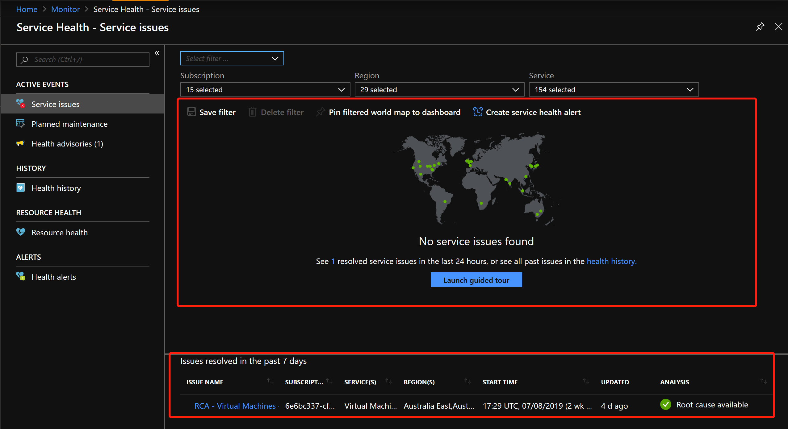
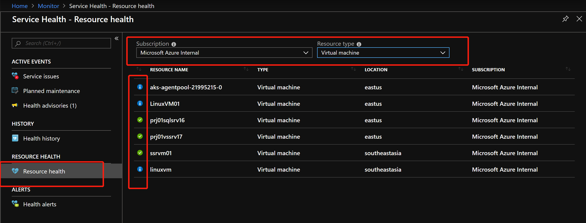
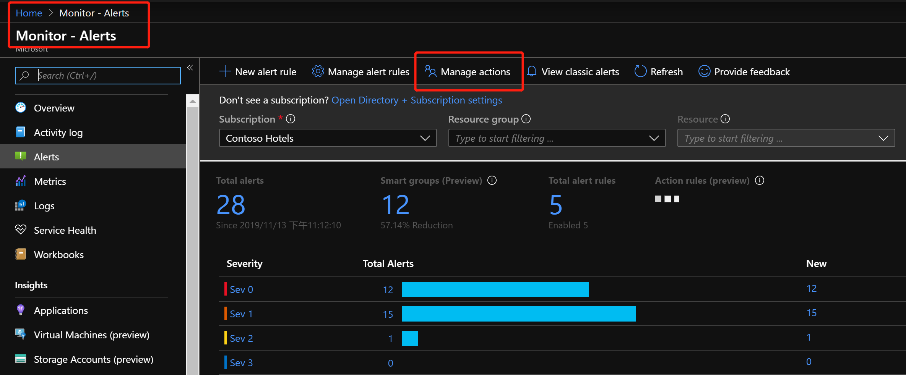
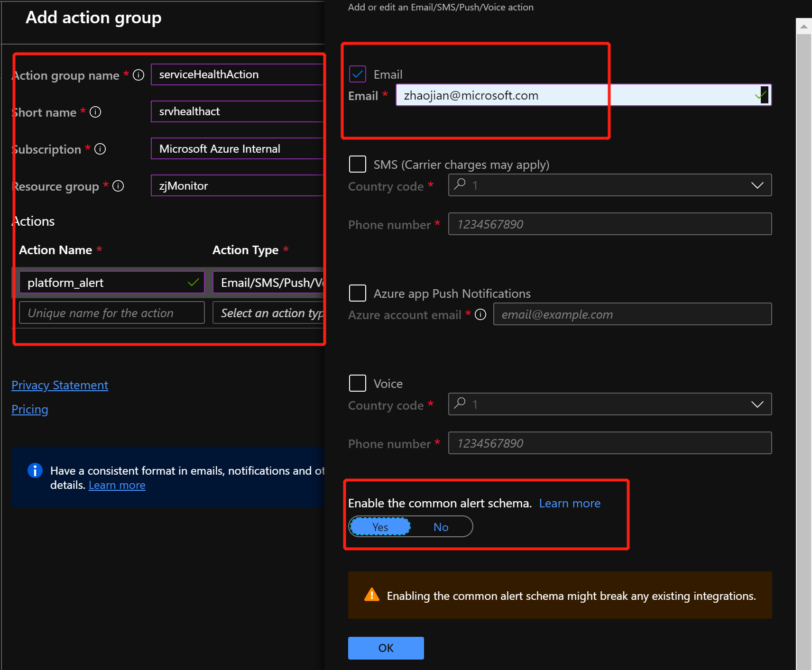
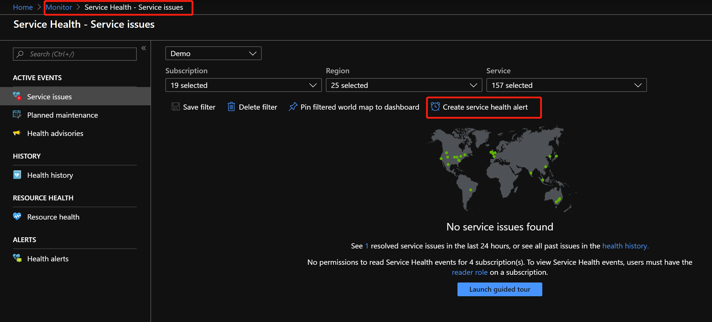
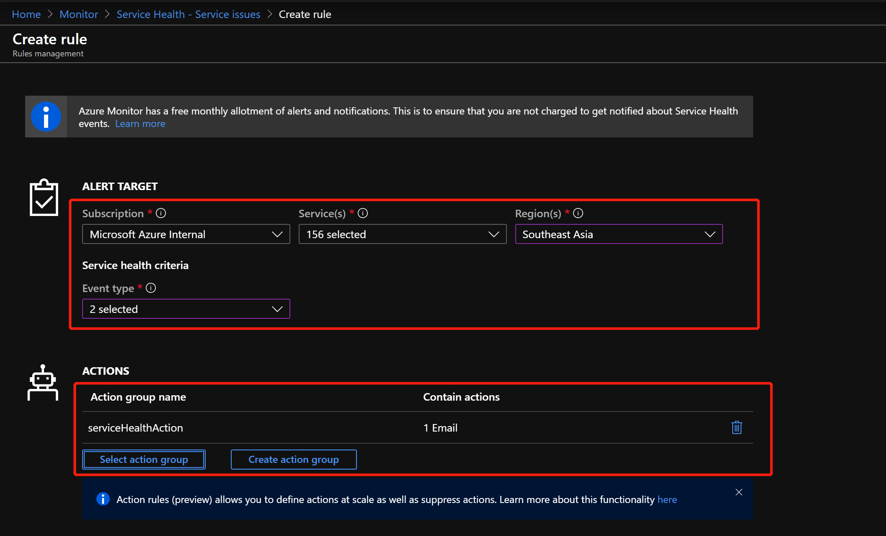
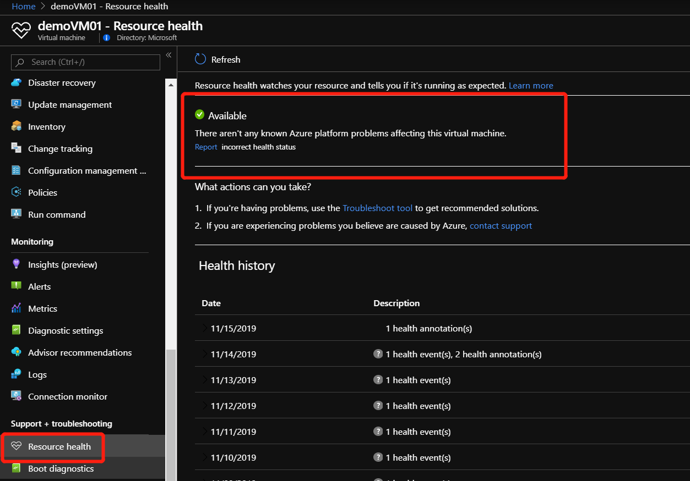
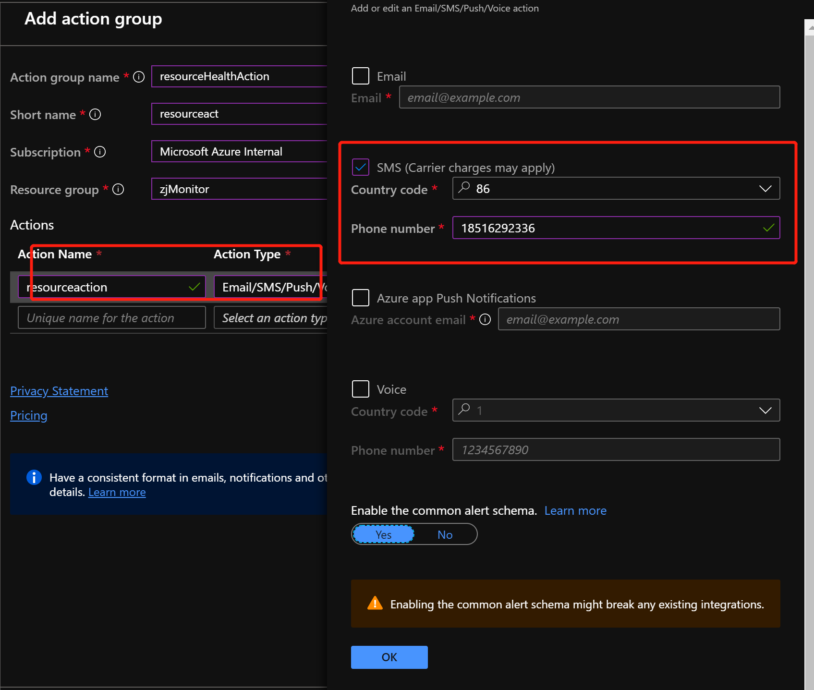
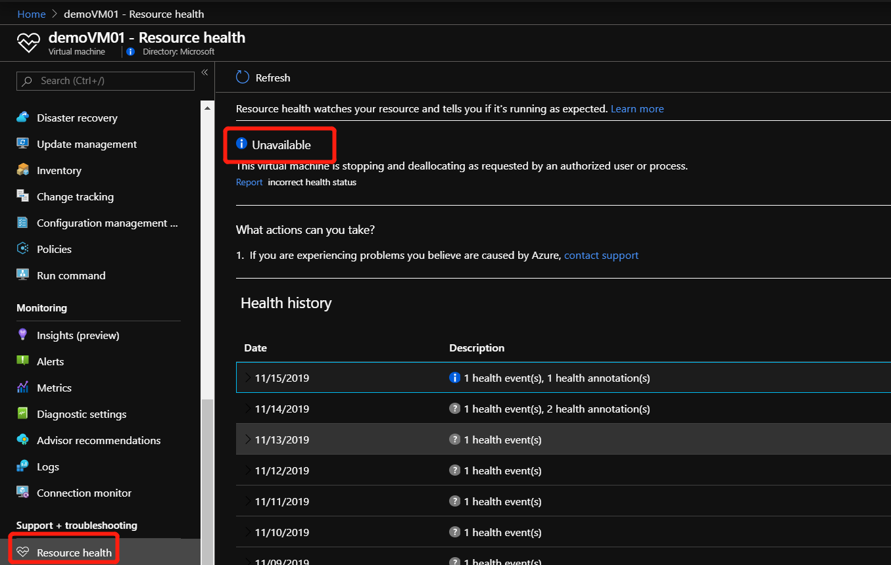
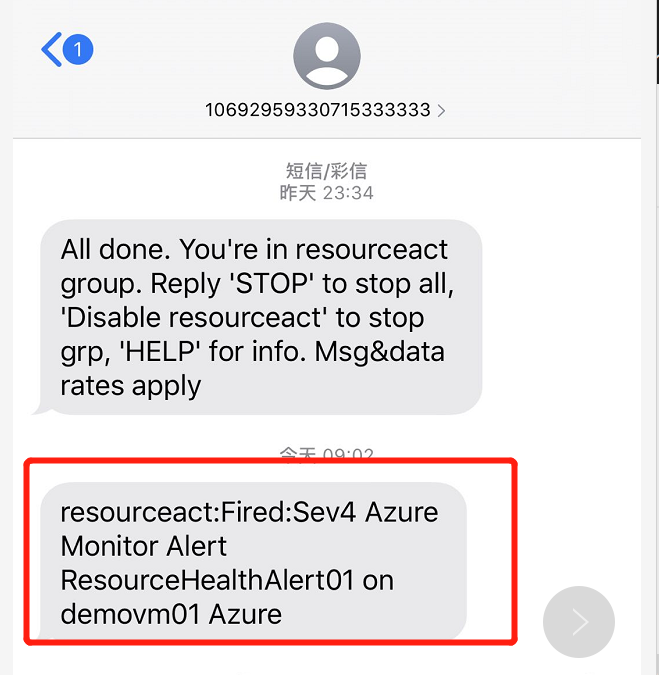

## Handson Lab for Azure Service Health & Resource Health

`Service Health`是集中了解云平台中资源是否可用，或当平台出现问题时，及时了解问题进站及下载事故分析的地方; `Service Health`会提供包括`Service issue` & `Planned maintenance` & `Health advisories`在内的三种指标，建议在实际的生产环境中，针对这三种指标设置三个警报，分别对应特定`Action Group`, 确保不同问题能够找到合适处理的人。



`Resource Health`是能够及时反映正在使用的某一个Azure资源是否因为平台出现的问题，达到`Limitation`, 或性能出现显著降低的一种监控指标; 

资源是指Azure提供的服务，例如：`Virtual Machines` & `Application Gateway`等, 资源的状态会在 `Available` & `Unavailable` & `Unknown` & `Degraded` 之间转换，只要资源不处于 `Available` 状态，除非是一些已知的原因，比如：`手动停机`，都应该发送相应的警报引起负责人员的重视，资源处于非`Available`状态证明当前环境中正存在一种或多种资源不能正常使用。



针对 `Service Health & Resource Health`, 及时设置告警信息, 当环境中出现问题时, 能够快速定位, 并有效的处理问题.

### 针对 Service Health Service Issue & Planned Maintenance 设置告警

Azure中的Alerts设置分为两个部分：

- Action Group : 设置警报需要采取的措施, 如发邮件/发短信等

- Alert Rule : 警报触发的条件

#### 设置 Action Group

设置一个名为 `serviceHealthAction` 的 Action Group, 当出现问题时, 立刻发送信息到指定邮箱





#### 创建 Service Health Alert

创建一个名为 `serviceHealthAlert` 的报警规则, 当平台出现 `Service Issue` 或 `Planned Maintenance`, 会立刻发邮件到指定的Action Group; 报警规则可以针对于`特定服务/特性区域`进行针对性设置.





这样当下一次平台中选中的服务出现问题或出现维护公告时，你会第一时间收到消息，确保可以及早处理突发事件.

### 针对 Resource Health 设置告警

同 Service Health 类似, 当我们正在使用的平台资源, 出现不可用或服务降级的情况, 例如 VM 突然停机, 状态会从 `Available` 转换到 `Unavailable` 状态, 我们希望第一时间收到消息, 及时处理.

创建 `Resource Health` 的警报涉及到 ARM 部署操作, 涉及的ARM文件请参照 [arm-templates](./files/service_resource_health_files/arm-templates/) 下的相应文件. 另外, 请事先准备好一台虚机, 且状态显示 Running.



#### 设置 Action Group

设置一个名为 `resourceHealthAction` 的 Action Group, 当出现问题时, 立刻发送信息到指定手机



#### 设置 Resource Health 告警

```
# 本次实验将使用 Azure CLI 结合 ARM 模板完成
# 针对 Resource Health 进行告警设置，当资源组下的某一资源状态从Available改变成Unavailable,Unknown,Degraded时，发送警报通知运维人员
# 获取ResourceID
az group show -n $your_rg_name --query id -o tsv

# 获取 Action Group ResourceID
az monitor action-group show -n resourceHealthAction -g $your_rg_name --query 'id' -o tsv

# 设置Resource Health的警报
az group deployment create --name ResourceHealth01 -g $your_rg_name --template-file './files/service_resource_health_files/arm-templates/monitor-resources-health.json' --parameters activityLogAlertName="ResourceHealthAlert01" --parameters '{ "scopes": {"value": ["$rgID"]}}' --parameters actionGroupResourceId='$actionGroupID'
```

设置完成后，当出现平台性问题导致资源状态变化，或如实验中，手动触发停止VM，就会发送告警信息.





### 参考资料

- [服务运行状况概述](https://docs.microsoft.com/zh-cn/azure/service-health/service-health-overview)

- [资源运行状况概述](https://docs.microsoft.com/zh-cn/azure/service-health/resource-health-overview)

- [Azure 资源运行状况中的资源类型和运行状况检查](https://docs.microsoft.com/zh-cn/azure/service-health/resource-health-checks-resource-types)

- [使用资源管理器模板创建资源运行状况警报](https://docs.microsoft.com/zh-cn/azure/service-health/resource-health-alert-arm-template-guide)