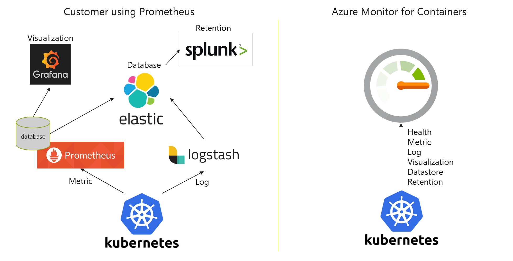
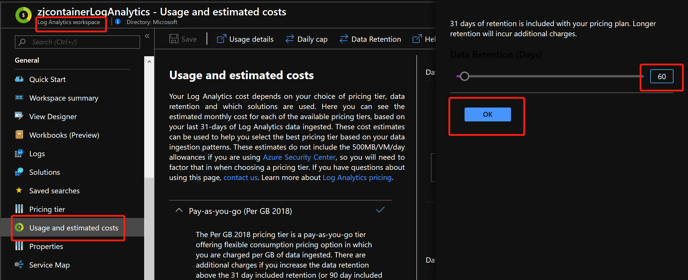
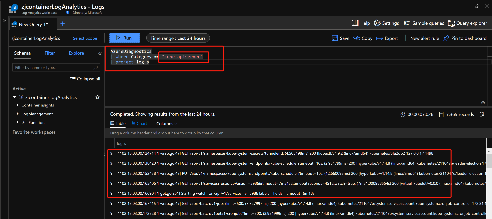

## Handson Lab for Azure 容器服务 (Azure Kubernetes Service)

Azure Kubernetes Service 提供了完整的解决方案, 通过 Metrics API 从 Kubernetes 中收集指标&日志, 来提供对集群的监控. 数据将存入 Azure Log Analytics 的 workspace 中. 整体架构及数据流动如下所示：


AKS 监控方案中支持的完整查询指标如下：

| 数据类型 | 日志搜索中的数据类型 | 字段 |
| --- | --- | --- |
| 主机和容器的性能 | `Perf` | 计算机、ObjectName、CounterName（处理器时间百分比、磁盘读取 MB、磁盘写入 MB、内存使用 MB、网络接收字节数、网络发送字节数、处理器使用秒数、网络）、CounterValue、TimeGenerated、CounterPath、SourceSystem |
| 容器库存 | `ContainerInventory` | TimeGenerated、计算机、容器名称、ContainerHostname、映像、ImageTag、ContainerState、ExitCode、EnvironmentVar、命令、CreatedTime、StartedTime、FinishedTime、SourceSystem、ContainerID、ImageID |
| 容器日志 | `ContainerLog` | TimeGenerated、计算机、映像 ID、容器名称、LogEntrySource、LogEntry、SourceSystem、ContainerID |
| 容器节点清单 | `ContainerNodeInventory`| TimeGenerated、计算机、ClassName_s、DockerVersion_s、OperatingSystem_s、Volume_s、Network_s、NodeRole_s、OrchestratorType_s、InstanceID_g、SourceSystem|
| Kubernetes 群集中的 Pod 清单 | `KubePodInventory` | TimeGenerated、Computer、ClusterId、ContainerCreationTimeStamp、PodUid、PodCreationTimeStamp、ContainerRestartCount、PodRestartCount、PodStartTime、ContainerStartTime、ServiceName、ControllerKind、ControllerName、容器状态、 ContainerStatusReason、ContainerID、、Name、PodLabel、Namespace、PodStatus、ClusterName、PodIp、SourceSystem |
| Kubernetes 群集节点部分清单 | `KubeNodeInventory` | TimeGenerated, Computer, ClusterName, ClusterId, LastTransitionTimeReady, Labels, Status, KubeletVersion, KubeProxyVersion, CreationTimeStamp, SourceSystem | 
| Kubernetes 事件 | `KubeEvents` | TimeGenerated, Computer, ClusterId_s, FirstSeen_t, LastSeen_t, Count_d, ObjectKind_s, Namespace_s, Name_s, Reason_s, Type_s, TimeGenerated_s, SourceComponent_s, ClusterName_s, Message,  SourceSystem | 
| Kubernetes 群集中的服务 | `KubeServices` | TimeGenerated, ServiceName_s, Namespace_s, SelectorLabels_s, ClusterId_s, ClusterName_s, ClusterIP_s, ServiceType_s, SourceSystem | 
| Kubernetes 群集节点部分的性能指标 | Perf &#124; where ObjectName == “K8SNode” | Computer、ObjectName、CounterName &#40;CpuAllocatableBytes、MemoryAllocatableBytes、CpuCapacityNanoCores、MemoryCapacityBytes、MemoryRssBytes、CpuUsageNanoCores、MemoryWorkingsetBytes、restartTimeEpoch&#41;、CounterValue、TimeGenerated、CounterPath、SourceSystem | 
| Kubernetes 群集容器部分的性能指标 | Perf &#124; where ObjectName == “K8SContainer” | CounterName &#40; CpuRequestNanoCores、MemoryRequestBytes、CpuLimitNanoCores、MemoryWorkingSetBytes、RestartTimeEpoch、CpuUsageNanoCores、memoryRssBytes&#41;、CounterValue、TimeGenerated、CounterPath、SourceSystem | 
| 自定义指标 |`InsightsMetrics` | 计算机、名称、命名空间、源、SourceSystem、标记<sup>1</sup>、TimeGenerated、类型、Va、_ResourceId | 

AKS支持通过 OMS-agent 收集 Prometheus 的指标信息, 将 Prometheus 作为监控方案的一部分, 引入到 Azure 容器监控中, 具体架构如下：


AKS支持用户通过开源的解决方案, 实现容器环境的监控, 例如 `Grafana + Prometheus / Elastic Search + Kibana + Logstash/File Beat`:



### 环境准备

#### 创建名为 `containerLogAnalytics`

Log Analytics workspace用于存储/分析实时的日志数据, 建议用户将此部分数据保存 45天-60天


#### 设置 `Azure Log Analytics 数据保留时间`

默认情况下, Azure Log Analytics 收集上来的数据, 免费保存30天; 如果需要更长时间的数据保留, 可以通过设置Log Analytics中的Data Retation进行调整



#### 创建名为 `containerlogarchivesa`

Storage Account用于存储日志的备份, 为相关的数据审查/阶段性数据分析提供数据支撑, 建议用户将此部分数据保存 180天-365天

#### 创建新的AKS集群 `aksMon01`, 选择 `containerLogAnalytics` 作为监控数据的收集存储


更多针对现有的AKS集群, 开启Monitor的Add-on, 请参照 [如何启用容器 Azure Monitor](https://docs.microsoft.com/zh-cn/azure/azure-monitor/insights/container-insights-onboard)

#### 了解内置的 AKS 集群监控

AKS自身提供了一个监控方案, 通过集群内的监控页面, 可以查看集群/节点/容器的性能指标及实时日志等信息, 如下所使：


详细的监控选项示例请参照：[使用适用于容器的 Azure Monitor 了解 AKS 群集性能](https://docs.microsoft.com/zh-cn/azure/azure-monitor/insights/container-insights-analyze)

#### 创建 Demo 资源

创建 Demo资源所使用的YML文件请参照 [demo_azure_vote.yml](./files/aks_monitor_files/demo_azure_vote.yml)

```
# 连接 AKS Cluster, 获取Credential信息
az aks get-credentials -n $yourAKSCluster -g $yourRG

# 创建 Demo 应用程序
kubectl apply -f ./files/aks_monitor_files/demo_azure_vote.yml
```

创建好的资源可以在监控屏幕上查看到, 如下所示：


应用程序运行时，Kubernetes 服务将向 Internet 公开应用程序前端，用 `kubectl get service` 查看：

.png)

可以看到应用程序外网IP为 `52.253.81.108`.

#### 开启 AKS 内容器的实时日志

AKS为客户提供了查看容器内实时日志的页面, 通过接收标准的 `stderr/stdout`, 查看容器内部的状况.

开启容器实时日志, 需要创建Kubernetes RBAC的授权, RBAC授权YML文件请参考 [live_logs_rbac.yml](./files/aks_monitor_files/live_logs_rbac.yml)

```
kubectl apply -f ./files/aks_monitor_files/live_logs_rbac.yml
```

若要查看 Azure Vote 应用的实际效果，请打开 Web 浏览器并转到服务的外部 IP 地址 `52.253.81.108`。

.png)

这样我们就可以从页面上实时的查看Pod中的容器,实时的日志信息


也可以通过 `Log Analytics workspace`, 查看容器的实时日志


```
# Query Sample 如下, 注意修改成自己的ContainerName和ClusterID等。
let ContainerIdList = KubePodInventory
| where ContainerName =~ '17eb9449-fd76-11e9-baf5-6a826853ae74/omsagent'
| where ClusterId =~ '/subscriptions/6e6bc337-cf5b-4001-88fe-d75dab242f4f/resourceGroups/zjMonitorDemo/providers/Microsoft.ContainerService/managedClusters/zjaksMon01'
| distinct ContainerID;
ContainerLog
| where ContainerID in (ContainerIdList)
| project LogEntrySource, LogEntry, TimeGenerated, Computer, Image, Name, ContainerID
| order by TimeGenerated desc
| render table
```

实时日志的详细介绍请参照 [查看实时日志和事件](https://docs.microsoft.com/zh-cn/azure/azure-monitor/insights/container-insights-live-logs#view-live-logs-and-events)

#### 开启诊断设置, 收集更多管理组件的日志及审核日志

可以通过开启诊断日志的方式, 收集如 `kube-apiserver` / `kube-controlmanager` / `kube-scheduler` / `kube-audit`等管理组件的日志

开启AKS的诊断设置, 选择AKS创建所在的资源组, 设置诊断日志




```
# Query Sample 如下
# 查询 API Server 相关的日志
AzureDiagnostics
| where Category == "kube-apiserver"
| project log_s

# 查询 Kube Audit 相关的日志
AzureDiagnostics
| where Category == "kube-audit"
| project log_s
```

#### 配置 Azure Monitor, 将 Prometheus 产生的数据信息发送的Azure Monitor

Azure Monitor中的监控信息收集, 主要是通过以DaemonSet运行在各个节点上的`omsagent`, 收集数据, 并传送到Log Analytics中; `omsagent`通过Configmap来配置收集的信息:


收集Prometheus监控数据, 就是通过修改OMSAgent的ConfigMap的配置, 配置Prometheus Metrics相关的Endpoint信息来实现, 具体架构如下：


Prometheus收集Kubernetes监控信息有很多个维度, 社区也提供了多个开源的exporter供用户选择；接下来, 我们将安装 [Prometheus Node Exporter](https://github.com/helm/charts/tree/master/stable/prometheus-node-exporter) & [kube-state-metrics](https://github.com/kubernetes/kube-state-metrics), 来收集Kubernetes集群监控的信息


**安装Helm**

[在本地客户端安装Helm](https://helm.sh/docs/using_helm/#installing-helm)，根据不同的的本地操作系统可以选择相应的安装方法。比如windows可以选择用Choclolate安装: `choco install kubernetes-helm`

> 注意：以下命令使用Helm V2。最新的Helm V3版本取消了init, --name等命令参数，请查阅官网。

```
# 创建Helm所使用的RBAC, Helm相关的RBAC请参阅 helm_rbac.yml
kubectl apply -f ./files/aks_monitor_files/helm_rbac.yml

# 初始化 Helm Tiller
helm init --service-account tiller

# 安装 Prometheus Node Exporter
helm install --name node-exporter stable/prometheus-node-exporter

# Git clone kube-state-metrics repo
git clone https://github.com/kubernetes/kube-state-metrics.git
cd kube-state-metrics/

# 安装 kube-state-metrics
kubectl apply -f ./examples/standard/
```

配置 OMS Agent 所使用的ConfigMap, 一份完整的ConfigMap可参照 [omsagent_configmap.yml](./files/aks_monitor_files/omsagent_configmap.yml), 其中重点的几个部分的解释如下：

__*收集 kube-system namespace下的监控数据*__

`kube-system` namespace 下的资源监控数据默认是不收集的, 我们可以通过调整如下配置, 收集这部分的日志：


__*收集 Prometheus node-exporter / kube-state-metrics 的监控数据*__

首选我们需要获取 `node-exporter` / `kube-state-metrics` services的名字

`kubectl get svc --all-namespaces`


更改ConfigMap的设置如下：


```
# 将更改应用到环境中
kubectl apply -f ./files/aks_monitor_files/omsagent_configmap.yml
```

当在Log Analytics workspace中看到数据, 证明整个设置成功了


相关 Configmap 的详细信息请参照 [Container Monitor ConfigMap 文件设置概述](https://docs.microsoft.com/zh-cn/azure/azure-monitor/insights/container-insights-agent-config#configmap-file-settings-overview)

#### 分析收集的监控数据, 构建监控大屏

经过一系列设置, 我们收集了该收集的数据, 接下来就是如何利用这些数据进行可视化分析展示; 我们可以将可视化后的数据统一展现在 Azure Dashboard 上

__**创建一个名为 Container Monitor 的 Dashboard**__


__**通过 Log Analytics Ad-hoc query, 查询可视化数据, 并添加到 Dashboard 中**__

```
#示例查询展示了正在运行的Container数量, 使用Azure提供的监控数据
ContainerInventory
| where TimeGenerated >= ago(30m)
| summarize AggregatedValue = dcount(ContainerID) by ContainerState
```


```
#示例查询展示了正在运行的Container CPU Usage, 使用Azure提供的监控数据
Perf
| where ObjectName == "K8SContainer" and CounterName == "cpuUsageNanoCores" 
| summarize AvgCPUUsageNanoCores = avg(CounterValue) by bin(TimeGenerated, 30m), InstanceName
```


__**通过 Prometheus kube-state-metrics 数据, 查询可视化数据, 并添加到 Dashboard 中**__

```
# 示例查询展示了目前各个节点中可用的CPU核数
InsightsMetrics 
| where Namespace == "prometheus" and Name == "kube_node_status_capacity"
| extend prom_metrics=parse_json(Tags)
| extend nodeName=prom_metrics.node, resourceType=prom_metrics.resource, resourceUnit=prom_metrics.unit
| where resourceType == "cpu"
| summarize by tostring(nodeName), Val
```


更多日志查询的Query Sample, 请参照 [使用日志查询分析数据](https://docs.microsoft.com/zh-cn/azure/azure-monitor/insights/container-insights-log-search)