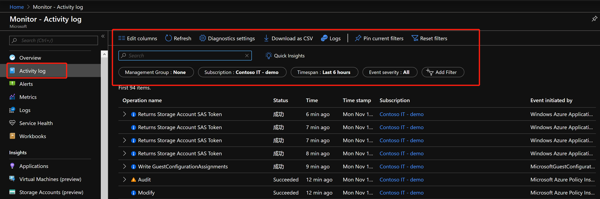
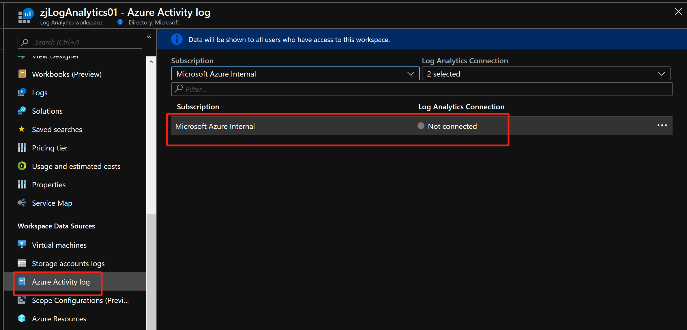
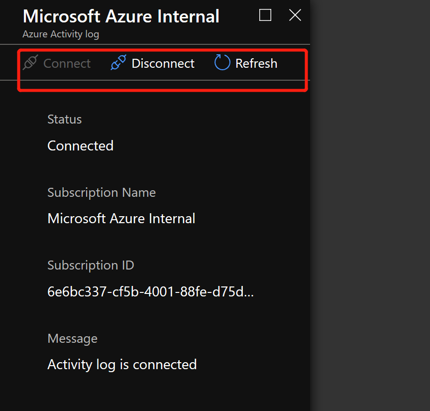
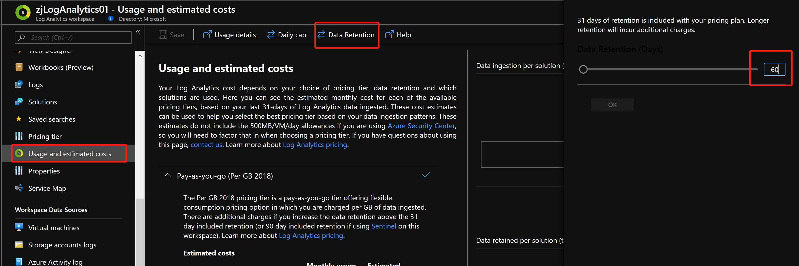
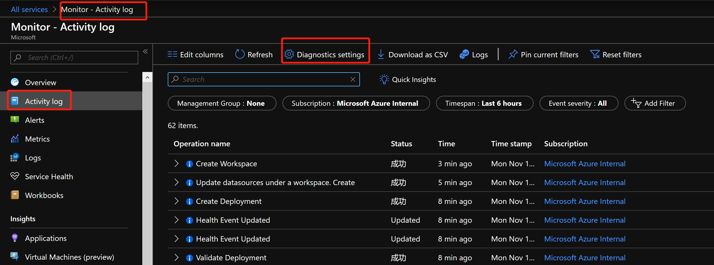
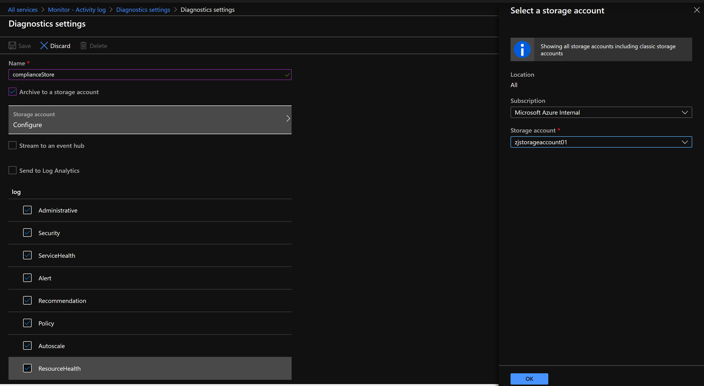
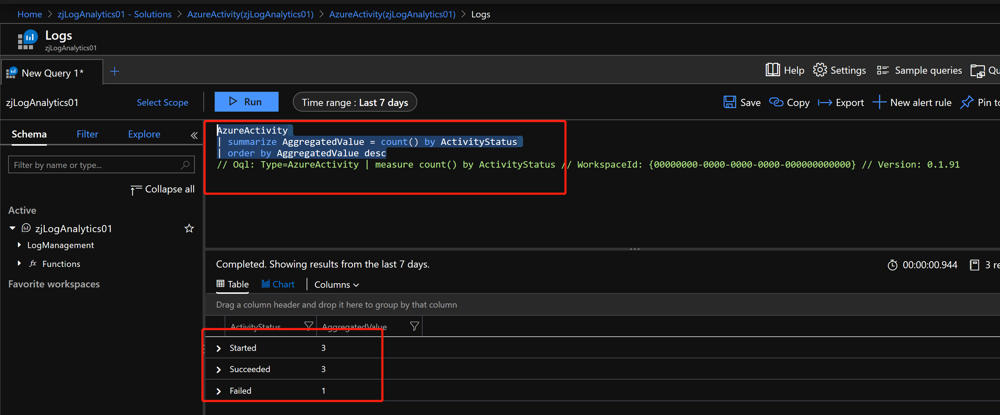
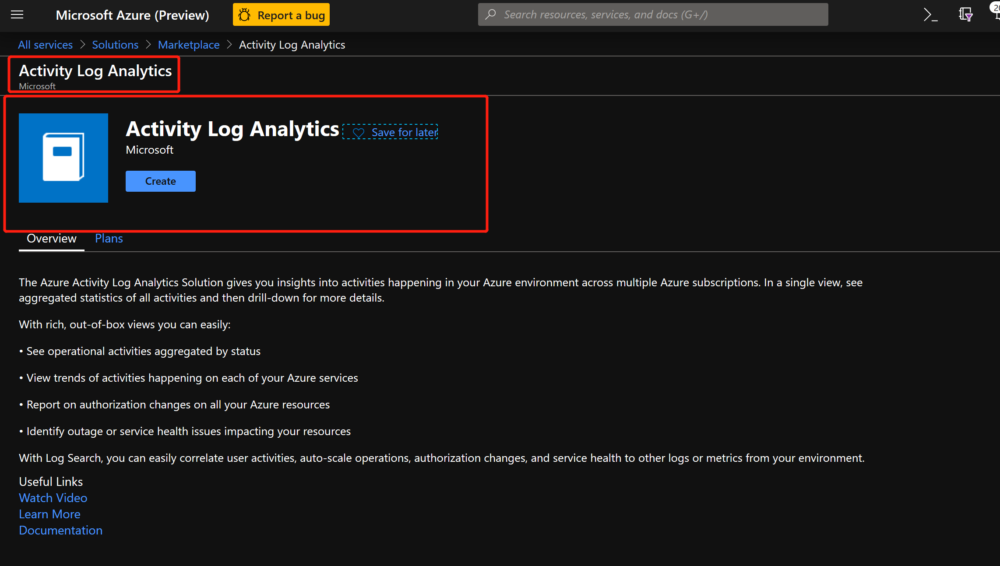
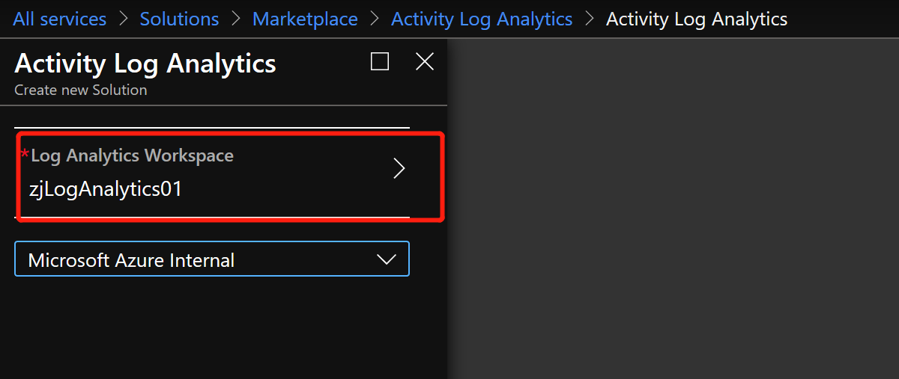
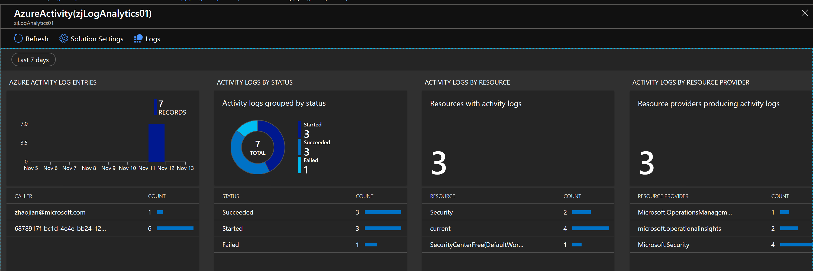

## Handson Lab for Azure 活动日志 (Activity Log)

Azure 活动日志定义了订阅级别的Azure资源相关事件, 即此资源发生了怎样的改变或执行了哪些操作；使用活动日志能够帮助我们更好的了解并管理Azure的环境；活动日志也称 “审核日志”或“操作日志”.

可直接通过 `Azure Monitor - Activity Log`, 筛选并查看你想要的活动日志

活动日志支持的日志种类及定义如下：

| 类别 | 描述 |
|:---|:---|
| 管理 | 包含对通过资源管理器执行的所有创建、更新、删除和操作的记录。 管理事件的示例包括创建虚拟机和删除网络安全组。  用户或应用程序通过资源管理器所进行的每一个操作都会作为特定资源类型上的操作建模。 如果操作类型为“写入”、“删除”或“操作”，则该操作的开始、成功或失败记录都会记录在管理类别中。 管理事件还包括任何对订阅中基于角色的访问控制进行的更改。 |
| 服务运行状况 | 包含对任何发生在 Azure 中的服务运行状况事件的记录。 服务运行状况事件的一个示例是“美国东部的 SQL Azure 正处于故障时间”。   服务运行状况事件分为六种种类：需要操作、协助恢复、事件、维护、信息或安全性。 仅当订阅中存在会受事件影响的资源时，才会创建这些事件。
| 资源运行状况 | 包含 Azure 资源发生的任何资源运行状况事件的记录。 资源运行状况事件的示例是“虚拟机运行状况已更改为不可用”。  资源运行状况事件可以表示四种运行状况之一：可用、不可用、已降级、未知。 此外，资源运行状况事件可以归类为“平台启动”或“用户启动”。 |
| 警报 | 包含 Azure 警报的激活记录。 “过去 5 分钟内，myVM 上的 CPU 百分比已超过 80%”是警报事件的示例。|
| 自动缩放 | 包含基于在订阅中定义的任何自动缩放设置的自动缩放引擎操作相关的事件记录。 自动缩放事件的一个示例是“自动缩放纵向扩展操作失败”。 |
| 建议 | 包含 Azure 顾问提供的建议事件。 |
| 安全性 | 包含 Azure 安全中心生成的任何警报的记录。 安全事件的一个示例是“执行了可疑的双扩展名文件”。 |
| 策略 | 包含 Azure Policy 执行的所有效果操作的记录。 策略事件的示例包括审核和拒绝。 Policy 执行的每个操作建模为对资源执行的操作。 |

### 设置活动日志的保存周期

由于活动日志系统默认保存90天, 超过90天系统会自动清理. 很多用户都希望能够将活动日志保存更长, 180天, 甚至出于审计需要, 保存1年. 

我们可以将活动日志与Azure Log Analytics对接, 保存90天, 可与其他监控数据一起完成多维度的分析; 我们可以将活动日志导出到 Storage Account, 存储1年, 以满足审计要求;

#### 前期准备

- Azure Log Analytics : `zjLogAnalytics01`

- Azure Storage Account : `zjstorageaccount01`

#### 设置 Log Analytics workspace, 接收 Activity Log, 并保存60天

将 Activity Log 持续导出到 Log Analytics workspace 中很简单, 按如下操作即可：

设置 Log Analytics workspace 的数据保留时间, 保留60天

活动日志到达Log Analytics存在一定的延迟，一般情况下，将活动日志数据发送到 Log Analytics 引入点大约需要 10 到 15 分钟.

#### 将 Activity Log 导出到 Storage Account 进行合规性保存, 保存期限一年

由于目前此功能只在Global Azure提供, Azure China如需满足合规性, 长时间保存数据的话, 请将Log Analytics的数据保留期限设置为365天

点击进入 `Azure Monitor - Activity Log - Diagnostics Settings`

### 在 Log Analytics 中查看活动日志

我们可以通过 Log Analytics, 查询我们需要的相关活动日志信息

#### Global Azure 通过Solution方式, 额外提供了针对 Activity Log 的可视化监控解决方案

安装针对于 Azure Activity Log 的解决方案非常简单, 只需要两个步骤: 1) 找到解决方案 ; 2) 创建到 Log Analytics workspace 中

回到 Log Analytics workspace, 点击Solution, 即可看到刚才安装的解决方案

### 参考资料

- [Azure 活动日志](https://docs.microsoft.com/zh-cn/azure/azure-monitor/platform/activity-logs-overview)

- [收集和分析 Azure Monitor 中 Log Analytics 工作区中的 Azure 活动日志](https://docs.microsoft.com/zh-cn/azure/azure-monitor/platform/activity-log-collect)