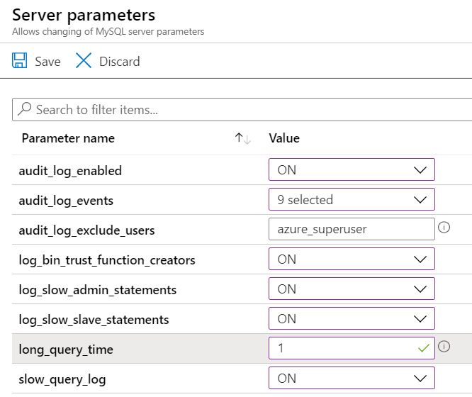

# Azure MySQL服务的监控

本次实验，向大家介绍如何利用Azure Monitor对Azure MySQL服务进行监控。主要涉及以下两种监测场景：

场景一：INSERT,DELETE,UPDATE操作监控

场景二：慢查询监控

实验中相关配置为了方便进行监控分析，实际使用中请根据具体情况而定

## **环境准备**

### 1. 部署一台CentOS测试主机

1.1 在Azure Portal中，新建一台CentOS虚拟机，配置如下：


1.2 创建成功后，登陆testVM，通过以下命令安装sysbench测试工具


``` bash
# 安装sysbench依赖库
sudo  yum -y install make automake libtool pkgconfig libaio-devel
sudo yum -y install mysql-devel openssl-devel 

# 安装sysbench
curl -s https://packagecloud.io/install/repositories/akopytov/sysbench/script.rpm.sh | sudo bash

sudo yum -y install sysbench 

# 验证安装成功
sysbench --version
```


1.3 在testVM中，安装MySQL客户端

``` 
sudo yum install mysql
```

### 2. 创建Log Analytics workspace

在Azure portal首页上方搜索“Log Analytics workspace”，进入LA workspaces页面，点击上方“+Add”添加LA workspace。


对Log Analytics workspace进行配置：


### 3. 部署Azure MySQL数据库

3.1 在Azure Portal中点击创建资源，选择“Azure Database for MySQL”


3.2 测试时可以关闭SSL证书，添加测试主机testVM到白名单

在Azure portal中打开Mysql database页面，在左侧工具栏中点击Settings下面的“Connection security”，进行如下操作：
- Allow access to Azure Services： <font color=red>ON</font>
- 将testVM的公网IP地址添加到规则中，参考下图
- Enforce SSL connection：<font color=red>DISABLED</font>


3.3 配置MySQL诊断日志

在Mysql databse页面的左侧工具栏Monitoring下面的“Server logs”，点击上方配置链接，进入日志配置页


为了方便查看监测效果，我们打开Mysql所有日志，配置如下：


配置完成后，点击保存。接下来，我们为Mysql数据库配置日志存放位置以及连接Log Analytics workspace方便后续的查询分析。在左侧工具栏中的点击"Diagnostic settings"，然后点击页面中“+Add diagnostic setting”


具体配置如下：
- 勾选“Archive to storage account”，将日志存档到Blob storage，您可以单独创建一个Blob storage container存放日志文件。
- 勾选“Send to Log Analytics”，选择订阅及之前创建的LA workspace
- 勾选所有log & metric选项，将Retention拖到最大（365天）
- 配置完成后点击保存


## **数据准备**

### 1. 在MySQL中创建测试库
 
 回到testVM测试机命令行，远程连接Azure Mysql数据库
```bash
# 从测试机testVM连接MySQL数据库
mysql -h mysql0001.mysql.database.chinacloudapi.cn -u datauser@mysql0001 -p
```
<font color=red>注：上述代码使用时，注意数据库host和username参数的替换</font>

```bash
# 在Mysql中创建测试库
create database sbtest;
show databases;
commit;
exit;
```

### 2 利用sysbench创建测试数据表

测试数据准备：4个并发连接，10张表，每个表填充10w条数据
```bash
#在测试机testVM上运行以下命令，创建测试数据表
sysbench /usr/share/sysbench/oltp_read_write.lua --threads=4 --mysql-host=mysql0001.mysql.database.chinacloudapi.cn --mysql-user=datauser@mysql0001 --mysql-password=<yourPassword> --mysql-port=3306 --tables=10 --table-size=1000000 prepare
```
<font color=red>注：上述代码使用时，注意数据库host和username参数的替换</font>

2.5 运行sysbench对mysql数据库的基准测试

执行sysbench测试：
```bash
#运行sysbench对mysql数据库的基准测试
sysbench /usr/share/sysbench/oltp_read_write.lua --threads=32 --events=0 --time=300 --mysql-host=mysql0001.mysql.database.chinacloudapi.cn --mysql-user=datauser@mysql0001 --mysql-password=<yourPassword> --mysql-port=3306 --tables=10 --table-size=1000000 --range_selects=off --db-ps-mode=disable --report-interval=1 run
```
<font color=red>注：上述代码使用时，注意数据库host和username参数的替换</font>

在进行sysbench测试期间，可以打开Metrics，对数据进行实时监控
<!-- 
在测试机上返回的测试结果如下，

-->

## **Azure Monitor监控**

### 1. 在Metrics中实时观测数据库性能指标
打开Azure Portal，进入创建的MySQL数据库页面，在左侧工具栏中点击Metrics, 添加监测指标，这里我们选择“Active Connection”，观察连接数。


在sysbench测试中我们配置了并发连接数为32，在上图结果中可以看到最大并发连接数为32。除此之外，可以点击“Add metric”添加更多的监测指标。

你也可以在首页找到/搜索“Azure Monitor”


可以通过Azure Monitor打开Metircs，查看MySql数据库的测试结果


### 2. 监控数据库中Insert/Delete/Update操作

2.1 在Azure portal中进行可视化分析

在Azure Monitor页面中，点击“Logs"，对数据库中的具体操作进行分析，在Query框中输入“AzureDiagnostics”，查询结果如下；


我们对日志进行进一步筛选可分析，在Query框中输入以下Kusto语句：
```Kusto
AzureDiagnostics
| where Category == "MySqlAuditLogs"
| where sql_text_s contains "INSERT" or sql_text_s contains "UPDATE" or sql_text_s contains "DELETE" 
| summarize count() by duration=bin(TimeGenerated, 1) 
| sort by duration asc | render barchart
```
查询结果如下：


2.2 连接Grafana，进行可视化分析

在Grafana中安装Azure Monitor插件，并成功连接数据源之后，新建一个Dashboard，点击"New dashboard"


选择新建图标


将服务切换成"Azure Log Analytics"


输入上文的Kusto查询语句，在页面上方选择合适的时间窗


### 3. 查看数据库中的慢查询

默认慢查询时间“1s”，为了更好展示慢查询监测效果，我们在Azure portal中将慢查询时间配置为“0.1s”


在testVM再一次运行2.5中的sysbench测试命令，运行完成后，我们对运行结果进行查询和分析

- 在Azure Portal中打开Azure Monitor，在左侧工具栏中点击“Logs”，在query窗口中输入以下命令

```Kusto
AzureDiagnostics
| where Category == "MySqlSlowLogs"
| project TimeGenerated , query_time_d , lock_time_d , sql_text_s , host_s 
| sort by TimeGenerated desc
```


- 在Grafana中查看慢查询结果

在之前的dashboard下，新建一个table查询


连接Log Analytics workspace，然后输入Kusto语句，点击“Run”，可得到查询结果如下：


返回Dashboard面板，可以看到日常的控制面板如下，您还可以根据需求进一步丰富监控面板效果


