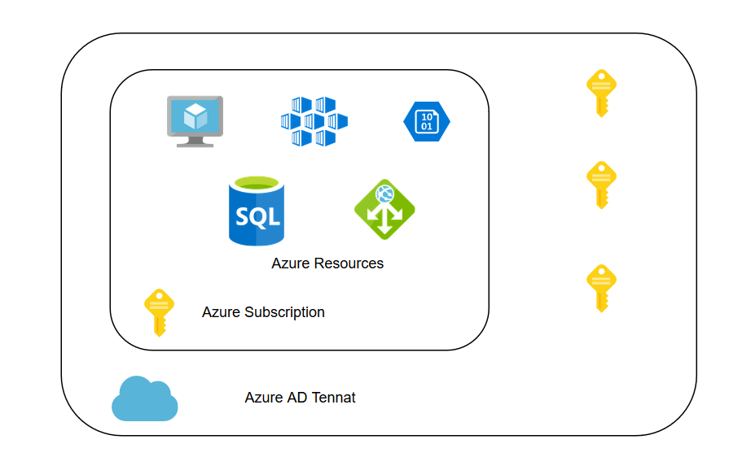
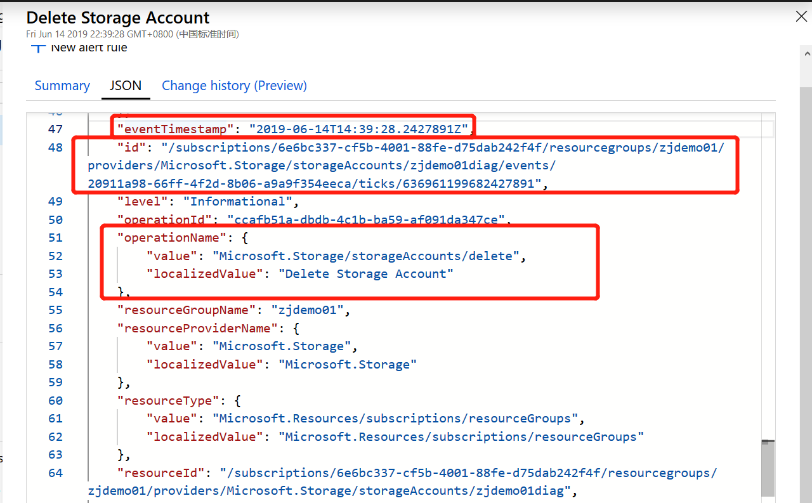
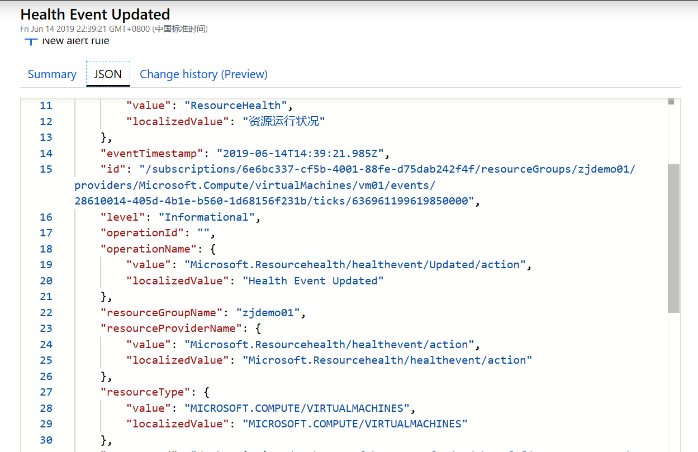
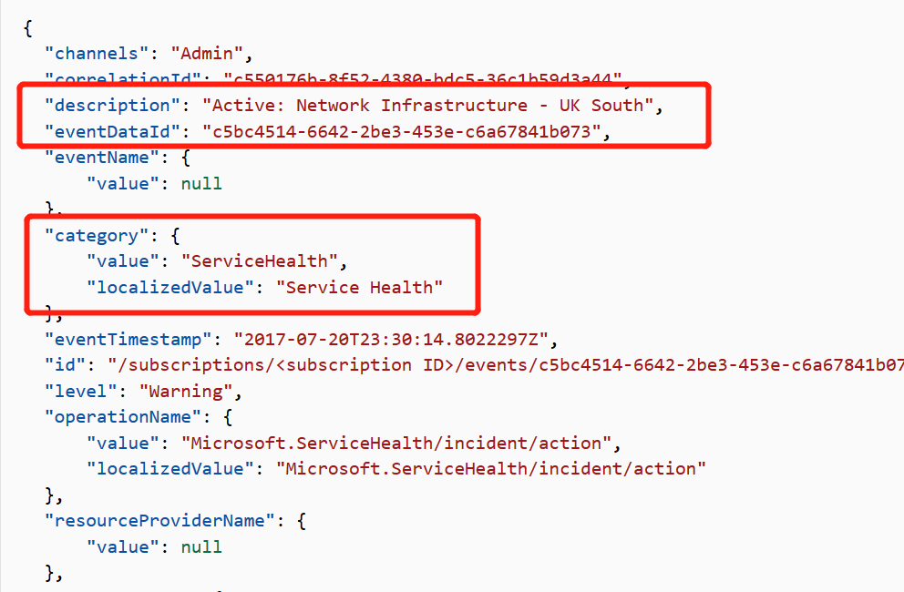

## 了解Azure中监控数据平台的层次，及各层次能够收集到的数据

Azure中监控的数据主要为 `Metrics` & `Logs`， 监控包括 `Tenant(租户)` & `Subscription` & `IaaS` & `Container` & `PaaS` & `客户自定义数据`等不同层级的资源，
  提供一致性的`监控` & `分析` & `可视化` & `警报`等功能。

### 数据的种类

- `Metrics` 是时序数据，包含一个时间戳和数值，形如`"Percentage CPU": {"average": 0.57,"timeStamp":"2019-06-13T13:00:00+00:00"}`，定期收集，能够快速反应环境中出现的问题，如“CPU过高”，可以根据合理的`Metrics`设置报警，以便在环境出现问题时快速响应； `Metrics`的访问可以
  集中通过 `Metrics Explorer`进行查询， 可以通过`Azure Dashboard`创建一个定制化的大屏，能够体现资源整体的运行情况；
  
  `Metrics` 主要包含三个维度
  
  - `平台指标 （无需任何配置）` ：  反映资源的运行状况和性能；
  - `Guest OS Metrics (特指VM，需要配置诊断设置)` ：  通过Extension的Agent收集；
  - `容器 Metrics （特指AKS，需要额外开启Addons）` : 通过Agent进行收集；
  - `额外需要配置诊断设置的 Azure服务`
  - `应用程序数据 （需要集成Application Insights）`
  - `自定义指标 (需遵循平台配置指南)` ：  收集非平台的指标，比如用户在虚机中安装了MySQL，收集MySQL的一些指标；或用户想收集本地虚机的指标等；
  
  `Metrics` 大多数资源的指标数据保留93天，用户可以导出到存储账户进行存档保存；
  
  更多详细信息 ：
  - [Azure中的Metrics介绍](https://docs.microsoft.com/zh-cn/azure/azure-monitor/platform/data-platform-metrics)  
  - [Azure平台中不同服务支持的 Metrics](https://docs.microsoft.com/zh-cn/azure/azure-monitor/platform/metrics-supported)

- `Logs` 是详细的信息记录，包含更多的信息，主要用于对出现的问题进行具体的分析；日志不同于指标，虽然按照时间顺序进行汇总，但不是按固定事件间隔进行收集发送； 建议将所近期日志
      （一个月或三个月）放入 `Log Analytics` 中保存分析，这样可以多维度的分析问题或获取见解，将长期数据（三个月以上）放入存储账户进行存储，以符合不同要求的合规性，审查或用于长期
    分析。
  
  Azure Monitor中提供了 `Log Analytics` 的服务，用于对日志进行查询分析； `Log Analytics` 使用Kusto语言进行查询； `Log Analytics`的日志数据均存储在`Log Analytics workspace`
      中，且 `Application Insights` & `Azure Security Center` & `Azure Sentinel` 收集的日志存储在其内置的workspace中，但可以跨workspace进行分析；

  Azure中的日志主要包括 管理层的 `Azure AD Audit Logs` & `Azure Activity Log`; 资源层面的 `支持Diagnostics Settings的资源的诊断日志` & `虚拟机 Extension收集的性能及自定义日志`
    & `容器的日志数据` & `Application Insights中收集的应用程序请求&异常等详细数据， 使用情况等`； 支持通过多种手段将第三方日志导入到 `Log Analytics`;
  
    一般情况下，资源产生的日志数据与Azure Monitor之间会有 2-5 Mins的延迟，主要是因为
  
    更多详细信息：
    - [Azure中日志介绍](https://docs.microsoft.com/zh-cn/azure/azure-monitor/platform/data-platform-logs)
    - [Azure中查询语言入门](https://docs.microsoft.com/zh-cn/azure/azure-monitor/log-query/get-started-queries)
    - [影响日志数据传入Azure Monitor的因素](https://docs.microsoft.com/zh-cn/azure/azure-monitor/platform/data-ingestion-time)

### 能够收集的不同层面的资源

一般情况下，一家公司是处于一个Tenant中，通过创建不同的订阅，并在订阅下创建不同的资源。

- Azure Tenant相关的数据 ：主要为 __*Azure Active Directory 审核日志*__ ，Azure AD的全局管理员才能够进行设置，具体设置可参照 [将 Azure AD 日志集成与 Azure Monitor 日志](https://docs.microsoft.com/zh-cn/azure/active-directory/reports-monitoring/howto-integrate-activity-logs-with-log-analytics), 将日志导入到特定的Log Analytics workspace中，并依照存储建议对数据进行存档；

- Azure Subscription相关数据：主要为 __*Activity Log*__ & __*Service Health*__

  - Activity Log ：收集所有针对资源的操作记录及资源的运行状况，例如：创建一个虚拟机，产生相关的活动日志记录虚拟机的创建过程及创建者；当平台对服务进行维护或某一资源的状态发生改变，也会创建一条活动日志记录发生的变化，如下所示：

    

    

    用户可以针对不同类别的Activity Log进行告警设置，及早知道环境中发生的变化；可参照 [收集和分析 Azure Monitor 的 Log Analytics 工作区中的 Azure 活动日志](https://docs.microsoft.com/zh-cn/azure/azure-monitor/platform/activity-log-collect)将活动日志配置到特定的Log Analytics workspace中，并依照存储建议对数据进行存档; 默认 Activity Log的保存期为90天。

    活动日志记录了包括 `Administrative` & `Service Health` & `Resource Health` & `Alert` & `Autoscale` & `Recommendation` & `Security` & `Policy` 在内的多种类型的事件，同时提供多种filter，帮助用户调查在Azure订阅级别下，资源或环境中发生的事情；

    更多资料参考：
    - [活动日志中的类别](https://docs.microsoft.com/zh-cn/azure/azure-monitor/platform/activity-logs-overview#categories-in-the-activity-log)

    - [Azure 活动日志事件架构](https://docs.microsoft.com/zh-cn/azure/azure-monitor/platform/activity-log-schema)

  - Azure Service Health : 服务运行状况的数据实际上是存放在活动日志中，用户可以登陆到特定页面 `Monitor - Service Health` 中了解到包括近一段环境中出现的服务相关的问题及RCA报告，平台计划的Maintenance等，并可设置响应的告警，以便第一时间知道平台的哪个服务出了问题，详细介绍请参照 [使用 Azure 门户查看服务运行状况通知](https://docs.microsoft.com/zh-cn/azure/azure-monitor/platform/service-notifications)

    

- Azure Resources ：主要为 __*Metrics*__ & __*Logs*__ ,另外包含针对于虚机的 `Guest OS` & `Azure Monitor for Container`

  - Metrics : 如上面介绍，指标是能够反应Azure服务可用性及性能的参考；大家比较好理解的是对虚机进行指标收集，Metrics除了支持IaaS资源外，还支持平台中的PaaS服务，且使用第一方的方式收集Metrics，更为简单，快速，稳定；部分IaaS服务&PaaS服务需要开启诊断日志，以支持指标的收集，用户在创建资源的时候记得打开诊断日志，以便更好的了解创建的服务；

  - Logs ：主要针对诊断日志，不需要代理并从 Azure 平台本身捕获特定于资源的数据；Azure资源的诊断日志默认是不开启的，需要在创建过程中或使用过程中开启，且指定到特定的Log Analytics workspace中，并依照存储建议对数据进行存档；并不是所有的服务都支持诊断日志，具体支持列表请参考 [Azure 诊断日志支持的服务、架构和类别](https://docs.microsoft.com/zh-cn/azure/azure-monitor/platform/diagnostic-logs-schema)；

    > __*注意：*__ 由于AzureDiagnostics 中列限制 “包含的列数不超过 500 个的任意给定 Azure 日志表具有明确的限制。 一旦达到该限制，在引入时，包含不属于前 500 个列的数据的行将被删除。”；当一个Project用到的资源类型过多，一定要计算一下需要的列数，并合理规划workspace；

  - Guest OS : 通过不同的 Extension 来收集 Guest OS 的指标数据，主要针对于 Azure VM 及 On-Prem VM

    - Azure Diagnostics Extension : 主要收集 Azure VM 中的指标数据；

    - Log Analytics Agent : 主要通过Agent收集 Windows/Linux 自定义数据，VM可以为Azuge VM，也可以是本地 On-Prem VM

    - Azure Monitor for VM ：主要提供对于Azure虚机的运行状况指标，提供针对于Azure/非Azure虚机的性能及Service Map指标；运行状况条件指标存储在 Azure Monitor 中时间序列数据库、 收集性能和依赖关系数据存储在 Log Analytics workspace 中。
  
  - Azure Monitor for Container : 提供针对AKS数据的收集，主要收集AKS集群的指标并发送到Azure Monitor，可在 Metrics Explorer中进行查询；提供针对AKS集群的日志数据，包括实时的Pod日志；

- Application 数据 ：Azure Monitor中的Application Insights是一款智能APM工具，能够提供对支持的框架开发的应用程序进行数据的收集，且不论应用程序部署在Azure还是本地；Application Insights安装检测包后，会收集与应用程序的性能和运行相关的指标和日志，并发送到Azure，保存在Application Insights Instance专属的Log Analytics workspace中；

__*注意 : 将数据传入到Azure Monitor或是Log Analytics会存在一定时间的延迟*__ ，请参阅 ：[不同数据一般情况下延迟时间](https://docs.microsoft.com/zh-cn/azure/azure-monitor/platform/data-ingestion-time)

### 更多参考资料

- [Azure Monitor 数据源](https://docs.microsoft.com/zh-cn/azure/azure-monitor/platform/data-sources#operating-system-guest)

- [Cloud Governance Tools及需求mapping](https://azure.microsoft.com/en-gb/product-categories/management-tools/)

- [将Azure Monitor中的数据通过Eventhub导出到外部平台](https://docs.microsoft.com/zh-cn/azure/azure-monitor/platform/stream-monitoring-data-event-hubs)

- [Kusto Query Language (KQL) from Scratch](https://www.pluralsight.com/courses/kusto-query-language-kql-from-scratch)