## Prerequisite - 容器化 Grafana 环境 for Azure Monitor Handson

Grafana 是一款比较流行的时序化数据展示的工具, 被用在了很多的监控场景中. Kubernetes容器监控的开源解决方案, Grafana就是数据展示部分的重要组件. Grafana支持将Azure Monitor作为数据源, 从Azure Monitor中读取监控数据, 并展示在Grafana的Dashboard中. 更多详情参见 [在 Grafana 中监控 Azure 服务](https://docs.microsoft.com/zh-cn/azure/azure-monitor/platform/grafana-plugin)

本次系列的Handson, 也为大家准备了Grafana的默认环境, 方便大家通过Grafana, 连接Azure Monitor数据源, 构建监控大屏. Grafana同时可以连接 Azure Monitor / Azure Log Analytics / Azure Application Insights. 

本次实验将Grafana容器化部署在Azure Kubernetes Service中, 未来, 此AKS集群可以作为客户的容器化集群, 承担更多的运维工具的容器化部署.

### 创建一个AKS集群

创建一个名为 `aksOps` 的集群, 如何创建 AKS 集群请参阅 [快速入门：使用 Azure 门户部署 Azure Kubernetes 服务 (AKS) 群集](https://docs.microsoft.com/zh-cn/azure/aks/kubernetes-walkthrough-portal)

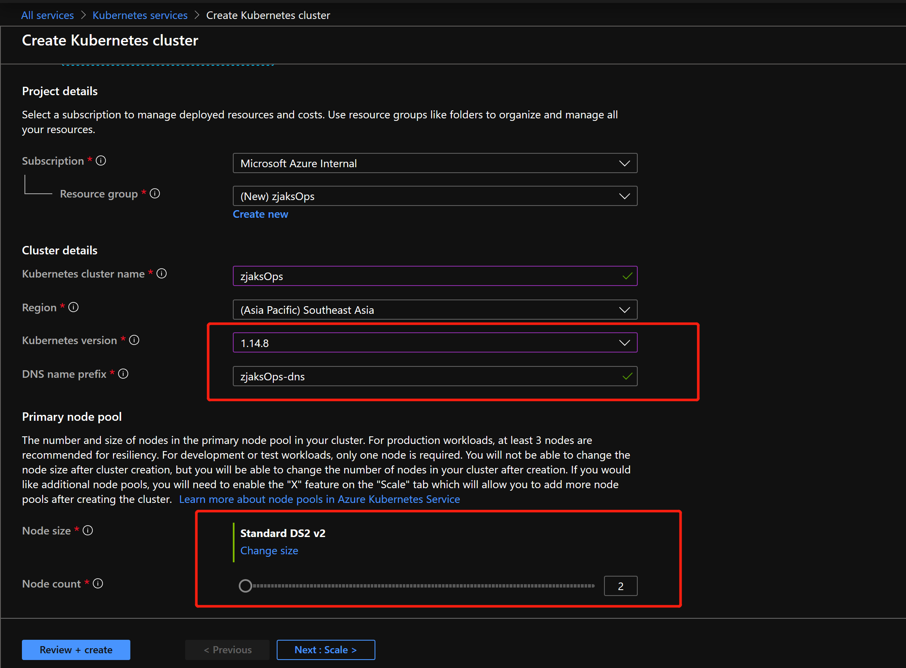

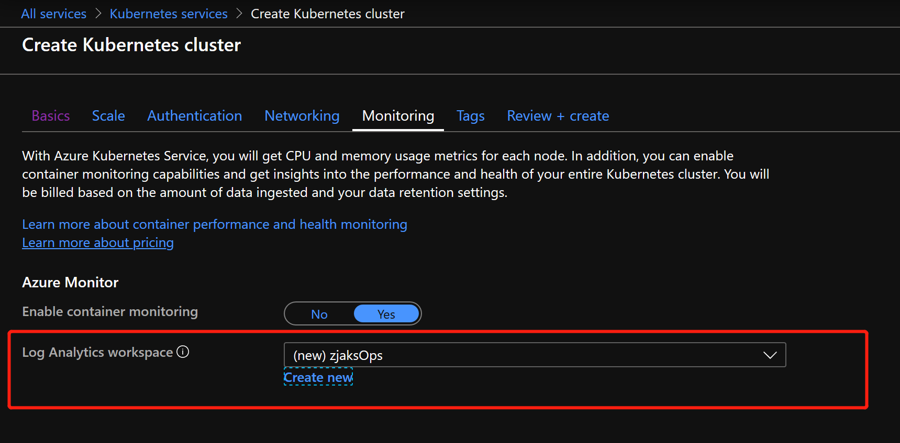

### Option 1 For Global Azure, 构建容器化的Grafana

#### 安装 Grafana

```
# Global Azure 可以直接通过 Helm Charts 进行安装
helm install -n demo-grafana stable/grafana --set service.type=LoadBalancer

# 获取 Grafana 的登陆密码
kubectl get secret --namespace default demo-grafana -o jsonpath="{.data.admin-password}" | base64 --decode ; echo

# 获取 Grafana 的登陆地址
kubectl get svc
```

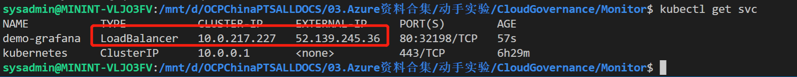

#### 配置 Grafana Data Source

Grafana本身并不存储数据, 数据主要从数据源中读取. Grafana支持很多种数据源, 其中 Azure Monitor是其官方支持的一种.

配置 `Azure Monitor DataSource` 需要事先准备好 ServicePrincipal, 配置详情如下：

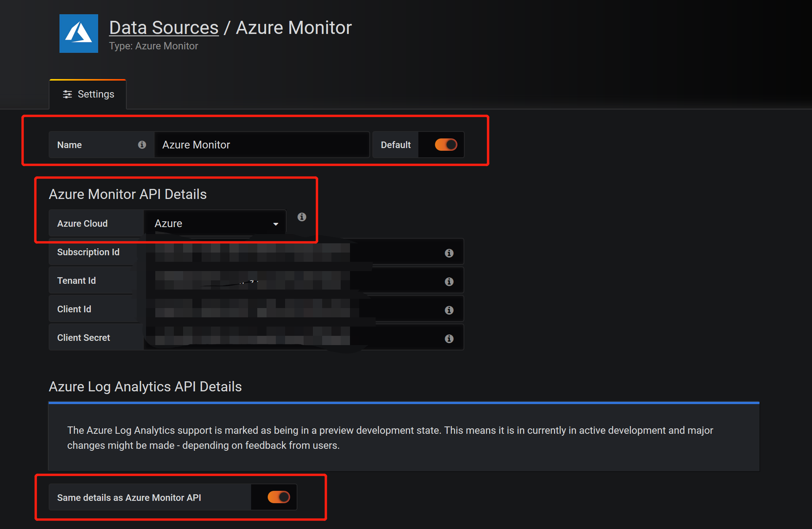

#### 验证监控数据是否已经可以显示在 Grafana Dashboard 中

随机添加一条环境中已有资源的Metrics信息, 在Dashboard中创建一个新的Query, 发现数据已经可以在Dashboard中显示


随机验证一条 Log Analytics 的查询语句, 发现数据已经在Dashboard中显示

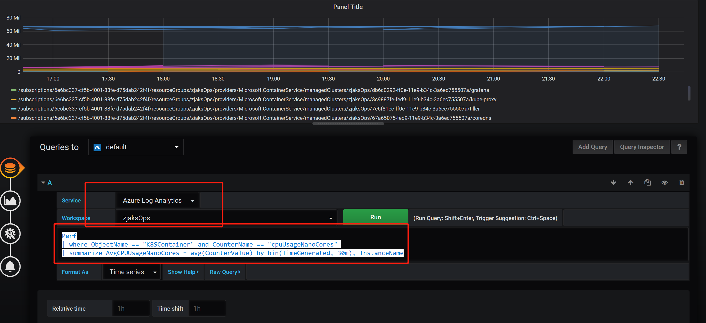

```
# 查询语句如下
Perf| where ObjectName == "K8SContainer" and CounterName == "cpuUsageNanoCores" | summarize AvgCPUUsageNanoCores = avg(CounterValue) by bin(TimeGenerated, 30m), InstanceName
```
---

### Option 2 For Azure Mooncake, 通过 IaaS VM 构建 Grafana

#### 安装&配置 Grafana

Grafana Azure Monitor Plugin 的插件，默认配置文件, 针对Azure China目前存在一定的问题, 导致Azure Log Analytics没有办法连接, 所以这里定制化了一个配置文件, 配置文件的详细内容请参考 [azure_monitor_plugin.json](./files/prerequisite_files/azure_monitor_plugin.json)

需要创建一台 `Ubuntu 16.04` 的VM, 建议型号为 `Standard_Ds3_v2`, 名为 `grafanaVM`

安装Grafana的详细文档请参照 ：[Grafana Installation](https://grafana.com/docs/installation/debian/)

本次实验为Grafana访问开启了Https, 使用自签名的证书；实际生产环境中, 请根据实际需要进行合理配置. 更多Grafana配置请参照 [Grafana Configuration](https://grafana.com/docs/installation/configuration/)

配置 `grafanaVM` 使用的IP, 配置DNS Name 及 静态IP

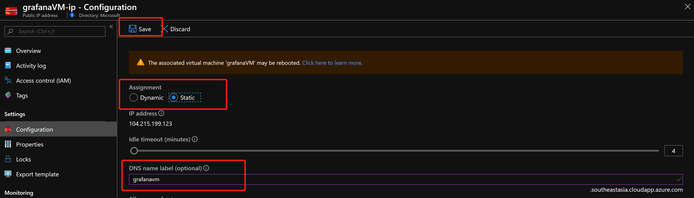

更改NSG, Grafana默认端口为3000, 需要增加一条 Inbound Rule, 允许访问3000端口的流量

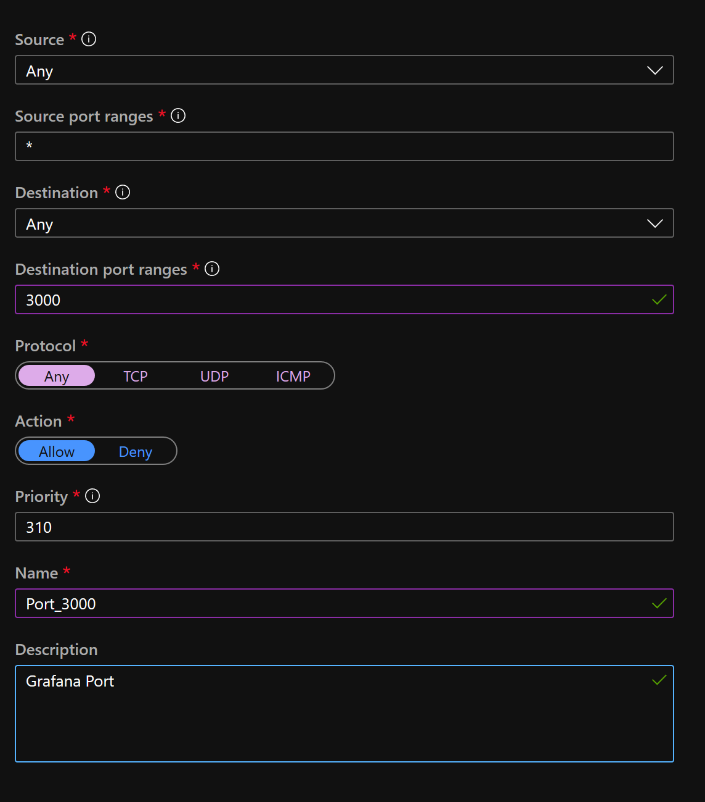

```
# 登陆到 grafanaVM
# 安装 Grafana
sudo apt-get install -y software-properties-common
sudo add-apt-repository "deb https://packages.grafana.com/oss/deb stable main"
wget -q -O - https://packages.grafana.com/gpg.key | sudo apt-key add -
sudo apt-get update
sudo apt-get install grafana=5.4.5

# 确保 Grafana 开机自动启动
sudo systemctl enable grafana-server.service
sudo systemctl daemon-reload
sudo systemctl start grafana-server

# 查看 Grafana 启动状态
sudo systemctl status grafana-server

# 制作自签名证书
sudo openssl genrsa -out demo-grafana.key 2048
sudo openssl req -new -key demo-grafana.key -out demo-grafana.csr
sudo openssl x509 -req -days 365 -in demo-grafana.csr -signkey demo-grafana.key -out demo-grafana.crt

# 将证书复制到 /etc/grafana/ 目录下, 并更改文件的Owner
sudo -i
cp demo* /etc/grafana/
chown root:grafana /etc/grafana/demo*

# 更改 Grafana 配置文件 /etc/grafana/grafana.ini
[server]
# Protocol (http, https, socket)
protocol = https

# The http port  to use
http_port = 3000

# https certs & key file
cert_file = /etc/grafana/demo-grafana.crt
cert_key = /etc/grafana/demo-grafana.key

# 保存并重启 Grafana Server
sudo systemctl restart grafana-server
```

__**注意：**__ 默认密码为 `admin/admin`, 第一次登陆时需要更改密码

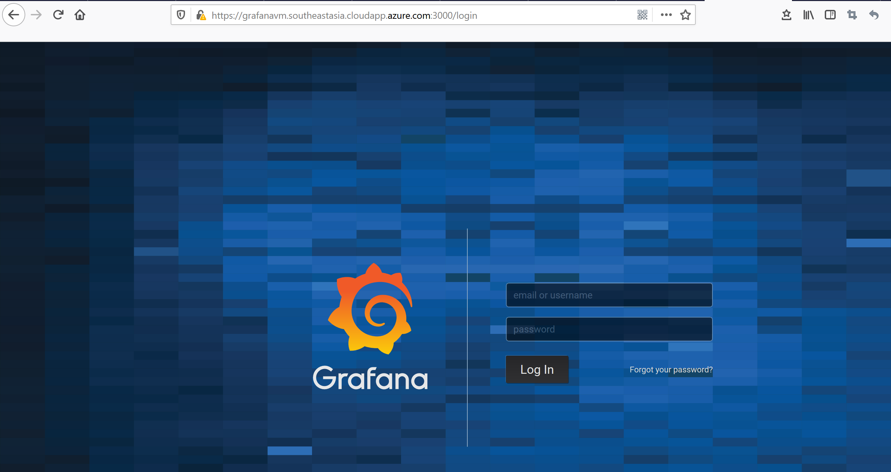

```
# 重新回到 grafanaVM
# 安装 Azure Monitor Plugin, 注意：Grafana 6.x版本, 默认集成了Azure Monitor Plugin
sudo grafana-cli plugins install grafana-azure-monitor-datasource

# 将 azure_monitor_plugin.json 替换如下目录下的文件
sudo -i
cp /home/sysadmin/plugin.json /var/lib/grafana/plugins/grafana-azure-monitor-datasource/src/
cp /home/sysadmin/plugin.json /var/lib/grafana/plugins/grafana-azure-monitor-datasource/dist/

# 重启 Grafana Server
systemctl restart grafana-server
```

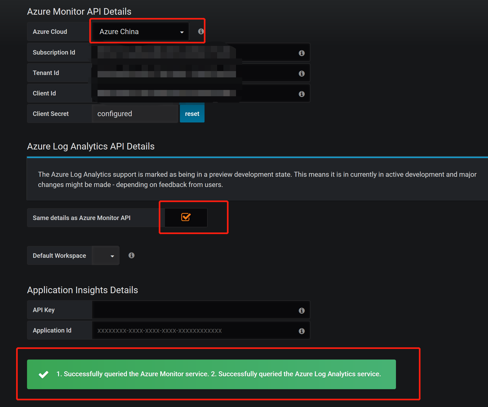

安装 `Azure Monitor Plugin` 详细可参考 [Azure Monitor Plugin 安装](https://grafana.com/grafana/plugins/grafana-azure-monitor-datasource)

#### 验证监控数据是否已经可以显示在 Grafana Dashboard 中

首先新建一个Graph的Dashboard, 然后点击标题 `Panel Title` 出现下拉菜单，点击 `Edit` :

.png)

随机添加一条环境中已有资源的Metrics信息, 在Dashboard中创建一个新的Query, 发现数据已经可以在Dashboard中显示

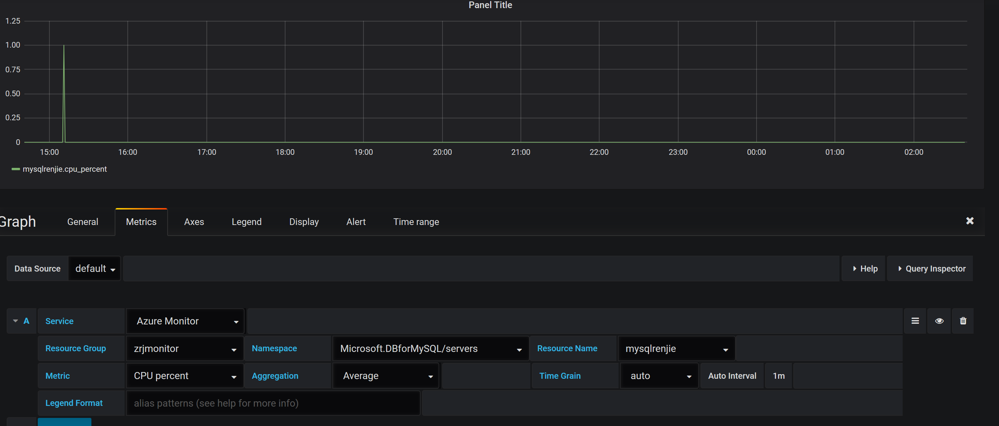

随机验证一条 Log Analytics 的查询语句 (这里新建一个Table的Dashboard), 发现数据已经在Dashboard中显示

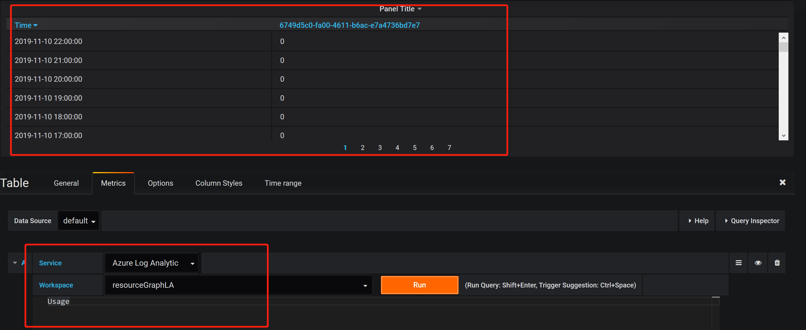

```
# 查询语句如下
Usage
```