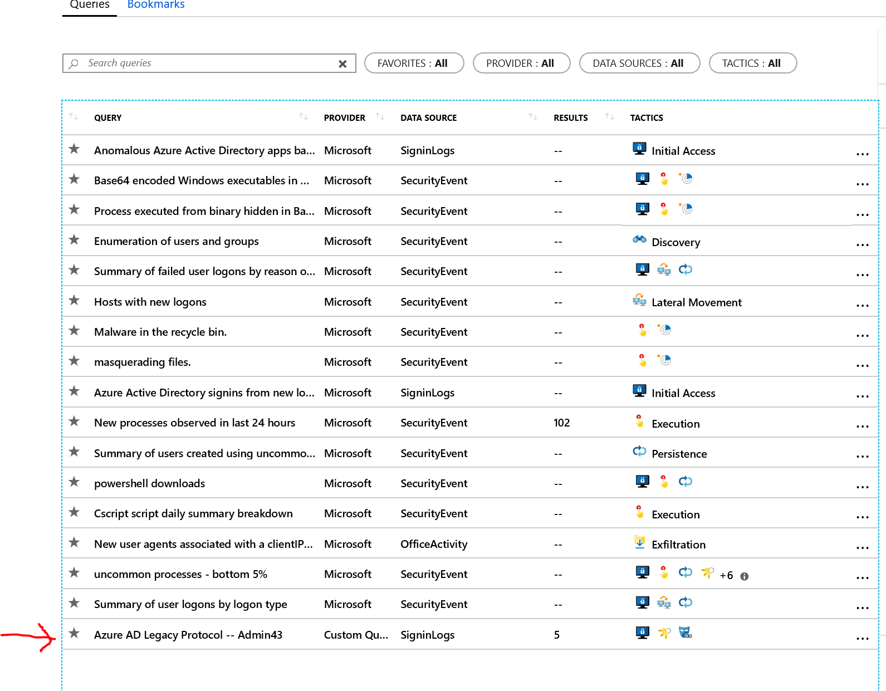

# Azure Sentinel - Hunting

> 如果你是一位调查人员，想要主动应对安全威胁，Azure 可以通过强大的搜索和查询工具来寻找组织数据源的安全威胁。 但您的系统和安全设备生成的数据山上很难分析和筛选成有意义的事件。 为了帮助安全分析师主动了解你的安全应用程序未检测到的新异常，Azure Sentinel 的内置搜索查询可指导你请求正确的问题，以便在你的网络上发现已有的数据中的问题。

 `Hunting` 是集成了很多微软默认提供的能针对很多通用场景的 `Kusto` 查询语句, 用来给用户提供一些参考, 也可以自定义查询语句。


***运行所有查询语句***

进入 `Azure Sentinel`, 选择相应的LA workspace，左侧点击 `Hunting`


 
默认有很多已经提供的查询, 可以点击 `run all queries` 来进行所有查询;


 
查看其中一个查询:


 查询之后, 产生的参考结果如下:

 

 
***用户Logon行为分析***

 

 
```
SecurityEvent
| where EventID == 4624
| where TimeGenerated >= ago(3d)
| where Computer startswith "DC01" or Computer startswith "DC03" or Computer startswith "DC04"
| where LogonTypeName <> "3 - Network" 
| where Account !endswith "$" and Account != @"NT AUTHORITY\LOCAL SERVICE" and Account != @"NT AUTHORITY\SYSTEM"
| summarize count() by Computer, Account, LogonTypeName
```

示例输出:
 


***用户自定义查询语句***

在门户顶部点击 `Azure Sentinel – Hunting` 回到 `Hunting` 面板.

 

 
自定义新query: 

 

```
Custom query: 
SigninLogs
| where ClientAppUsed in ('Other clients; Older office clients', 'Other clients', 'Other clients; IMAP', 'Other clients; POP', 'Other clients; SMTP')
| where TimeGenerated >ago(30d)
| summarize count() by UserPrincipalName, IPAddress, ClientAppUsed
```


点击创建, 并在portal上查看;

 

点击 `Run all queries` 将新建的query添加到所有queries中.


点击新创建的query, 点击 `Run Query` 和 `View Results`.


 
通过结果, 可以查看具体来源访问的ip, 通信协议等等;


### 参考资料：
- [利用 Azure Sentinel 寻找威胁](https://docs.microsoft.com/zh-cn/azure/sentinel/hunting)
- [Azure Sentinel Hunting Queries](https://github.com/Azure/Azure-Sentinel/tree/master/Hunting%20Queries)


