# Azure Sentinel 监控第三方平台 - AWS Cloudtrail

> AWS CloudTrail 是一项 AWS 服务，可对 AWS 账户进行监管、合规性检查、操作审核和风险审核。用户、角色或 AWS 服务执行的操作将记录为 CloudTrail 中的事件。事件包括在 AWS 管理控制台、AWS Command Line Interface 和 AWS 开发工具包和 API 中执行的操作。可以通过CloudTrail 来查看、搜索、下载、归档、分析和响应您的 AWS 基础设施中的账户活动。您可以确定谁或哪个组件对哪些资源执行了哪些操作、事件发生的时间以及其他细节，来帮助您分析和响应 AWS 账户中的活动。

`Azure Sentinel` 可接入 `AWS Cloudtrail` 数据，从而在 `Azure Sentinel` 中查看并监控AWS账户活动。

### 操作步骤

1. 首先登录AWS账户，在 `Amazon Web Services` 控制台中, 在 `"安全性"` 下, 单击 `"标识 & 符合性"`, 然后选择 `IAM`。

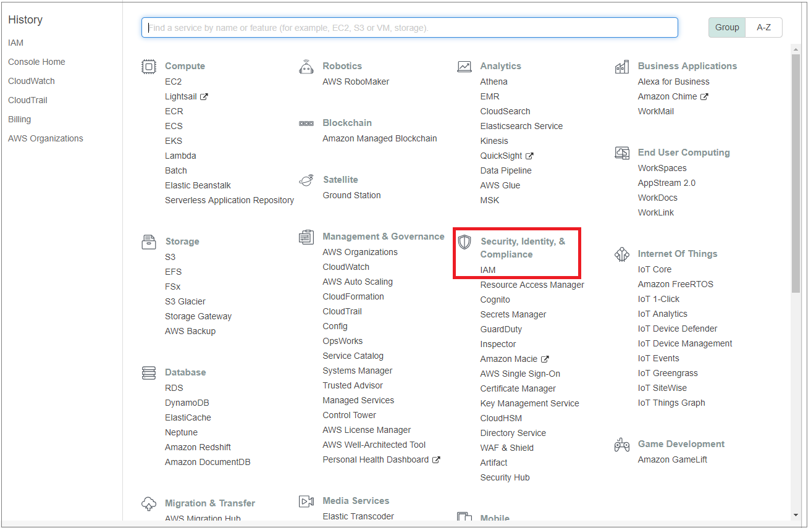

2. 选择 `"角色"` 并选择 `"创建角色"`。

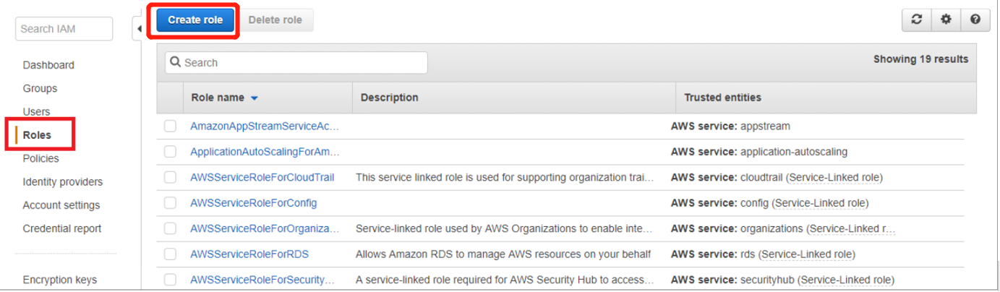

3. 请选择 `“其他 AWS 帐户”`:

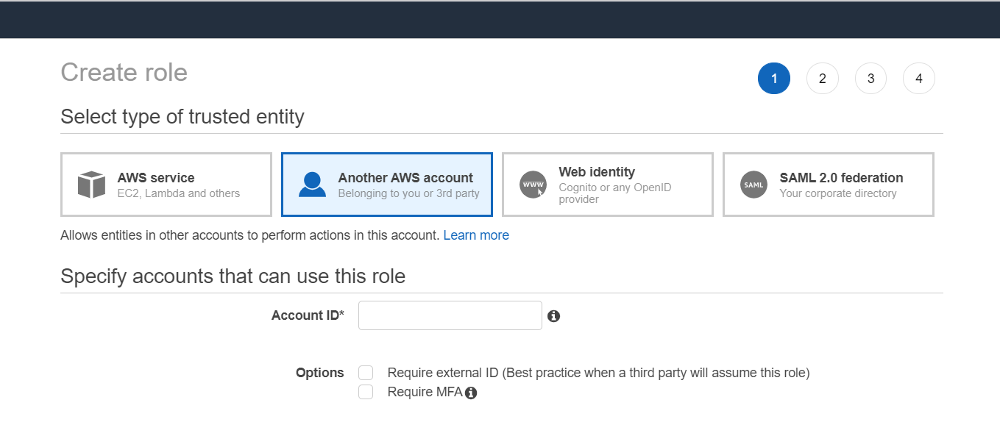

4. 在 `"帐户 id"` 字段中, 输入可在 `Azure Sentinel` 门户的 AWS 连接器页中找到的 `Microsoft 帐户 id (197857026523)`。

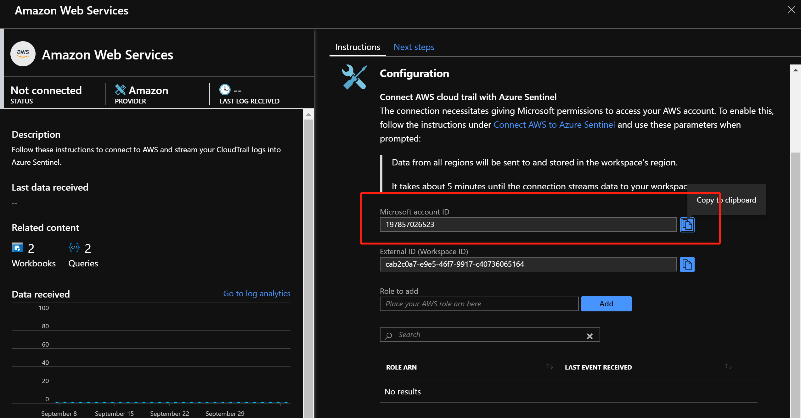

5. 请确保选择 `"需要外部 id"`, 然后输入可在 `Azure Sentinel 门户`的 AWS 连接器页中找到的`外部 Id` (工作区 id):

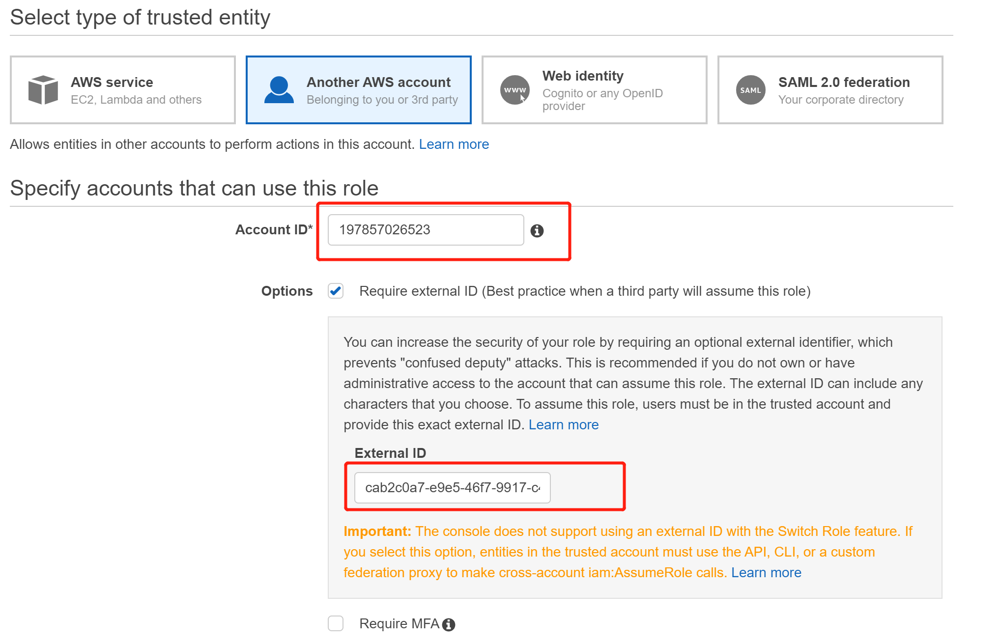

6. 在 `"附加权限策略"` 下选择 `"AWSCloudTrailReadOnlyAccess"`，点击 `"Next:Tag"`:
 
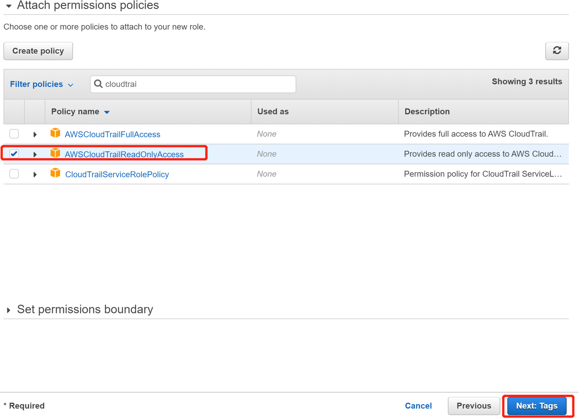

7. 输入标记 `Tags` (可选)

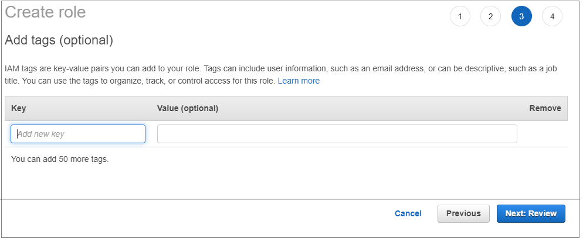

8. 然后, 输入角色名称并选择 `"创建角色"` 按钮。
 
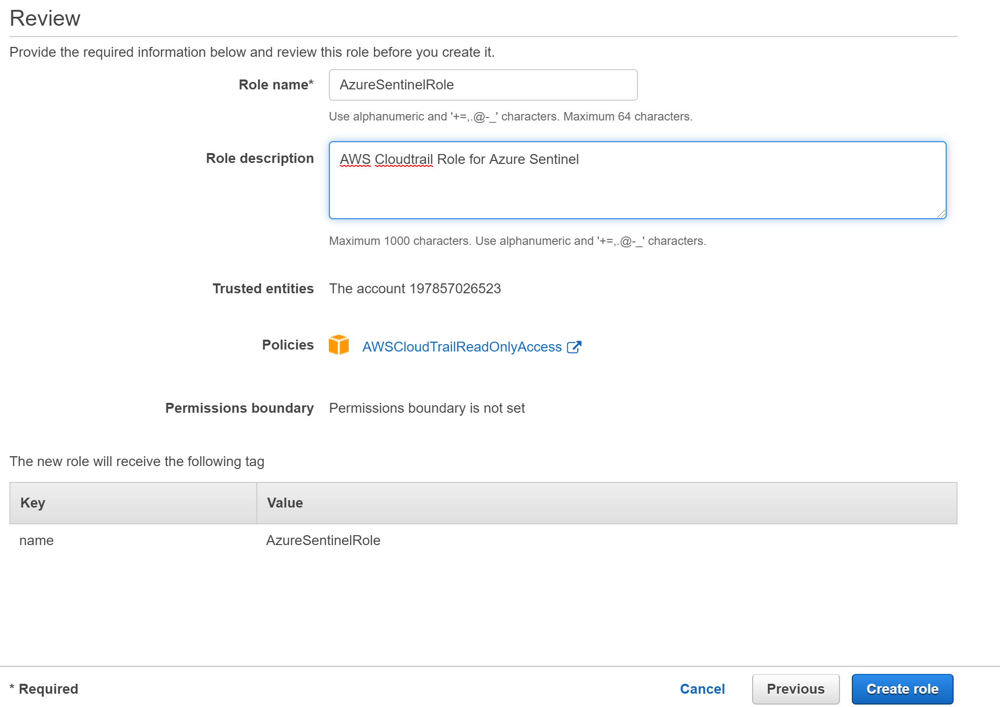

9. 复制 `角色 ARN`。 在 `Azure Sentinel 门户` 的 `"Amazon Web Services 连接器"` 屏幕上, 将其粘贴到 `"要添加的角色Role to add"` 字段, 然后单击 `"添加"`。

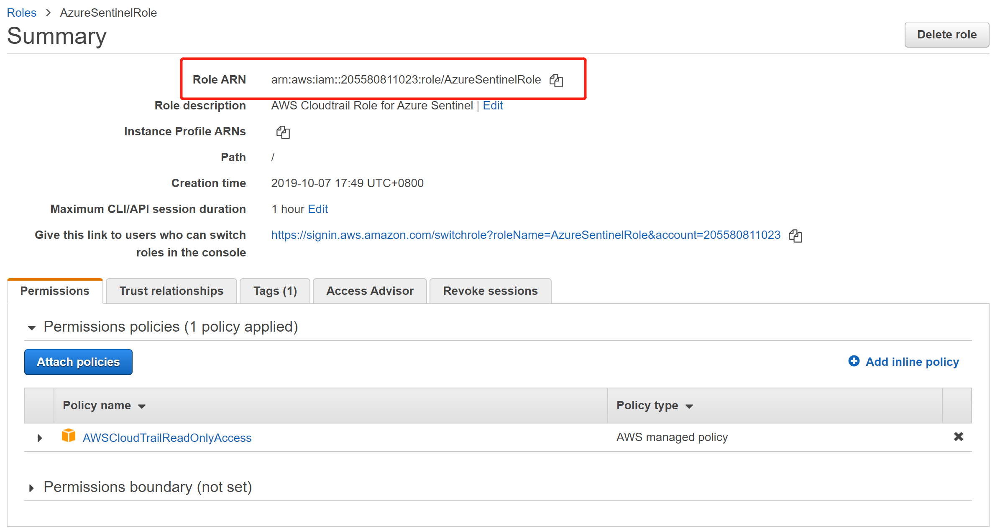

将 `ARN ID` 复制, 输入标红框处, 点击 `add`, 如下图:

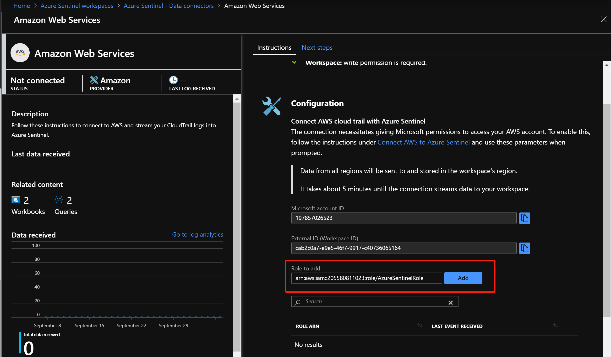

10. 在AWS门户中做些操作，如登录，创建虚机等。

11. Azure portal中切换至 `Azure Sentinel` – `Logs`, 在Query中输入 `AWSCloudTrail` 查看之前在AWS中做的操作:

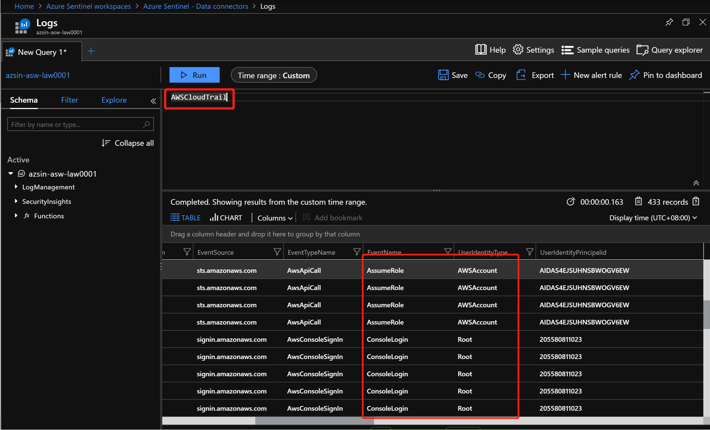

需要注意的是AWS Cloudtrail的log只能audit enable之后的log。

12. 查看下AWS的事件：

```shell
let Now = now();
(range TimeGenerated from ago(30d) to Now-1d step 1d
| extend Count = 0
| union isfuzzy=true (AWSCloudTrail
| summarize Count = count() by bin_at(TimeGenerated, 1d, Now))
| summarize Count=max(Count) by bin_at(TimeGenerated, 1d, Now)
| sort by TimeGenerated
| project Value = iff(isnull(Count), 0, Count), Time = TimeGenerated, Legend = "awsCloudTrail")
| render timechart
```


### 参考资料：
- [什么是 AWS CloudTrail？](https://docs.aws.amazon.com/zh_cn/awscloudtrail/latest/userguide/cloudtrail-user-guide.html)

- [将 Azure Sentinel 连接到 AWS CloudTrail](https://docs.microsoft.com/zh-cn/azure/sentinel/connect-aws)
