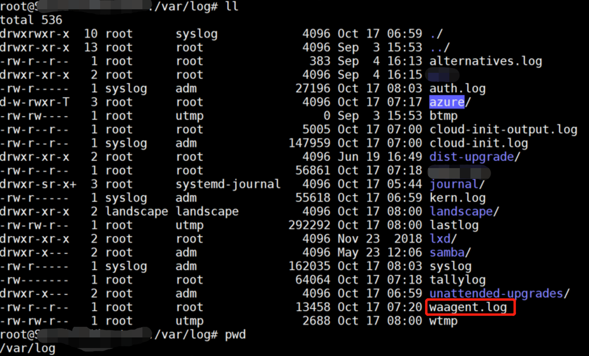
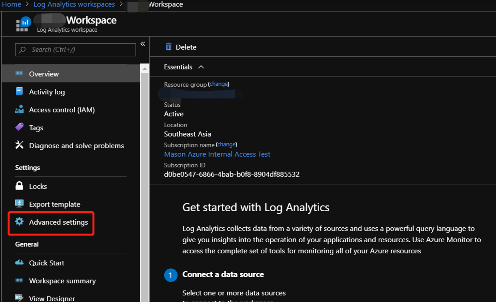

# Azure Sentinel 监控Linux Syslog

###  首先从Azure Portal中创建一个Linux虚拟机（以CentOS 7为例）：


### 安装 Syslog
`Azure Portal` 中搜索 `Azure Sentinel`，点击之前创好的 `Log Analytics` 的workspace，左侧选择 `Data connectors`:


搜索 Syslog:


安装Syslog:


### 监控Linux虚拟机
选择需要监控的Linux虚拟机并connect：


实际上，是在Linux虚拟机中安装了`omsagent`:


该日志文件路径为 `/var/log/waagent.log`:



### 选择需要监控的日志

Portal中回到 `Log Analytics Workspace` 界面，找到之前创建的workspace点击左侧 `Advanced Settings`:



点击 `Data` -> `Syslog`，选择需要监控的日志：


勾选 `Apply below configuration to my machines`，搜索 `auth` 并选中，再点击右边 `+` 号：


再添加 `daemon`, `syslog`, `user`, 然后点击上方 `Save`：


保存成功后，点击上方 `Logs`:


### 查询 `Syslog` 日志

在框内输入查询语句：


``` 
# 查询语句如下
let Now = now();
(range TimeGenerated from ago(7d) to Now-1d step 1d
| extend Count = 0
| union isfuzzy = true (Syslog
| summarize Count = count() by bin_at(TimeGenerated, 1d, Now))
| summarize Count = max(Count) by bin_at(TimeGenerated, 1d, Now)
| sort by TimeGenerated
| project Value = iff(isnull(Count), 0, Count), Time = TimeGenerated, Legend = "Syslog")
| render timechart
```

可以看到查询结果：


在 `Azure Sentinel` -> `Overview` 中，也能看到多出了 `Syslog`的监控数据：


### 参考资料

- [Azure Monitor 中的 Syslog 数据源 ](https://docs.microsoft.com/zh-cn/azure/azure-monitor/platform/data-sources-syslog)

- [使用 Syslog 连接外部解决方案](https://docs.microsoft.com/zh-cn/azure/sentinel/connect-syslog)
