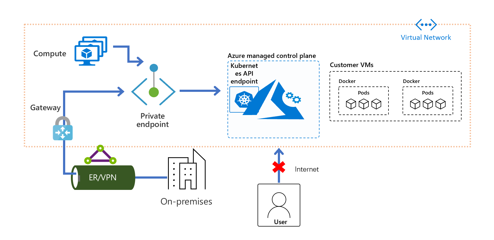
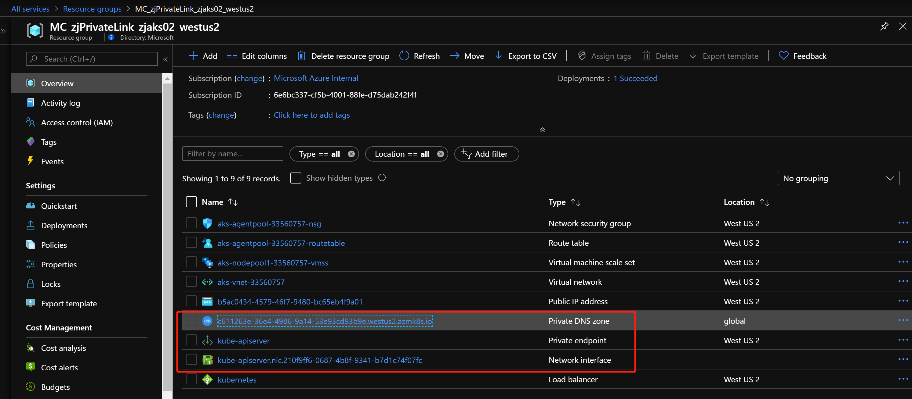
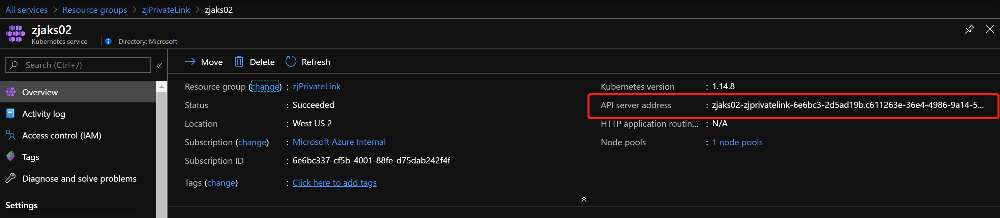
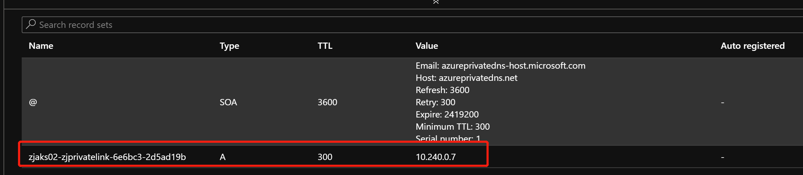
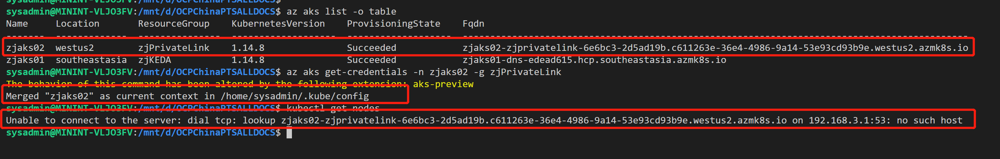
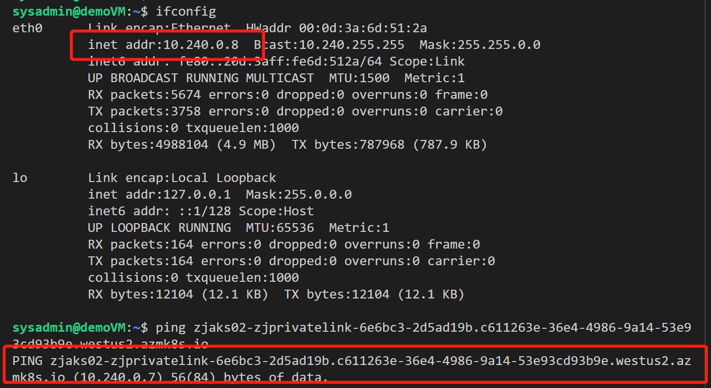
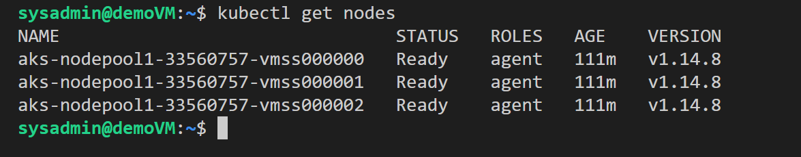

* [通过 Private Link, 实现 AKS 专有集群功能](#1)

---

<h2  id="1">通过 Private Link, 实现 AKS 专有集群功能</h2>



目前已经创建的AKS集群暂不支持开启 `Private Cluster` 功能, 此功能只针对于新创建的集群.

```
# 准备 Azure CLI, 升级 aks-preview extension 版本
az extension add --name aks-preview
az extension update --name aks-preview

# 注册 PrivateLink 针对 AKS 服务的功能, 并确保注册状态已经是 Registered
az feature register --name AKSPrivateLinkPreview --namespace Microsoft.ContainerService
az feature list -o table --query "[?contains(name, 'Microsoft.ContainerService/AKSPrivateLinkPreview')].{Name:name,State:properties.state}"
az provider register --namespace Microsoft.ContainerService
az provider register --namespace Microsoft.Network

# 创建 AKS 集群, Enable private cluster 功能
az group create -n zjPrivateLink -l westus2
az aks create -n zjaks02 -g zjPrivateLink --load-balancer-sku standard --enable-private-cluster
```

我们从Portal中可以看到, 集群创建过程中, 自动创建了 `Private Endpoint` 供 AKS 集群使用



当集群创建好后, AKS对外访问接口也变成了内网地址, 从外部无法访问, 只能通过部署在同一VNET中的虚机, 或通过Azure Bastion进行访问, 真正做到了专有集群.











### 参考资料

- [Private Azure Kubernetes Service cluster](https://docs.microsoft.com/zh-cn/azure/aks/private-clusters)

---