* [KEDA - Kubernetes-based Event Driven Autoscaler](#1)

---

<h2  id="1">KEDA - Kubernetes-based Event Driven Autoscaler</h2>

KEDA, 全称 `Kubernetes-based Event Driven Autoscaler`, 用来实现 Kubernetes 集群中的 `Deployment & Job`, 基于事件数量进行自动扩缩. KEDA 是 `Microsoft & Redhat` 发起的开源项目, 目前已经发布了v1.0版本.

KEDA 主要完成了两个作用：`1) 基于事件的量而非资源监控指标, 来扩缩集群中的资源; 2) 实现了 Deployment 从 0 到 1 & 1 到 0 的扩缩`.

目前 Kubernetes 集群中, 资源动态扩展的方式主要有几种：

通过 `HPA - Horizontal Pod Autoscaler`, 根据预先设定好的扩展规则, 如 基于Pod CPU的使用率, 动态调整Pod的数量

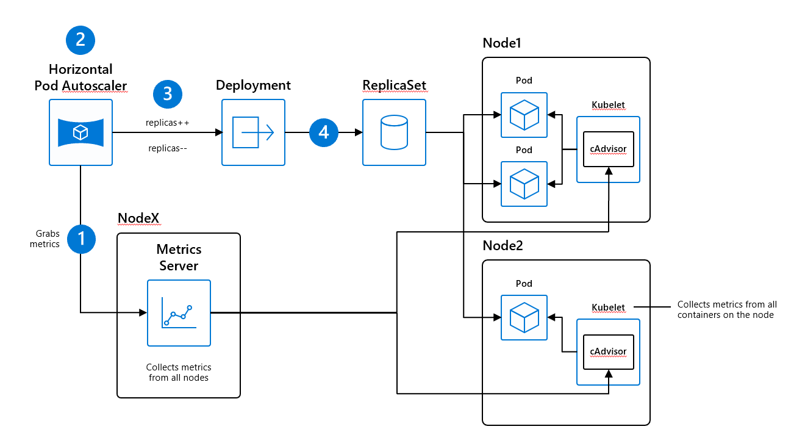

当 `集群创建Pod时, 由于节点资源不足, 出现 Pending Pod`, 会动态扩缩 `Worker Node` 的数量

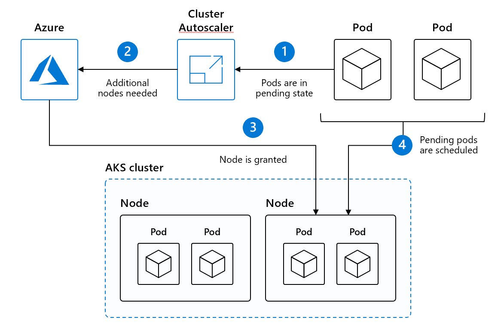

`Virtual Node` 出现后, 我们也可以直接通过 `Virtual Node` 与 `HPA` 结合, 按需调整Pod数量

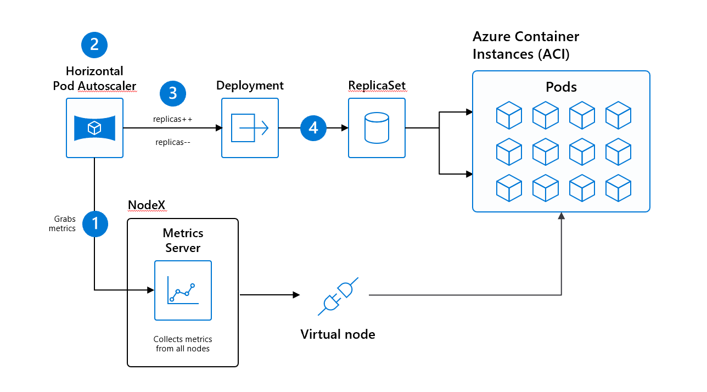

但上述三种方式, 都是基于 Pod & Node 的资源指标, 如`CPU, Memory`等实现扩缩, 对于一些基于事件处理的场景, 并不会因为事件数量的多少来扩缩资源. KEDA就是用来弥补这个部分.

KEDA的架构图如下, 三大核心组件 `Metrics Server` & `Controller` & `Scaler` 实现的主要功能已分别在图中做了标记，便于理解.

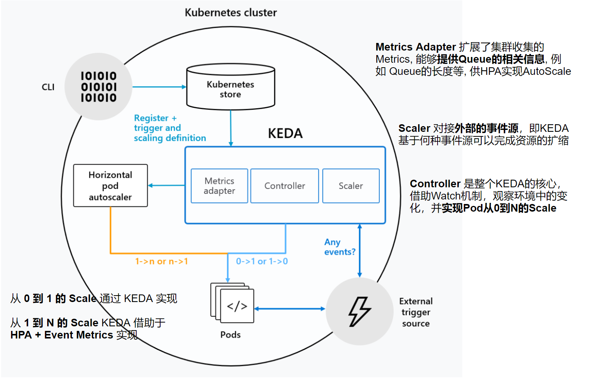

KEDA可以部署在标准的Kubernetes集群中, 支持对于 `Deployment & Job` 实现动态扩缩, 且支持多种 Event 的数据源, 包括13种确定的数据源以及一种基于gRPC的扩展方式来允许用户扩展数据源种类. 其中一些如下所示:

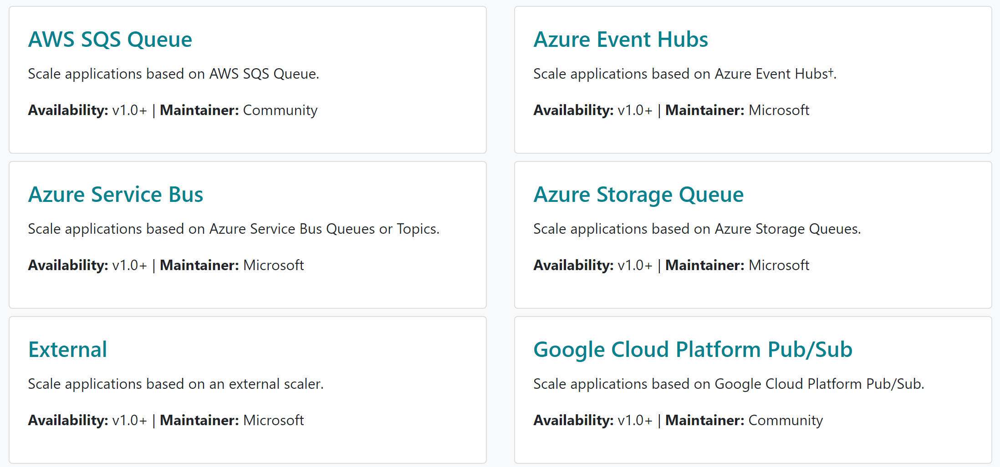

接下来我们就在AKS中搭建KEDA, 并实现我们今天的Demo, 来看看KEDA是如何工作的

### 搭建 KEDA 环境

#### Step 1 准备 AKS 集群

我们需要准备好一个AKS集群并启用虚拟节点, 虚拟节点可以帮助我们按需的扩缩Pod的数量, 而无需考虑Worker Node资源的限制.

```
# 连接已创建的AKS集群
az aks get-credentials -n zjaks01 -g zjKEDA

# 查看集群中的节点，确保虚拟节点已经存在
kubectl get nodes -w
```

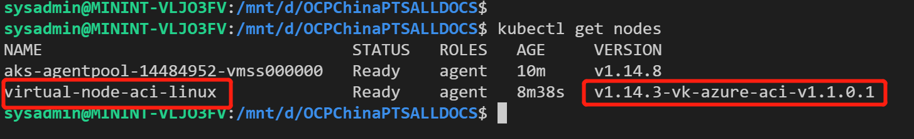

#### Step 2 安装 KEDA

安装KEDA很简单, 既可以通过 Helm Chart, 也可通过文件直接进行资源得部署. 本次实验将使用`Helm Chart`完成.

```
# 添加 KEDA Repo
helm repo add kedacore https://kedacore.github.io/charts

# Update Repo List
helm repo update

# 查看已存在的Repo, 搜索需要安装的KEDA是否存在
helm repo list
helm search "kedacore/keda"

# 安装 KEDA
helm install kedacore/keda --namespace keda --name keda
```

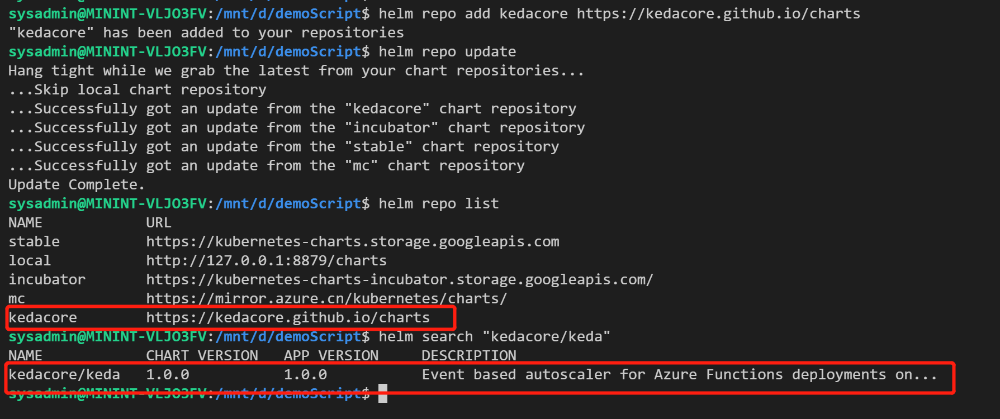

我们为KEDA设置了单独的命名空间 `keda`, 所有资源都创建部署在了此命名空间下. 我们可以看到, 部署创建了两个CRD `ScaledObjects` & `TriggerAuthentication`, 以及一个Operator `keda-operator`, 来实现KEDA的功能.

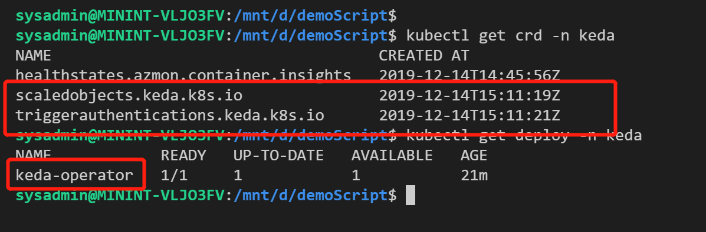

Kubernetes的CRD, 让Kubernetes有了无限的扩展空间, 感兴趣的可以从参考资料里面查看相关文档. KEDA中的CRD `ScaledObjects` 定义了需要扩缩的`Deployment`与事件源之间的对应关系.

### Demo KEDA 是如何工作的 - 以 RabbitMQ 作为事件源

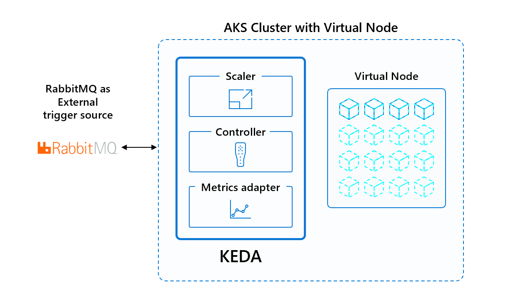

```
# 通过 Helm 安装 RabbitMQ
helm install --name rabbitmq --set rabbitmq.username=user,rabbitmq.password=PASSWORD stable/rabbitmq
```

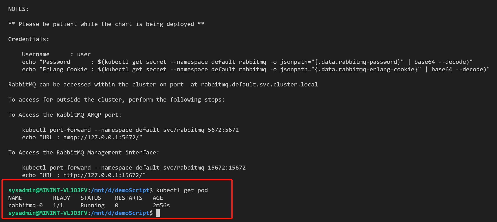

通过 [demo_deploy_consumer.yml](./files/191214/demo_deploy_consumer.yml) 部署实验需要的资源

```
kubectl apply -f ./files/191214/demo_deploy_consumer.yml
```

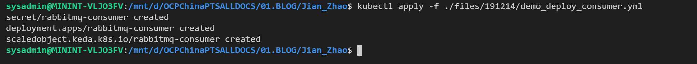

我们部署了一个 `Deployment`, 部署在VirtualNode上, 用来处理Message

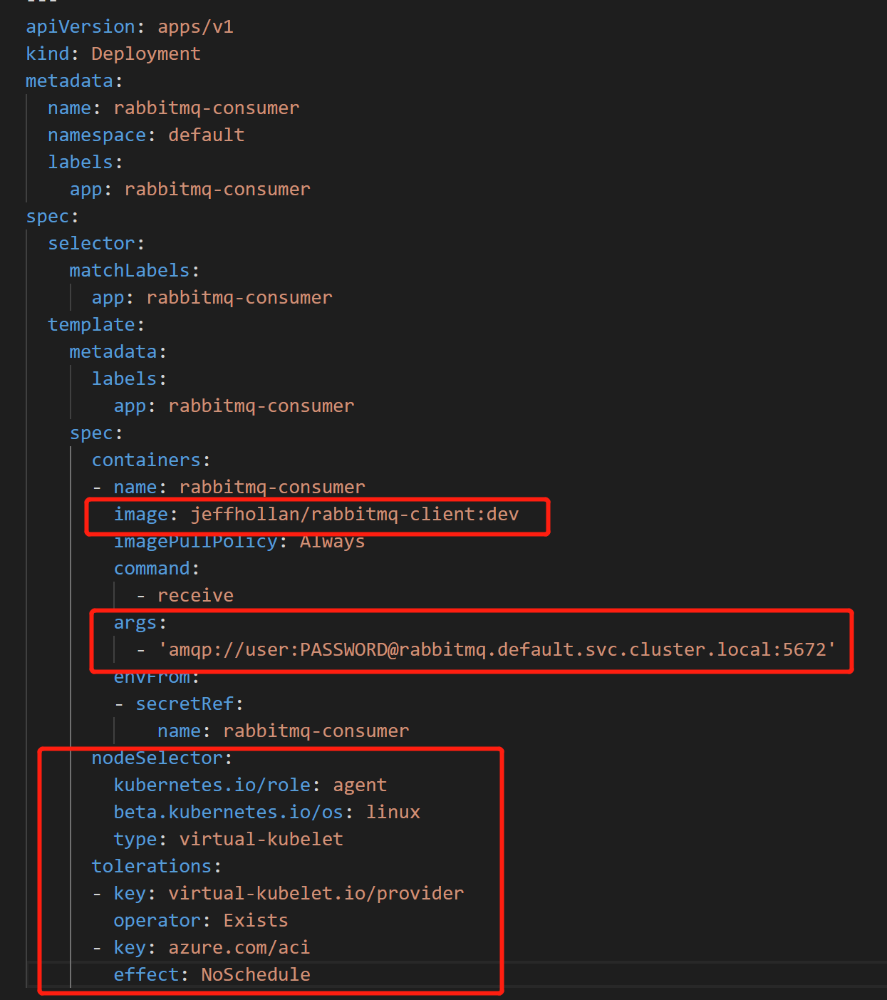

我们部署了一个 `ScaledObject`, 用来描述将创建好的 `Deployment rabbitmq-consumer` 与 事件源 `RabbitMQ`进行绑定, 并指定了触发规则 `当队列长度超过5就进行Scale, 最大Scale 30个, 冷却时间30s, 避免不停的伸缩`

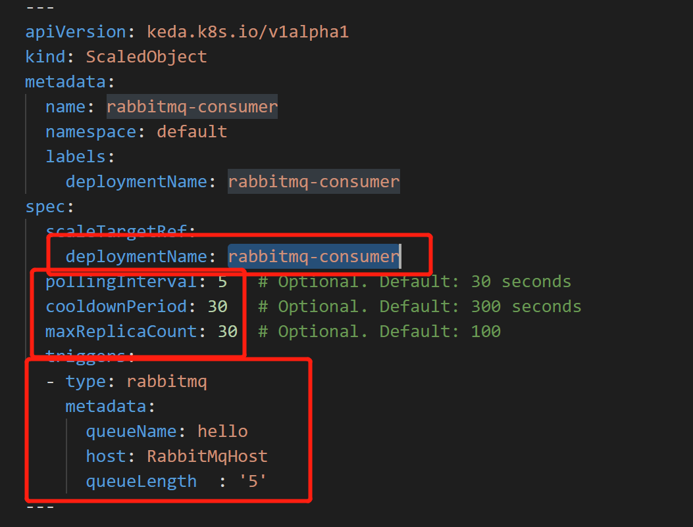

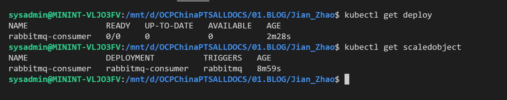

然后我们通过部署一个 `Job` 来向RabbitMQ中发送 Event, 验证KEDA是否可以正常工作, 创建Job请参考 [demo_publish_events.yml](./files/191214/demo_publish_events.yml)

```
kubectl apply -f ./files/191214/demo_publish_events.yml 
```

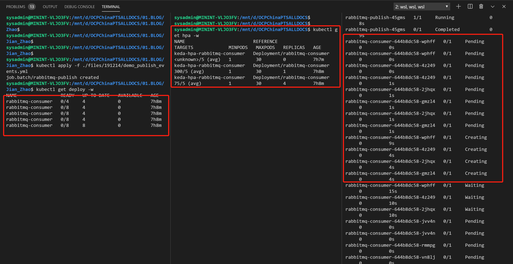

当我们删掉Job后, 我们会发现, 处理完Queue中的Event, KEDA又将Deployment Scale到了0

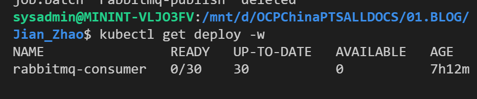

在官方文档的Sample中, 另外一个Demo也非常有趣, 感兴趣的大家可以自行尝试, 是关于将 `KEDA & Azure Functions & Azure Queue & AKS with Virtual Node` 结合在一起.

我们都知道 `Azure Functions` 是Azure上提供的Serverless的FaaS(Function as a Service). 但其实, `Azure Functions`不只能够运行在Azure上, `Azure Functions Runtime`还是一个开源的项目, 我们可以将其部署到任何的Kubernetes集群中, 使用原有的方式, 原有的工具, 原有的Function代码, 每一个Function都跑在Deployment中. KEDA可以通过事件源, 来Scale Functions的Deployment, 处理Queue中的事件, 结合Virtual Node, 可以实现`基于事件的Serverless的FaaS`. 架构图如下:

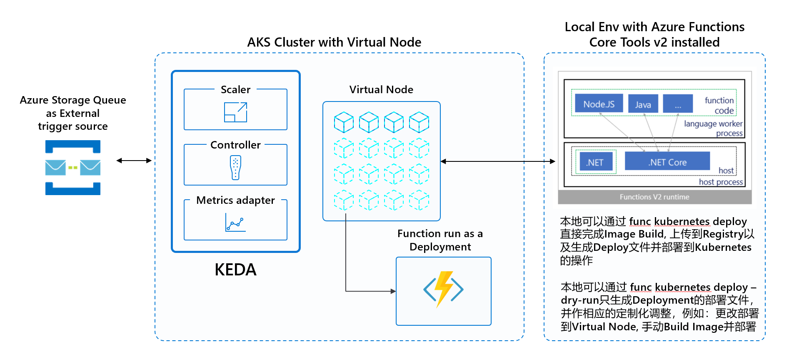

### 参考资料

- [KEDA 介绍](https://keda.sh/#)

- [KEDA Github Repo](https://github.com/kedacore/keda)

- [Deploying KEDA](https://keda.sh/deploy/)

- [Kubernetes CRD 介绍](https://kubernetes.io/docs/concepts/extend-kubernetes/api-extension/custom-resources/)

- [Kubernetes Operator 介绍](https://kubernetes.io/docs/concepts/extend-kubernetes/operator/)

- [实验一参考 : RabbitMQ consumer and sender](https://github.com/kedacore/sample-go-rabbitmq)

- [实验二参考 : KEDA and Azure Functions with queues sample](https://github.com/kedacore/sample-hello-world-azure-functions)

---