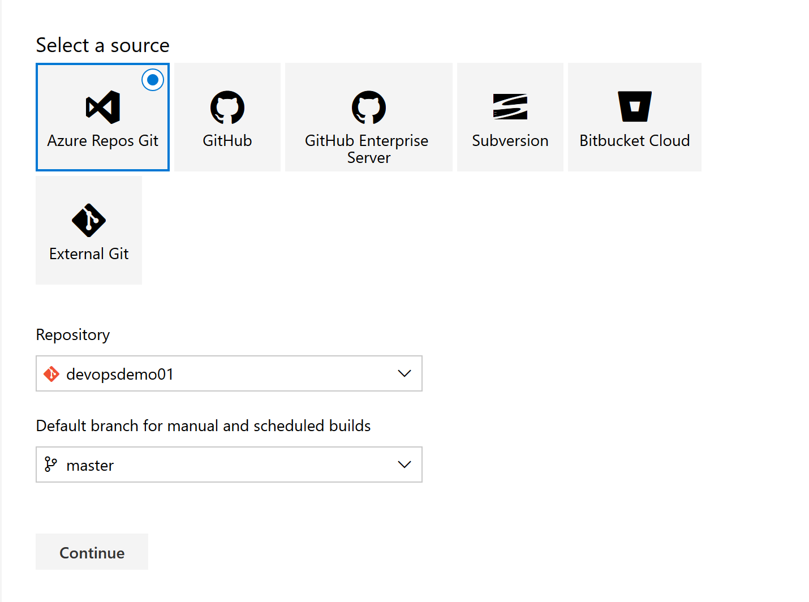
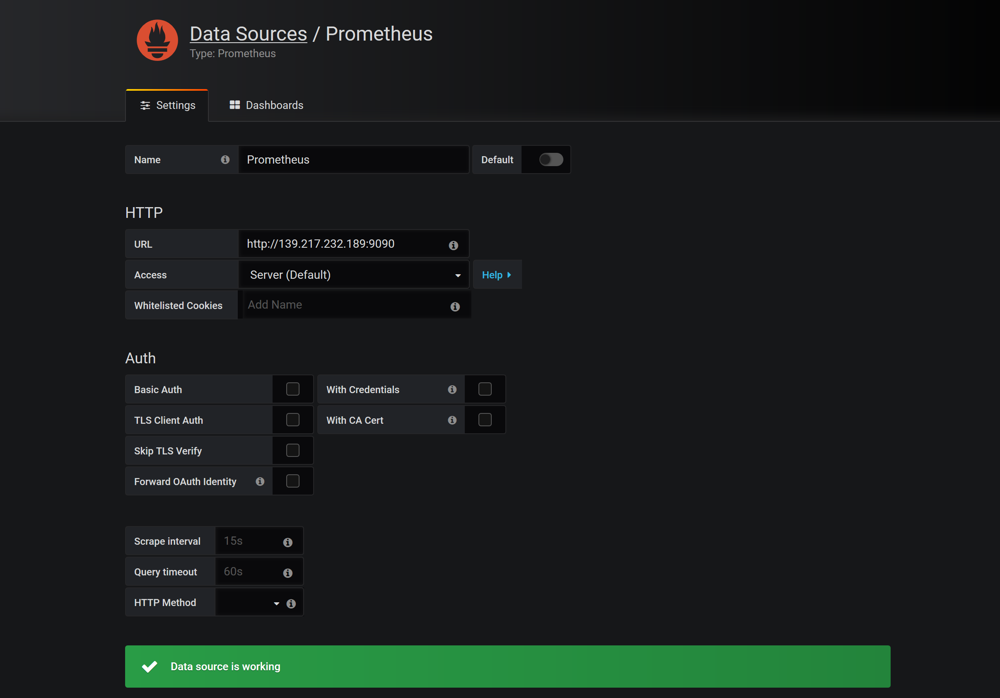

# **集群建立部分** #

AKS集群的部署方式可以通过Portal，CLI，PS，ARM等，本实验采用ARM Template进行部署。ARM是一种声明式编程方式，不需要考虑过程，只要把最终状态描述清楚即可。

部署需要的条件：

a.Azure 账号一个

b.sp(Service Principal)一个

c.ARM需要的配置文件，parameters.json（包含ARM所需要的参数定义），template.json（模板文件）


1.先创建sp,本实验使用密码认证
(注：appId和passwod是parameters.json需要使用的；默认创建的sp权限是contributor)

    az ad sp create-for-rbac --name azcnakssp01 --password MicroSoft1234!


2.查看对应的Principleid(注：principalId也是parameters.json需要使用的)

    az role assignment list --assignee 1f045ca3-e822-4010-9a95-5a59be646a1a


3.配置需要的ARM Template文件，创建parameters.json，附上示例配置文件，/* --- */为注释；
[<Parameters.json>](https://github.com/ChinaOcpPTS/OCPChinaPTSALLDOCS/blob/master/03.Azure%E8%B5%84%E6%96%99%E5%90%88%E9%9B%86/%E5%8A%A8%E6%89%8B%E5%AE%9E%E9%AA%8C/%E5%AE%B9%E5%99%A8AKS/Media/Basic/parameters.json)

4.创建template.json，附上示例配置文件，/* --- */为注释；
[<template.json>](https://github.com/ChinaOcpPTS/OCPChinaPTSALLDOCS/blob/master/03.Azure%E8%B5%84%E6%96%99%E5%90%88%E9%9B%86/%E5%8A%A8%E6%89%8B%E5%AE%9E%E9%AA%8C/%E5%AE%B9%E5%99%A8AKS/Media/Basic/template.json)

5.部署集群：cd切换到对应目录下，执行命令

    az group deployment create --name azcnaks01 --resource-group akshandson --template-file template.json --parameters @parameters.json


# **AKS常规操作** #
1.AKS Dashboard,打开Azure CN Portal，点击“View Kubernetes dashboard”，如下图所示：


2.按照下图所示步骤进行安装：


3.执行最后一步后，会在本地启动一个http服务，监听8001端口，即为AKS Dashboard


# **集群收缩** #

## 第一部分：手动集群伸缩 ##
手动伸缩：可以通过Portal或者CLI进行AKS集群worker nodes横向扩展，本实验采用Portal方式；修改之后要稍等3 ~ 5分钟才可以生效。


修改节点个数后，点击save即可，本实验演示从3节点变为4节点：修改之后要稍等3 ~ 5分钟才可以生效


## 第二部分：自动收缩集群 ##
自动伸缩：autoscaling，目前还在preview阶段，Mooncake还未支持，不过目前已经在roadmap上了，本实验此部分选择使用新加坡Global账号做测试，旨在做功能性演示
1.安装 aks-preview CLI 扩展

    az extension add --name aks-preview

2.注册规模集功能提供程序

要创建使用规模集的 AKS，还必须在订阅上启用功能标志。 若要注册 VMSSPreview 功能标志，请使用 
az feature register 命令，如以下示例所示：


    az feature register --name VMSSPreview --namespace Microsoft.ContainerService


状态显示为“已注册”需要几分钟时间。 可以使用 az feature list 命令检查注册状态：

    az feature list -o table --query "[?contains(name, 'Microsoft.ContainerService/VMSSPreview')].{Name:name,State:properties.state}"


准备就绪后，使用 az provider register 命令刷新 Microsoft.ContainerService 资源提供程序的注册状态：

    az provider register --namespace Microsoft.ContainerService

3.集群autocaling缩放；
缩放的方式有2种，1是在创建的时候指定autocaler，2是在现有集群上update，本实验演示在现有AKS集群上如何启用autocaler；
使用 az aks update 命令并选择 --enable-cluster-autoscaler，然后指定节点 --min-count 和 --max-count。 下面的示例在使用最少 3 个且最多 5 个节点的现有群集上启用群集自动缩放程序：

    az aks update \
      --resource-group myResourceGroup \
      --name myAKSCluster \
      --enable-cluster-autoscaler \
      --min-count 3 \
      --max-count 5
如果最小节点计数大于群集中的现有节点数，则创建附加节点需要花费几分钟时间。


# **AKS与AAD集成** #
本实验介绍如何部署 AKS 和 Azure AD 的先决条件、部署支持 Azure AD 的集群以及在 AKS 集群中创建简单的 RBAC 角色。需要注意以下2点：
1.只有在创建新的启用 RBAC 的集群时，才能启用 Azure AD。 不能在现有 AKS 群集上启用 Azure AD。
2.不支持 Azure AD 中的来宾用户，例如，从其他目录使用联合登录。
## 第一步：创建服务器应用程序 ##
a.选择“Azure Active Directory” > “应用注册” > “新应用程序注册”，为应用程序命名，选择“Web 应用/API”作为应用程序类型，然后为“登录 URL”输入采用 URI 格式的任何值。 完成后，选择“创建”。


b.	选择“清单”，将 groupMembershipClaims 值编辑为 "All"。完成后保存更新。


c.	返回 Azure AD 应用程序，选择“设置” > “密钥”。添加密钥说明，选择过期截止时间，然后选择“保存”。 记下密钥值。 部署支持 Azure AD 的 AKS 群集时，此值称为 Server application secret。


d.	返回 Azure AD 应用程序，选择“设置” > “所需的权限” > “添加” > “选择 API” > “Microsoft Graph” > “选择”。


e.	在“应用程序权限”下，勾选“读取目录数据”。


f.	在“委派权限”下，勾选“登录并读取用户个人资料”和“读取目录数据”。 完成后保存更新。


g.	从 API 列表中选择“Microsoft Graph”，然后选择“授予权限”。 如果当前帐户不是租户管理员，此步骤将会失败。


h.	成功授予权限后，门户中会显示以下通知：

i.	返回应用程序并记下“应用程序 ID”。 部署支持 Azure AD 的 AKS 群集时，此值称为 Server application ID。


## 第二步：创建客户端应用程序 ##
使用 Kubernetes CLI (kubectl) 登录时，将使用第二个 Azure AD 应用程序。

a.	选择“Azure Active Directory” > “应用注册” > “新建应用程序注册”。为应用程序命名，选择“本机”作为应用程序类型，然后为“重定向 URI”输入采用 URI 格式的任何值。 完成后，选择“创建”。


b.	在 Azure AD 应用程序中，选择“设置” > “所需的权限” > “添加” > “选择API”，并搜索本文档最后一个步骤中创建的服务器应用程序的名称。


c.	勾选该应用程序，并单击“选择”。


d.	从列表中选择服务器 API，然后选择“授予权限”


e.	返回 AD 应用程序并记下“应用程序 ID”。 部署支持 Azure AD 的 AKS 群集时，此值称为 Client application ID。


## 第三步：获取租户 ID ##
最后，获取 Azure 租户的 ID。 部署 AKS 集群时，也要使用此值。在 Azure 门户中，选择“Azure Active Directory” > “属性”并记下“目录 ID”。 部署支持 Azure AD 的 AKS 群集时，此值称为 Tenant ID。


## 第四步：创建集群 ##

a.	使用 az group create 命令为 AKS 群集创建资源组。

    az group create --name aksrg01 --location chinanorth2

b.	使用 az aks create 命令部署群集。 请将以下示例命令中的值替换为创建 Azure AD 应用程序时收集的值。

    az aks create \
      --resource-group aksrg01 \
      --name azcnaks01 \
      --generate-ssh-keys \
      --aad-server-app-id b1220521-94c5-4ffe-809e-9d1dbc06b449 \	/* aksaadserver01 app ID */
      --aad-server-app-secret jJoj1mI3GgsGuM9LJiFoWb+bWpv6cspJeY5pP22xD04=\/* aksaadserver01 app secret */
      --aad-client-app-id 3cca8007-1056-4957-99bf-29d004d9a872 \	/* aksaadclient01 app ID */
      --aad-tenant-id b362ae96-4a99-473b-9b8d-134bb79ec909		/* tenant ID */
    
## 第五步：创建 RBAC 绑定 ##
a.	首先，使用管理员访问权限，结合 --admin 参数运行 az aks get-credentials 命令登录到群集。

    az aks get-credentials --resource-group aksrg01 --name azcnaks01 --admin

b.	接下来，使用以下清单为 Azure AD 帐户创建 ClusterRoleBinding。 此示例向该帐户授予对群集所有命名空间的完全访问权限。获取objectId的所需的用户帐户使用az ad 用户显示命令。 提供所需的帐户的用户主体名称 (UPN):

    az ad user show --upn-or-object-id azcnaks01@smsptsp.partner.onmschina.cn --query objectId -o tsv

c.	创建一个文件（例如 rbac-aad-user.yaml），然后粘贴以下内容。 使用你在上一步中获得的 Azure AD 中的用户帐户的对象 ID 更新用户名称

    apiVersion: rbac.authorization.k8s.io/v1
    kind: ClusterRoleBinding
    metadata:
      name: contoso-cluster-admins
    roleRef:
      apiGroup: rbac.authorization.k8s.io
      kind: ClusterRole
      name: cluster-admin
    subjects:
    - apiGroup: rbac.authorization.k8s.io
      kind: User
      name: "11d8fafc-4088-48a5-acd7-0994e1b92bc4"	/* 上一步得到的UPN */


d.	使用 kubectl apply 命令应用绑定，如以下示例所示：

    kubectl apply -f rbac-aad-user.yaml

## 第五步：使用 Azure AD 访问群集 ##

a.	接下来，使用 az aks get-credentials 命令提取非管理员用户的上下文。


    az aks get-credentials --resource-group aksrg01 --name azcnaks01
得到Merged "azcnaks01" as current context in /root/.kube/config返回结果代表成功

b.	运行任何 kubectl 命令后，系统会提示在 Azure 上进行身份验证。 请遵照屏幕说明操作。

    kubectl get nodes


# **网络部分** #

使用静态IP绑定负载均衡器部署容器服务

## 第一部分：准备 ##
预先准备一个可用的镜像，本教程使用的示例应用程序是一个基本的投票应用。 该应用程序由前端 Web 组件和后端 Redis 实例组成。 Web 组件打包到自定义容器映像中。 Redis 实例使用 Docker 中心提供的未修改的映像。

1.使用 git 可将示例应用程序克隆到开发环境：

    git clone https://github.com/Azure-Samples/azure-voting-app-redis.git

2.换到克隆目录。使用 Docker Compose，可自动生成容器映像和部署多容器应用程序。使用示例 docker-compose.yaml 文件创建容器映像、下载 Redis 映像和启动应用程序：(请提前安装好docker-compose)

    docker-compose up -d

3.完成后，使用 docker images 命令查看创建的映像。 已下载或创建三个映像。 azure-vote-front 映像包含前端应用程序，并以 nginx-flask 映像为基准。 redis 映像用于启动 Redis 实例。

    docker images

4.查看一下docker ps的进程，并且查看正在运行的应用程序，请在本地 Web 浏览器中输入 http://localhost:8080。 示例应用程序会加载，如以下示例所示：


5.使用 az acr create 命令创建 Azure 容器注册表实例，并提供你自己的注册表名称。 注册表名称在 Azure 中必须唯一，并且包含 5-50 个字母数字字符。 在本教程的剩余部分，请使用 <acrName> 作为容器注册表名称的占位符。 提供自己的唯一注册表名称。 “基本”SKU 是一个针对成本优化的入口点，适用于可以对存储和吞吐量进行均衡考虑的开发目的。

    az acr create --resource-group demoaks --name <acrName> --sku Basic

6.若要使用 ACR 实例，必须先登录。 使用 az acr login 命令并提供一个唯一名称，该名称是在上一步提供给容器注册表的

    az acr login --name <acrName>
    
7. 最后，在ACR的Access Control里加入之前建立AKS使用的service principle，这样在拉取镜像的时候就会有相应的权限。


## 第二部分：主要操作部分 ##
1.首先获取节点的资源组名称，因为节点所在的资源组名称与AKS创建的资源组名称并不是一致的。

    az aks show --resource-group demoaks --name demoaks --query nodeResourceGroup -o tsv

2.现在，使用 az network public ip create 命令创建静态公用 IP 地址。 指定上一命令中获取的节点资源组名称，然后指定 IP 地址资源的名称，如 demoaksPublicIP。同时记下输出的IP地址，已备后用。

    az network public-ip create --resource-group MC_demoaks_demoaks_chinaeast2 --name demoaksPublicIP --allocation-method static

3.当然稍后可以使用 az network public-ip list 命令获取公用 IP 地址。 指定节点资源组的名称和创建的公共 IP 地址，然后查询 ipAddress，如以下示例中所示：

    az network public-ip show --resource-group MC_demoaks_demoaks_chinaeast2 --name demoaksPublicIP --query ipAddress --output  tsv

4.查询一下资源组中可用的ACR资源，记住ACR的地址和名字

    az acr list --resource-group demoaks --query "[].{acrLoginServer:loginServer}" --output table

5.登录ACR

    az acr login --name <acrName>


6.现在，请使用容器注册表的 acrloginServer 地址标记本地 azure-vote-front 映像。 若要指示映像版本，请将 :v1 添加到映像名称的末尾：

    docker tag azure-vote-front <acrLoginServer>/azure-vote-front:v1

7.若要验证是否已应用标记，请再次运行 docker images。 系统会使用 ACR 实例地址和版本号对映像进行标记。

    docker images


8.将映像推送到注册表.生成并标记映像后，将 azure-vote-front 映像推送到 ACR 实例。 使用 docker push 并提供自己的适用于映像名称的 acrLoginServer 地址，如下所示：

    docker push <acrLoginServer>/azure-vote-front:v1

9.列出注册表中的映像。若要返回已推送到 ACR 实例的映像列表，请使用 az acr repository list 命令。 按如下所示提供自己的 <acrName>：

    az acr repository list --name <acrName> --output table


10.在目录中编辑yaml文件

    vi azure-vote-all-in-one-redis.yaml

11.将 microsoft 替换为 ACR 登录服务器名称。 映像名称位于清单文件的第 47 行。把IP地址更改为之前建好的静态地址，在文件64行。 以下示例展示了默认映像名称：

    containers:
      name: azure-vote-front
      image: microsoft/azure-vote-front:v1
    
      loadBalancerIP: 40.73.86.77
      type: LoadBalancer

12.提供自己的 ACR 登录服务器名称，使清单文件如以下示例所示：

    containers:
      -name: azure-vote-front
      image: <acrName>.azurecr.io/azure-vote-front:v1

13.部署应用程序容器，请使用 kubectl apply 命令。 此命令分析清单文件并创建定义的 Kubernetes 对象。 指定示例清单文件，如以下示例所示：

    kubectl apply -f azure-vote-all-in-one-redis.yaml

14.应用程序运行时，Kubernetes 服务将向 Internet 公开应用程序前端。 此过程可能需要几分钟才能完成。若要监视进度，请将 kubectl get service 命令与 --watch 参数配合使用。查看是否服务得到了之前创建的外部地址。如果得到了外部地址，通过浏览器打开相关IP，查看应用是否可用。

    kubectl get service azure-vote-front –watch


15.删除服务，Pod等

    kubectl delete deployments azure-vote-front
    kubectl delete deployments azure-vote-back
    kubectl delete services azure-vote-front
    kubectl delete services azure-vote-back
 

----------


# **存储部分** #
1.使用 kubectl get sc 命令查看预先创建的存储类。 以下示例显示了 AKS 群集中可用的预先创建存储类：
    kubectl get sc

2.创建永久性卷声明.永久卷声明 (PVC) 用于基于存储类自动预配存储。 在这种情况下，PVC 可以使用预先创建的存储类之一创建标准或高级 Azure 托管磁盘。创建名为 azure-premium.yaml 的文件，并将其复制到以下清单中。 该声明请求名为 azure-managed-disk、大小为 5 GB、具有 ReadWriteOnce 访问权限的磁盘。 managed-premium 存储类指定为存储类。使用 kubectl apply 命令创建永久性卷声明，并指定 azure-premium.yaml 文件：

    kubectl apply -f azure-premium.yaml
[<yaml文件地址>](https://github.com/ChinaOcpPTS/OCPChinaPTSALLDOCS/blob/master/03.Azure%E8%B5%84%E6%96%99%E5%90%88%E9%9B%86/%E5%8A%A8%E6%89%8B%E5%AE%9E%E9%AA%8C/%E5%AE%B9%E5%99%A8AKS/azure-premium.yaml)

3.创建永久性卷声明并成功预配磁盘以后，即可创建可以访问磁盘的 Pod。 以下清单创建的基本 NGINX Pod 使用名为 azure-managed-disk 的永久性卷声明将 Azure 磁盘装载到 /mnt/azure 路径。创建名为 azure-pvc-disk.yaml 的文件，并将其复制到以下清单中。

    kubectl apply -f azure-pvc-disk.yaml
[<yaml文件地址>](https://github.com/ChinaOcpPTS/OCPChinaPTSALLDOCS/blob/master/03.Azure%E8%B5%84%E6%96%99%E5%90%88%E9%9B%86/%E5%8A%A8%E6%89%8B%E5%AE%9E%E9%AA%8C/%E5%AE%B9%E5%99%A8AKS/azure-pvc-disk.yaml)

4.现在你有一个正在运行的 Pod，其中 Azure 磁盘被装载到 /mnt/azure 目录中。 通过 kubectl describe pod mypod 检查 Pod 时可以看到此配置，如以下精简示例所示：

    kubectl describe pod mypod

5.删除Pod，和创建的永久申明卷。

    kubectl delete pods mypod
    kubectl delete pvc azure-managed-disk

---

# DevOps部分

本次实验，将实现应用容器化的CI/CD流程，通过预先写好的Dockerfile，结合Azure DevOps，自动化Build容器化镜像，将容器化镜像发布到私有ACR中，并将容器镜像部署到AKS集群中。

本次实验的程序为一个在线投票系统，具体架构图如下：


系统共有三部分组成：
- 前端Web Application ：使用Python开发；
- 应用服务 Calculator microservice ：使用Java开发；
- 缓存服务 Cache microservice ：使用 Redis 实现；

本次实验所使用的 [Github Repo](https://github.com/ericzhao0821/python-voting-web-app) 
 
本次实验Azure资源创建部分，尽量使用 `Azure CLI` ； Azure DevOps部分，将会使用 `DevOps Portal`进行创建。

### 创建实验所需资源

#### 创建Azure DevOps的Organization & Project

Azure DevOps的Dashboard请参照 <https://dev.azure.com> ，请使用相应的`Global Azure`账户进行登陆。

1. 创建Organization `zjdevopsdemo01`


2. 创建 Project `devopsdemo01`


3. 将实验中所使用的Github Repo克隆至Azure Repos

Azure DevOps中也会提供代码管理功能，即服务 `Azure Repos`。本次实验，所有代码的修改，都将通过Azure Repos进行，Azure Repos也支持Git的操作方式，可以通过本地客户端，连接Azure Repos，并使用熟悉的Git命令进行操作。

点击 `Repos`，选择 `Import`，来导入实验用到的Github项目


可以看到，导入的项目内容如下：


#### 配置Azure DevOps，连接Azure China

由于目前Azure DevOps服务是由Global Azure提供，但提供对于Azure China的支持，即可以使用Global Azure的Azure DevOps来构建基于Azure China资源的自动化运维解决方案。 如果需要Azure DevOps与Azure China资源进行连接，需要进行手动的配置。

1. 创建 Service Principal

`az ad sp create-for-rbac -n "zjdevopssp01" --role contributor`


2. 建立针对于Azure China的Endpoint，并创建连接

进入Project `devopsdemo01`，点击`Project Settings`，选择`Pipelines - Service connections`，点击`New service connection`，选择`Azure Resource Manager`


点击`use the full version of the service connection dialog`，创建`Azure China Cloud`，并填写相对应的Service Principal，点击`Verify connection`，确保连接成功。


#### 创建实验所需的Azure资源

1. 创建 Resource Group `zjdemo01`

`az group create -n zjdemo01 -l chinaeast2`


2. 创建Azure Kubernetes Service集群 `zjaksdemo01`

`az aks create -n zjaksdemo01 -g zjdemo01 --node-vm-size Standard_DS2_v2 --node-count 2 --kubernetes-version 1.12.6 --disable-rbac`


3. 创建 Azure Container Registry `zjacrdemo01`

`az acr create -n zjacrdemo01 -g zjdemo01 --sku Standard --admin-enabled -l chinaeast2`
 


### 通过 Azure DevOps，构建CI/CD Pipelines

__**注意**__ 新版本Azure DevOps默认会开启YAML编辑页面，本次实验仍然以图形化界面为主，关闭YAML页面可通过如下操作：


点击右上角的用户，选择`Preview features`，disable选项`New YAML pipeline creation experience`即可
 


#### 构建 Builds Pipelines，通过Dockerfile，Build容器镜像，并上传到私有镜像仓库

1. 选择`Pipelines -> Builds`，点击`New pipeline` 

Source选择：选择前面导入的Azure Repos `devopsdemo01`
 


Azure DevOps Pipelines提供了多种内置的模板供用户使用，本次实验，选取`Empty job`进行构建


将创建好的Pipeline `devopsdemo01-CI`，Agent pool更改为`Hosted Ubuntu 1604`

2. 添加 Task `Maven calculator-api/pom.xml`

点击 `Agent job 1` 右侧的`+`，选择 Maven Task添加，Maven Task的作用主要将应用层计算服务的源码构建成可部署的Jar程序。Maven POM file，从Azure Repos `devopsdemo01/calculator-api/pom.xml`中选择，MavenTask的配置信息如下：


3. 添加 Task `Build out demo images with Docker Compose`

点击 `Agent job 1` 右侧的`+`，选择Docker Compose Task添加。Docker Compose Task的作用是通过写好的Docker Compose文件，构建出实验中需要的容器化镜像，Task的配置信息如下：
 


4. 添加 Task `Push demo images to ACR`

点击 `Agent job 1` 右侧的`+`，选择Docker Compose Task添加。Docker Compose Task的作用是将上一步构建好的两个容器镜像 `zjacrdemo01.azurecr.cn/azure-vote-front:latest`，`zjacrdemo01.azurecr.cn/azure-calculator-api:latest` 添加到ACR，Task的配置信息如下：


 
添加完所有Task后，点击`Save & Queue`，手动触发Build的Pipeline，验证所有Tasks都达到预期


 
可以看到，所有Tasks都已运行成功，并成功的将build好的images上传到了ACR中。

5. Enable continuous integration

通过Enable持续集成，后续当有代码更新，会自动触发此Build Pipeline，将更新后的代码打包成新的镜像，并上传到ACR


#### 构建 Release Pipeline，将构建好的容器镜像，部署到AKS集群中

1. 选择`Releases`，点击`New pipeline`，创建新的Release Pipeline，选择`Empty job` Template进行构建，创建好后，将Release Pipeline名字更改为`devopsdemo01-CD`

2. 添加Artifacts，并Enable continuous deployment配置

Artifacts的配置如下，主要是为后面Release Pipeline中的Tasks提供执行文件的支持


为Artifacts Enable Continuous Delivery选项


3. 添加 Task `Deploy out demo services to AKS`

点击`Agent Job`右侧的`+`，选择 Task `Deploy to Kubernetes`，将为此实验写好的YAML，部署到AKS中，YAML中包括了实验中希望创建的服务，Task配置如下：
 


 
配置好后，可以手动触发Release，进行验证。点击右上角`+Release`，选择`Create Release`，进行触发


可以看到，Release Pipeline已经可以正常运行。

4. 验证AKS集群中，实验中涉及到的服务的创建状况

获取AKS的Credentials信息

` az aks get-credentials -n zjaksdemo01 -g zjdemo01 `

查看集群中创建的Pod资源

` kubectl get pod `


这里发现，实际运行服务的Pod并没有创建成功，通过查询可以看到，失败原因主要是因为容器镜像无法正确下载，容器镜像名称并非我们上传到ACR的名字。

` kubectl describe pod azure-vote-front-b56b4686b-7lwt8 `


#### 修复环境中目前的问题，模拟更新文件触发CI/CD

1. 查看部署的文件`azure-vote-all-in-one-redis.yaml`，发现ACR的地址并未进行更改，使用的是个错误的ACR地址
 


2. 将ACR的地址改为实际实验中创建的ACR地址，同时拉取ACR镜像需要Credentials信息，但部署文件中的`imagePullSecrets`信息并不准确，需要同时更新`imagePullSecrets`信息


3. 更改文件后，会自动触发CI/CD的Pipeline，将更新后的信息部署到现有环境中，待Pipelines执行完成后，重新检验AKS环境中资源的创建情况：

` kubectl get pod `


这里发现，Pod `azure-vote-back-746d4bc54b-2h8md` 仍然处于failed状态，查看情况发现，是因为没有成功拉取到 Image `redis`。


 
这个问题主要源于，国内对于 dockerhub 镜像的拉取会有些网络连接的问题，我们可以通过一些proxy进行帮助。

4. 更改`azure-vote-all-in-one-redis.yaml`中，redis的Image地址，然后重新触发CI/CD Pipelines


5. 待Pipeline运行完毕，重新检验AKS环境中资源的创建情况：

` kubectl get pod `


目测环境中一切正常，查询投票系统对外提供的服务信息并进行验证

`kubectl get svc`


访问 http:// 40.73.102.194，可以访问如下页面


本次实验到此成功结束 ！

---

# 监控部分 - 基于开源的Prometheus&Grafana&EFK完成对集群的监控

本次实验，将实现基于Prometheus & EFK，构建用于监控AKS容器化集群的开源监控方案。所有监控服务组件均以容器的方式运行在AKS集群中。本次环境所创建的环境资源，尽量使用命令行方式进行创建。

本次实验的架构图如下所示：


### 实验环境资源准备

#### 构建AKS集群

1. 创建资源组`zjdemo01`，并创建AKS集群`zjaksdemo01`

```
# 创建资源组 zjdemo01
az group create -n zjdemo01 -l chinaeast2

# 创建AKS集群 zjaksdemo01
az aks create -n zjaksdemo01 -g zjdemo01 --node-vm-size Standard_DS2_v2 --node-count 2 --kubernetes-version 1.12.6 --disable-rbac
```

2. 连接到创建的AKS集群`zjaksdemo01`，验证集群可用

```
# 下载AKS连接Credentials信息，并保存在.kube/config文件中
az aks get-credentials -n zjaksdemo01 -g zjdemo01

# 查看集群信息，及Node状态，确保集群可用
kubectl cluster-info
kubectl get nodes
```


#### 安装并配置Helm

Helm作为一款流行的容器包管理工具，可以方便的对部署在Kubernetes集群中的各项资源进行打包管理。本次实验，将通过Helm进行Prometheus & EFK & Grafana的安装。

1. 安装 Helm

__**注意**__ 建议通过指定的镜像连接，在中国区进行Helm的安装，本次实验用到的Helm版本为2.11.0。

```
VER=v2.11.0
wget https://mirror.azure.cn/kubernetes/helm/helm-$VER-linux-amd64.tar.gz
tar -zxvf helm-v2.11.0-linux-amd64.tar.gz
sudo mv linux-amd64/helm /usr/local/bin
# 由于网络的限制，以将部分Repo的访问地址替换成可达的Proxy地址，并添加中国区可用的Mirror Repo
sudo helm init --tiller-image gcr.azk8s.cn/kubernetes-helm/tiller:$VER --stable-repo-url https://mirror.azure.cn/kubernetes/charts/
```


2. 查看可用的Helm Repo，并验证Helm环境可用

查看可用的Helm Repo

`helm repo list`


通过Helm，安装Redis，来确保环境可用

```
# 搜索可用的Redis
helm search redis
# 通过Helm安装Redis
helm install mc/redis
```


可以看到，通过Helm，部署了Service，Deployment，StatefulSet，Secret，ConfigMap等资源，通过kubectl命令，我们可以查看到部署的资源，以下命令将列出构建的Service及StatefulSet。

```
# 列出环境中部署的Helm资源
helm list
helm status joyous-umbrellabird
```


 
```
# 查看Kubernetes中的Service资源
kubectl get svc joyous-umbrellabird-redis-master
# 查看Kubernetes中的StatefulSet资源
kubectl get statefulset joyous-umbrellabird-redis-master
```


#### 实验所需的部署文件

1. 实验所需的资源都以包含在此Repo中

- [prometheus.yml](./Files/Monitor/prometheus.yml)
- [prometheus-deploy.yml](./Files/Monitor/prometheus-deploy.yml)
- [demo-rbac.yml](./Files/Monitor/demo-rbac.yml)

### 安装 Prometheus & Grafana & EFK

#### 安装 Prometheus

Prometheus是目前开源世界非常流行的一种容器监控软件，原生支持Kubernetes，与Kubelet进行了无缝的整合，主要用于收集Metrics信息。本次实验，将通过Helm，部署Prometheus到AKS集群，并配置相应的环境监控。

1. 为监控部分的容器创建独立的Namespace `monitoring`

`kubectl create namespace monitoring`


2. 创建ConfigMap

此ConfigMap为Prometheus Server的配置文件，记录了Prometheus用于监控容器环境的Metric Endpoint信息，将会在创建Prometheus容器时，挂载到对应的配置文件路径。

创建 ConfigMap `Prometheus-config`

` kubectl create configmap prometheus-config --from-file ./prometheus.yml -n monitoring`
 


3. 部署Prometheus Server

本次部署将通过预先写好的Deployment YAML进行。本次部署将创建名为`prometheus-deployment` Deployment，创建名为`prometheus-server` Service。

` kubectl apply -f ./prometheus-deploy.yml `


4. 验证Prometheus Server正常运行

我们通过创建的Service对外暴露出来的公共IP及对应的端口，对Prometheus进行访问。可以看到，Prometheus Server运行正常。


当我们检查监测的Targets（点击Status - Targets）时，我们发现，其中两个Target `kube-state-metrics`及`node-exporter`并未正常监控，这主要是因为，我们目前并没有安装对应的容器程序来收集监控信息。Prometheus支持非常多的扩展程序，帮助用户收集不同种类的Metrics信息。


5. 安装 Node Exporter

本次实验，将通过Helm安装Node Exporter。Node Exporter主要用来集群中Working Nodes的Hardware，OS的Metrics。Helm将会以DaemonSet的方式，部署Node Exporter容器，确保每个可用的Working Nodes都有Node Exporter容器运行。

```
# 手工添加需要的Role及RoleBinding，由于创建集群时，disable了RBAC，但Helm创建Node exporter时需要使用，所以需要手工创建
kubectl apply -f ./demo-rbac.yml

# 创建RBAC过程中，同时创建了Service Account tiller，需要通过此Service Account重新初始化Helm
helm init --tiller-image gcr.azk8s.cn/kubernetes-helm/tiller:v2.11.0 --stable-repo-url https://mirror.azure.cn/kubernetes/charts/ --service-account tiller –upgrade

# Update Helm Repo
helm repo update

# 创建 Node exporter
helm install --name node-exporter mc/prometheus-node-exporter --namespace monitoring
```


 
刷新Prometheus Server页面，你会发现，Targets `node-exporter`已经可用


6. 安装 `kube-state-metrics`

`kube-state-metrics`是一款开源的工具，社区已经准备好了相对应的部署脚本，可以通过下载Git Repo，并通过相应的部署文件进行安装。

```
# 下载 “kube-state-metrics”
git clone https://github.com/kubernetes/kube-state-metrics.git

# 由于 k8s.gcr.io & quay.io 没有办法直接访问，需要替换成 mirror的镜像地址 gcr.azk8s.cn/google_containers/ & quay.azk8s.cn，需要通过修改文件 ./kube-state-metrics/kubernetes/kube-state-metrics-deployment.yaml，此步骤需要有学员自己完成
vim ./kube-state-metrics/kubernetes/kube-state-metrics-deployment.yaml

# 部署 “kube-state-metrics”
kubectl apply -f kube-state-metrics/kubernetes/
```

 

刷新 Prometheus Servers界面，你会发现，所有Targets均可用


  
 

#### 安装 Grafana

在实际应用中，用户普遍会选择Grafana与Prometheus进行搭配，将Prometheus收集到的数据更为友好的呈现给终端用户。本次实验将带大家实践如何通过Helm安装Grafana，并构建集群信息的大屏。

1. 通过Helm，安装Grafana

`helm install --name grafana mc/grafana --set service.type=LoadBalancer --set sidecar.datasources.enabled=true --set sidecar.dashboards.enabled=true --set sidecar.datasources.label=grafana_datasource --set sidecar.dashboards.label=grafana_dashboard --namespace monitoring`

2. 部署完成后，获取Grafana对外暴露的Service地址，及Credential，用户名默认为`admin`

```
# 获取Grafana Service的对外访问地址
kubectl get svc grafana -n monitoring

# 获取 Grafana的登陆密码
kubectl get secret --namespace monitoring grafana -o jsonpath="{.data.admin-password}" | base64 --decode ; echo
```


 

3. 配置 Prometheus Data Source

Grafana是通过支持的Data Source，获取Metrics的数据。点击`Add data source`，添加相对应的Prometheus连接信息。

 

4. 配置用于监视AKS集群状态的可视化大屏

Grafana 除了可以自定义大家需要的Dashboard之外，Grafana 社区有很多大家分享的比较漂亮的模板，大家可以挑选自己喜欢的模板，并进行二次更改。本次实验将使用Grafana社区提供的两个模板`K8s Cluster Summary`&`Node Exporter Server Metrics`构建大屏。

回到`Home`页，点击左下角的`？`，选择`Community site`，跳转到Grafana Community，然后点击`Dashboards`，通过左下角的`Seach within this list`，查看两个模板的编号。经查询可以确认，模板`K8s Cluster Summary`的编号为8685，模板`Node Exporter Server Metrics`的编号为405。
 

 

回到Grafana ，点击左侧`Dashboards`，选择`Manage`，点击`Import`，分别输入两个模板的编号，导入模板

 

5. 验证大屏的可用性

我们可以借助于两个Dashboard，了解集群中的使用情况


 
 
### 安装 EFK

Prometheus主要是针对于Metrics进行收集，EFK（Elasticsearch & Fluent & Kibana）主要是针对于Logs进行收集。本次实验，将通过Helm，创建基于EFK的日志汇集查询系统。

1. 配置 EFK 所使用的Helm repo

```
# 目前社区有一种流行的方式，即通过Operator的方式对有状态的服务进行集群的创建，EFK同样有相对应的Operator，将通过Helm，完成EFK Operator的安装
helm repo add akomljen-charts https://raw.githubusercontent.com/komljen/helm-charts/master/charts/

# 为EFK 创建单独的namespace
kubectl create namespace logging

# 安装 EFK Operator
helm install --name es-operator --namespace logging akomljen-charts/elasticsearch-operator

# 验证 EFK Operator 是否已经部署完成
kubectl get deploy -n logging
```


 

2. 安装 EFK

` helm install --name efk --namespace logging akomljen-charts/efk `

 

3. 验证部署是否完成，并调整Kibana Service的访问方式

Kibana是整个日志系统的查询Dashboard，而Helm Chart默认创建的Service Type为ClusterIP，需要将ClusterIP更改为LoadBalancer，从而拿到一个可访问的公网IP，方便实验的验证。

```
# 确保资源已经部署完成
kubectl get deploy -n logging

# 检查 Kibana Service的类型，并将类型更改为LoadBalancer
kubectl get svc efk-kibana -n logging
kubectl edit svc efk-kibana -n logging
kubectl get svc efk-kibana -n logging
```
 

 

 
 
4. 验证Kibana是否工作正常

登陆 Kibana页面

 

点击`Discover`，可以看到，集群中的Log信息已经可以在Kibana中获得。
 
 

---

# 监控部分 - 基于Azure Monitor完成对AKS集群的监控

本次实验，将通过Azure Monitor，完成对于AKS集群的端到端监控。 将借用 `Metrics` & `Log Analytics`，定制化仪表盘，来展现集群的使用情况。

### 前期准备

1. 准备好用于实验的AKS集群，并配置好Helm环境;

2. Enable AKS 集群的监控

`az aks enable-addons -a monitoring --workspace-resource-id $your_log_analytics_workspace_resourceid -n $your_clustername -g $your_rg`

3. 通过 Helm 创建 Redis 作为实验数据

```
# 获取AKS集群连接信息，本次实验集群名称为 zjaksdemo01, 资源组名称为 zjdemo01
az aks get-credentials -n zjaksdemo01 -g zjdemo01

# 列出可用的Redis Charts
helm search redis

# 安装 Redis
helm install mc/redis --namespace demo-monitor
```

__**注意**__ 如果针对新创建的集群开启容器监控服务

- 通过 Azure Portal， 创建名为 `zjdemolog01` 的 Log Analytics Workspace


- 获取 Log Analytics Workspace 的ResourceID

`az resource show -g zjaks01 -n zjdemolog01 --namespace Microsoft.OperationalInsights --resource-type workspaces | jq -r .id`

- 在创建AKS集群过程中 Enable 容器监控

`az aks create -n zjaks02 -g zjaks01 --node-count 1 --enable-addons monitoring --workspace-resource-id  $your_log_analytics_workspace_resourceid --disable-rbac`

### 通过Azure Monitor查看集群信息 & 通过 Log Analytics查看容器的日志信息

Azure Monitor是原生的Azure监控服务，目前支持对AKS集群的监控，通过Azure Monitor，可以看到当前集群的各类监控信息，包括Node节点的CPU & Memory负载，Pod & Container的配置及运行情况。

进入AKS集群实例 `zjaksdemo01`， 点击 `Monitoring - Insights`，将可以看到集群中的使用信息

可以查看到目前集群中节点的健康状况，资源使用情况，并可 Drill down查看目前节点中运行的所有Controllers & Container的信息； 右侧详细描述了节点的配置信息


可以查看到集群中运行的所有容器的信息，健康状况，资源使用情况，所属Pod等信息


点击 `Monitoring - Logs`, 将进入Log Analytics Workspace页面，通过不同的查询语句，可以查看集群中收集到的Log信息

```
# 本次实验 Example 查询语句，将查看一天内的容器的日志信息
let startTimestamp = ago(1d);
KubePodInventory
    | where TimeGenerated > startTimestamp
    | where ClusterName =~ "zjaks02"
    | distinct ContainerID
| join
(
  ContainerLog
  | where TimeGenerated > startTimestamp
)
on ContainerID
  | project LogEntrySource, LogEntry, TimeGenerated, Computer, Image, Name, ContainerID
  | order by TimeGenerated desc
  | render table
```


