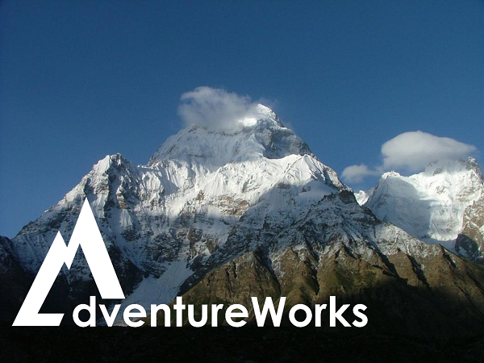

# OCP Open Hack

## 使用 Azure 进行计算机视觉的深度学习 - 动手实验指导

**致谢**：本动手实验来源于 [Ready 2019 - Deep Learning For Computer Vision Hack](https://github.com/GraemeMalcolm/ready2019)，有修改。

本动手实验由一组具有挑战性的任务组成。这些任务的复杂性和难度逐次递增，以帮助参与者了解和体验针对计算机视觉领域构建一个机器学习解决方案的主要方面。

本动手实验可以由单人独立完成，但更建议组成队伍多人合作完成。如果是团队合作，团队成员应尽量坐在一起，在充分参考本实验提供的参考资料后，进行适当的分工。实验过程中，建议团队成员充分交流，分享想法和进展，作为团队，不仅要争取解决挑战任务，更应让每一个成员了解自己团队的解决方案的技术路线和实现方法。

## 背景

Adventure Works，是一家虚构的大型户外装备和登山用品的零售商。Adventure Works 希望从顾客购买的商品中挖掘出顾客的购买行为。他们决定采用微软的以及开源的计算机视觉技术来实现这一目标。而您和您的团队，受邀与 Adventure Works 一起去构建一个计算机视觉解决方案，以充分利用其采集的图片数据。

## 任务

本动手实验一共由四个任务组成。每个任务都涉及了计算机视觉的机器学习领域的一些方面。这些任务需要您编写 Python 代码来完成。您可以参考 <a href="https://docs.python.org/3.6/" target="_blank">Python 3.6 开发文档</a> 获得帮助。

在开始每个任务之前，建议您先花一点时间，阅读任务页面最后的文档和资源。

* [任务一： 搭建营地](Challenge01.md)
* [任务二： 深入丛林](Challenge02.md)
* [任务三： 云上漫步](Challenge03.md)
* [任务四： 循迹而至](Challenge04.md)
