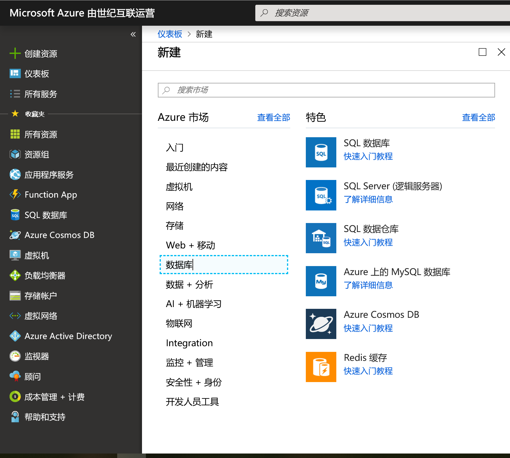
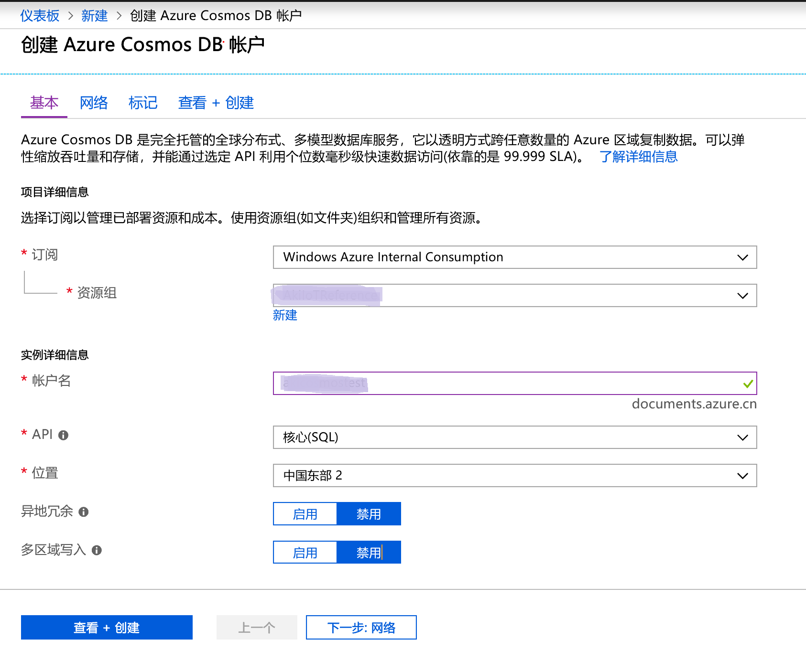
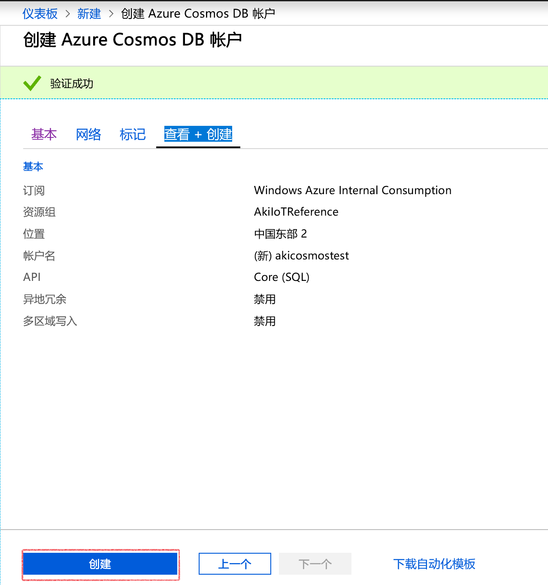
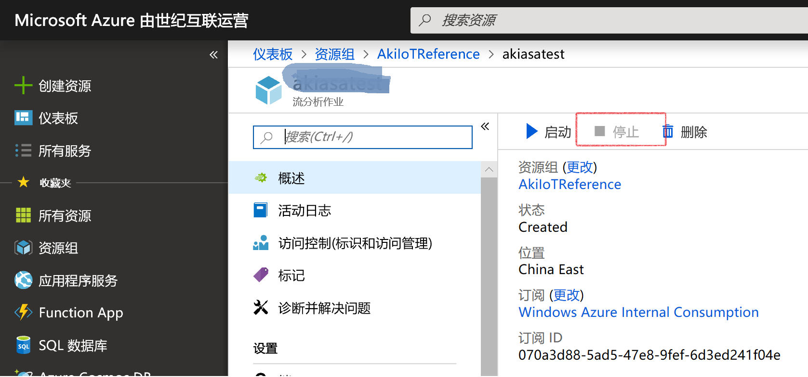
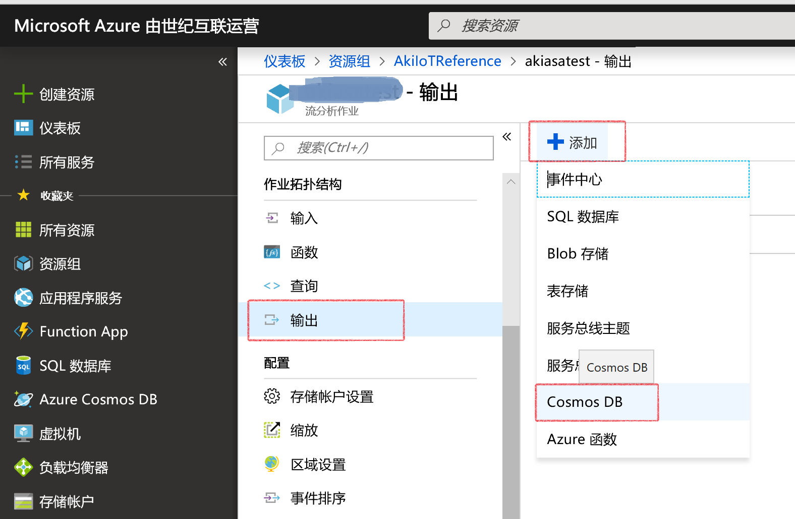
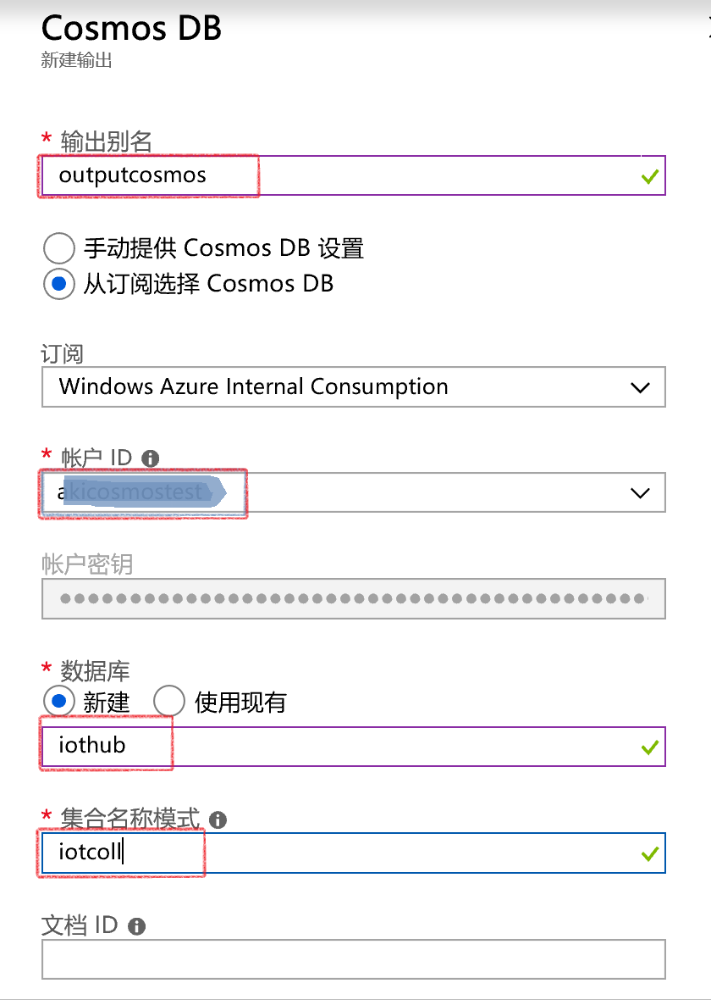
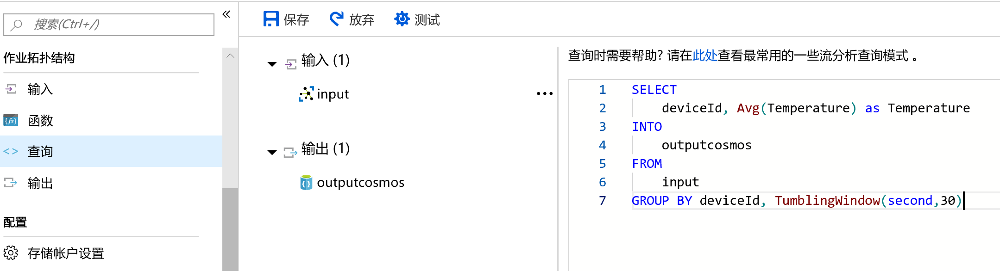
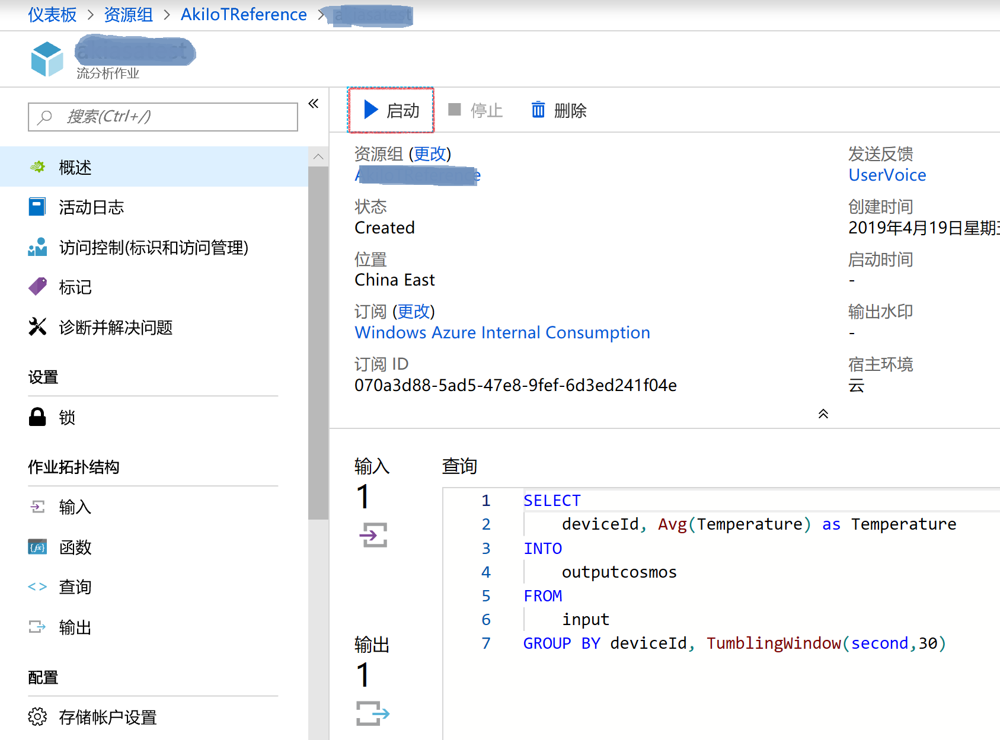
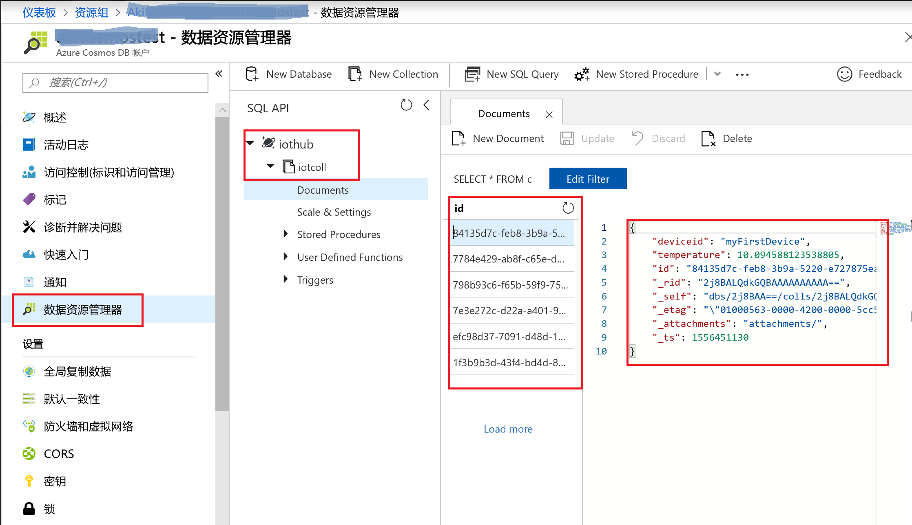

### 本实验基于“基于Azure IoT Hub的远程监控”实验，请先完成“基于Azure IoT Hub的远程监控”再继续以下实验
### 实验一：在Azure中创建Cosmos DB
 1.	登陆Azure管理门户	
 2.	新建Cosmos DB
 3. 配置Stream Analytics Job输出到Cosmos DB
 4. 在Cosmos DB中查看监控数据

## 实验一：在Azure中创建Cosmos DB
### 1.登陆Azure管理门户

在浏览器中输入 (https://www.azure.cn/) 打开Azure中国区官方网站，然后点击页面右上角的“Azure门户预览”
输入账户和密码，登陆到管理门户。

### 2.新建Cosmos DB

点击左上角“+新建”按钮，然后依次选择“数据库”，“Azure Cosmos DB”，如下图所示：

选择在“基于Azure IoT Hub的远程监控”中的资源组，为cosmosDB新建名称，API选择‘核心（SQL）’，以及数据中心位置，如下图所示：

点击“查看 + 创建”，并点击“创建", 如下图所示：

### 3.配置Stream Analytics Job输出到Cosmos DB

如果Stream Analytic Job 还在运行，请点击‘停止’，如下图所示：

点击‘输出’ -> ‘添加’ -> 'Cosmos DB',如下

填写输出别名，选择订阅，并选择在上述步骤中创建的cosmos DB账户ID，点击‘新建’并填写名称和集合名称模式，最后点击‘保存’，如下

在Stream Analytics Job中点击“查询”，然后输入如下查询语句，并点击“保存“：

SELECT

    deviceId, Avg(Temperature) as Temperature
    
INTO

    outputcosmos
    
FROM

    input
    
GROUP BY deviceId, TumblingWindow(second,30)

在Stream Analytics Job界面中，点击“启动‘，如下图所示：

### 4.在Cosmos DB中查看监控数据

参考“基于Azure IoT Hub的远程监控”实验当中的实验二像iot hub发送模拟数据。
运行IoTDemoApp.sln，启动程序，可以看到模拟程序每秒向IoT Hub发送一组消息，消息中包含随机生成的风速、温度和湿度的数据。

点击cosmos DB服务->'数据资源管理器'， 选择之前步骤中创建的账户->集合名称模式, 在id下可以看到模拟数据从iot hub传入到cosmos DB，如下图所示：

