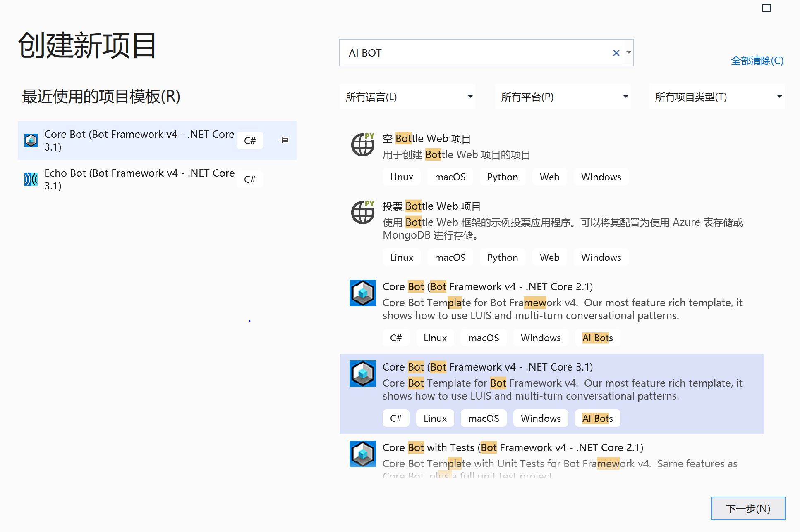
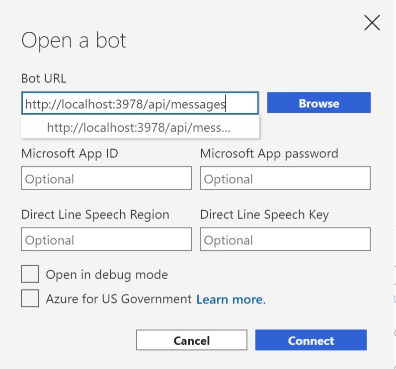
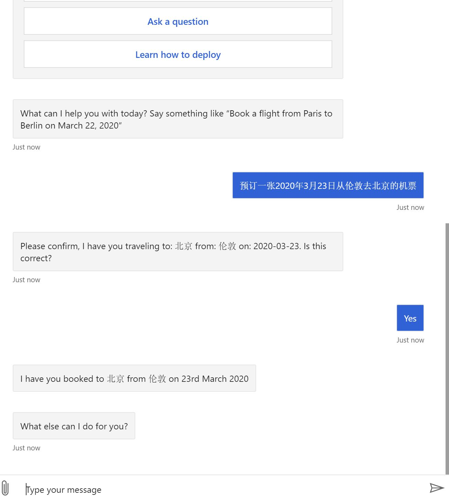

# 创建基于LUIS的Bot应用
本实验中，我们将[LUIS](https://www.luis.ai)中创建了一个中文的[预订机票应用](./README_LUIS.md)，集成到Bot服务中实现一个可以预订机票机器人应用。

## 先决条件 ##

- [Visual Studio 2019](https://visualstudio.microsoft.com/zh-hans/downloads/) 或更高版本
- 面向 C# 的 [Bot Framework SDK v4 模板](https://marketplace.visualstudio.com/items?itemName=BotBuilder.botbuilderv4)
- [.NET Core 3.1](https://dotnet.microsoft.com/download)
- [Bot Framework Emulator](https://github.com/microsoft/BotFramework-Emulator/blob/master/README.md)
- Azure.com的订阅，Azure.com的试用账号可以参考[链接](http://www.cnblogs.com/meowmeow/p/7773226.html?from=groupmessage&isappinstalled=0)
- [Azure CLI](https://docs.microsoft.com/zh-cn/cli/azure/?view=azure-cli-latest)

## 构建并运行机器人应用 ##
1 . 在VS2019中使用Core Bot (Bot Framework v4 - .NET Core 3.1) 模板创建一个新的机器人项目。 从项目类型中选择“AI BOT”，以仅显示机器人模板。


2 . 将我们在[预订机票应用](./README_LUIS.md)中生成的**AppID**, **Primary Key**和**Endpoint URL**参数赋值到appsetting.json文件中的以下参数中
```
"{
  "LuisAppId": "",
  "LuisAPIKey": "",
  "LuisAPIHostName": ""
}
```
注意这个**LuisAPIHostName**符值格式如：“westus.api.cognitive.microsoft.com”

3 . 修改LUIS返回结果的Json解析的代码 （这里是因为模板应用中结果Json文件中的参数没有升级到Machine Learned Entities的类型），这部分代码需要我们手工调整。

- 修改FlightBooking.cs文件中关于Json解析的代码，请用如下代码
  ```
  // Machine Learned 
  public AirPortInfo[] AirPort { get; set; }

  public class AirPortInfo
  {
      public string[] From { get; set; }
      public string[] To { get; set; }
      [JsonProperty("$instance")]
      public InstanceArray Instances { get; set; }
  }
  public class InstanceArray
  {
      public InstanceData[] From;
      public InstanceData[] To;
  }

  // Instance
  public class _Instance
  {
      public InstanceData[] datetime;
      public InstanceData[] Airport;
  }
  [JsonProperty("$instance")]
  public _Instance _instance;

  ```
  替换原来的如下代码：
  ```
  // Composites
  public class _InstanceFrom
  {
      public InstanceData[] Airport;
  }
  public class FromClass
  {
      public string[][] Airport;
      [JsonProperty("$instance")]
      public _InstanceFrom _instance;
  }
  public FromClass[] From;

  public class _InstanceTo
  {
      public InstanceData[] Airport;
  }
  public class ToClass
  {
      public string[][] Airport;
      [JsonProperty("$instance")]
      public _InstanceTo _instance;
  }
  public ToClass[] To;

  // Instance
  public class _Instance
  {
      public InstanceData[] datetime;
      public InstanceData[] Airport;
      public InstanceData[] From;
      public InstanceData[] To;
  }
  [JsonProperty("$instance")]
  public _Instance _instance;
  ```
- 修改FlightBookingEx.cs文件，请用如下代码
  ```
  public (string From, string Airport) FromEntities
  {
      get
      {
          var query = from a in Entities.AirPort
                      where a.From != null
                      select a;
          var fromValue = query?.FirstOrDefault()?.From?.FirstOrDefault();
          var fromAirportValue = query?.FirstOrDefault()?.Instances?.From?.FirstOrDefault()?.Text;
          return (fromValue, fromAirportValue);
      }
  }

  public (string To, string Airport) ToEntities
  {
      get
      {
          var query = from a in Entities.AirPort
                      where a.To != null
                      select a;
          var toValue = query?.FirstOrDefault()?.To?.FirstOrDefault();
          var toAirportValue = query?.FirstOrDefault()?.Instances?.To?.FirstOrDefault()?.Text;
          return (toValue, toAirportValue);
      }
  }
  ```
  替换原来的如下代码：
  ```
  public (string From, string Airport) FromEntities
  {
      get
      {
          var fromValue = Entities?._instance?.From?.FirstOrDefault()?.Text;
          var fromAirportValue = Entities?.From?.FirstOrDefault()?.Airport?.FirstOrDefault()?.FirstOrDefault();
          return (fromValue, fromAirportValue);
      }
  }

  public (string To, string Airport) ToEntities
  {
      get
      {
          var toValue = Entities?._instance?.To?.FirstOrDefault()?.Text;
          var toAirportValue = Entities?.To?.FirstOrDefault()?.Airport?.FirstOrDefault()?.FirstOrDefault();
          return (toValue, toAirportValue);
      }
  }

  ```
完成之后，点击生成解决方案并运行。
## 测试机器人应用 ##
4 . 启动Bot Framework Emulator，输入调试的本地Bot URL，点击connect



5 . Bot连接成功后，输入需要预订机票的语料如：“预订一张2020年3月23日从伦敦去北京的机票”，然后发送，就可以返回预订信息如下



说明LUIS已经集成到Bot应用中。

## 部署机器人应用 ##
请参考之前做[EchoBot或者QnABot的部署步骤](https://docs.microsoft.com/zh-cn/azure/bot-service/bot-builder-deploy-az-cli?view=azure-bot-service-4.0&tabs=csharp)完成机器人部署
## 总结 & 后续 ##
可以到GitHub上访问下载更多[Bot的参考示例](https://github.com/Microsoft/BotBuilder-Samples/blob/master/README.md)