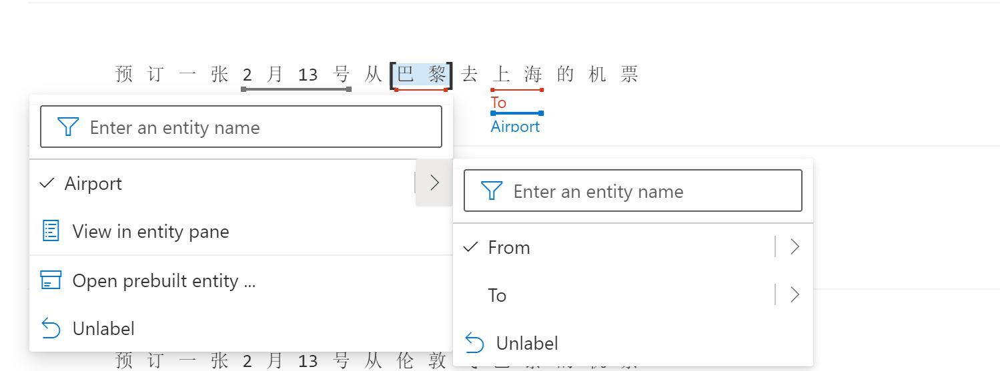

# 创建预订机票LUIS应用
Language Understanding Intelligent Services（简称LUIS），是Azure中用于会话AI的意图管理的服务。通过LUIS用户可以创建任务对话服务中的意图，意图中的参数，部署和管理意图信息，发布意图服务给对话机器人或者其他需要意图识别的应用。

本实验是带领开发者完成一个中文机票预订的LUIS应用，该应用发布后，可以集成到[机票预订机器人](./README-BOT.md)的开发中。该实验将包括以下内容：
- 创建语义应用
- 创建意图/语料
- 创建实例
- 训练与测试意图
- 发布和调用语义应用


该样例需要使用[微软认知服务](https://azure.microsoft.com/zh-cn/services/cognitive-services/)中语义服务，需要申请免费使用账号或者购买Azure.com的订阅，Azure.com的试用账号可以参考[链接](http://www.cnblogs.com/meowmeow/p/7773226.html?from=groupmessage&isappinstalled=0)

## 创建语义应用 ##
1 . LUIS为开发者提供了定制化训练业务场景语义的工具，开发者可以自己独立完成语义应用的搭建和训练。访问[luis.ai](https://www.luis.ai)，使用已有的Azure订阅账号登陆。

2 . 登陆LUIS门户后，进入MyApp页面，点击New App，


创建你的LUIS应用，输入应用名称如：FlightBookingCN，语种（目前支持18种语言），应用的描述等信息。输入完成后点击Done。


## 创建意图/语料 ##
4 . 应用创建完成后，就可以开始为系统创建意图，点击"Create new intent"，输入意图名称“BookFlight” （因为意图和实例名称都会在LUIS应用调用时返回给Bot程序，建议使用英文），点击确认。

5 . 意图创建后，需要输入意图相关的语料，可以输入多个语料，每个语料输入后回车即可，确认的语料会出现在Utterance列表中。 


这里创建的语料中的有“北京，上海，巴黎，伦敦”这些城市，还有“3月8号”等这些日期，不需要为每个城市和日期都创建语料，只需要创建机场和日期实体（entity），需要的该实体的语料只需要在语料中加入该实体即可。

接下来， 我们看看实体的创建

## 创建实例 ##
6 . LUIS目前废弃了之前composite的实例类型，使用Machine Learned类型来完成带结构的实例定义。点击左侧功能栏中的Entities，进入实例管理界面， 选择Create +， 选择：Machine Learned类型，输入实例名称:Airport，选择：Add structure，点击“Next”


然后，在Airport实例下添加子实例，点击右侧的+，输入：From，在重复一次输入：To，点击“Create”


7 . 创建成功后，可以为Airport实例创建phrase list，帮助自动学习城市名称。 点击Airport实例，选择右侧“+Add Feature”，然后选择Create new phrase list，输入Phrase List名称：“Airport”， 在Value栏中输入城市的名称，每输入一个回车，即可进入下一个。


8 . 下方的Suggestions Values里面会有其他相关的推荐，可以根据需要添加对应的value进入你的Phrase List Values中，完成后，点击Create。


9 . 在本实验中还需要一个日期实例，LUIS提供了日期，温度，数字等常用实例类型，作为prebuilt entity。我们这需要创建这个prebuilt entity，点击实例页面中Add prebuilt entity，选择datetimeV2这个实例，点击Done


## 语料关联实例 ##

10 . 实例创建完成后，就可以在意图的语料中关联对应的实例，以方便训练识别。点击左侧功能栏的Intents，进入意图管理界面， 选择之前我们创建的“BookFlight”的意图，可以调出之前的Utterance列表， 用鼠标在Utterance中连续点击需要作为实体的字符，比如这里“巴黎”，在下拉框中选择Airport实例，再继续再右箭头点卡的下拉框中选择From，因为巴黎是出发地。以此类推，为目的地“上海”也关联到Airport的To上，同理再把2月13号这个日期与DATeTimeV2这个实例关联起来。



以此类推，以后添加的语料有可能回自动识别到对应的实例，如果识别准确你可以选择对应的语料，然后点击confirm all entities就可以自动关联了。


## 训练与测试意图 ##
11 . 按照上面的意图和实例操作，再创建一个Cancel的意图，和GetWeather的意图。完成后，就可对意图做训练了， 点击右上方的“Train”，进行训练，训练完成后，就可以进行测试， 点击右上方的“Test”，进入测试界面，输入你需要测试的语料，比如“预订一张4月5号从伦敦去巴黎的机票”，然后回车。测试页面会出现测试语料对应的意图以及意图的置信度的打分，这里是0.941（满分是1）。可以点击Inspect查看返回的结果，包括实例是否识别正确


所有意图和实体创建测试完成后，就可以进入发布阶段。

## 发布语义应用 ##

12 .点击功能界面右上方的Publish，选择production slot，点击Done，进行发布。发布完成后，点击右上方的Manage，进入管理界面，选择左侧菜单中Setting，进入设置页面，将**AppID**复制出来后面开发使用。


13 . 语义应用最终是部署到Azure LUIS服务上的，接下来，在您的[Azure Portal](http://portal.azure.com)中创建LUIS服务，并将我们的FightBookingCN应用发布该LUIS服务上。登陆[Azure Portal](http://portal.azure.com)后， 点击创建，输入LUIS查询，结果中出现与LUIS相关的Azure服务，点击Language Understanding，然后点击Create。按照下面示例输入参数，资源组根据你自己的环境确定，选择Authoring和Prediction两种选项，价格可以选择F0，Name和Location自己确定。完成后点击Review+Create


14 . 创建完成后，回到[Luis.ai](http://luis.ai)，点击右上方的MANAGE菜单，进入应用设置管理界面，在左侧功能栏中，选择Azure Resources， 点击Add prediction resources，选择你的订阅，并点击你刚刚创建好的LUIS服务，点击Done


16 . 完成后就可以看到之前发布的BookingFlightCN应用已经部署到LUIS服务上了，保存**Primary Key:**，**Endpoint URL**，后面开发机器人使用。这里同时还提供了一个Query的URL链接，可以复制下来，在浏览器中测试你应用是否成功。


17 . 点击Endpoint链接后，进入浏览器，可以直接在URL链接后面输入测试语料比如：预订一张4月10号从北京去巴黎的机票， 回车，就可以看到语义应用返回的Json结果


```json
{
    "query": "预订一张4月10号从北京去巴黎的机票",
    "prediction": {
        "topIntent": "BookFlight",
        "intents": {
            "BookFlight": {
                "score": 0.9184409
            },
            "GetWeather": {
                "score": 0.0452690646
            },
            "None": {
                "score": 0.0143802371
            },
            "Cencle": {
                "score": 0.00308279833
            }
        },
        "entities": {
            "Airport": [
                {
                    "From": [
                        "北京"
                    ],
                    "$instance": {
                        "From": [
                            {
                                "type": "From",
                                "text": "北京",
                                "startIndex": 10,
                                "length": 2,
                                "score": 0.7795254,
                                "modelTypeId": 1,
                                "modelType": "Entity Extractor",
                                "recognitionSources": [
                                    "model"
                                ]
                            }
                        ]
                    }
                },
                {
                    "To": [
                        "巴黎"
                    ],
                    "$instance": {
                        "To": [
                            {
                                "type": "To",
                                "text": "巴黎",
                                "startIndex": 13,
                                "length": 2,
                                "score": 0.9942933,
                                "modelTypeId": 1,
                                "modelType": "Entity Extractor",
                                "recognitionSources": [
                                    "model"
                                ]
                            }
                        ]
                    }
                }
            ],
            "datetimeV2": [
                {
                    "type": "date",
                    "values": [
                        {
                            "timex": "XXXX-04-10",
                            "resolution": [
                                {
                                    "value": "2020-04-10"
                                },
                                {
                                    "value": "2021-04-10"
                                }
                            ]
                        }
                    ]
                }
            ],
            "$instance": {
                "Airport": [
                    {
                        "type": "Airport",
                        "text": "北京",
                        "startIndex": 10,
                        "length": 2,
                        "score": 0.997155845,
                        "modelTypeId": 1,
                        "modelType": "Entity Extractor",
                        "recognitionSources": [
                            "model"
                        ]
                    },
                    {
                        "type": "Airport",
                        "text": "巴黎",
                        "startIndex": 13,
                        "length": 2,
                        "score": 0.999820948,
                        "modelTypeId": 1,
                        "modelType": "Entity Extractor",
                        "recognitionSources": [
                            "model"
                        ]
                    }
                ],
                "datetimeV2": [
                    {
                        "type": "builtin.datetimeV2.date",
                        "text": "4月10号",
                        "startIndex": 4,
                        "length": 5,
                        "modelTypeId": 2,
                        "modelType": "Prebuilt Entity Extractor",
                        "recognitionSources": [
                            "model"
                        ]
                    }
                ]
            }
        }
    }
}
```
这样就完成了BookingFlightCN应用的开发。

## 后续 ##
该应用完成后，就可以开始实现[机票预订机器人](./README-BOT.md)的开发和部署了。 