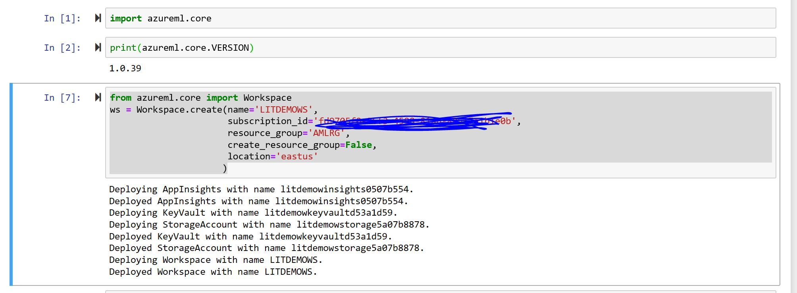
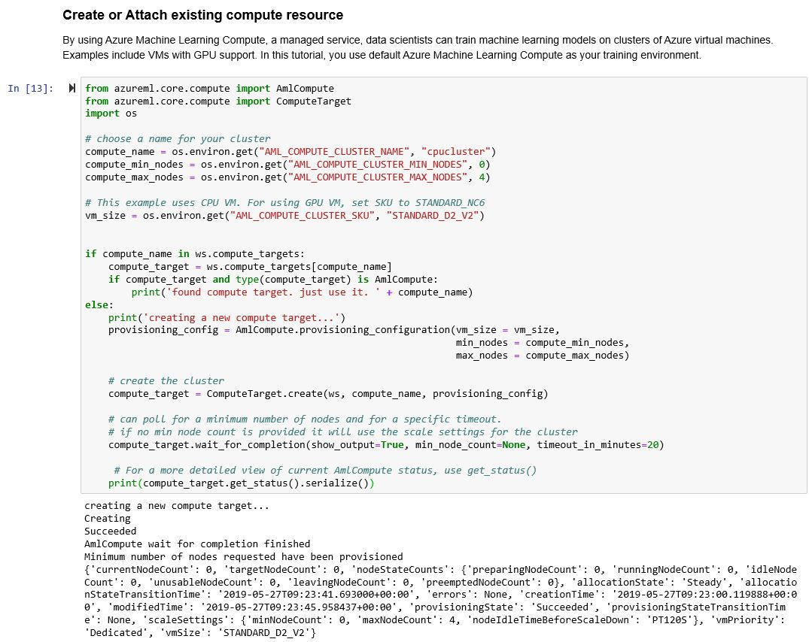
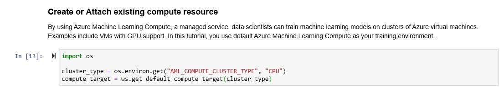
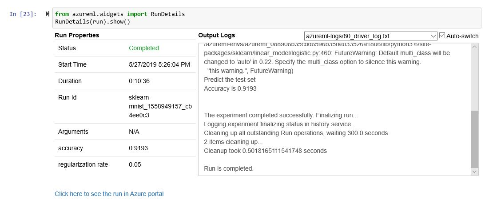
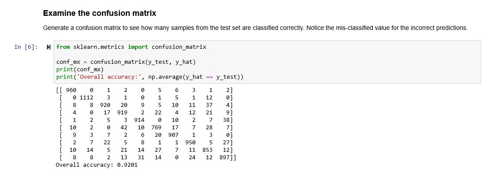
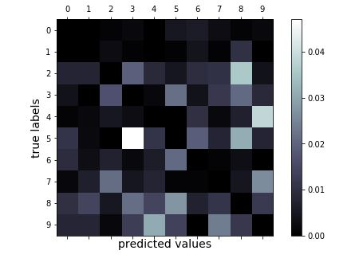
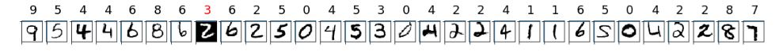

# 自建环境的图像识别项目

Azure Machine Learning Service是Azure上的一个基于云的环境, 可用于准备数据、培训、测试、部署、管理和跟踪机器学习模型。开始在本地计算机上进行培训, 然后扩展到云。该服务完全支持开源技术, 如 PyTorch、TensorFlow, 可用于任何类型的机器学习, 从经典的机器学习到深度学习、监督和无监督的学习。

本实验会介绍如何使用Azure Machine Learning Service实现基于MNIST和Scikit-learn实现图片分类服务。

## 实验条件 ##
要完成本实验，您需要准备好：
1. 有效的Azure.com订阅账号
2. 如果你希望在本地服务上运行脚本，需要按照实验一完成本地环境安装。


## 实验内容 ##
本实验包含三个主要部分：
- 实验一：创建实验环境
- 实验二：训练分类模型
- 实验三：部署分类模型
  
## 实验一： 创建实验环境 ##
Azure Machine Learning Service支持用户使用云端的notebook server运行脚本，也支持用户使用自己本地的notebook server运行脚本来训练模型。 本实验我们将介绍如果创建使用自己本地notebook server的环境。

1. 下载安装[Anaconda](https://www.anaconda.com/download/ )， 选择你的系统平台安装包，下载安装。
2. 安装完成后， 进入程序->Anaconda3->Anaconda Prompt，启动Anaconda Prompt。
3. 为Azure Machine Learning Service Python SDK安装创建一个独立的部署环境， 在Anaconda Prompt命令窗口依次运行如下命令：
    ```
    conda create -n myenv python=3.6.5

    conda activate myenv

    conda install notebook ipykernel

    ipython kernel install --user

    ```
4. 在myenv下，依次运行下面命令安装Azure Machine Learning Service Pyhton SDK的相关内容
    ```
    pip install --upgrade azureml-sdk[notebooks]

    conda install -y cython matplotlib pandas

    pip install --upgrade azureml-sdk[automl]

    ```
5. cd进入你需要运行本次实验的本地目录下， 启动jupyter notebook
    ```
    jupyter notebook

    ```
6. 在jupyter notebook里点击new创建一个新的PYTHON3的脚本，运行下面脚本导入azureml.core的包
   ```python
    import azureml.core
    print(azureml.core.VERSION)
   ```
7. 使用如下脚本创建Azure Machine Learning Service的WorkSpace，名字和资源组自己定义， 如果在已有资源组上创建，create_resource_group=False否则为True，位置可以选eastus
   ```python
   from azureml.core import Workspace
    ws = Workspace.create(name='LITDEMOWS',
                        subscription_id=<到portal里面复制你的订阅ID>,
                        resource_group='AMLRG',
                        create_resource_group=False,
                        location='eastus' 
                        )

   ```
   完成后，结果如下：

   

8. 运行下面命令在本地目录下生成aml_config/config.json文件，里面包括workspace的配置信息，后面实验需要使用。
     ```python
    # Create the configuration file.
    ws.write_config()
    # Use this code to load the workspace from 
    # other scripts and notebooks in this directory.
    # ws = Workspace.from_config()
   ```
9. Clone或者download[GitHub Repository](https://github.com/Azure/MachineLearningNotebooks)。
10. 复制8步骤中生成的config.json文件到Clone的文件目录下，并在jupyter notebook中打开克隆目录下 tutorials/img-classification-part1-training.ipynb文件。我们将进入训练模型阶段。
    
到这里，完成环境的创建。

## 实验二：训练分类模型 ##

本实验中我们将完成使用scikit-learn在Azure Machine Learning Service中训练手写体0-9这十个数字的图片。 使用的是经典的MNIST的数据集。 所有的实验内容都在img-classification-part1-training.ipynb，可以直接在jupyter notebook中运行。 为了大家理解方便，这里将主要过程介绍如下：

1. 准备训练资源：  
  - 导入所需Python包
  - 访问Azure Machine Learning Service Workspace
  - 在Workspace中创建一个实验
  - 在Workspace中创建训练需要的计算资源（或者关联你已有的计算资源）

**Note：** 在实验一中我们创建的是一个空白的workspace，所以我们第一次训练时需要为自己创建训练所需要的计算资源。这里我们需要替换部分代码，

第一次需要创建计算资源请使用下面的代码 （我们创建了一个最多4节点的CPU集群）
```Python
from azureml.core.compute import AmlCompute
from azureml.core.compute import ComputeTarget
import os

# choose a name for your cluster
compute_name = os.environ.get("AML_COMPUTE_CLUSTER_NAME", "cpucluster")
compute_min_nodes = os.environ.get("AML_COMPUTE_CLUSTER_MIN_NODES", 0)
compute_max_nodes = os.environ.get("AML_COMPUTE_CLUSTER_MAX_NODES", 4)

# This example uses CPU VM. For using GPU VM, set SKU to STANDARD_NC6
vm_size = os.environ.get("AML_COMPUTE_CLUSTER_SKU", "STANDARD_D2_V2")


if compute_name in ws.compute_targets:
    compute_target = ws.compute_targets[compute_name]
    if compute_target and type(compute_target) is AmlCompute:
        print('found compute target. just use it. ' + compute_name)
else:
    print('creating a new compute target...')
    provisioning_config = AmlCompute.provisioning_configuration(vm_size = vm_size,
                                                                min_nodes = compute_min_nodes, 
                                                                max_nodes = compute_max_nodes)

    # create the cluster
    compute_target = ComputeTarget.create(ws, compute_name, provisioning_config)
    
    # can poll for a minimum number of nodes and for a specific timeout. 
    # if no min node count is provided it will use the scale settings for the cluster
    compute_target.wait_for_completion(show_output=True, min_node_count=None, timeout_in_minutes=20)
    
     # For a more detailed view of current AmlCompute status, use get_status()
    print(compute_target.get_status().serialize())
```
运行结果如下：


如果计算资源已经创建好了，可以保持原始脚本中的代码不变如下：



2. 准备数据
  - 下载实验所需的MNIST数据集
  - 展示样例数据
  - 将数据集加载到Azure Machine Learning Service的Workspace中
3. 在Workspces中的计算服务上做训练
  - 创建训练目录
  - 生成训练脚本
  - 创建训练Estimator对象，用于我们的训练
  - 提交Estimator Job到WS计算资源进行训练
4. 监控训练状态
  - 使用jupyter widget可以监控训练状态（Queued， Preparing， Running， Completed等）
 
  
  - 训练完成后，可以获取训练日志，显示训练结果
  
5. 注册模型
  - 训练结束，将模型注册到workspace中， 为后续其他用户使用。
   
6. 准备部署模型
  - 在jupyter notebook中回到你从github上Clone下面的目录中，打开img-classification-part2-deploy.ipynb 脚本，我们可以开始进行实验三的内容。


## 实验三：部署分类模型 ##
本实验的前提是完成实验二的内容，已经得到一个精度不错的分类器模型， 下面我们将这个模型部署为一个Azure Container Instances下的docker image，用户可以使用这个docker image在本地实现对0-9的数字手写体的分类识别。与实验二相同， img-classification-part2-deploy.ipynb脚本中已经包含了所有实验步骤， 为了方便理解，把主要内容解释如下：

1. 准备部署
  - 导入所需的Python包
  - 访问Azure Machine Learning Service的Workspace，获取实验二中训练并注册的模型
2. 本地测试
  - 准备测试数据
  - 使用测试数据生成预测结果
  - 使用混淆矩阵评估预测结果

**Note：** 混淆矩阵是对Scikit-Learning算法的评估方法， 横轴是预测值，纵轴是真实值， 每个交叉点就是有多少预测值的个数。 因此对角线的数值越大，非对角线数值越小，说明模型精度越高。



图中可看出数值5的手写体预测出来的准确率不高。识别成3的概率比较高。

另外实验还给出了混淆矩阵的可视化图，颜色越浅，错误率越高。



3. 部署Web Service的docker image
  - 创建Scoring脚本（score.py)
  - 创建docker image的环境文件（需要安装哪些包）
  - 创建容器实例的配置文件
  - 创建部署容器实例（Azure Container Instance，需要提供score.py，环境文件，配置文件等）

**Note：** 容器实例生成后，会提供一个webservice url, 是一个RESF API，可以调用它来给需要设别的图片返回预测数字。

4. 测试部署的服务
  - 加载测试数据图片，随机取30个数据调用容器中部署的服务, 显示预测结果
  
    

## 资源清理 ##

实验结束后， 如果你希望保存workspace为其他实验使用，可以只删除掉container instance的部署。使用以下命令
```pyhton
service.delete()
```

如果后续不需要使用，可以登录[Azure Portal](http://portal.azure.com)把资源组删除。

## 实验小结 ##

在本实验中，您利用 Azure Machine Learning Service
使用Python SDK和Scikit-learn模型，实现对MNIST数据的图片分类器。力求通过实验对Azure ML的使用有一个全面的了解，掌握如何利用Azure ML开发自己的机器学习项目。 


