# 基于QnA Maker的问答机器人
这个实验会介绍如何使用QnAMaker轻松创建一个问答帮助机器人的服务，Azure Bot SDK集成该QnA服务实现一个可以沟通的机器人样例。本样例主要包括以下几部分内容：
- 创建QnA服务
- 集成开发问答机器人QnA服务
- 本地测试问答机器人
  
## 实验条件
1. 需要有Microsoft Azure国际版订阅
2. 需要下载[Bot Emulator](https://github.com/Microsoft/BotFramework-Emulator/releases/tag/v4.3.0)
3. 需要[Visual Studios 2017](https://visualstudio.microsoft.com/zh-hans/downloads/?rr=https%3A%2F%2Fdocs.microsoft.com%2Fen-us%2Fazure%2Fbot-service%2Fbot-builder-tutorial-basic-deploy%3Fview%3Dazure-bot-service-4.0%26tabs%3Dcsharp)以上版本

## 创建QnA服务
QnAMaker可以让开发者使用FAQ URL，FAQ文件或者手工录入问题答案等方式，轻松构建一个问答机器人服务。

1. 使用Azure订阅账号登陆[Azure Portal](http://portal.azure.com)，选择+，创建资源，搜索QnAMaker，选择搜索出来的QnA Maker服务，点击Create。
   
   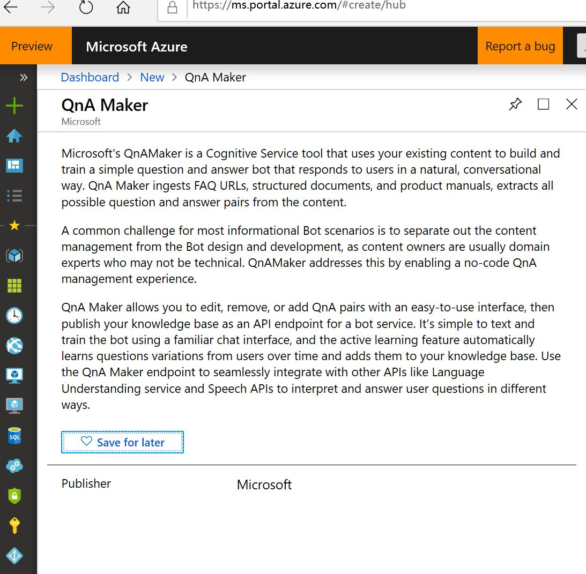
2. 输入QnA Maker服务的名字，选择订阅，价格，部署地理位置等信息； 其中价格可以选择S0（提交的问题对文档不限量，每月10美金）；Search Price可以选择F(3 Indexes)；本实验不需要监控服务使用情况，可以将App Insights服务Disable，点击Create。
   
   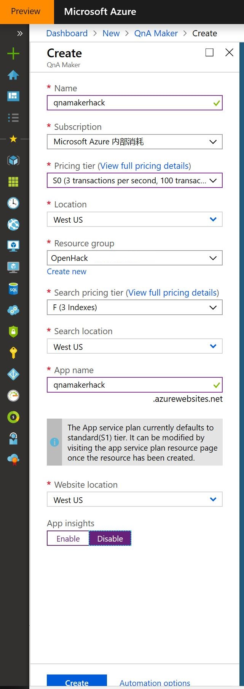

   创建完成后，就可以开始QnA Maker应用的创建和训练了。
3. 使用Azure订阅账号登陆[QnAMaker门户](http://qnamaker.ai)，点击Create a knowledge base，在第二步中选择你的Azure订阅和你刚刚创建的QnAMaker的服务，输入Knowledge Base的名字，下载训练的问题对文件[样例](./src/qna.txt)，在添加问题对文件处，浏览到你样例文件的下载路径选择样例文件qna.txt，点击Create。
   
    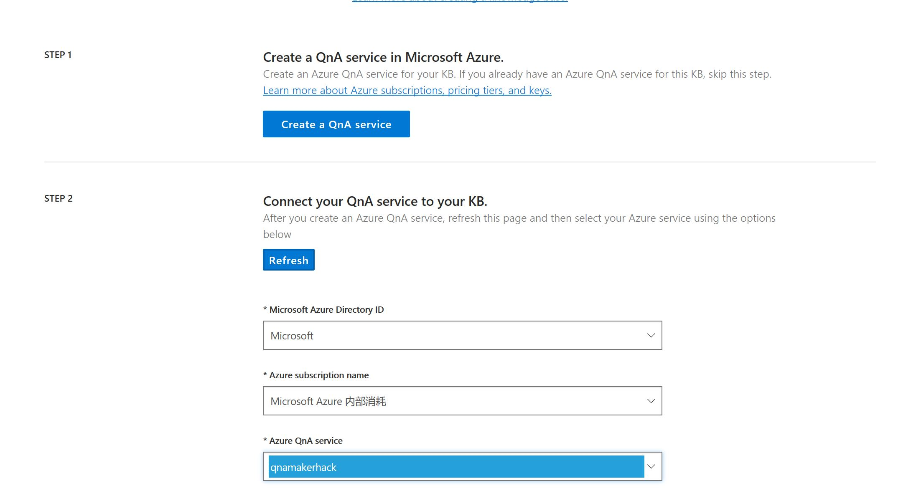
    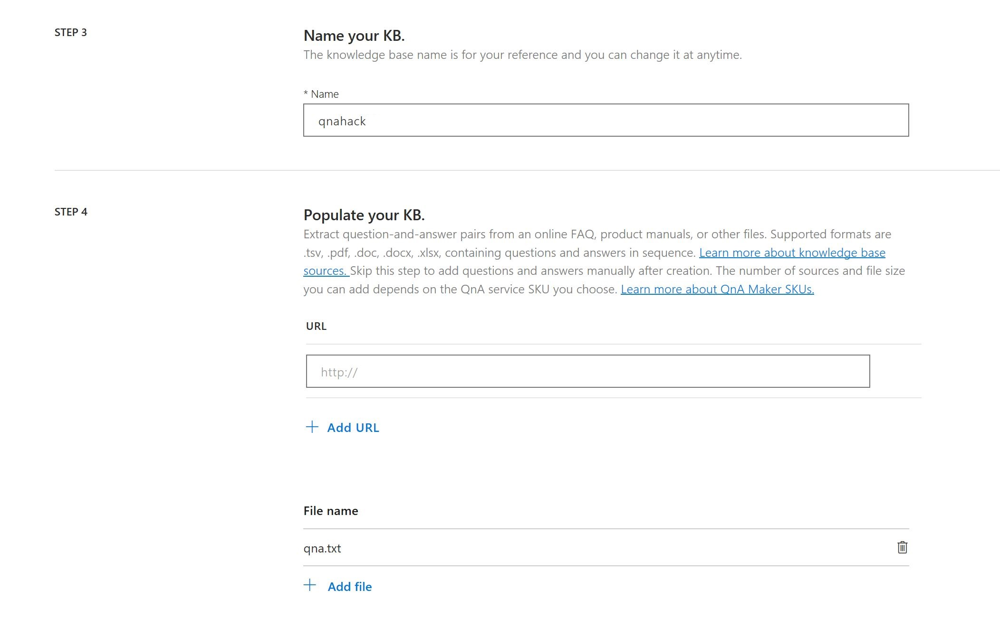
4. KnowledgeBase创建完成后，问题对编辑和训练界面， 可以检查一下导入的文件是否问题对显示正确（样例中有11个问题对），确认后，点击Save and train，进行训练。
   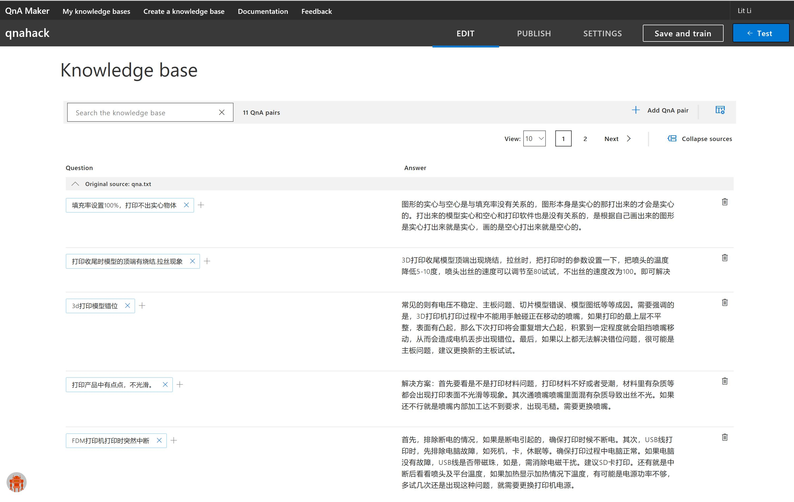
5. 训练完成后，可以点击Test，进行测试， 输入你需要提问的内容，回车。点击inspect，可以看到后台给出的具体分析，确认问题回答的匹配程度。不满意，可以选择增加或修改答案，然后重新Save and train。直到满意。
   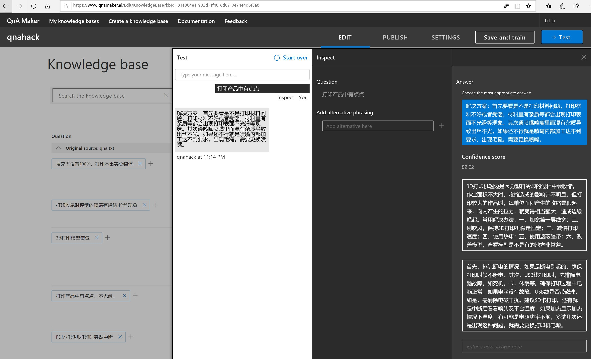
6. 训练和测试完成后，可以点击Publish，发布应用，发布成功后需要保存其中的**Knowledge BaseID，Endpoint key，和hostname**，后面会用到。

   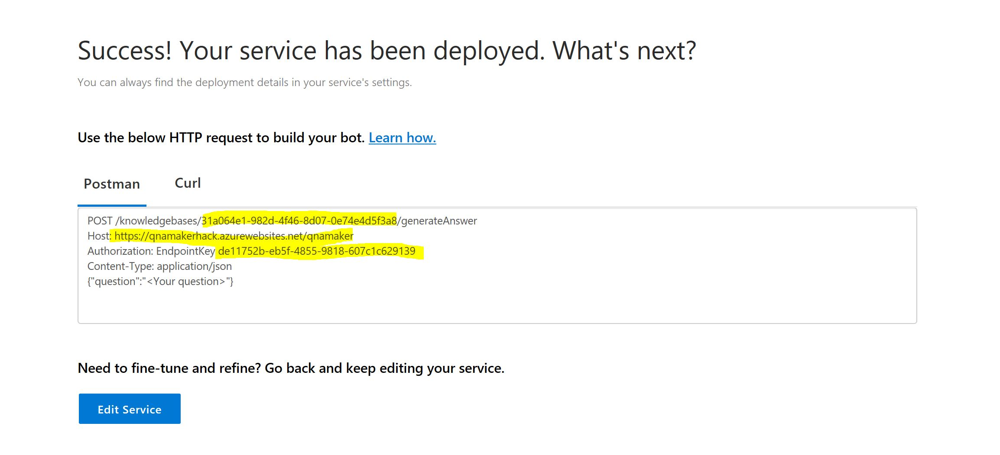
创建好QnA查询服务，就可以开始开发问答机器人了。

## 创建问答机器人QnaBot
这里我们将使用微软Bot Sample中的QnaBot的样例，实现与之前创建的QnA服务集成，实现问答机器人。
1. Clone或者Download [BothSample](https://github.com/Microsoft/BotBuilder-Samples/blob/master/README.md)的ZIP文件。
2. 在本地的\BotBuilder-Samples\samples\csharp_dotnetcore\11.qnamaker目录下，双击**QnABot.csproj**文件，在Visual Studio中打开。
3. 修改\BotBuilder-Samples\samples\csharp_dotnetcore\11.qnamaker目录下的Qnamaker.bot文件，将上一步中我们创建的KBID， EndpointKey，和hostname等信息，填入.Bot文件，其中还有一个subscriptionKey就是你创建QnA Maker Service是的订阅ID，可以在Azure Portal里面all Services下面的Subscription信息里可以找到。全部填入这个配置文件中。保存。
   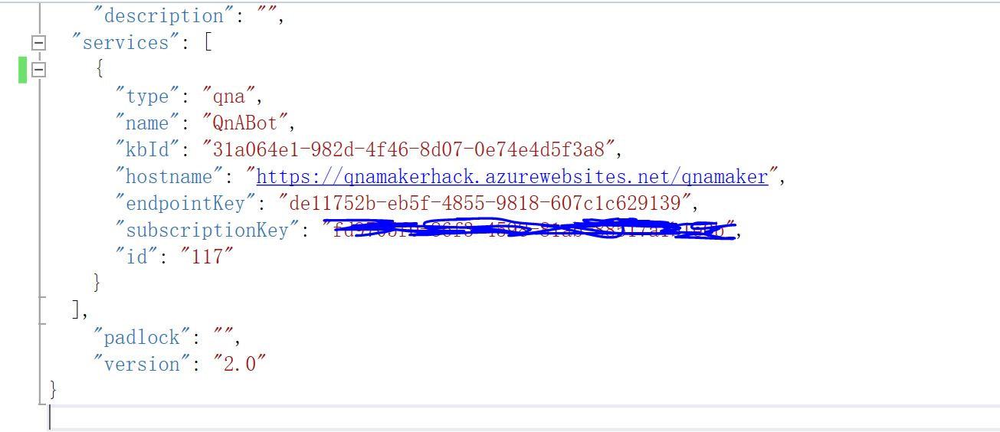
**Note：如果你修改了name属性，请务必将QnABot.cs下面的QnAMakerKey修改成同名**
4. 修改完成，保存，F5启动QnABot本地服务，启动后，自动弹出浏览器显示如下：
   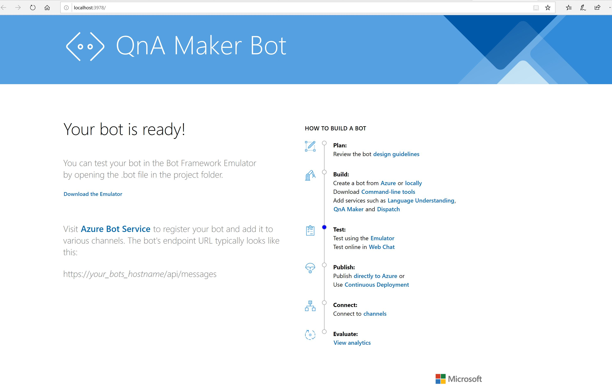
本地QnaBot运行起来，我们可以使用Bot Emulator进行测试，看看我们的问答机器人是否可以回答我们之前在QnA Knowledge Base中的问题。

## 本地测试问答机器人
1. 打开在**实验条件**中下载下来的Bot Emulator， 点击Open Bot，Browser到上面创建好的\BotBuilder-Samples\samples\csharp_dotnetcore\11.qnamaker目录下，选择Qnamaker.bot文件，点击Connect
   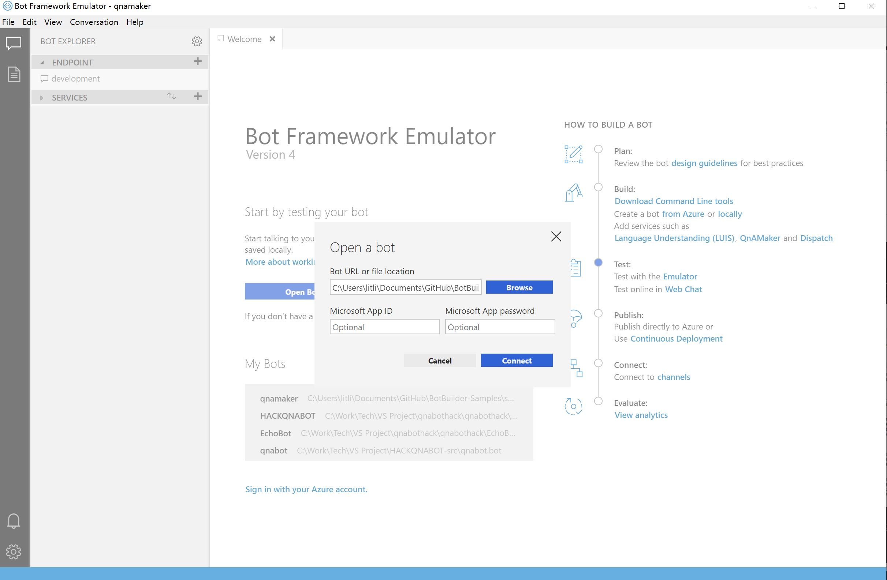
2. 右下方的日志栏会提示连接成功，中间对话栏会弹出提示对话，这时候我们可以输入测试问题，比如“打印产品不光滑”，看看问答机器人是否可以正确给我们返回响应。
   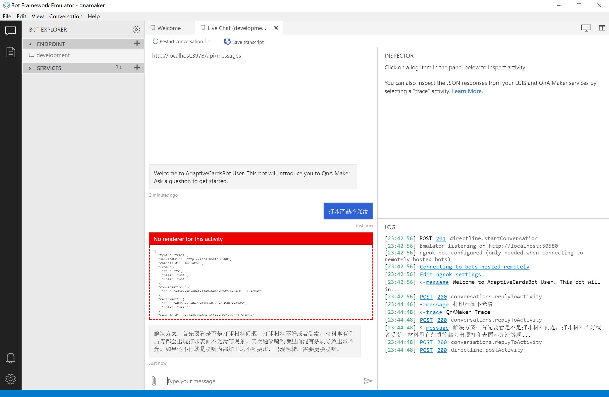

    官网的QnAmaker的样例中，返回时提供了QnA Trace消息，可以查看到问题的答案的置信度等信息。

## 总结
本实验主要是利用QnA Maker服务和Bot Sample中QnABot的样例，让大家可以简单体验一个问答机器人的开发。后面我们会基于这个实验，完成将问答机器人部署到云端的工作。

