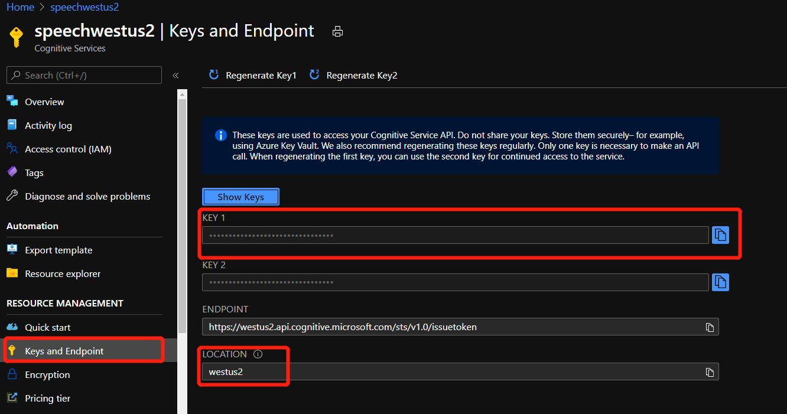

# 微软语音翻译
语音服务的核心功能之一是能够识别人类语音并将其翻译成其他语言。在本实验中，你将了解如何在应用和产品中使用 Speech SDK 来执行高质量的语音翻译。在本次实验中您将完成：
翻译语音到文本
将语音转换为多个目标语言
执行直接语音到语音转换

- 提示：如果要直接跳到示例代码，请参阅 GitHub 上的[快速入门示例](https://github.com/Azure-Samples/cognitive-services-speech-sdk/tree/master/quickstart)。

## 先决条件

本文假设已有一个 Azure 帐户和语音服务订阅。 如果你没有帐户和订阅，可[免费试用语音服务](https://docs.microsoft.com/zh-cn/azure/cognitive-services/speech-service/get-started)。如果已经有Azure账户和订阅，请[创建Azure语音服务资源](https://docs.microsoft.com/zh-cn/azure/cognitive-services/speech-service/overview#create-the-azure-resource)。

## 安装语音 SDK
需要先安装语音 SDK，然后才能执行任何操作。 根据你的平台，请按照[获取语音sdk](https://docs.microsoft.com/zh-cn/azure/cognitive-services/speech-service/speech-sdk?tabs=windows%2Cubuntu%2Cios-xcode%2Cmac-xcode%2Candroid-studio#get-the-speech-sdk) 中的说明进行操作。

本次实验将以Python的代码为例，如需要其他语言的实验文档，请参考[语音翻译入门](https://docs.microsoft.com/zh-cn/azure/cognitive-services/speech-service/get-started-speech-translation?tabs=script&pivots=programming-language-java)，并选择相应的语言。

## 导入依赖项

若要运行本文中的示例，请在 python 代码文件的顶部添加以下 import 语句。
```
import os
import azure.cognitiveservices.speech as speechsdk
```

## 配置语音资源

通过设置speech config配置语音资源，如订阅密钥和区域。
```
speech_key, service_region = "YourSubscriptionKey", "YourServiceRegion"

```
上述代码中的密钥和区域，请在[Azure门户](portal.azure.com)中获取。

请先找到[先决条件](#先决条件)中已经创建好的语音服务资源。部署完成后，选择“转到资源”，然后在左侧导航窗格中选择“密钥和终结点”以显示语音服务订阅密钥和区域。




## 创建语音翻译配置
若要使用语音 SDK 调用语音服务，需要创建 [SpeechTranslationConfig](https://docs.microsoft.com/zh-cn/python/api/azure-cognitiveservices-speech/azure.cognitiveservices.speech.translation.speechtranslationconfig?view=azure-python)。 此类包含有关订阅的信息，例如密钥和关联的区域、终结点、主机或授权令牌。

- 提示：无论是要执行语音识别、语音合成、翻译还是意向识别，都需要创建一个配置。

可以通过以下几种方法初始化 SpeechTranslationConfig：

使用订阅：传入密钥和关联的区域。
使用终结点：传入语音服务终结点。 密钥或授权令牌是可选的。
使用主机：传入主机地址。 密钥或授权令牌是可选的。
使用授权令牌：传入授权令牌和关联的区域。

让我们看看如何使用密钥和区域创建 SpeechTranslationConfig。
```
from_language, to_language = 'zh-CN', 'en'

def translate_speech_to_text():
    translation_config = speechsdk.translation.SpeechTranslationConfig(subscription=speech_key,region=service_region)

```

## 更改源语言
语音翻译的一项常见任务是指定输入（或源）语言。 在代码中与 SpeechTranslationConfig 实例交互，为 speech_recognition_language 属性赋值。
```
def translate_speech_to_text():
    translation_config = speechsdk.translation.SpeechTranslationConfig(
            subscription=speech_key, region=service_region)

    # Source (input) language
    translation_config.speech_recognition_language = from_language
```


speech_recognition_language 属性需要语言区域设置格式字符串。 可以提供受支持的[区域设置/语言](https://docs.microsoft.com/zh-cn/azure/cognitive-services/speech-service/language-support)的列表中“区域设置”列中的任何值。

## 添加翻译语言
语音翻译的另一项常见任务是指定目标翻译语言，至少需要一种语言，但支持多种语言。 以下代码片段将法语和德语设置为翻译语言目标。
```
def translate_speech_to_text():
    translation_config = speechsdk.translation.SpeechTranslationConfig(
            subscription=speech_key, region=service_region)

    translation_config.speech_recognition_language = "zh-CN"

    # Translate to languages. See, https://aka.ms/speech/sttt-languages
    translation_config.add_target_language("fr")
    translation_config.add_target_language("de")

```
每次调用 add_target_language 时，都会指定一种新的目标翻译语言。 换言之，根据源语言识别语音后，就会在接着进行的翻译操作过程中提供每项目标翻译。


## 初始化翻译识别器

创建 SpeechTranslationConfig 后，下一步是初始化 [TranslationRecognizer](https://docs.microsoft.com/zh-cn/python/api/azure-cognitiveservices-speech/azure.cognitiveservices.speech.translation.translationrecognizer?view=azure-python)。 初始化 TranslationRecognizer 时，需要向其传递 translation_config。 配置对象会提供验证你的请求时语音服务所需的凭据。

如果使用设备的默认麦克风识别语音，则 TranslationRecognizer 应如下所示：
```

def translate_speech_to_text():
    translation_config = speechsdk.translation.SpeechTranslationConfig(
            subscription=speech_key, region=service_region)

    translation_config.speech_recognition_language = from_language
    translation_config.add_target_language(to_language)

    recognizer = speechsdk.translation.TranslationRecognizer(
            translation_config=translation_config)

```

如果要提供音频文件而不是使用麦克风，则仍需要提供 audioConfig。 但是，在创建 [AudioConfig](https://docs.microsoft.com/zh-cn/python/api/azure-cognitiveservices-speech/azure.cognitiveservices.speech.audio.audioconfig?view=azure-python) 时，你将使用 filename="path-to-file.wav" 进行调用（而不是使用 use_default_microphone=True 进行调用），并提供 filename 参数。

```

def translate_speech_to_text():
    translation_config = speechsdk.translation.SpeechTranslationConfig(
            subscription=speech_key, region=service_region)

    translation_config.speech_recognition_language = from_language
    for lang in to_languages:
        translation_config.add_target_language(lang)

    audio_config = speechsdk.audio.AudioConfig(filename="path-to-file.wav")
    recognizer = speechsdk.translation.TranslationRecognizer(
            translation_config=translation_config, audio_config=audio_config)

```

## 翻译语音

为了翻译语音，语音 SDK 依赖于麦克风或音频文件输入。 在语音翻译之前先进行语音识别。 初始化所有对象后，调用识别一次的函数并获取结果。
```
import os
import azure.cognitiveservices.speech as speechsdk

speech_key, service_region = "YourSubscriptionKey", "YourServiceRegion"
from_language, to_languages = 'en-US', 'de'

def translate_speech_to_text():
    translation_config = speechsdk.translation.SpeechTranslationConfig(
            subscription=speech_key, region=service_region)

    translation_config.speech_recognition_language = from_language
    translation_config.add_target_language(to_language)

    recognizer = speechsdk.translation.TranslationRecognizer(
            translation_config=translation_config)
    
    print('Say something...')
    result = recognizer.recognize_once()
    print(get_result_text(reason=result.reason, result=result))

def get_result_text(reason, result):
    reason_format = {
        speechsdk.ResultReason.TranslatedSpeech:
            f'RECOGNIZED "{from_language}": {result.text}\n' +
            f'TRANSLATED into "{to_language}"": {result.translations[to_language]}',
        speechsdk.ResultReason.RecognizedSpeech: f'Recognized: "{result.text}"',
        speechsdk.ResultReason.NoMatch: f'No speech could be recognized: {result.no_match_details}',
        speechsdk.ResultReason.Canceled: f'Speech Recognition canceled: {result.cancellation_details}'
    }
    return reason_format.get(reason, 'Unable to recognize speech')

translate_speech_to_text()

```

有关语音转文本的详细信息，请参阅[语音识别基础知识](https://docs.microsoft.com/zh-cn/azure/cognitive-services/speech-service/speech-to-text-basics)。


合成翻译
成功进行语音识别和翻译后，结果会包含字典中的所有翻译。 [translations](https://docs.microsoft.com/zh-cn/python/api/azure-cognitiveservices-speech/azure.cognitiveservices.speech.translation.translationrecognitionresult?view=azure-python#translations) 字典键是目标翻译语言，其值是已翻译的文本。 可以翻译已识别的语音，然后以另一种语言进行合成（语音转语音）。

手动合成
translations 字典可用于从翻译文本合成音频。 循环访问每项翻译，并合成翻译。 创建 SpeechSynthesizer 实例时，SpeechConfig 对象需要将其 [speech_synthesis_voice_name](https://docs.microsoft.com/zh-cn/python/api/azure-cognitiveservices-speech/azure.cognitiveservices.speech.speechconfig?view=azure-python#speech-synthesis-voice-name) 属性设为所需的语音。 以下示例翻译为五种语言，然后将每种翻译合成为相应神经语言的音频文件。

```
import os
import azure.cognitiveservices.speech as speechsdk

speech_key, service_region = "YourSubscriptionKey", "YourServiceRegion"
from_language, to_languages = 'en-US', [ 'de', 'en', 'it', 'pt', 'zh-Hans' ]

def translate_speech_to_text():
    translation_config = speechsdk.translation.SpeechTranslationConfig(
            subscription=speech_key, region=service_region)

    translation_config.speech_recognition_language = from_language
    for lang in to_languages:
        translation_config.add_target_language(lang)

    recognizer = speechsdk.translation.TranslationRecognizer(
            translation_config=translation_config)
    
    print('Say something...')
    result = recognizer.recognize_once()
    synthesize_translations(result=result)

def synthesize_translations(result):
    language_to_voice_map = {
        "de": "de-DE-KatjaNeural",
        "en": "en-US-AriaNeural",
        "it": "it-IT-ElsaNeural",
        "pt": "pt-BR-FranciscaNeural",
        "zh-Hans": "zh-CN-XiaoxiaoNeural"
    }
    print(f'Recognized: "{result.text}"')

    for language in result.translations:
        translation = result.translations[language]
        print(f'Translated into "{language}": {translation}')

        speech_config = speechsdk.SpeechConfig(subscription=speech_key, region=service_region)
        speech_config.speech_synthesis_voice_name = language_to_voice_map.get(language)
        
        audio_config = speechsdk.audio.AudioOutputConfig(filename=f'{language}-translation.wav')
        speech_synthesizer = speechsdk.SpeechSynthesizer(speech_config=speech_config, audio_config=audio_config)
        speech_synthesizer.speak_text_async(translation).get()

translate_speech_to_text()
```

有关语音合成的详细信息，请参阅[语音合成基础知识](https://docs.microsoft.com/zh-cn/azure/cognitive-services/speech-service/text-to-speech-basics)。

综上，你应该已经了解了语音翻译实现的基本流程。你可以参考以下示例，完成从语音到语音的完整实验。我们以中文到英文的翻译为例。

```
import os
import azure.cognitiveservices.speech as speechsdk

speech_key, service_region = "YourSubscriptionKey", "YourServiceRegion"
from_language = 'zh-CN'
to_language = 'en'

def translate_speech_to_speech():
    translation_config = speechsdk.translation.SpeechTranslationConfig(
            subscription=speech_key, region=service_region)

    translation_config.speech_recognition_language = from_language
    translation_config.add_target_language(to_language)

    recognizer = speechsdk.translation.TranslationRecognizer(
            translation_config=translation_config)
    
    print('Say something...')
    result = recognizer.recognize_once()
    print(get_result_text(reason=result.reason, result=result))

    speech_config = speechsdk.SpeechConfig(subscription=speech_key, region=service_region)
    speech_config.speech_synthesis_voice_name = "en-US-AriaNeural"

    audio_config = speechsdk.audio.AudioOutputConfig(use_default_speaker=True)
    speech_synthesizer = speechsdk.SpeechSynthesizer(speech_config=speech_config, audio_config=audio_config)
    speech_synthesizer.speak_text_async(result.translations[to_language]).get()


def get_result_text(reason, result):
    reason_format = {
        speechsdk.ResultReason.TranslatedSpeech:
            f'RECOGNIZED "{from_language}": {result.text}\n' +
            f'TRANSLATED into "{to_language}"": {result.translations[to_language]}',
        speechsdk.ResultReason.RecognizedSpeech: f'Recognized: "{result.text}"',
        speechsdk.ResultReason.NoMatch: f'No speech could be recognized: {result.no_match_details}',
        speechsdk.ResultReason.Canceled: f'Speech Recognition canceled: {result.cancellation_details}'
    }
    return reason_format.get(reason, 'Unable to recognize speech')

translate_speech_to_speech()
```
后续，请参考更多 GitHub 上的 [快速入门示例](https://github.com/Azure-Samples/cognitive-services-speech-sdk/tree/master/quickstart) 。
